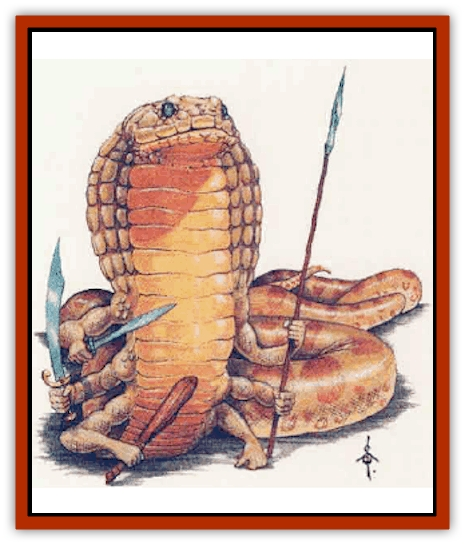

# Marl

| Statistic | **Marl** |
| --- | --- |
| **Activity Cycle:** | Day |
| **Alignment:** | Neutral |
| **Armor Class:** | 6 |
| **Climate/Terrain:** | Temperate or tropical swamps and rivers |
| **Damage/Attack:** | Constriction |
| **Diet:** | Carnivore |
| **Frequency:** | Rare |
| **Hit Dice:** | 10 |
| **Intelligence:** | Average to Very (8-12) |
| **Magic Resistance:** | Nil |
| **Morale:** | Elite (14) |
| **Movement:** | 6, Sw 24 |
| **No. Appearing:** | 14 |
| **No. of Attacks:** | 3 to 8 |
| **Organization:** | Solitary |
| **Size:** | G (40' long) |
| **Special Attacks:** | Immune to charms, mental attacks, and psionics |
| **Special Defenses:** | 1d2+4 each or by weapon +4 |
| **THAC0:** | 11 |
| **Treasure:** | R |
| **XP Value:** | 6,000 |

Mark are giant aquatic [[Snake|snake]]like creatures with hoods like those of cobras. Three to eight arms sprout from a marl's long body each about three feet long and ending in a hand like that of a human. These creatures are usually brown, with white underbellies, though those that live in especially verdant swamps often have green splotches. Their arms have the same colors as their bodies, and are covered in fine scales.

Marls, sometimes called *slime devils*, can be found in the wild, in swamps or along rivers. They are often willing to serve as guardians or mercenaries, especially for snake-like creatures such as [[Yuan-ti|yuan-ti]] or [[Ophidian|ophidians]]. A marl usually speaks the language most common to its home region.

**Combat:** Marls are immensely strong and very aggressive. They float in water until prey gets very close, then attempt to strike with surprise. There is one exception: marls become frenzied at the sight of any type of [[Bird|bird]], attacking without planning, ignoring morale and attacking until all birds in sight are dead, or until slain themselves.

Mark never attack with a bite, instead using their fists. A marl has 1d6+2 arms, each of which ends in a hand that can make a fist, ranged along its body. On occasion, marls use weapons, usually improvised clubs, but sometimes weapons from previous victims. Marl mercenaries are often given good weapons by their employers. Wild marls never use missile weapons, though they can be taught how to use them by a patient instructor.

Marls receive a bonus of +4 damage to each of their melee attacks, armed or unarmed, as listed above, because of their great strength. A marl can attack several opponents at the same time, if they are ranged along the creature's length; the marl's body is supple enough that it can quickly whip around to bring more arms to bear against several opponents clustered at its head.

A marl can also constrict an opponent. To do so, it must first grab the opponent with at least one hand; this requires a normal attack roll and causes no damage. The creature must then make a second attack roll in the same round; if this succeeds, the marl wraps one or more coils of its body around the victim, constricting for 6d6 points of damage per round until the victim is freed or killed. A victim can get loose by a successful bend bars/lift gates roll, with a -20% to normal chances. A marl can make no other attack in the first round of constriction, but can thereafter use all or most of its arms to attack other opponents, depending on where those opponents are.

Marls are immune to mental attack, including psionic attack, as well as *charm* spells of all types. *ESP* and similar spells are ineffective on marls.

**Habitat/Society:** Marls have no real culture to speak of. Though a few of them might be found in the same area, they have little commerce with one another (except for mating). They do not build, nor do they engage in art or crafts. Marls live to hunt and to lie in the warmth of the sun.

While marls in the wild are loners, they adapt readily to other societies. When hired as mercenaries they are usually paid in food and shiny trinkets. They learn rapidly; marls adopted into other cultures sometimes exhibit strong talents for artistic endeavors such as painting.

Mark mate in the late winter, producing eggs about three months later. The eggs hatch after another five months, producing cobra-like snakes about two feet long. Over the next two years, these young grow rapidly; their arms begin to grow after about a year. Mark can live for 20 years.

**Ecology:** Marls are dangerous predators that feed primarily on water birds, though mammals of human-size or smaller are also considered prey.

These creatures are said to have been created through magical experimentation, possibly by yuan-ti, though some sages suggest that the creatures originated on a faraway plane of existence, said to be a world completely devoid of magic.

---
## Discovery & Documentation

**Source Publication:** Monstrous Compendium, 1995 Annual, Volume 2 (1995)
**Campaign Setting:** Advanced Dungeons & Dragons 2nd Edition
**Author(s):** Jon Pickens

### Other Creatures Found in This Source Book
   * [[Aboleth_Savant|Aboleth, Savant]]
   * [[Addazahr|Addazahr]]
   * [[Amiq_Rasol|Amiq Rasol]]
   * [[Arch-Shadow|Arch-Shadow]]
   * [[Automaton_Scaladar|Automaton, Scaladar]]
   * [[Automaton_Trobriand's|Automaton, Trobriand's]]
   * [[Bat_Sporebat|Bat, Sporebat]]
   * [[Beetle_Dragon|Beetle, Dragon]]
   * [[Bi-nou|Bi-nou]]
   * [[Boggle|Boggle]]
   * [[Brownie_Dobie|Brownie, Dobie]]
   * [[Brownie_Quickling|Brownie, Quickling]]
   * [[Cat_Crypt|Cat, Crypt]]
   * [[Cat_Great_Cath_Shee|Cat, Great, Cath Shee]]
   * [[Centaur-kin_Dorvesh|Centaur-kin, Dorvesh]]
   * [[Centaur-kin_Gnoat|Centaur-kin, Gnoat]]
   * [[Centaur-kin_Ha'pony|Centaur-kin, Ha'pony]]
   * [[Centaur-kin_Zebranaur|Centaur-kin, Zebranaur]]
   * [[Chronolily|Chronolily]]
   * [[Curst|Curst]]
   * [[Darktentacles|Darktentacles]]
   * [[Dinosaur_Aquatic|Dinosaur, Aquatic]]
   * [[Dinosaur_II|Dinosaur II]]
   * [[Dinosaur_III|Dinosaur III]]
   * [[Doppelganger_Greater|Doppelganger, Greater]]
   * [[Dragon_Brine|Dragon, Brine]]
   * [[Dragon_Half-|Dragon, Half-]]
   * [[Dragon-kin_Sea_Wyrm|Dragon-kin, Sea Wyrm]]
   * [[Dwarf_Wild|Dwarf, Wild]]
   * [[Ekimmu|Ekimmu]]
   * [[Elemental_Nature|Elemental, Nature]]
   * [[Elf_Winged|Elf, Winged]]
   * [[Fish_Great_Glacier|Fish (Great Glacier)]]
   * [[Fish_Subterranean|Fish, Subterranean]]
   * [[Fish_Toril|Fish (Toril)]]
   * [[Flareater|Flareater]]
   * [[Flumph|Flumph]]
   * [[Froghemoth|Froghemoth]]
   * [[Ghost_Casurua|Ghost, Casurua]]
   * [[Ghost_Ker|Ghost, Ker]]
   * [[Ghul|Ghul]]
   * [[Ghul-Kin|Ghul-Kin]]
   * [[Giant_Half-giant|Giant, Half-giant]]
   * [[Golem_Burning_Man|Golem, Burning Man]]
   * [[Golem_Phantom_Flyer|Golem, Phantom Flyer]]
   * [[Gulguthhydra|Gulguthhydra]]
   * [[Hakeashar|Hakeashar]]
   * [[Horse_Moon-|Horse, Moon-]]
   * [[Human_Dragonslayer|Human, Dragonslayer]]
   * [[Human_Vistana|Human, Vistana]]
   * [[Jellyfish_Giant|Jellyfish, Giant]]
   * [[Kalin|Kalin]]
   * [[Kholiathra|Kholiathra]]
   * [[Laerti|Laerti]]
   * [[Leucrotta_Greater|Leucrotta, Greater]]
   * [[Lich_Suel|Lich, Suel]]
   * [[Lurker_Shadow|Lurker, Shadow]]
   * [[Lycanthrope_Werepanther|Lycanthrope, Werepanther]]
   * [[Lycanthrope_Wereshark|Lycanthrope, Wereshark]]
   * [[Mammal_Herd_II|Mammal, Herd II]]
   * [[Meenlock|Meenlock]]
   * [[Mimic_Greater|Mimic, Greater]]
   * [[Mold_II|Mold II]]
   * [[Mummy_Creature|Mummy, Creature]]
   * [[Nyth|Nyth]]
   * [[Ooze_Slime_Jelly_Ghaunadan|Ooze/Slime/Jelly, Ghaunadan]]
   * [[Palimpsest|Palimpsest]]
   * [[Peltast|Peltast]]
   * [[Plant_Dangerous_II|Plant, Dangerous II]]
   * [[Pleistocene_Animal|Pleistocene Animal]]
   * [[Pudding_Subterranean|Pudding, Subterranean]]
   * [[Raggamoffyn|Raggamoffyn]]
   * [[Snake_Serpent|Snake, Serpent]]
   * [[Snake_Serpent_Vine|Snake, Serpent Vine]]
   * [[Sphinx_Draco-|Sphinx, Draco-]]
   * [[Sprite_Seelie_Faerie|Sprite, Seelie Faerie]]
   * [[Sprite_Unseelie_Faerie|Sprite, Unseelie Faerie]]
   * [[Squealer|Squealer]]
   * [[Turtle_Giant|Turtle, Giant]]
   * [[Umpleby|Umpleby]]
   * [[Vizier's_Turban|Vizier's Turban]]
   * [[Wall_Walker|Wall Walker]]
   * [[Webbird|Webbird]]
   * [[Yak-Man|Yak-Man]]
   * [[Zorbo|Zorbo]]
