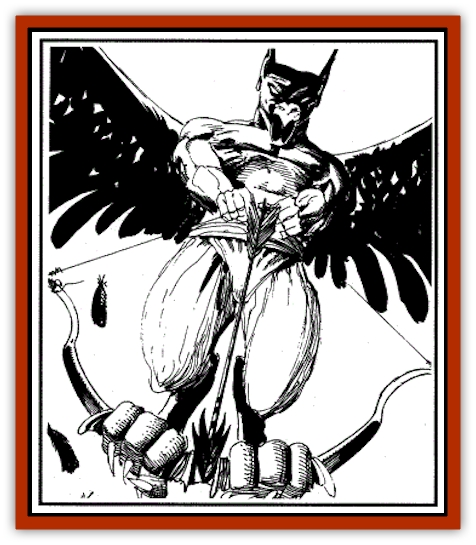

# Marrashi

| Statistic | **Marrashi** |
| --- | --- |
| **Activity Cycle:** | Day |
| **Alignment:** | Lawful evil |
| **Armor Class:** | 5 |
| **Climate/Terrain:** | Jungle, desert |
| **Damage/Attack:** | 1d2(&times;2)/1d6 or by arrow type |
| **Diet:** | Carrion |
| **Frequency:** | Rare |
| **Hit Dice:** | 7 |
| **Intelligence:** | Average (8-10) |
| **Magic Resistance:** | Nil |
| **Morale:** | Average (8-10) |
| **Movement:** | 12, Fl 27 (B) |
| **No. Appearing:** | 1d3 |
| **No. of Attacks:** | 3 |
| **Organization:** | Solitary |
| **Size:** | M (5' tall) |
| **Special Attacks:** | Missile weapons, disease |
| **Special Defenses:** | Immune to missile attacks |
| **THAC0:** | 13 (12 with missile weapons) |
| **Treasure:** | B |
| **XP Value:** | 2,000 |

The marrashi (plural: *marrash*), or *winged archer*, is an evil spirit of pestilence that sometimes agrees to serve a wizard or evil [[Genie|genie]] in exchange for treasure and the opportunity to spread contagion. It has the dark wings of a [[Vulture|vulture]], the arms and body of a human, the claws of a parrot, and the head of a [[Jackal|jackal]]. Its voice cracks and screeches. A marrashi is always armed with a bow and arrows.

**Combat:** On the ground a marrashi is a weak fighter, attacking with each clawlike hand for 1d2 points of damage and its beak for 1d6 points of damage. Marrash prefer to use their bows while airborne, by holding the bow with their talons and pulling back the string with their hands. This gives them additional power in each shot. It also gives them an odd, tumbling style of flight when shooting. Marrash can fire two shots per round, and they never suffer range penalties.

Marrash arrows may be barbed or diseased. Barbed arrows inflict 1d8+2 points of damage each. Diseased arrows cause 1d6+2 points of damage and require a saving throw vs. petrification. A failed save means that the victim has contracted a fatal disease and will die in 1d20 days unless treated by a *cure disease* spell, cast by a cleric of 7th level or higher, or a character with the healing proficiency makes a successful check at a penalty of -5. Any person exposed to the infected character must make a successful saving throw vs. petrification each day or also become infected until the affliction is cured.

Marrash can increase their numbers by firing *taklif* arrows. These special projectiles infect their victims with a disease that appears to be identical to the one spread by the diseased arrows described earlier, although the course of the disease is always much swifter - the victim of a *taklif* arrow dies in a day if untreated. *Bless*, *cure disease*, and *dispel evil* in combination are required within six hours to heal the afflicted victim. After six hours, the course of the disease is irreversible, short of a *heal* or *limited wish* spell (these also cure the disease completely in its earlier stages). A marrashi never has more than one *taklif* arrow at a time, and these are almost always used on human or demihuman targets; marrash bred from other races rarely survive.

The spirit of a victim struck by a *taklif* arrow is devoured by a growing marrashi presence, and when it is entirely eaten, the victim dies and the new marrashi begins to slowly transform the corpse. Victims of a *taklif* arrow cannot be brought back with a *raise dead* or *resurrection* spell, though a properly worded *wish* is effective. If simply buried, the body becomes a new marrashi in 1d6 days. The marrashi, having fed on the spirit of the transformed body, sometimes retains some of the memories and personality of the deceased. Its alignment, if not already lawful evil, shifts to that alignment in stages over the next 1d3 weeks. If cremated, the embryonic marrashi dies.

**Habitat/Society:** Marrash are usually confined to the Outer Planes, but they can be summoned to the Prime Material by wizards knowledgeable in the art of commanding their service. Once summoned, they always seek to increase their numbers without the knowledge of the mage who conjured them so that the newborns may, in time, avenge their parents' servitude. These newly created marrash are always the result of *taklif* arrows, and they must fend for themselves from the moment they shed their hosts' skins. They grow quickly and nourish themselves to maturity in desolate places, stealing carrion from vultures and ambushing lone travelers to create more of their own kind.

**Ecology:** Marrash are servitor creatures on the Prime Material Plane and have few effects on any ecology there, except when their plagues decimate city populations.

---
## Discovery & Documentation

**Source Publication:** Monstrous Compendium, 1994 Annual, Volume 1 (1995)
**Campaign Setting:** Advanced Dungeons & Dragons 2nd Edition
**Author(s):** David Wise

### Other Creatures Found in This Source Book
   * [[Abyss_Ant|Abyss Ant]]
   * [[Achaierai|Achaierai]]
   * [[Afanc|Afanc]]
   * [[Al-Jahar|Al-Jahar]]
   * [[Baelnorn|Baelnorn]]
   * [[Baneguard|Baneguard]]
   * [[Banelar|Banelar]]
   * [[Bird_Talking|Bird, Talking]]
   * [[Blazing_Bones|Blazing Bones]]
   * [[Campestri|Campestri]]
   * [[Caniquine|Caniquine]]
   * [[Cat_Winged|Cat, Winged]]
   * [[Crypt_Servant|Crypt Servant]]
   * [[Death's_Head_Tree|Death's Head Tree]]
   * [[Dog_Saluqi|Dog, Saluqi]]
   * [[Dragon_Electrum|Dragon, Electrum]]
   * [[Dragon_Fang|Dragon, Fang]]
   * [[Dragon_Linnorm_Corpse_Tearer|Dragon, Linnorm, Corpse Tearer]]
   * [[Dragon_Linnorm_Dread|Dragon, Linnorm, Dread]]
   * [[Dragon_Linnorm_Flame|Dragon, Linnorm, Flame]]
   * [[Dragon_Linnorm_Forest|Dragon, Linnorm, Forest]]
   * [[Dragon_Linnorm_Frost|Dragon, Linnorm, Frost]]
   * [[Dragon_Linnorm_Gray|Dragon, Linnorm, Gray]]
   * [[Dragon_Linnorm_Land|Dragon, Linnorm, Land]]
   * [[Dragon_Linnorm_Midgard|Dragon, Linnorm, Midgard]]
   * [[Dragon_Linnorm_Rain|Dragon, Linnorm, Rain]]
   * [[Dragon_Linnorm_Sea|Dragon, Linnorm, Sea]]
   * [[Dragon_Neutral_Jacinth|Dragon, Neutral, Jacinth]]
   * [[Dragon_Neutral_Jade|Dragon, Neutral, Jade]]
   * [[Dragon_Neutral_Pearl|Dragon, Neutral, Pearl]]
   * [[Dread|Dread]]
   * [[Dragon-kin|Dragon-kin]]
   * [[Elemental_Earth_Kin_Chrysmal|Elemental, Earth Kin, Chrysmal]]
   * [[Elemental_Earth_Kin_Earth_Weird|Elemental, Earth Kin, Earth Weird]]
   * [[Elemental_Fire_Kin_Azer|Elemental, Fire Kin, Azer]]
   * [[Elemental_Sandman|Elemental, Sandman]]
   * [[Elemental_Wind_Walker|Elemental, Wind Walker]]
   * [[Elemental_Vermin|Elemental Vermin]]
   * [[Feystag|Feystag]]
   * [[Flame_Skull|Flame Skull]]
   * [[Foulwing|Foulwing]]
   * [[Gambado|Gambado]]
   * [[Garbug|Garbug]]
   * [[Genie_Tasked_Administrator|Genie, Tasked, Administrator]]
   * [[Genie_Tasked_Deceiver|Genie, Tasked, Deceiver]]
   * [[Genie_Tasked_Harim_Servant|Genie, Tasked, Harim Servant]]
   * [[Genie_Tasked_Messenger|Genie, Tasked, Messenger]]
   * [[Genie_Tasked_Miner|Genie, Tasked, Miner]]
   * [[Genie_Tasked_Oathbinder|Genie, Tasked, Oathbinder]]
   * [[Gibbering_Mouther|Gibbering Mouther]]
   * [[Gnasher|Gnasher]]
   * [[Gnasher_Winged|Gnasher, Winged]]
   * [[Golem_Brain|Golem, Brain]]
   * [[Golem_Hammer|Golem, Hammer]]
   * [[Golem_Metagolem|Golem, Metagolem]]
   * [[Golem_Spiderstone|Golem, Spiderstone]]
   * [[Gorynych|Gorynych]]
   * [[Greelox|Greelox]]
   * [[Helmed_Horror|Helmed Horror]]
   * [[Jarbo|Jarbo]]
   * [[Laraken|Laraken]]
   * [[Lich_Psionic|Lich, Psionic]]
   * [[Living_Steel|Living Steel]]
   * [[Lock_Lurker|Lock Lurker]]
   * [[Loxo|Loxo]]
   * [[Lycanthrope_Loup_de_Noir|Lycanthrope, Loup de Noir]]
   * [[Lycanthrope_Werebadger|Lycanthrope, Werebadger]]
   * [[Lycanthrope_Werejaguar|Lycanthrope, Werejaguar]]
   * [[Lythlyx|Lythlyx]]
   * [[Magebane|Magebane]]
   * [[Metalmaster|Metalmaster]]
   * [[Mimic_House_Hunter|Mimic, House Hunter]]
   * [[Naga_Bone|Naga, Bone]]
   * [[Nautilus_Giant|Nautilus, Giant]]
   * [[Nightshade_Toril|Nightshade (Toril)]]
   * [[Nishruu|Nishruu]]
   * [[Noran|Noran]]
   * [[Opinicus|Opinicus]]
   * [[Ormyrr|Ormyrr]]
   * [[Parasite|Parasite]]
   * [[Pasari-Niml|Pasari-Niml]]
   * [[Plant_Vampire_Moss|Plant, Vampire Moss]]
   * [[Pteraman|Pteraman]]
   * [[Rautym|Rautym]]
   * [[Shadeling|Shadeling]]
   * [[Skum|Skum]]
   * [[Snake_Giant_Cobra|Snake, Giant Cobra]]
   * [[Snake_Stone|Snake, Stone]]
   * [[Spectral_Wizard|Spectral Wizard]]
   * [[Spell_Weaver|Spell Weaver]]
   * [[Spider_Brain|Spider, Brain]]
   * [[Suwyze|Suwyze]]
   * [[Tatalla|Tatalla]]
   * [[Tick_Heart|Tick, Heart]]
   * [[Tree_Dark|Tree, Dark]]
   * [[Tree_Singing|Tree, Singing]]
   * [[Tressym|Tressym]]
   * [[Troll_Snow|Troll, Snow]]
   * [[Tuyewera|Tuyewera]]
   * [[Ulitharid|Ulitharid]]
   * [[Undead_Dwarf|Undead Dwarf]]
   * [[Undead_Lake_Monster|Undead Lake Monster]]
   * [[Whipsting|Whipsting]]
   * [[Windghost|Windghost]]
   * [[Wolf_Dread|Wolf, Dread]]
   * [[Wolf_Stone|Wolf, Stone]]
   * [[Wolf_Vampiric|Wolf, Vampiric]]
   * [[Wraith_Shimmering|Wraith, Shimmering]]
   * [[Xantravar|Xantravar]]
   * [[Xaver|Xaver]]
