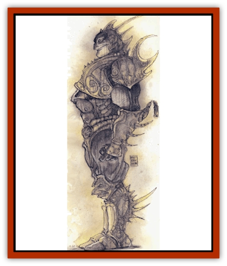

# Marut

| Statistic | **Marut** |
| --- | --- |
| **Activity Cycle:** | Any |
| **Alignment:** | Lawful neutral |
| **Armor Class:** | 0 |
| **Climate/Terrain:** | Mechanus (and Upper Planes) |
| **Damage/Attack:** | 8d10 |
| **Diet:** | None |
| **Frequency:** | Rare |
| **Hit Dice:** | 15 |
| **Intelligence:** | High (13-14) |
| **Magic Resistance:** | 10% |
| **Morale:** | Elite (13-14) |
| **Movement:** | 15 |
| **No. Appearing:** | 1-6 |
| **No. of Attacks:** | 1 |
| **Organization:** | Solitary |
| **Size:** | L (12' tall) |
| **Special Attacks:** | See below |
| **Special Defenses:** | +3 weapons to hit, regeneration |
| **THAC0:** | 5 |
| **Treasure:** | Nil |
| **XP Value:** | 17,000 |

Maruts are the servants of the powers throughout the Upper Planes. They go forth from Mechanus and spread the powers' will across the Outer Planes.

In his book *Magic and Mystery of Ind*, Vimalanda Rey tells a legend of the marut.

"In the Plague Year, Rudra visited death upon the once mighty city of Dharaputta.

"Prince Rajavahana claimed that with his wealth and power he could deny death, dismay Rudra, and lock out the plague. He locked himself in his high-domed palace. Guards kept away all sickness, and even the healthy who would see the Prince were bathed in strong smelling herbs and given magical treatments to insure their health. The sages of Rajavahana warned him that he could not avoid the maruts, but he paid wizards vast amounts to set certain powerful seals upon his doors that would keep the onyx giants from entering his palace.

"As the plague reduced his great city to ruin, the prince amused himself by parties and dances. One day he organized a trip to the treasure room of his great-grandfather. There he found a statue of a marut. For a moment he felt afraid, but the oldest dwellers of the palace assured him that the statue had been there since his grandfather's time. He had the statue taken to his ballroom to show his victory over Rudra.

"During his next feast, with all his guests around, Prince Rajavahana stood in front of the figure and taunted it. To his horror, the statue spoke! �Know, 0 Prince, that the decrees of fate are set aside by no man. Patiently I have waited since the time of your grandfather to bring you this.' Whereupon the marut breathed out a silvery breath.

"Coughing, the Prince cried, �What of my guards? what of my spells?'

"�Spells and guards are as naught to fate.'

"In an instant all had died the Silvery Death, and the marut, unhampered by spells to prevent its leaving, returned to Mechanus."

Maruts look like red-eyed, unliving giants carved from a single piece of polished stone with no discernible joints or seams. Maruts wear golden armor with wide plates on the shoulders and armbands.

Mamts speak only in response to direct questioning, save when relaying messages given to them. they understand all languages.

**Combat:** Maruts are awesome opponents. Their punch alone can fell all but the most powerful opponents (8d10 damage).

Maruts have the following spell-like powers: *animate object*, *blink*, *cause disease* (against any one target within 60') *continual light*, *control minds* (3 times per day), *deafness*, *earthquake* (once per day), *hold person*, *lightning bolt* (8d6 damage), and *shades*.

Maruts are immune to attacks from weapons of less than +3 magical enchantment. They regenerate 5 hp per round. Maruts are immune to acid-based attacks. They take half damage from cold and fire-based spells. *Trap the soul* and related magics do not affect the maruts. They also are immune to *death* spells.

**Habitat/Society:** Maruts spread the will of the power they serve, whether a god of disease, love, or magic. They interact with others only if it directly involves the service they are currently performing or if hindered from prforming that service. Otherwise they seem oblivious to what occurs around them. However, nothing could be further from the truth. Maruts are highly intelligent and keenly alert to their environment.

Although maruts seem evil, they are only servants who obey the will of their masters to the absolute letter. WHen the situation warrants it, their masters may even send them to aid a power of another alignment. Of course, when the maruts' actions no longer serve their master's will, they leave the scene immediately.

**Ecology:** Maruts are enchanted constructs that the god of disease, Rudra, has imbued with intelligence and sentience. The marut body itself is made of pure onyx and is worth hundreds of thousands of gold pieces.

Maruts exist only to spread the will of their masters or to serve those their master has chosen. They spread the will of their master even when assigned other tasks.

All maruts were created directly from the will of Rudra but have changed hands many times since. Because Rudra spreads disease, his own maruts harm their environment by causing disease in plants, animals, and sapient creatures. The god has given maruts to fellow powers as gifts for services rendered. In fact, at times it serves Rudra's enemies ends to assist the causes of good. In those times, his maruts directly serve a good deity.

---
## Discovery & Documentation

**Source Publication:** MC8 Outer Planes Appendix (1990)
**Campaign Setting:** Planescape
**Author(s):** Timothy B. Brown, Jamie LaFountain

### Other Creatures Found in This Source Book
   * [[Aasimon_Agathinon|Aasimon, Agathinon]]
   * [[Aasimon_Deva|Aasimon, Deva]]
   * [[Aasimon_Light|Aasimon, Light]]
   * [[Aasimon_General_Information|Aasimon, General Information]]
   * [[Aasimon_Planetar|Aasimon, Planetar]]
   * [[Aasimon_Solar|Aasimon, Solar]]
   * [[Air_Sentinel|Air Sentinel]]
   * [[Animal_Lord|Animal Lord]]
   * [[Archon|Archon]]
   * [[Baatezu_Lesser_Abishai|Baatezu, Lesser, Abishai]]
   * [[Baatezu_Greater_Amnizu|Baatezu, Greater, Amnizu]]
   * [[Baatezu_Lesser_Barbazu|Baatezu, Lesser, Barbazu]]
   * [[Baatezu_Greater_Cornugon|Baatezu, Greater, Cornugon]]
   * [[Baatezu_Lesser_Erinyes|Baatezu, Lesser, Erinyes]]
   * [[Baatezu_General_Information|Baatezu, General Information]]
   * [[Baatezu_Greater_Gelugon|Baatezu, Greater, Gelugon]]
   * [[Baatezu_Lesser_Hamatula|Baatezu, Lesser, Hamatula]]
   * [[Baatezu_Lemure|Baatezu, Lemure]]
   * [[Baatezu_Least_Nupperibo|Baatezu, Least, Nupperibo]]
   * [[Baatezu_Lesser_Osyluth|Baatezu, Lesser, Osyluth]]
   * [[Baatezu_Greater_Pit_Fiend|Baatezu, Greater, Pit Fiend]]
   * [[Baatezu_Least_Spinagon|Baatezu, Least, Spinagon]]
   * [[Balaena|Balaena]]
   * [[Bariaur|Bariaur]]
   * [[Bebilith|Bebilith]]
   * [[Bodak|Bodak]]
   * [[Dog_Moon|Dog, Moon]]
   * [[Dragon_Adamantite|Dragon, Adamantite]]
   * [[Einheriar|Einheriar]]
   * [[Gehreleth|Gehreleth]]
   * [[Githyanki|Githyanki]]
   * [[Githzerai|Githzerai]]
   * [[Hordling|Hordling]]
   * [[Lammasu_Celestial|Lammasu, Celestial]]
   * [[Larva|Larva]]
   * [[Maelephant|Maelephant]]
   * [[Mediator|Mediator]]
   * [[Mortai|Mortai]]
   * [[Night_Hag|Night Hag]]
   * [[Nightmare|Nightmare]]
   * [[Noctral|Noctral]]
   * [[Per|Per]]
   * [[Phoenix|Phoenix]]
   * [[Slaad|Slaad]]
   * [[Tanar'ri_Greater_Babau|Tanar'ri, Greater, Babau]]
   * [[Tanar'ri_Greater_Chasme|Tanar'ri, Greater, Chasme]]
   * [[Tanar'ri_Greater_Nabassu|Tanar'ri, Greater, Nabassu]]
   * [[Tanar'ri_Least_Dretch|Tanar'ri, Least, Dretch]]
   * [[Tanar'ri_Least_Manes|Tanar'ri, Least, Manes]]
   * [[Tanar'ri_Least_Rutterkin|Tanar'ri, Least, Rutterkin]]
   * [[Tanar'ri_Lesser_Alu-Fiend|Tanar'ri, Lesser, Alu-Fiend]]
   * [[Tanar'ri_Lesser_Bar-Lgura|Tanar'ri, Lesser, Bar-Lgura]]
   * [[Tanar'ri_Lesser_Cambion|Tanar'ri, Lesser, Cambion]]
   * [[Tanar'ri_Lesser_Succubus|Tanar'ri, Lesser, Succubus]]
   * [[Tanar'ri_Guardian_Molydeus|Tanar'ri, Guardian, Molydeus]]
   * [[Tanar'ri_General_Information|Tanar'ri, General Information]]
   * [[Tanar'ri_True_Balor|Tanar'ri, True, Balor]]
   * [[Tanar'ri_True_Glabrezu|Tanar'ri, True, Glabrezu]]
   * [[Tanar'ri_True_Hezrou|Tanar'ri, True, Hezrou]]
   * [[Tanar'ri_True_Marilith|Tanar'ri, True, Marilith]]
   * [[Tanar'ri_True_Nalfeshnee|Tanar'ri, True, Nalfeshnee]]
   * [[Tanar'ri_True_Vrock|Tanar'ri, True, Vrock]]
   * [[Titan|Titan]]
   * [[Translator|Translator]]
   * [[T'uen-rin|T'uen-rin]]
   * [[Vaporighu|Vaporighu]]
   * [[Warden_Beast|Warden Beast]]
   * [[Yugoloth_Greater_Arcanaloth|Yugoloth, Greater, Arcanaloth]]
   * [[Yugoloth_Lesser_Dergoloth|Yugoloth, Lesser, Dergoloth]]
   * [[Yugoloth_Lesser_Hydroloth|Yugoloth, Lesser, Hydroloth]]
   * [[Yugoloth_General_Information|Yugoloth, General Information]]
   * [[Yugoloth_Lesser_Mezzoloth|Yugoloth, Lesser, Mezzoloth]]
   * [[Yugoloth_Greater_Nycaloth|Yugoloth, Greater, Nycaloth]]
   * [[Yugoloth_Lesser_Piscoloth|Yugoloth, Lesser, Piscoloth]]
   * [[Yugoloth_Greater_Ultroloth|Yugoloth, Greater, Ultroloth]]
   * [[Yugoloth_Lesser_Yagnoloth|Yugoloth, Lesser, Yagnoloth]]
   * [[Zoveri|Zoveri]]
