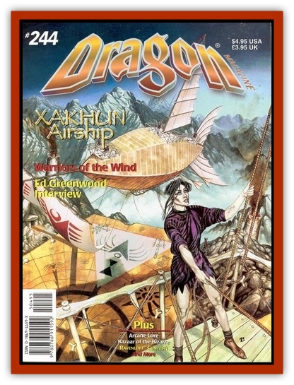

# Masgai

| Statistic | **Masgai** |
| --- | --- |
| **Activity Cycle:** | Any |
| **Alignment:** | Lawful neutral |
| **Armor Class:** | 2 |
| **Climate/Terrain:** | Any |
| **Damage/Attack:** | By weapon type |
| **Diet:** | Omnivore |
| **Frequency:** | Rare |
| **Hit Dice:** | 3 |
| **Intelligence:** | High (13-14) |
| **Magic Resistance:** | Nil |
| **Morale:** | Fanatic (18) |
| **Movement:** | 9, Fl 18 (C) |
| **No. Appearing:** | 10-40 |
| **No. of Attacks:** | 1 or 2 |
| **Organization:** | Community |
| **Size:** | M (6' tall) |
| **Special Attacks:** | Nil |
| **Special Defenses:** | Nil |
| **THAC0:** | 18 |
| **Treasure:** | Nil |
| **XP Value:** | 65 |

The Masgai are tall and long-limbed insect humanoids. They walk upright on spindly legs, and their thin arms extend almost to their knees. The outer surface of their entire body is covered by a dark chitinous layer, acting as natural armor plating. Their faces are elongated, with two eyes set wide apart, a prominent jaw, and sharp teeth.

Masgai are highly advanced tool makers, and their clothes are mass produced. While the clothing is of high quality, there is very little variety in fashion, so most Masgai have a uniform appearance. The Masgai do not have wings, as they are distantly related to [[Elemental_Air_Earth|air elementals]] and have the innate ability to fly at will.

The Masgai are empire builders who are slowly spreading their influence from world to world. The Masgai's capital city of Rig-Veda is hidden on a remote world, its location jealously guarded by both mundane and magical means.

The Masgai have developed a systematic approach to their dominion of other worlds. They begin by establishing trading enclaves in the most powerful cities of each world, entering into trade alliances that give them both financial and political power. When they determine the time is right, they establish a minor settlement on the edge of the frontier, helping the indigenous races keep any humanoid, giant or monster populations at bay. Once they have been accepted, they slowly increase the size of their settlement until they can challenge for political, economic and military supremacy.

The Masgai are perfectly content to wait for centuries for their plans to come to fruition. They prefer to establish control without military conquest, but they engage in battle without hesitation whenever necessary.

Masgai warriors can advance to an unlimited level as warriors. They have no clerical magic, though, and their wizards can advance only as far as fourth level.

**Combat:** The Masgai way of life of has created exemplary warriors. They are disciplined in battle, responding flawlessly to a hierarchy of commanders and sub-units.

Attacks are coordinated and well-planned. Their assaults are always carried out for a very specific purpose. The Masgai do not form rigid battle lines or commit themselves irrevocably to attack. They usually approach in a loose, flexible formation, trying to attack opponents at their weakest points. The front ranks of Masgai attackers usually carry 12' spears that are used to thrust at non-flying warriors, and secondary ranks are typically armed with both bows and short swords.

If strongly resisted, the Masgai withdraw, hoping to coerce the enemy into breaking ranks and overextending themselves to counterattack. Once an opponents discipline has broken down, the Masgai mass to attack isolated groups, engaging in melee combat only when the battle is clearly in their favor.

**Habitat/Society:** Masgai are builders of the highest order. They live in vast cities that are built with magic the Masgai have tamed for domestic use. Since they can fly, they choose sites that are easily defensible and of little value to creatures who can't fly. They use sophisticated agricultural techniques to produce large yields from their fields, and they create immense transportation networks to bring supplies from outlying regions.

War is central to the social structure of the Masgai. A military hierarchy wields economic and political power, and all citizens are expected to serve at least two years in the standing army of each Masgai city. The response of most Masgai warriors to the strain of constant war-making is a fierce adherence to a strict code of honor that stresses personal service to the state above all else. This strict warrior code has led to the establishment of various military orders, membership in which is the measurement of social status in the Masgai hierarchy.

The Masgai wage war as an extension of their political power; they do not waste resources without the prospect of some type of gain. They see conquest as a means to gain riches and power, planning immense campaigns for the annexation and consolidation of power. They are ruthless and terrifying in battle.

**Ecology:** The Masgai are an ambitious, powerful race. They plan for the long term and are extremely patient in dealing with other races. Masgai population centers tend to be very large, and they are a great drain on the natural resources of the surrounding lands. The Masgai need to expand their population base due to a short life-span forces them to go farther and farther afield for food and materials. Their largest empires have actually drawn on the resources of numerous worlds, all connected by sophisticated teleportation portals.

The Masgai jealously guard their magical advances, which are centered on group benefits rather than individual applications.

---
## Discovery & Documentation

**Source Publication:** Dragon244 (1998)
**Campaign Setting:** Dragon Magazine
**Author(s):** Michael Lambert, David Day, Roger Raupp, with Chris Perkins and Jesse Decker
