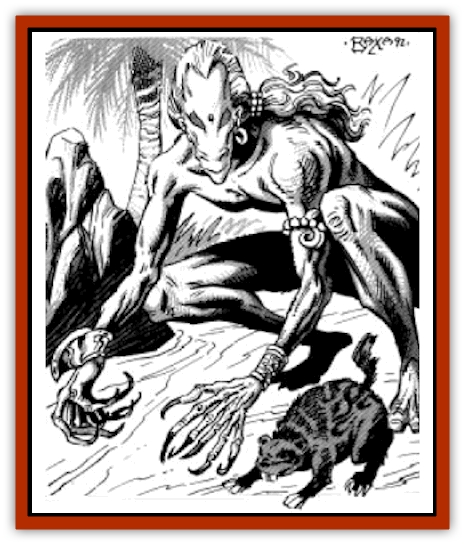

# Maskhi

| Statistic | **Maskhi** |
| --- | --- |
| **Activity Cycle:** | Day |
| **Alignment:** | Chaotic neutral |
| **Armor Class:** | 5 or 0 |
| **Climate/Terrain:** | Any tropical land |
| **Damage/Attack:** | 1-3/1-3 or by weapon |
| **Diet:** | Omnivore |
| **Frequency:** | Rare |
| **Hit Dice:** | 4+1 |
| **Intelligence:** | Average to High (8-14) |
| **Magic Resistance:** | Nil |
| **Morale:** | Elite (13) |
| **Movement:** | 9 (as animal) or 0 |
| **No. Appearing:** | 2-40 |
| **No. of Attacks:** | 2 |
| **Organization:** | Tribes |
| **Size:** | M |
| **Special Attacks:** | Surprise |
| **Special Defenses:** | Shapeshifting |
| **THAC0:** | 17 |
| **Treasure:** | P (C) |
| **XP Value:** | 975 / Lore mistress or witch doctor: 3,000 |

Maskhi are humanoids capable of transforming into an animal, tree, or stone. They dwell in small, xenophobic tribes in the wilderness, far from Zakharan civilization.

In their original form, maskhi appear to be lean and wiry man-sized humanoids. Their faces have elongated features, but still appear remarkably human, many with wide, cerulean or green eyes. All have blond, sun-bleached hair, tied back in long flowing manes or braids down their backs. Their tanned skin is covered with short, light hair, lending their skin a fuzzy, peachlike appearance. Maskhi have six-fingered hands and six-toed feet, their digits ending in talon-like claws. Their agility and tough skin lend them a natural AC of 5.

Each maskhi is capable of assuming a single animal form that reflects their personality. Many choose the shape of a small [[Mammal|mammal]] or [[Bird|bird]]. In this shape, their AC is still 5 and they receive the form's normal movement rate.

Their plant form is usually that of a small tropical tree (from 8-12' tall) common to the region in which a maskhi tribe dwells. A maskhi can only assume the form of one type of tree. Maskhi are AC 0 and stationary while in their arboreal form.

Finally, their stone form is roughly man-sized. Although an individual maskhi can only assume one type of rock (i.e., basalt, obsidian, quartz, marble, etc.), they can change their shape to look like a boulder, standing stone, or an outcropping of a larger rock formation, as desired. Most maskhi choose a form of stone common to the region in which they dwell. They are AC 0 and stationary in this form as well.

Maskhi communicate only in their own language, although there is a 10% chance that a member of a Maskhi tribe may know Common if they have had any interaction with the other races of Zakhara through raids or trading.

**Combat:** In their humanoid form, Maskhi prefer to fight with weapons, preferably the spear, short bow, and jambiya. Although some tribes may have managed to acquire steel weapons, either by trade or raiding, many (50%) use blades and arrow heads crafted out of bone, which are -1 on damage and may break (2 in 6 chance) on a natural attack roll of 1. If disarmed, they can attack with their sharp claws.

Maskhi use their shapeshifting abilities to aid them in ambushing, hiding, and fleeing. A common tactic is to wait at an oasis in their tree or stone forms and ambush those who arrive for a drink. They can change shape quickly, so that their opponents have a penalty of +4 on surprise.

In their tree and stone forms, they are indistinguishable in smell and texture from real trees and stones. They can fool even highly intelligent adversaries, provided the maskhi were not seen while shapeshifting into their new form. Despite their similarity to natural trees and rock formations, spells and potions that affect plants and stones (e.g., *potion of plant control*, *charm plant*, *transmute rock to mud*, *pass wall*, etc.) have no effect on a transformed maskhi.

When it is not possible to hide and transform unobserved into a tree or stone, maskhi shapeshift into their animal form, which has a greater movement rate, in order to flee.

The leadership of a maskhi tribe with more than 20 individuals is directed by a lore mistress and a witch doctor, each with 33 hit points. The lore mistress is female, with the powers of a 5th- to 8th-level kahin priest. The witch doctor, a male, has the powers of a 6th- to 9th-level sorcerer wizard. Maskhi witch doctors typically choose sand and wind as their specialization.

**Habitat/Society:** Maskhi are fearful of "civilized" Zakharans. They dwell in isolation in the wilderness, living in temporary shelters made from animal skins stretched over light wooden frames.

The typical tribe consists of a loose confederation of up to 40 maskhi. Males and females have equal status, although none share any lasting commitment to each other. Even when an infant is born, only a temporary family is established until the child learns to shapeshift, after which the parents go their separate ways, looking for new mates.

**Ecology:** All maskhi have a reverence for the land and the environment. They hunt only out of necessity, never pleasure.

Most tribes are peaceful, but if their niche is threatened or encroached upon, they will fight tenaciously to protect it.

---
## Discovery & Documentation

**Source Publication:** MC13 Al-Qadim Appendix (1992)
**Campaign Setting:** Al-Qadim (Forgotten Realms)
**Author(s):** C. Terry Phillips

### Other Creatures Found in This Source Book
   * [[Ammut|Ammut]]
   * [[Ashira|Ashira]]
   * [[Asuras|Asuras]]
   * [[Black_Cloud_of_Vengeance|Black Cloud of Vengeance]]
   * [[Buraq|Buraq]]
   * [[Camel|Camel]]
   * [[Camel_of_the_Pearl|Camel of the Pearl]]
   * [[Centaur_Desert|Centaur, Desert]]
   * [[Copper_Automaton|Copper Automaton]]
   * [[Debbi|Debbi]]
   * [[Elephant_Bird|Elephant Bird]]
   * [[Gen|Gen]]
   * [[Genie_Noble_Dao|Genie, Noble Dao]]
   * [[Genie_Noble_Djinni|Genie, Noble Djinni]]
   * [[Genie_Noble_Efreeti|Genie, Noble Efreeti]]
   * [[Genie_Noble_Marid|Genie, Noble Marid]]
   * [[Genie_Tasked_Architect_Builder|Genie, Tasked, Architect/Builder]]
   * [[Genie_Tasked_Artist|Genie, Tasked, Artist]]
   * [[Genie_Tasked_Guardian|Genie, Tasked, Guardian]]
   * [[Genie_Tasked_Herdsman|Genie, Tasked, Herdsman]]
   * [[Genie_Tasked_Slayer|Genie, Tasked, Slayer]]
   * [[Genie_Tasked_Warmonger|Genie, Tasked, Warmonger]]
   * [[Genie_Tasked_Winemaker|Genie, Tasked, Winemaker]]
   * [[Ghost_Mount|Ghost Mount]]
   * [[Ghul|Ghul]]
   * [[Giant_Desert|Giant, Desert]]
   * [[Giant_Jungle|Giant, Jungle]]
   * [[Giant_Reef|Giant, Reef]]
   * [[Giant_Zakhara_General_Information|Giant (Zakhara), General Information]]
   * [[Hama|Hama]]
   * [[Heway|Heway]]
   * [[Living_Idol|Living Idol]]
   * [[Lycanthrope_Werehyena|Lycanthrope, Werehyena]]
   * [[Lycanthrope_Werelion|Lycanthrope, Werelion]]
   * [[Markeen|Markeen]]
   * [[Mason_Wasp_Giant|Mason Wasp, Giant]]
   * [[Nasnas|Nasnas]]
   * [[Pahari|Pahari]]
   * [[Rom|Rom]]
   * [[Sabu_Lord|Sabu Lord]]
   * [[Sakina|Sakina]]
   * [[Serpent_Lord|Serpent Lord]]
   * [[Serpent_Winged|Serpent, Winged]]
   * [[Silat|Silat]]
   * [[Simurgh|Simurgh]]
   * [[Stone_Maiden|Stone Maiden]]
   * [[Vishap|Vishap]]
   * [[Zaratan|Zaratan]]
   * [[Zin|Zin]]
