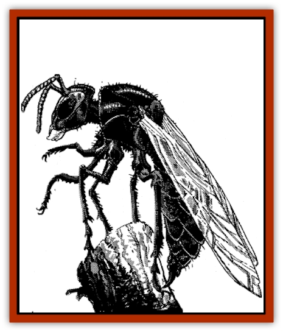

# Mason Wasp - Giant

| Statistic | **Mason Wasp, Giant** |
| --- | --- |
| **Activity Cycle:** | Day |
| **Alignment:** | Neutral good |
| **Armor Class:** | 2 |
| **Climate/Terrain:** | Tropical/Plains or desert |
| **Damage/Attack:** | 4-16/1-4 |
| **Diet:** | Omnivore |
| **Frequency:** | Uncommon |
| **Hit Dice:** | 6+1 |
| **Intelligence:** | Low (5-7) |
| **Magic Resistance:** | Nil |
| **Morale:** | Steady (11) |
| **Movement:** | 6, Fl 21 (B) |
| **No. Appearing:** | 1-2 |
| **No. of Attacks:** | 2 |
| **Organization:** | Solitary |
| **Size:** | M (6' long) |
| **Special Attacks:** | Poison and fire breath |
| **Special Defenses:** | mmune to fire |
| **THAC0:** | 15 |
| **Treasure:** | Incidental |
| **XP Value:** | 3,000 |

Giant mason [[Hornet_Giant|wasps]] are enlarged versions of the normal variety, which is found throughout Zakhara. Both kinds are viewed as messengers of the gods and bringers of good fortune.

The body of a giant mason wasp is 6' long, with a 12' wingspan. Its hard exoskeleton is a lustrous, jet black, but its front mandibles and mouth glow cherry red with heat. In addition, the abdomen is tipped with a retractable stinger.

**Combat:** Giant mason wasps rarely attack humans or demihumans, preying mostly on the animals, reptiles, and evil monsters that roam the plains and deserts of Zakhara. If faced with a single opponent, it will swoop down and grab the victim with its legs. The wasp will then bite with its red-hot mandibles and attempt to impale the victim with its stinger.

The vicious bite of a giant mason wasp inflicts 2-8 points of damage. Creatures not immune to fire take an additional 2-8 points of damage from the mandibles' searing heat.

The wasp's sting inflicts 1-4 points of damage and injects a victim with a powerful and deadly toxin. Those not successfully saving vs. poison lose consciousness in 1-4 rounds and are wracked by a burning fever. Victims must make two system shock rolls: if the first is successful, the victim awakes from the fever after 1-3 days. If the first roll is failed but the second is successful, the victim awakes from the fever after a week, but loses 1 point of constitution permanently. A victim with two failed rolls will die after a week of fever unless they receive the benefit of a *cure disease* spell in the interim; they still lose 1 point of constitution permanently.

Giant mason wasps are immune to fire and all fire-based attacks. If faced with more than one opponent, they can also breathe a cone of fire (5 feet wide at the mouth, 15 feet wide at the end, and 20 feet long) up to three times per day. The breath inflicts 6-30 points of damage (save for half damage).

Finally, it is considered very bad luck to kill a giant mason wasp. At the DM's discretion,whoever participates in their destruction must roll a saving throw or be afflicted with the *evil eye*.

**Habitat/Society:** In the wild, giant mason wasps are solitary creatures. Their name is derived from the female's tendency to create large above-ground structures out of a mixture of dirt sand, and saliva called dhilva, which hardens into a rocklike substance.

Once a month, the female will seek a male and mate. The pair then hunt for a large animal or evil monster, paralyze it with their poison, and carry it back to the female's den, where the victim is immobilized with more dhilva. The female then lays 1-3 eggs on the victim and seals the entrance to the den with dhilva. Upon hatching, the larvae consume the host, dissolve the dhilva with their own saliva, and fly away to establish their own hunting grounds and dens. Although giant mason wasps do not hoard treasure, some incidental treasure might be found in a mason wasp's den.

Giant mason wasps are often friendly to humans and demihumans. They make excellent pets and guardians if a common mode of communication can be established. Priests, who can use spells to speak with animals, and rangers who have a natural affinity for animal handling, are among those most frequently encountered with a giant mason wasp as a pet or guardian. They might also be found as guardians in mosques.

**Ecology:** In both the wilderness and city, giant mason wasps can be found as protectors of good and the opposers of evil. Their arch-nemesis is the [[Vishap|vishap]], who break into their dens and consume wasp eggs as a sugared delicacy.

There are many useful derivatives that can be made from a mason wasp. Since killing a giant mason wasp can bring bad luck, most people wait until one of the insects dies from natural causes before using their remains in a potion. Their fire glands can be used to make *potions of fire breath*, while their exoskeleton, if powdered, can be used to make either *potions of fire resistance* or oil of *fire elemental invulnerability*. Insinuative poison can be obtained from their poison sacks, which are located in the abdomen near the stinger. This poison (Type O) loses its potency if not used within a week; it can also be used to make powerful poison antidotes.

---
## Discovery & Documentation

**Source Publication:** MC13 Al-Qadim Appendix (1992)
**Campaign Setting:** Al-Qadim (Forgotten Realms)
**Author(s):** C. Terry Phillips

### Other Creatures Found in This Source Book
   * [[Ammut|Ammut]]
   * [[Ashira|Ashira]]
   * [[Asuras|Asuras]]
   * [[Black_Cloud_of_Vengeance|Black Cloud of Vengeance]]
   * [[Buraq|Buraq]]
   * [[Camel|Camel]]
   * [[Camel_of_the_Pearl|Camel of the Pearl]]
   * [[Centaur_Desert|Centaur, Desert]]
   * [[Copper_Automaton|Copper Automaton]]
   * [[Debbi|Debbi]]
   * [[Elephant_Bird|Elephant Bird]]
   * [[Gen|Gen]]
   * [[Genie_Noble_Dao|Genie, Noble Dao]]
   * [[Genie_Noble_Djinni|Genie, Noble Djinni]]
   * [[Genie_Noble_Efreeti|Genie, Noble Efreeti]]
   * [[Genie_Noble_Marid|Genie, Noble Marid]]
   * [[Genie_Tasked_Architect_Builder|Genie, Tasked, Architect/Builder]]
   * [[Genie_Tasked_Artist|Genie, Tasked, Artist]]
   * [[Genie_Tasked_Guardian|Genie, Tasked, Guardian]]
   * [[Genie_Tasked_Herdsman|Genie, Tasked, Herdsman]]
   * [[Genie_Tasked_Slayer|Genie, Tasked, Slayer]]
   * [[Genie_Tasked_Warmonger|Genie, Tasked, Warmonger]]
   * [[Genie_Tasked_Winemaker|Genie, Tasked, Winemaker]]
   * [[Ghost_Mount|Ghost Mount]]
   * [[Ghul|Ghul]]
   * [[Giant_Desert|Giant, Desert]]
   * [[Giant_Jungle|Giant, Jungle]]
   * [[Giant_Reef|Giant, Reef]]
   * [[Giant_Zakhara_General_Information|Giant (Zakhara), General Information]]
   * [[Hama|Hama]]
   * [[Heway|Heway]]
   * [[Living_Idol|Living Idol]]
   * [[Lycanthrope_Werehyena|Lycanthrope, Werehyena]]
   * [[Lycanthrope_Werelion|Lycanthrope, Werelion]]
   * [[Markeen|Markeen]]
   * [[Maskhi|Maskhi]]
   * [[Nasnas|Nasnas]]
   * [[Pahari|Pahari]]
   * [[Rom|Rom]]
   * [[Sabu_Lord|Sabu Lord]]
   * [[Sakina|Sakina]]
   * [[Serpent_Lord|Serpent Lord]]
   * [[Serpent_Winged|Serpent, Winged]]
   * [[Silat|Silat]]
   * [[Simurgh|Simurgh]]
   * [[Stone_Maiden|Stone Maiden]]
   * [[Vishap|Vishap]]
   * [[Zaratan|Zaratan]]
   * [[Zin|Zin]]
