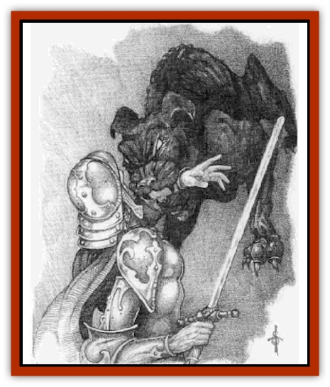

# Mastiff - Shadow

| Statistic | **Mastiff, Shadow** |
| --- | --- |
| **Activity Cycle:** | Night or shadow |
| **Alignment:** | Neutral evil |
| **Armor Class:** | 6 |
| **Climate/Terrain:** | Demiplane of Shadow |
| **Damage/Attack:** | 2d4 |
| **Diet:** | Living creatures |
| **Frequency:** | Uncommon |
| **Hit Dice:** | 4 |
| **Intelligence:** | Semi- (2-4) |
| **Magic Resistance:** | Nil |
| **Morale:** | Fanatic (17) |
| **Movement:** | 18 (9 in bright light) |
| **No. Appearing:** | 4-16 |
| **No. of Attacks:** | 1 |
| **Organization:** | Pack |
| **Size:** | M (5' at shoulder) |
| **Special Attacks:** | Baying |
| **Special Defenses:** | Hide in shadows |
| **THAC0:** | 17 |
| **Treasure:** | Nil |
| **XP Value:** | 420 |

Shadow mastiffs are native to the Demiplane of Shadow, appearing on the Prime Material Plane only when summoned by ambitious wizards and clerics. While on their home plane, shadow mastiffs roam at all times, returning to their lairs only after feeding. When summoned on the Prime Material, these creatures prowl at night or during times of darkness (such as eclipses), always seeking shelter just before light returns.

**Combat:** Creatures who are forced to fight a pack of shadow mastiffs typically find themselves in one of two positions: combat during near-dark or completely dark conditions, or fighting where light conditions work against the mastiffs.

During darkened conditions, a shadow mastiff is at its most deadly peak. Each time the shadow mastiff strikes, it instantly blends back into the shadows, making it 40% likely that it cannot be seen and imposing a -4 penalty on its victim's attack rolls. A shadow mastiff that has successfully blended back into the shadows must be attacked physically or with area of effect spells; line-of-sight spells (such as *magic missile*) cannot be used unless some special method of locating the mastiff is used.

During illuminated conditions, such as that created by a *continual light* spell or daylight (but not a normal *light* spell), the weaknesses of a mastiff becomes obvious. It loses its ability to hide in shadows, loses 4 hit points, its movement rate drops to 9, and its morale decreases to average (9).

Regardless of light conditions, a howling pack of shadow mastiffs can cause panic in even the most resolute of warriors. The baying power of a pack of mastiffs causes all creatures within 360 feet of a pack to run in fear away from the shadow mastiffs for 2d4 rounds unless a saving throw vs. spell is made. Such a saving throw is made with a modifier based upon the number of shadow mastiffs in the pack. There must be at least four shadow mastiffs present to use their baying power.

| No. of Shadow Mastiffs | Saving Throw Modifier |
| --- | --- |
| 4-6 | +4 |
| 7 | +3 |
| 8 | +2 |
| 9 | +1 |
| 10 | 0 |
| 11 | -1 |
| 12 | -2 |
| 13-14 | -3 |
| 15+ | -4 |

Those who fail their saving throws are 50% likely to drop anything held in their hands as they flee. While on the Demiplane of Shadow, saving throw modifiers for the mastiffs' baying power can increase to a -6 penalty if an exceptionally large pack of 20 or more of the creatures are encountered.

**Habitat/Society:** Shadow mastiffs are ruled by the most powerful mastiff in the pack, but there is little loyalty to the leader. Shadow mastiffs never suffer morale penalties for losing their leader, as another mastiff is always prepared to lead.

The lair of a pack of shadow mastiffs is 50% likely to contain 2-5 whelps. These young are valued at around 200-500 gold pieces each. Bright light is fatal to whelps, however, so transportation of young shadow mastiffs is normally possible only through use of *continual darkness* or similar magic.

**Ecology:** Sages have long believed that shadow mastiffs arise as the result of an animal being killed by an undead shadow. Upon its death, it is believed to be mystically transported to the Demiplane of Shadow where it joins with others of its kind.

---
## Discovery & Documentation

**Source Publication:** Monstrous Compendium, 1996 Annual, Volume 3 (1995)
**Campaign Setting:** Advanced Dungeons & Dragons 2nd Edition
**Author(s):** Jon Pickens

### Other Creatures Found in This Source Book
   * [[Alaghi|Alaghi]]
   * [[Alhoon|Alhoon]]
   * [[Aranea_Savage_Coast|Aranea (Savage Coast)]]
   * [[Arcane_Head|Arcane Head]]
   * [[Banedead|Banedead]]
   * [[Banelich|Banelich]]
   * [[Bat_Bonebat|Bat, Bonebat]]
   * [[Beetle|Beetle]]
   * [[Belgoi|Belgoi]]
   * [[Bladeling|Bladeling]]
   * [[Braxat|Braxat]]
   * [[Bunyip|Bunyip]]
   * [[Burbur|Burbur]]
   * [[Bvanen|Bvanen]]
   * [[Cat_Great_Snow_Tiger|Cat, Great, Snow Tiger]]
   * [[Chosen_One|Chosen One]]
   * [[Chronovoid|Chronovoid]]
   * [[Cildabrin|Cildabrin]]
   * [[Coffer_Corpse|Coffer Corpse]]
   * [[Disenchanter|Disenchanter]]
   * [[Dog_Temporal|Dog, Temporal]]
   * [[Dragon_Cerilia|Dragon (Cerilia)]]
   * [[Dragon_Ghost|Dragon, Ghost]]
   * [[Dragon_Lesser_Undead|Dragon, Lesser Undead]]
   * [[Dragon_Neutral_Amber|Dragon, Neutral, Amber]]
   * [[Dread_Warrior|Dread Warrior]]
   * [[Dreamweaver|Dreamweaver]]
   * [[Dream_Spawn_Greater_Ennui|Dream Spawn, Greater, Ennui]]
   * [[Dream_Spawn_Lesser_Morph|Dream Spawn, Lesser, Morph]]
   * [[Dwarf_Arctic|Dwarf, Arctic]]
   * [[Dwarf_Urdunnir|Dwarf, Urdunnir]]
   * [[Eel_Giant_Moray|Eel, Giant Moray]]
   * [[Elemental_Fire_Kin_Tome_Guardian|Elemental, Fire Kin, Tome Guardian]]
   * [[Elf_Rockseer|Elf, Rockseer]]
   * [[Ethyk|Ethyk]]
   * [[Faerie_Faerie_Fiddler|Faerie, Faerie Fiddler]]
   * [[Faerie_Petty_Bramble|Faerie, Petty, Bramble]]
   * [[Faerie_Petty_Gorse|Faerie, Petty, Gorse]]
   * [[Faerie_Petty|Faerie, Petty]]
   * [[Firenewt|Firenewt]]
   * [[Formian|Formian]]
   * [[Gargoyle_II|Gargoyle II]]
   * [[Giant_Cerilia|Giant (Cerilia)]]
   * [[Goblin_Cerilia|Goblin (Cerilia)]]
   * [[Golem_Magic|Golem, Magic]]
   * [[Golem_Shaboath|Golem, Shaboath]]
   * [[Hag_Bheur|Hag, Bheur]]
   * [[Hamadryad|Hamadryad]]
   * [[Hound_of_Ill-Omen|Hound of Ill-Omen]]
   * [[Human_Cerilia|Human (Cerilia)]]
   * [[Hybsil|Hybsil]]
   * [[Ibrandlin|Ibrandlin]]
   * [[Imp_Chaos|Imp, Chaos]]
   * [[Ixitxachitl_Ixzan|Ixitxachitl, Ixzan]]
   * [[Jabberwock|Jabberwock]]
   * [[Kyton|Kyton]]
   * [[Kyuss_Son_of|Kyuss, Son of]]
   * [[Lillend|Lillend]]
   * [[Life-Shaped_Creation_Guardian|Life-Shaped Creation, Guardian]]
   * [[Life-Shaped_Creation_Transport|Life-Shaped Creation, Transport]]
   * [[Lycanthrope_Werecrocodile|Lycanthrope, Werecrocodile]]
   * [[Lycanthrope_Werespider|Lycanthrope, Werespider]]
   * [[Magedoom|Magedoom]]
   * [[Manotaur|Manotaur]]
   * [[Meazel|Meazel]]
   * [[Mist_Scarlet_Dancer|Mist, Scarlet Dancer]]
   * [[Needleman|Needleman]]
   * [[Orc_Neo-Orog|Orc, Neo-Orog]]
   * [[Orc_Ondonti|Orc, Ondonti]]
   * [[Owlbear_II|Owlbear II]]
   * [[Pegataur|Pegataur]]
   * [[Phaerimm|Phaerimm]]
   * [[Reggelid|Reggelid]]
   * [[Render|Render]]
   * [[Saurial|Saurial]]
   * [[Scalamagdrion|Scalamagdrion]]
   * [[Sharn|Sharn]]
   * [[Snake_Messenger|Snake, Messenger]]
   * [[Spirit_Forest_Uthraki|Spirit, Forest, Uthraki]]
   * [[Spirit_Forest_Wood_Man|Spirit, Forest, Wood Man]]
   * [[Spirit_Ice_Orglash|Spirit, Ice, Orglash]]
   * [[Spirit_Rock_Thomil|Spirit, Rock, Thomil]]
   * [[Strider_Giant|Strider, Giant]]
   * [[Tembo|Tembo]]
   * [[Temporal_Glider|Temporal Glider]]
   * [[Temporal_Stalker|Temporal Stalker]]
   * [[Tether_Beast|Tether Beast]]
   * [[Thessalmonster|Thessalmonster]]
   * [[Time_Dimensional|Time Dimensional]]
   * [[Tomb_Tapper|Tomb Tapper]]
   * [[Undead_Dragon_Slayer|Undead Dragon Slayer]]
   * [[Unicorn_Black_Toril|Unicorn, Black (Toril)]]
   * [[Vaath|Vaath]]
   * [[Vortex_Spider|Vortex Spider]]
   * [[Weredragon|Weredragon]]
   * [[Zhentarim_Spirit|Zhentarim Spirit]]
