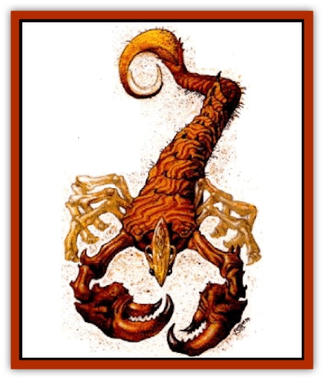

# Mastyrial

| Statistic | **Black** | **Desert** |
| --- | --- | --- |
| **Activity Cycle:** | Any | Any |
| **Alignment:** | Neutral | Neutral |
| **Armor Class:** | 0 | 0 |
| **Climate/Terrain:** | Mountain | Desert |
| **Damage/Attack:** | 1d6/1d6/2d4/3d4 | 1d10/1d10/2d6/1d6 |
| **Diet:** | Carnivore | Carnivore |
| **Frequency:** | Uncommon | Uncommon |
| **Hit Dice:** | 8 | 12 |
| **Intelligence:** | Low (5-7) | Animal (1) |
| **Magic Resistance:** | Nil | Nil |
| **Morale:** | Very steady (13) | Steady (11) |
| **Movement:** | 12 | 15 |
| **No. Appearing:** | 5-20 (5d4) | 1-3 (1d3) |
| **No. of Attacks:** | 4 | 4 |
| **Organization:** | Pack | Solitary |
| **Size:** | S (3' long) | M (5-6') |
| **Special Attacks:** | Poison | Poison |
| **Special Defenses:** | See below | Regeneration, immune to blunt weapons |
| **THAC0:** | 13 | 9 |
| **Treasure:** | Nil | D |
| **XP Value:** | 3,000 | 10,000 |

The mastyrial lives in the desert regions of Athas, spending most of its time hibernating beneath the sands. It resembles an oversized [[Scorpion|scorpion]]. The creature propels itself using its six legs and has large jagged claws and a tail that makes up most of its length. The mastyrial is deep brown to orange-red and has a striped pattern on its back that resembles drifting sand when viewed from a distance. This affords the beast a form of camouflage if gusting wind uncovers its top while in a deep state of sleep. The mastyrial sometimes lacks any pigment at all.

The mastyrial has two areas of darker skin on its head that resemble eyes. Its real eyes are smaller and farther forward on the creature's head. The mastyrial spends most of its life underground and relies on its other senses, particularly its hearing. Similar to [[Bat|bats]], the mastyrial emits clicking sounds that allow it to determine the direction and distance of the nearest prey. Other than the clicking sounds and the sounds made when in motion, this fell beast is completely silent and seems almost supernatural in combat.

**Combat:** Mostly, the mastyrial lies asleep in a state of hibernation. But if the creature detects prey within striking distance, it bursts from its resting place and attacks. The victim is easily detected if moving across the sand as the mastyrials' hearing can detect the distance and direction of a victim below ground more accurately than above ground. The first attack made by a submerged mastyrial is made at +2 because of this accuracy, however the beast gets no tail attack during the first round because it is the last part of the creature to emerge.

The mastyrial attacks using its two pinchers (1d10 points of damage each), a bite (2d6 points of damage). and its tail (1d6 points of damage). The tail causes poison damage in addition to the 1-6 (1d6) points of standard damage. A victim successfully hit by the tail of the creature sustains 30 points of damage, 15 points of damage if a successful save vs. poison is made. Such saving throws are made at -1 because of the potency of the venom. If the tail hits with a natural 20, the victim is impaled on the tail and receives 2d6 points of damage in addition to the poison damage.

The tough, chitinous shell of the mastyrial gives the beast a naturally tough AC. It also gives the beast an immunity to any blunt or crushing weapon such as clubs, maces, or flails. The beast regenerates 3 hp per round. If the mastyrial is reduced to fewer than 25% of its maximum hit points it tunnels under the sand to nurse its wounds and lie in wait for prey less likely to fight back.

**Habitat/Society:** Mastyrials are solitary creatures and are generally found in small groups of 1-3. They tend to live underground or in crevasses or ruins.

The male of the species is smaller than the female. Mastyrials mate just once in their lives. After mating, the female stings the male with its venom and ingests him. The male makes no attempt to escape even if the sting doesn't kill him outright. Each lair has 4-20 mastyrial eggs.

**Ecology:** The mastyrial's natural diet usually consists of [[Spider|giant spiders]], [[Ant|giant ants]], and other giant versions of Athasian [[Insect_Giant|insects]] and arachnids. The mastyrial acts as a form of pest control in the deserts of Athas. The beast rarely eats anything that it didn't kill and never eats the carcass of any animal that was killed more than an hour prior.

The chitinous shell of the mastyrial is valued by warriors for its protective qualities and its ventilation. The shell is frequently used as material in shields and armor. The poison is also highly sought by both defilers and assassins.

## Black Mastyrial

**Psionics Summary**

| Level | Dis/Sci/Dev | Attack/Defense | Score | PSPs |
| --- | --- | --- | --- | --- |
| 8 | 2/2/7 | EW,II/IF,TS | 9 | 30 |

**Clairsentience -** *Science:* clairvoyance; *Devotions:* feel light, hear light, know direction.

**Telepathy -** *Science:* mind link; *Devotions:* contact, ego whip, id insinuation, send thoughts.

The black mastyrial makes its home in the mountainous regions of Athas. The creature spends most of its time in a state of stasis resembling hibernation.

Black mastyrials are similar to mastyrials, but they are only 3 feet long. They are social creatures, living in small packs or communities. These beasts are believed to have originally been separated from their kin and survived underground for thousands of years. They are blind and have no apparent visual organs. Their color ranges from black to light brown. The carapace of the black mastyrial is ridged and bony, and when completely motionless and low to the ground, it resembles rock. There are enormous, gnarled mandibles to either side of the black mastyrials' mouths. So strong are these appendages that they can be used to cut stone and rock. These beasts can tunnel into stone and rock to protect themselves from the elements and the few creatures that are their enemy.

**Combat:** When a creature stumbles upon a pack of these beasts that is on the surface and the intruder seems to be fairly helpless, the black mastyrials attack using their pincers (1d6x2 points of damage), stingers (2d4 points of damage), and mandibles (3d4 points of damage). Only three beasts can attack a man-sized opponent simultaneously. A target hit by the stingers must make a successful save vs. poison or receive 1d4 more points of damage from the poison for each sting. Even if no damage is taken, the area stung swells and within 1-4 (1d4) rounds is completely numb and useless. Roll 1d6 to determine the part of the body stung (1=head, 2=right arm, 3=left arm, 4=right leg, 5=left leg, and 6=body or tail). The numbness lasts for 1 turn and a head sting indicates that the victim becomes disoriented and wanders aimlessly for the duration.

The black mastyrial has very powerful pincers and mandibles. An attack that hits with an unmodified 20 locks onto the opponent, causing an additional 1-6 (1d6) points of damage per round (for the pincer) or 1-8 (1d8) points of damage per round (for the mandibles). Once these appendages are locked, only the death of the black mastyrial or a successful Bend Bars/Lift Gates roll at +4 removes the creature. This attack also makes black mastyrials more vulnerable and any attacks against them from opponents other than their current victim are made at +2.

Black mastyrials spend most of their time hibernating beneath the surface of the rock with only the top of their head exposed to sight. Mastyrials so concealed are not detectable 90% of the time. If a creature wanders within 100 feet of a pack of concealed black mastyrials, it is detected by one of the beasts. Black mastyrials then use their psionic abilities of clairvoyance, contact, and send thought to attempt to lure the prey closer and inform the pack of the intruder. Once within striking distance, the pack leaps and launches an attack. A being so attacked must make a successful save vs. paralyzation or be surprised and suffers the accompanying penalties to initiative.

If the pack is reduced to fewer than half their original numbers, they retreat back into their holes. While in their holes, only the toughest portion of their carapace is exposed and they are immune to all nonmagical and physical attacks. To harm the mastyrials, they must be removed from this cavity or the rock must be removed from around them.

**Habitat/Society:** Black mastyrials live in a communal environment but are confined by their solitary nature. Each beast tunnels its own dwelling within the community and they are all members of the same family or pack. All other beasts, including black mastyrials from outside of the pack, are considered to be prey. Because of sparse food supplies in their ecosystem, mastyrials attack almost any creature wandering into their midst. The pack is intimidated by creatures larger than giant-sized and only attack during periods of severe famine.

Black mastyrials are far more intelligent than the desert mastyrials and have developed a group intelligence. They are in constant psionic contact with one another. Therefore, there is a sense of history and learning that far exceeds their low intelligence. Each black mastyrial has the knowledge of its ancestors. If part of the pack survives an encounter with a creature, any weakness experienced is incorporated into the pack and grants each mastyrial a +1 bonus against any future encounters with this type of being. So there is a 2% cumulative chance per individual that any particular type of creature has already been encountered by the pack. This contact conflicts with their genetic desire to be independent which has basically caused them to become insane.

**Ecology:** The black mastyrial is carnivorous, but it also serves as a scavenger and clears nearby dead. The claws and pincers of the black mastyrial are highly sought for use in weapons. A bladed weapon honed from the carapace of a black mastyrial receives a +1 attack bonus and +1 to all damage inflicted.

---
## Discovery & Documentation

**Source Publication:** Dark Sun Appendix II - Terrors Beyond Tyr (1991)
**Campaign Setting:** Dark Sun
**Author(s):** Jim Atkiss, Steve Brown, Timothy B. Brown, Andrew P. Morris, Bruce Nesmith, Wes Nicholson, Bill Slavicsek

### Other Creatures Found in This Source Book
   * [[Aarakocra_Athas|Aarakocra (Athas)]]
   * [[Animal_Domestic_Athas_II|Animal, Domestic (Athas) II]]
   * [[Aviarag|Aviarag]]
   * [[Baazrag|Baazrag]]
   * [[Baazrag_Boneclaw|Baazrag, Boneclaw]]
   * [[Bloodgrass|Bloodgrass]]
   * [[Cactus_Hunting|Cactus, Hunting]]
   * [[Cactus_Rock|Cactus, Rock]]
   * [[Cilops|Cilops]]
   * [[Crodlu|Crodlu]]
   * [[Dagorran|Dagorran]]
   * [[Dhaot|Dhaot]]
   * [[Drake_Lesser_Athas_General_Information|Drake, Lesser (Athas), General Information]]
   * [[Drake_Lesser_Athas_Magma|Drake, Lesser (Athas), Magma]]
   * [[Drake_Lesser_Athas_Rain|Drake, Lesser (Athas), Rain]]
   * [[Drake_Lesser_Athas_Silt|Drake, Lesser (Athas), Silt]]
   * [[Drake_Lesser_Athas_Sun|Drake, Lesser (Athas), Sun]]
   * [[Dray|Dray]]
   * [[Drik|Drik]]
   * [[Dune_Reaper|Dune Reaper]]
   * [[Dwarf_Athas|Dwarf (Athas)]]
   * [[Elemental_Beast_Athas_Air|Elemental Beast (Athas), Air]]
   * [[Elemental_Beast_Athas_Earth|Elemental Beast (Athas), Earth]]
   * [[Elemental_Beast_Athas_Fire|Elemental Beast (Athas), Fire]]
   * [[Elemental_Beast_Athas_Water|Elemental Beast (Athas), Water]]
   * [[Elf_Athas|Elf (Athas)]]
   * [[Fael|Fael]]
   * [[Feylaar|Feylaar]]
   * [[Fordorran|Fordorran]]
   * [[Giant_Half-giant|Giant, Half-giant]]
   * [[Giant_Shadow|Giant, Shadow]]
   * [[Golem_Athas_Magma|Golem (Athas), Magma]]
   * [[Golem_Athas_Salt|Golem (Athas), Salt]]
   * [[Golem_Athas_General_Information|Golem (Athas), General Information]]
   * [[Gorak|Gorak]]
   * [[Halfling_Athas|Halfling (Athas)]]
   * [[Human_Athas|Human (Athas)]]
   * [[Jhakar|Jhakar]]
   * [[Kaisharga|Kaisharga]]
   * [[Kes'trekel|Kes'trekel]]
   * [[Klar|Klar]]
   * [[Krag|Krag]]
   * [[Kragling|Kragling]]
   * [[Lirr|Lirr]]
   * [[Meorty|Meorty]]
   * [[Mul|Mul]]
   * [[Nikaal|Nikaal]]
   * [[Paraelemental_Beast_General_Information|Paraelemental Beast, General Information]]
   * [[Paraelemental_Beast_Magma|Paraelemental Beast, Magma]]
   * [[Paraelemental_Beast_Rain|Paraelemental Beast, Rain]]
   * [[Paraelemental_Beast_Silt|Paraelemental Beast, Silt]]
   * [[Paraelemental_Beast_Sun|Paraelemental Beast, Sun]]
   * [[Pakubrazi|Pakubrazi]]
   * [[Psionocus|Psionocus]]
   * [[Psurlon|Psurlon]]
   * [[Raaig|Raaig]]
   * [[Retriever_Obsidian|Retriever, Obsidian]]
   * [[Ruktoi|Ruktoi]]
   * [[Ruvoka_Athas|Ruvoka (Athas)]]
   * [[Sand_Howler|Sand Howler]]
   * [[Scorpion_Athas|Scorpion (Athas)]]
   * [[Seed_Brain|Seed, Brain]]
   * [[Silt_Horror_Black|Silt Horror, Black]]
   * [[Silt_Horror_Magma|Silt Horror, Magma]]
   * [[Silt_Horror_Red|Silt Horror, Red]]
   * [[Silt_Spawn|Silt Spawn]]
   * [[Slig|Slig]]
   * [[Spider_Athas|Spider (Athas)]]
   * [[Spinewyrm|Spinewyrm]]
   * [[Ssurran|Ssurran]]
   * [[Stalking_Horror|Stalking Horror]]
   * [[Tarek|Tarek]]
   * [[Tari|Tari]]
   * [[Thri-kreen|Thri-kreen]]
   * [[T'liz|T'liz]]
   * [[Tohr-kreen_II|Tohr-kreen II]]
   * [[Tohr-kreen_III|Tohr-kreen III]]
   * [[Trin|Trin]]
   * [[Tul'k|Tul'k]]
   * [[Undead_Athas_General_Information|Undead (Athas), General Information]]
   * [[Wraith_Athas|Wraith (Athas)]]
   * [[Xerichou|Xerichou]]
   * [[Zombie_Thinking|Zombie, Thinking]]
