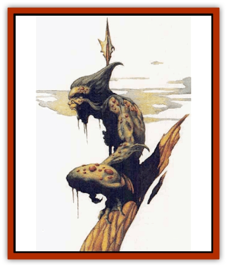

# Meazel

| Statistic | **Meazel** |
| --- | --- |
| **Activity Cycle:** | Night |
| **Alignment:** | Chaotic evil |
| **Armor Class:** | 8 |
| **Climate/Terrain:** | Marshes, subterranean |
| **Damage/Attack:** | 1d4/1d4 |
| **Diet:** | Carnivore |
| **Frequency:** | Uncommon |
| **Hit Dice:** | 4 |
| **Intelligence:** | Low (5-7) |
| **Magic Resistance:** | Nil |
| **Morale:** | Steady (11-12) |
| **Movement:** | 12 |
| **No. Appearing:** | 1 |
| **No. of Attacks:** | 2 |
| **Organization:** | Solitary |
| **Size:** | M (4-5' tall) |
| **Special Attacks:** | Nil |
| **Special Defenses:** | See below |
| **THAC0:** | 17 |
| **Treasure:** | M (B) |
| **XP Value:** | 120 |

The meazel is a vicious, malevolent creature that preys on other subterranean dwellers or anyone else in the area. The meazel is slightly smaller than a human. Its skin varies in color from light gray to dark green. Most meazels (85%) have irregular patches of angry red color: these are the result of a noncontagious skin disease peculiar to meazels. The patches give the creature a leprous appearance. The eyes are jet black and the thick, waxy hair is dark green-gray The toes are partially webbed. Males and females are nearly identical.

**Combat:** Meazels attack with their clawed hands, each hand inflicting 1d4 points of damage. They might use a cord to strangle a victim seven feet tall or shorter, if they can approach from the rear and surprise the victim. If they try this, a successful attack roll means the cord has wrapped around the victim's throat; the victim will die in two rounds unless the meazel relaxes its grip or the victim breaks the cord or pulls it free of his throat. Meazels only relax their grip if they are dead or forced to defend themselves from another attack.

Meazels possess the following natural thieving abilities:

| PP | OL | F/RT | MS | HS | DN | CW | RL |
| --- | --- | --- | --- | --- | --- | --- | --- |
| 45% | 37% | 35% | 33% | 25% | 15% | 88% | 20% |

They rarely attack openly .They prefer to hide, sneak up from the rear, and then either strangle stragglers from behind or pick pockets in search of gold.

**Habitat/Society:** Meazels are hostile hermits, rarely encountered away from their lairs. They prefer marshes, caverns, or other cold, dark, dank places as sites to build their squalid homes. Such homes are appallingly dirty. Each meazel's possessions are gathered into a pile that also serves as the creatures bed. [[Rat|Rats]] and insects overrun the mess, polish off the leftovers, and also serve as snacks.

Only two things make meazels congregate willingly: the need for cooperation against a foe, and the infrequent urge to mate. Meazel females give birth to one or two whelps. The whelps are independent at three years and mature in six years. The whelps are incapable of being tamed even if captured at birth and raised in a kind environment, the whelps still grow malevolent - although probably more intelligent and cunning.

Meazels are too mean-spiritrd to make reliable allies. However, they occasionally can he duped into acting as unwitting pawns or recruited against a common foe.

Meazels are greedy and will strip a corpse of anything they find valuable. However, they either do not understand or recognize magical items as valuable, hence such items are not generally found in meazel hoards. On the other hand, they might grab items that they are unable to use properly, such as human armor or large weapons. The bones of past meals are ofteb stored in sacks near the meazels' lair. The sacks also contain any gemy that the creatures may have found among their victims' possessions. Meazels do not recognize gems and semiprecious stones as treasure, hence they throw these away. Most of their treasure is coinage, silver and gold.

**Ecology:** Meazels prey on anything that roams the subterranean realms. They are carnivorous and prefer humanoid flesh. Meazels prey mainly on [[Orc|orcs]] and [[Kobold|kobolds]], although they galdy attack anyone else who is available. Because of this, almost any subterranean dwellers attack a meazel on sight. Meazels are unique in that hatred of them unites virtually all other subterranean travelers.

---
## Discovery & Documentation

**Source Publication:** Monstrous Compendium, 1996 Annual, Volume 3 (1995)
**Campaign Setting:** Advanced Dungeons & Dragons 2nd Edition
**Author(s):** Jon Pickens

### Other Creatures Found in This Source Book
   * [[Alaghi|Alaghi]]
   * [[Alhoon|Alhoon]]
   * [[Aranea_Savage_Coast|Aranea (Savage Coast)]]
   * [[Arcane_Head|Arcane Head]]
   * [[Banedead|Banedead]]
   * [[Banelich|Banelich]]
   * [[Bat_Bonebat|Bat, Bonebat]]
   * [[Beetle|Beetle]]
   * [[Belgoi|Belgoi]]
   * [[Bladeling|Bladeling]]
   * [[Braxat|Braxat]]
   * [[Bunyip|Bunyip]]
   * [[Burbur|Burbur]]
   * [[Bvanen|Bvanen]]
   * [[Cat_Great_Snow_Tiger|Cat, Great, Snow Tiger]]
   * [[Chosen_One|Chosen One]]
   * [[Chronovoid|Chronovoid]]
   * [[Cildabrin|Cildabrin]]
   * [[Coffer_Corpse|Coffer Corpse]]
   * [[Disenchanter|Disenchanter]]
   * [[Dog_Temporal|Dog, Temporal]]
   * [[Dragon_Cerilia|Dragon (Cerilia)]]
   * [[Dragon_Ghost|Dragon, Ghost]]
   * [[Dragon_Lesser_Undead|Dragon, Lesser Undead]]
   * [[Dragon_Neutral_Amber|Dragon, Neutral, Amber]]
   * [[Dread_Warrior|Dread Warrior]]
   * [[Dreamweaver|Dreamweaver]]
   * [[Dream_Spawn_Greater_Ennui|Dream Spawn, Greater, Ennui]]
   * [[Dream_Spawn_Lesser_Morph|Dream Spawn, Lesser, Morph]]
   * [[Dwarf_Arctic|Dwarf, Arctic]]
   * [[Dwarf_Urdunnir|Dwarf, Urdunnir]]
   * [[Eel_Giant_Moray|Eel, Giant Moray]]
   * [[Elemental_Fire_Kin_Tome_Guardian|Elemental, Fire Kin, Tome Guardian]]
   * [[Elf_Rockseer|Elf, Rockseer]]
   * [[Ethyk|Ethyk]]
   * [[Faerie_Faerie_Fiddler|Faerie, Faerie Fiddler]]
   * [[Faerie_Petty_Bramble|Faerie, Petty, Bramble]]
   * [[Faerie_Petty_Gorse|Faerie, Petty, Gorse]]
   * [[Faerie_Petty|Faerie, Petty]]
   * [[Firenewt|Firenewt]]
   * [[Formian|Formian]]
   * [[Gargoyle_II|Gargoyle II]]
   * [[Giant_Cerilia|Giant (Cerilia)]]
   * [[Goblin_Cerilia|Goblin (Cerilia)]]
   * [[Golem_Magic|Golem, Magic]]
   * [[Golem_Shaboath|Golem, Shaboath]]
   * [[Hag_Bheur|Hag, Bheur]]
   * [[Hamadryad|Hamadryad]]
   * [[Hound_of_Ill-Omen|Hound of Ill-Omen]]
   * [[Human_Cerilia|Human (Cerilia)]]
   * [[Hybsil|Hybsil]]
   * [[Ibrandlin|Ibrandlin]]
   * [[Imp_Chaos|Imp, Chaos]]
   * [[Ixitxachitl_Ixzan|Ixitxachitl, Ixzan]]
   * [[Jabberwock|Jabberwock]]
   * [[Kyton|Kyton]]
   * [[Kyuss_Son_of|Kyuss, Son of]]
   * [[Lillend|Lillend]]
   * [[Life-Shaped_Creation_Guardian|Life-Shaped Creation, Guardian]]
   * [[Life-Shaped_Creation_Transport|Life-Shaped Creation, Transport]]
   * [[Lycanthrope_Werecrocodile|Lycanthrope, Werecrocodile]]
   * [[Lycanthrope_Werespider|Lycanthrope, Werespider]]
   * [[Magedoom|Magedoom]]
   * [[Manotaur|Manotaur]]
   * [[Mastiff_Shadow|Mastiff, Shadow]]
   * [[Mist_Scarlet_Dancer|Mist, Scarlet Dancer]]
   * [[Needleman|Needleman]]
   * [[Orc_Neo-Orog|Orc, Neo-Orog]]
   * [[Orc_Ondonti|Orc, Ondonti]]
   * [[Owlbear_II|Owlbear II]]
   * [[Pegataur|Pegataur]]
   * [[Phaerimm|Phaerimm]]
   * [[Reggelid|Reggelid]]
   * [[Render|Render]]
   * [[Saurial|Saurial]]
   * [[Scalamagdrion|Scalamagdrion]]
   * [[Sharn|Sharn]]
   * [[Snake_Messenger|Snake, Messenger]]
   * [[Spirit_Forest_Uthraki|Spirit, Forest, Uthraki]]
   * [[Spirit_Forest_Wood_Man|Spirit, Forest, Wood Man]]
   * [[Spirit_Ice_Orglash|Spirit, Ice, Orglash]]
   * [[Spirit_Rock_Thomil|Spirit, Rock, Thomil]]
   * [[Strider_Giant|Strider, Giant]]
   * [[Tembo|Tembo]]
   * [[Temporal_Glider|Temporal Glider]]
   * [[Temporal_Stalker|Temporal Stalker]]
   * [[Tether_Beast|Tether Beast]]
   * [[Thessalmonster|Thessalmonster]]
   * [[Time_Dimensional|Time Dimensional]]
   * [[Tomb_Tapper|Tomb Tapper]]
   * [[Undead_Dragon_Slayer|Undead Dragon Slayer]]
   * [[Unicorn_Black_Toril|Unicorn, Black (Toril)]]
   * [[Vaath|Vaath]]
   * [[Vortex_Spider|Vortex Spider]]
   * [[Weredragon|Weredragon]]
   * [[Zhentarim_Spirit|Zhentarim Spirit]]
