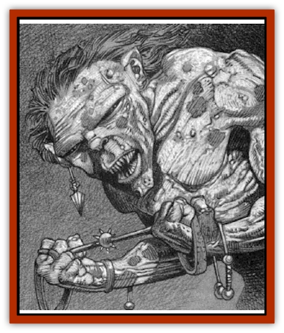

# Meazel - Salizarr

| Statistic | **Meazel (Salizarr)** |
| --- | --- |
| **Activity Cycle:** | Night |
| **Alignment:** | Chaotic evil |
| **Armor Class:** | 8 |
| **Climate/Terrain:** | Darkon |
| **Damage/Attack:** | 1-4 (1d4)/1-4 (1d4) |
| **Diet:** | Carnivore |
| **Frequency:** | Unique |
| **Hit Dice:** | 4 (13 hit points) |
| **Intelligence:** | Low (6) |
| **Magic Resistance:** | Nil |
| **Morale:** | Steady (11) |
| **Movement:** | 12 |
| **No. Appearing:** | 1 |
| **No. of Attacks:** | 2 |
| **Organization:** | Solitary |
| **Size:** | M (4'6&rdquo; tall) |
| **Special Attacks:** | Strangulation; disease; thief abilities |
| **Special Defenses:** | Thief abilities |
| **THAC0:** | 15 |
| **Treasure:** | (B) |
| **XP Value:** | 270 |

People have always feared the darkness, often with good reason. After all, there are things in the black shadows of night more horrible than any vision that might come to a person in sleep. When this dread is combined with the creeping anxiety that comes with travel underground, it becomes a gnawing terror that quickens the pulse of even the stoutest hero. In the dread domain of Darkon, in the maze of sewers beneath the great city of Il Aluk, this horror has a name: Salizarr.

Salizarr is a [[Meazel|meazel]], a sly and murderous race. His skin is rough and olive green in color, marked here and there by angry red patches of blisters and sores. His black hair, thick and wiry, juts away from his head as if blown back by a great wind, framing his triangular face. His jet-black eyes are set in narrow slits and gleam as if they were cut from black marble. His mouth is thin and angular, vanishing almost completely when closed but opening to reveal a frightening array of needle-like teeth. Although this terrible creature wears no clothing, he does adorn himself with a piece of jewelry, a dangling earring that connects by a chain to a jewelled nose-stud; this is somewhat unusual, as his kind do not generally value such things.

Salizarr speaks the hissing, guttural language of his people, as well as the Common Tongue of Darkon. The latter, however, is heavily accented and can be quite difficult to understand. It is said that he can speak with the [[Rat|rats]] of sewers, but this may be myth.

**Combat:** In close combat, Salizarr is a deadly enemy. Like all meazels, his speed and strength give him a better THAC0 than would normally accrue to a monster of his Hit Dice. His ripping claws can strike twice per round, inflicting 1-4 (1d4) points of damage each. As if this were not enough, the filth of the sewers has collected on his talons. Thus, everyone who is hit by Salizarr's attack must make a Saving Throw vs. Poison (with a +4 bonus) or contract a debilitating disease as described under the 3rd-level cleric's spell *cure disease*.

Salizarr is fond of strangling lone victims who are under seven: feet in height. When he does this, he employs a knotted cord that not only cuts off the air flow of the victim but may actually crush the windpipe. Salizarr only employs his strangulation attack when he is attacking with surprise and from behind. Because of his thieving skills and knowledge of the sewers, he is frequently able to catch his victims unawares, gaining a bonus of +4 on his attack roll.

In order to loop his deadly cord about the neck of a potential victim, Salizarr leaps onto his target's back and rolls his attack. If successful, once the line is in place the meazel applies his considerable (18/50) Strength to it. If he is not dislodged within two rounds, the victim's windpipe has been crushed and death by suffocation is unavoidable.

Forcing Salizarr to release his grip is not easy; he will not willingly loosen his strangling line once it is in place except to defend himself. A player character wishing to break free of his deadly embrace must do so in accordance with the unarmed combat rules described in the *Player's Handbook*. Thus, a successful throw, gouge, or hit with a weapon is required, and a victim wearing armor suffers a penalty of anywhere from -1 to as much as -10 on his or her attack.

The meazel's natural agility and knowledge of the sewers gives him some useful expertise similar to that of a master thief. Thus, he has the following special abilities: Pick Pockets (45%), Open Locks (37%), Find/Remove Traps (35%), Move Silently (33%), Hide in Shadows (25%), Hear Noise (15%), Climb Walls (88%), and Read Languages (20%).

If a combat seems to be going against Salizarr, he will attempt to flee. In general, he is fast and agile enough to do this with ease. If he is pursued, he will attempt to lead his enemies into deadly danger. While he does not set traps or similar hazards to protect his lair, he knows where there are patches of [[Ooze_Slime_Jelly_II|green slime]] or puddles of [[Ooze_Slime_Jelly_II|grey ooze]]. With his enemies generally unaware of these dangers, he can frequently dodge them while his opponents stumble right into them.

**Habitat/Society:** Salizarr lurks in the great maze of sewers that curl beneath Il Aluk. No one knows how extensive this labyrinth is, for there is no record of its construction. It may well be that this underground complex was fashioned by the magic of the [[Lich|lich]] lord Azalin or even some other, darker power. Whoever or whatever the architect of this great place was, there is no doubt that Salizarr is its master now.

Salizarr is a relative newcomer to Ravenloft, having come into the Demiplane of Dread roughly one year ago. Before that time, Salizarr lived in a series of catacombs not far from the city of Cormyr in the Forgotten Realms. One day, a stranger wandered into his underground realm and Salizarr attacked him. The man broke free of his grip and bolted away into the shadows. Enraged and ravenous, the meazel pursued him. After countless twists and turns, Salizarr had to concede that his victim had escaped him. He slowed from a run to a trot and then realized that he had no idea where he was.

The natural complex of caverns that had been his home for so many years was gone. Now, he found himself moving through a series of man-made sewers. After several days of trying to find his way home, it became obvious that his efforts were futile, so he determined to make this new place his own.

At that time, the sewers were home to a tribe of [[Kobold|kobolds]], living in an alcove near a nexus of two major tunnels. It wasn't long before Salizarr had hunted them down and destroyed them all, one by one. Once they had been removed, Salizarr claimed their quarters for his own, scattering the previous occupants' bones around in various geometric patterns by way of decoration. He has since forgotten his original home, and now believes that he has always lived in these sinister tunnels.

Salizarr collects the gold and silver carried by his victims, but has no interest in accumulating other treasures. He wears an unusual earring, but keeps no other jewelry or art objects. What this or any other meazel plans to do with his hoarded treasure is anybody's guess.

Whenever Salizarr makes a kill, he strips the body of valuables (i.e., coins). Items that he does not deem valuable, including weapons, armor, and magical items, he carries to a nearby pit and tosses in. At the bottom of this eighty-foot hole is a foot-deep pool of green slime. In this horrible bath, not even magical items can survive for long. Because green slime is unable to dissolve them, it is likely that there may be dozens of valuable gems at the bottom of the pit. Anyone capable of defeating the slime and recovering them might find this quite a valuable treasure.

**Ecology:** As a meazel, Salizarr seems to hunger constantly for the flesh of humans, demihumans, and humanoids. Because such folk seldom come into the sewers, however, he is forced to subsist on a diet of [[Rat|rats]] and similar vermin. When this unsatisfactory board becomes too bland for him, he ventures out of the sewers to strike at the folk of Il Aluk. On those dark nights, the screams of his victims can be heard as he drags them back into the sewers to torture and destroy.

---
## Discovery & Documentation

**Source Publication:** Ravenloft Appendix II: Children of the Night (1991)
**Campaign Setting:** Ravenloft
**Author(s):** William W. Connors

### Other Creatures Found in This Source Book
   * [[Brain_Living|Brain, Living]]
   * [[Ermordenung_Nostalia_Romaine|Ermordenung, Nostalia Romaine]]
   * [[Ghoul_Ghast_Jugo_Hesketh|Ghoul, Ghast, Jugo Hesketh]]
   * [[Golem_Half-|Golem, Half-]]
   * [[Golem_Mechanical_Ahmi_Vanjuko|Golem, Mechanical, Ahmi Vanjuko]]
   * [[Human_Cursed_Jacqueline_Montarri|Human, Cursed (Jacqueline Montarri)]]
   * [[Human_Madman_The_Midnight_Slasher|Human, Madman (The Midnight Slasher)]]
   * [[Human_Voodan|Human, Voodan]]
   * [[Lich_Bardic|Lich, Bardic]]
   * [[Lycanthrope_Weretiger_Jahed|Lycanthrope, Weretiger (Jahed)]]
   * [[Medusa_Ravenloft|Medusa (Ravenloft)]]
   * [[Mummy_Greater_Senmet|Mummy, Greater, Senmet]]
   * [[Night_Hag_Styrix|Night Hag, Styrix]]
   * [[Spectre_Jezra_Wagner|Spectre, Jezra Wagner]]
   * [[Thrax_Pelik|Thrax (Pelik)]]
   * [[Treant_Evil_Blackroot|Treant, Evil (Blackroot)]]
   * [[Vampire_Eastern_Mayónaka|Vampire, Eastern (Mayónaka)]]
   * [[Vampire_Illithid_Athaekeetha|Vampire, Illithid (Athaekeetha)]]
   * [[Vampyre_Vladimir_Ludzig|Vampyre (Vladimir Ludzig)]]
