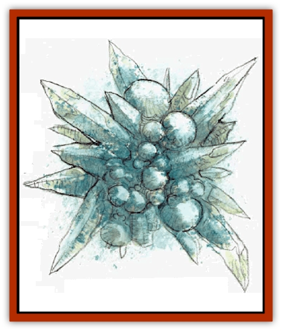
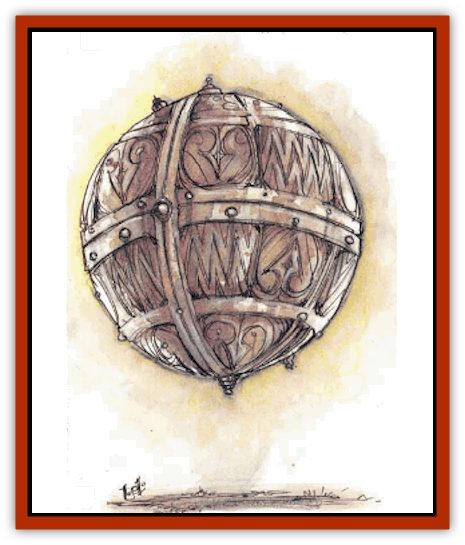

# Mediator

| Statistic | **Mechanus** | **Translator** |
| --- | --- | --- |
| **Activity Cycle:** | Any | Any |
| **Alignment:** | Lawful neutral | Neutral |
| **Armor Class:** | 5 | 8 |
| **Climate/Terrain:** | Mechanus | Upper Planes |
| **Damage/Attack:** | 2d12 | Stun |
| **Diet:** | Nil | None |
| **Frequency:** | Very rare | Common |
| **Hit Dice:** | 3 | 5 |
| **Intelligence:** | Genius (17-18) | High (13-14) |
| **Magic Resistance:** | 90% | Nil |
| **Morale:** | Average (8-10) | Fearless (19-20) |
| **Movement:** | Fl 9 (A) | Fl 64 (A) |
| **No. Appearing:** | 1 | 1 |
| **No. of Attacks:** | 1 | 1 |
| **Organization:** | Solitary | Solitary |
| **Size:** | M (5' diam) | S (3' diam.) |
| **Special Attacks:** | See below | Spell erasing |
| **Special Defenses:** | See below | Deific intervention |
| **THAC0:** | 17 | Miss only on 1 |
| **Treasure:** | Nil | Nil |
| **XP Value:** | See below | 1,400 |

Mediators are proxies of the powers of neutrality.

## Mechanus Mediator

Mechanus mediators, the balancing forces found in the Clockwork Universe, ensure that all things, light and darkness, liquid and solid, maintain perfect balance and harmony. They look like clusters of geometric shapes made of strange green crystal. They are roughly spherical in shape, prickling with protuberances: squares, triangles, trapezoids, and spheres of all sizes stick out in all directions.

Unlike their lesser kin, the translators (see below), Mechanus mediators communicate through empathy. They cannot communicate with undead.

**Combat:** Mediators rarely enter combat except to balance an ongoing battle. They attack with a piercing green ray of light that inflicts 2d12 damage and ignites combustibles. The ray has no range modifiers; the mediator can attack anything it can see.

Mechanus mediators can create or do anything as long as it directly relates to maintaining balance in Mechanus. For game purposes, this means that they have unlimited *wish* spells, but only for the purpose of balance. For example, if the amount of liquid in Mechanus begins to exceed the amount of solid matter, a mediator can transform liquid to solid until balance is restored. If two groups battle, the  mediators can destroy combatants until the sides are equal or even telekinetically stop the battle. Given their omnipotent power, it is perhaps fortunate that only three mediators exist in Mecbanus.

Because their own destruction is the greatest possible threat to balance, Mechanus mediators use their *wish* ability to save themselves from danger. Without conscious effort mediators can affect any attacker, no matter where or in what manner the attack is launched. The attacker immediately undergoes an alignment shift to absolute neutral and, therefore, ceases its attack. Simply put, a mediator cannot be killed, so they have no experience point value.

**Habitat/Society:** The sole purpose of the mediators is to maintain balance. It is irrelevant whether the balancing is of good and evil, light and darkness, liquid and solid, etc. The mediators are heedless of anything except this symmetry of existence, even of sapient life. This causes some to view them as evil and uncaring, but mediators are certainly not evil in this respect. Rather, they are amoral in their drive for perfect equilibrium.

Mediators have gained an almost godlike reputation in Mechanus. They are rarely seen, and when they appear it is generally to effect tremendous change in the name of equilibrium. Even those beings of true neutral alignment are not beyond slight error or deviation. Neutrality tends to be inhibited, in some cases, by emotion. The mediators, however, are neutrality unfettered by emotion. They are objective judges, free of bias.

**Ecology:** A legend of the mediators, its origin and truth lost in the mists of time, claims that eons ago when the Outer Planes were first forming, the powers of creation divided space among them. They created planes of certain alignments as homes for the corresponding powers. Intense arguments between powers of the same alignment but slightly differing viewpoints led to the creation of 17 individual planes for the nine alignments.

When the Outlands were created, they were to be the home of the neutral powers. From there they could send out their influences to maintain balance and order. But the neutral powers bickered because they disagreed how to organize and construct the inner areas of the plane. Each tried to exert individual influence, causing the plane to become unbalanced.

When the powers of creation saw what had happened, they cast the powers of neutrality out of the Outlands, thus closing it off to all beings. They created Mechanus with its perfect harmony and giant clockwork, and sent the powers of neutrality there to live. In order that the neutrals not corrupt Mechanus as they had done with the Outlands, the powers of creation made the mediators and gave them great power and influence over balance. Three mediators were made, one for each of the Lights of Balance that shine now at the center of the Outlands.

## 

Translator

Messengers of the powers of neutrality (and occasionally of other powers), translators travel the planes at tremendous speeds, relaying important messages. These speedy couriers look like spheres of shining silver 3' in diameter. They pulse with an inner yellow light when carrying a message. They have no apparent "front" or "back" and apparently no corporeal form.

Translators can speak any language audibly and do not use telepathy. It takes one approximately 30 seconds to pick up a new language. Note that the translator need not hear the language spoken; in the presence of creatures who speak a unknown language, it picks up that language magically.

**Combat:** Translators fight only when directly prevented delivering a message or when they cannot outrun an attacker. With their impressive speed and maneuverability, translators can usually outdistance anything, and avoid combat when they are not delivering a message.

In combat translators attack with a shining silver beam of light. This almost always hits, missing only on a roll of 1. Anyone struck by the beam is stunned for 1d12-3 rounds; no save is possible. If the result is zero or less, the beam did not carry sufficient power to stun its target. Those stunned cannot move or think for the duration of the effect. The target is, in effect, in suspended animation. Even more devastating, the beam also wipes spellcsaters minds clean of memorized spells.

The gods of the Upper Planes take special care of the translators. These beings carry the plans and will of the gods from plane to plane. Therefore, if a translator is attacked while delivering a message, the sending deity always becomes aware of this and sends aid. In such an instance, roll d100. If the result is 99 or less, the deity sends an [[Aasimon_General_Information|aasimon]] servant to help. If the result is 00, roll again. If the second roll is 99 or less, the deity sends 1d6+1 aasimon servants. If the result is 00, the deity itself appears. Aid of this type arrives in 1d10 rounds after the translator is attacked.

**Habitat/Society:** Translators are the prized messengers of the powers. They are quiet and unassuming creatures, but carry great importance with them.

Translators do not have a society. They are content in their absolute servitude, though they are not rewarded in any way. A translator's entire existence consists of either delivering a message or waiting patiently for one.

A translator does not intentionally alter a message. The courier relays it with the greatest accuracy possible, maintaining not only the words but, where possible, the spirit of the message. Sometimes incompatibilities between languages, particularly those of widely differing planes, prevent a completely accurate translation, and the translator advises listeners of this situation.

**Ecology:** Translators derive their sustenance from the energy of the planes. They do not eat, drink, or sleep. If they were not intelligent, translators might be mistaken for mere automatons. As intelligent beings, translators can evaluate situations and conduct themselves in a manner appropriate to completion of their mission.

---
## Discovery & Documentation

**Source Publication:** MC8 Outer Planes Appendix (1990)
**Campaign Setting:** Planescape
**Author(s):** Timothy B. Brown, Jamie LaFountain

### Other Creatures Found in This Source Book
   * [[Aasimon_Agathinon|Aasimon, Agathinon]]
   * [[Aasimon_Deva|Aasimon, Deva]]
   * [[Aasimon_Light|Aasimon, Light]]
   * [[Aasimon_General_Information|Aasimon, General Information]]
   * [[Aasimon_Planetar|Aasimon, Planetar]]
   * [[Aasimon_Solar|Aasimon, Solar]]
   * [[Air_Sentinel|Air Sentinel]]
   * [[Animal_Lord|Animal Lord]]
   * [[Archon|Archon]]
   * [[Baatezu_Lesser_Abishai|Baatezu, Lesser, Abishai]]
   * [[Baatezu_Greater_Amnizu|Baatezu, Greater, Amnizu]]
   * [[Baatezu_Lesser_Barbazu|Baatezu, Lesser, Barbazu]]
   * [[Baatezu_Greater_Cornugon|Baatezu, Greater, Cornugon]]
   * [[Baatezu_Lesser_Erinyes|Baatezu, Lesser, Erinyes]]
   * [[Baatezu_General_Information|Baatezu, General Information]]
   * [[Baatezu_Greater_Gelugon|Baatezu, Greater, Gelugon]]
   * [[Baatezu_Lesser_Hamatula|Baatezu, Lesser, Hamatula]]
   * [[Baatezu_Lemure|Baatezu, Lemure]]
   * [[Baatezu_Least_Nupperibo|Baatezu, Least, Nupperibo]]
   * [[Baatezu_Lesser_Osyluth|Baatezu, Lesser, Osyluth]]
   * [[Baatezu_Greater_Pit_Fiend|Baatezu, Greater, Pit Fiend]]
   * [[Baatezu_Least_Spinagon|Baatezu, Least, Spinagon]]
   * [[Balaena|Balaena]]
   * [[Bariaur|Bariaur]]
   * [[Bebilith|Bebilith]]
   * [[Bodak|Bodak]]
   * [[Dog_Moon|Dog, Moon]]
   * [[Dragon_Adamantite|Dragon, Adamantite]]
   * [[Einheriar|Einheriar]]
   * [[Gehreleth|Gehreleth]]
   * [[Githyanki|Githyanki]]
   * [[Githzerai|Githzerai]]
   * [[Hordling|Hordling]]
   * [[Lammasu_Celestial|Lammasu, Celestial]]
   * [[Larva|Larva]]
   * [[Maelephant|Maelephant]]
   * [[Marut|Marut]]
   * [[Mortai|Mortai]]
   * [[Night_Hag|Night Hag]]
   * [[Nightmare|Nightmare]]
   * [[Noctral|Noctral]]
   * [[Per|Per]]
   * [[Phoenix|Phoenix]]
   * [[Slaad|Slaad]]
   * [[Tanar'ri_Greater_Babau|Tanar'ri, Greater, Babau]]
   * [[Tanar'ri_Greater_Chasme|Tanar'ri, Greater, Chasme]]
   * [[Tanar'ri_Greater_Nabassu|Tanar'ri, Greater, Nabassu]]
   * [[Tanar'ri_Least_Dretch|Tanar'ri, Least, Dretch]]
   * [[Tanar'ri_Least_Manes|Tanar'ri, Least, Manes]]
   * [[Tanar'ri_Least_Rutterkin|Tanar'ri, Least, Rutterkin]]
   * [[Tanar'ri_Lesser_Alu-Fiend|Tanar'ri, Lesser, Alu-Fiend]]
   * [[Tanar'ri_Lesser_Bar-Lgura|Tanar'ri, Lesser, Bar-Lgura]]
   * [[Tanar'ri_Lesser_Cambion|Tanar'ri, Lesser, Cambion]]
   * [[Tanar'ri_Lesser_Succubus|Tanar'ri, Lesser, Succubus]]
   * [[Tanar'ri_Guardian_Molydeus|Tanar'ri, Guardian, Molydeus]]
   * [[Tanar'ri_General_Information|Tanar'ri, General Information]]
   * [[Tanar'ri_True_Balor|Tanar'ri, True, Balor]]
   * [[Tanar'ri_True_Glabrezu|Tanar'ri, True, Glabrezu]]
   * [[Tanar'ri_True_Hezrou|Tanar'ri, True, Hezrou]]
   * [[Tanar'ri_True_Marilith|Tanar'ri, True, Marilith]]
   * [[Tanar'ri_True_Nalfeshnee|Tanar'ri, True, Nalfeshnee]]
   * [[Tanar'ri_True_Vrock|Tanar'ri, True, Vrock]]
   * [[Titan|Titan]]
   * [[Translator|Translator]]
   * [[T'uen-rin|T'uen-rin]]
   * [[Vaporighu|Vaporighu]]
   * [[Warden_Beast|Warden Beast]]
   * [[Yugoloth_Greater_Arcanaloth|Yugoloth, Greater, Arcanaloth]]
   * [[Yugoloth_Lesser_Dergoloth|Yugoloth, Lesser, Dergoloth]]
   * [[Yugoloth_Lesser_Hydroloth|Yugoloth, Lesser, Hydroloth]]
   * [[Yugoloth_General_Information|Yugoloth, General Information]]
   * [[Yugoloth_Lesser_Mezzoloth|Yugoloth, Lesser, Mezzoloth]]
   * [[Yugoloth_Greater_Nycaloth|Yugoloth, Greater, Nycaloth]]
   * [[Yugoloth_Lesser_Piscoloth|Yugoloth, Lesser, Piscoloth]]
   * [[Yugoloth_Greater_Ultroloth|Yugoloth, Greater, Ultroloth]]
   * [[Yugoloth_Lesser_Yagnoloth|Yugoloth, Lesser, Yagnoloth]]
   * [[Zoveri|Zoveri]]
