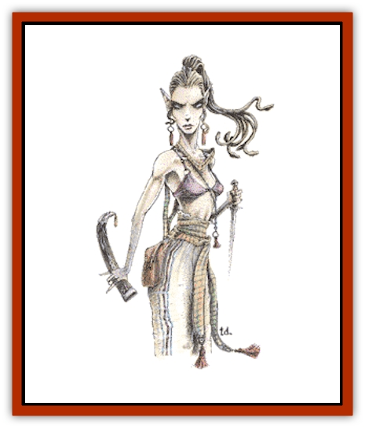

# Medusa

| Statistic | **Greater Medusa** | **Medusa** |
| --- | --- | --- |
| **Activity Cycle:** | Any | Any |
| **Alignment:** | Lawful evil | Lawful evil |
| **Armor Class:** | 3 | 5 |
| **Climate/Terrain:** | Any | Any |
| **Damage/Attack:** | 1-4 | 1-4 |
| **Diet:** | Omnivore | Omnivore |
| **Frequency:** | Rare | Rare |
| **Hit Dice:** | 8 | 6 |
| **Intelligence:** | Very (11-12) | Very (11-12) |
| **Magic Resistance:** | 20% | Nil |
| **Morale:** | Elite (13-14) | Elite (13-14) |
| **Movement:** | 12 | 9 |
| **No. Appearing:** | 1-3 | 1-3 |
| **No. of Attacks:** | 1+weapon | 1 |
| **Organization:** | Solitary | Solitary |
| **Size:** | M (6-7') | M (6-7') |
| **Special Attacks:** | Petrification, poison | Petrification, poison |
| **Special Defenses:** | Poisonous blood | Nil |
| **THAC0:** | 13 | 15 |
| **Treasure:** | P,Q(&times;10),X,Y | P,Q(&times;10),X,Y |
| **XP Value:** | 4,000 | 2,000 |

Medusae are female humanoids with hair of swarming [[Snake|snakes]]. They are hateful creatures that can petrify any creature that meets their gaze.

The typical medusa has a pale-skinned, very shapely woman's form. It stands 5 to 6 feet tall with the snakes adding up to another foot. At distances farther than 30 feet, the medusa is easily confused with a normal woman. Its red-glowing eyes are visible up to 30 feet. At distances of 20 feet or closer, the medusa's true nature is revealed. Its face is horrible - the snakes writhe constantly, especially if the medusa is excited.

Medusae wear human clothing such as loose dresses or robes. They seldom wear armor and cannot easily wear helmets. Medusae may carry a knife, dagger, or short bow. Medusae speak their own tongue and the common one.

**Combat:** The medusa tries to get close to a victim before it reveals its true nature. It will use its attractive body to lure males nearer while staying in the shadows. Once the medusa is within 30 feet, it strikes, trying to get its victim to look into its eyes. Any creature within 30 feet must make a saving throw versus petrification or turn instantly to lifeless stone. If an opponent averts his eyes, the medusa rushes up so that its serpentine growths can attack. The range of such attacks is only 1 foot, but the victim must save versus poison or die.

The medusa is able to see creatures in the Ethereal and Astral planes, and its petrifying gaze is equally as effective against creatures there. It retains its petrifying gaze after death. Creatures looking at a freshly-dead medusa's head make a saving throw at +1. The saving throw increases +1 each day the head decays.

If the medusa cannot easily use its normal tactics, it may resort to normal weapons such as knives and shortbows.

**Habitat/Society:** Medusae dwell in dark caves or the lower regions of large abandoned buildings. They arrange the lighting such that their homes are filled with flickering shadows.

The presence of petrified victims is a sure indicator of the occupant's true nature. For this, aesthetic, and other reasons, the medusa usually removes most of its victims. Those that resemble interesting statues may be retained; the rest are often broken into unrecognizable (and unrevivable) chunks.

The one form of treasure never found in a medusa's lair is a mirror. If a medusa sees its own reflection in a mirror, it turns to stone itself. Reflection in nonmetallic reflectors such as water or polished stone have no such effect. Medusae are immune to the petrifying effect of another medusa.

Medusae are infrequently driven to mate with humanoid males. The act always ends in the male's death, usually by petrification when the medusa reveals its previously hidden visage. Two to six eggs are laid one month later and hatch eight months after that. The female hatchlings appear as baby girls with stubby green tendrils. The hatchlings are revolting to look at but cannot petrify. Medusae grow at the same rate as humans. At about age two the serpentine hair becomes alive and gains its poisonous bite. The medusa can petrify with the onset of adolescence.

**Greater Medusa (Serpentine)**

  Rare medusae (10%) have serpentine bodies in place of the lower torso and legs. The entire body is covered with fine scales and measures 10 to 20 feet. The poison of these medusae is so deadly that saving throws are made at -1, and they are known to use bows and poisoned arrows. Their blood is so poisonous, in fact, that even after one has been killed, touching its body still requires a saving throw versus poison. They seldom venture far from their lairs, since they are immediately recognizable. Greater medusae have a morale bonus of +1.

---
## Discovery & Documentation

**Source Publication:** MC1 Volume I (w/binder #1) (1991)
**Campaign Setting:** Advanced Dungeons & Dragons 2nd Edition
**Author(s):** Jay Batista, Scott Bennie, Grant Boucher, William W. Connors, Steve Gilbert, Heike Kubasch, James Lowder, David Edward Martin, Bruce Nesmith, Jean Rabe, Rick Swan, John J. Terra, Gary L. Thomas

### Other Creatures Found in This Source Book
   * [[Bat|Bat]]
   * [[Bear|Bear]]
   * [[Behir|Behir]]
   * [[Boar|Boar]]
   * [[Bookworm|Bookworm]]
   * [[Brownie|Brownie]]
   * [[Bugbear|Bugbear]]
   * [[Carrion_Crawler|Carrion Crawler]]
   * [[Cat_Great|Cat, Great]]
   * [[Catoblepas|Catoblepas]]
   * [[Dragon_General_Information|Dragon, General Information]]
   * [[Dragonfish|Dragonfish]]
   * [[Elemental_Air_Kin_Aerial_Servant|Elemental, Air Kin, Aerial Servant]]
   * [[Elemental_Earth_Kin_Sandling|Elemental, Earth Kin, Sandling]]
   * [[Elephant|Elephant]]
   * [[Gnoll|Gnoll]]
   * [[Hobgoblin|Hobgoblin]]
   * [[Homunculus|Homunculus]]
   * [[Hornet_Giant|Hornet, Giant]]
   * [[Horse|Horse]]
   * [[Hyena|Hyena]]
   * [[Jackal|Jackal]]
   * [[Jackalwere|Jackalwere]]
   * [[Korred|Korred]]
   * [[Lich|Lich]]
   * [[Lizard|Lizard]]
   * [[Lizard_Man|Lizard Man]]
   * [[Lycanthrope_General_Information|Lycanthrope, General Information]]
   * [[Lycanthrope_Seawolf|Lycanthrope, Seawolf]]
   * [[Lycanthrope_Werebear|Lycanthrope, Werebear]]
   * [[Lycanthrope_Weretiger|Lycanthrope, Weretiger]]
   * [[Lycanthrope_Werewolf|Lycanthrope, Werewolf]]
   * [[Manticore|Manticore]]
   * [[Mind_Flayer|Mind Flayer]]
   * [[Minotaur|Minotaur]]
   * [[Mudman|Mudman]]
   * [[Mummy|Mummy]]
   * [[Nixie|Nixie]]
   * [[Nymph|Nymph]]
   * [[Ogre|Ogre]]
   * [[Ooze_Slime_Jelly_I|Ooze/Slime/Jelly I]]
   * [[Ooze_Slime_Jelly_II|Ooze/Slime/Jelly II]]
   * [[Orc|Orc]]
   * [[Owl|Owl]]
   * [[Owlbear_I|Owlbear I]]
   * [[Pegasus|Pegasus]]
   * [[Piercer|Piercer]]
   * [[Pudding_Deadly|Pudding, Deadly]]
   * [[Rakshasa|Rakshasa]]
   * [[Rat|Rat]]
   * [[Ray|Ray]]
   * [[Remorhaz|Remorhaz]]
   * [[Satyr|Satyr]]
   * [[Scorpion|Scorpion]]
   * [[Selkie|Selkie]]
   * [[Shadow|Shadow]]
   * [[Skeleton|Skeleton]]
   * [[Skunk|Skunk]]
   * [[Snake|Snake]]
   * [[Spectre|Spectre]]
   * [[Spider|Spider]]
   * [[Sprite|Sprite]]
   * [[Toad_Giant|Toad, Giant]]
   * [[Treant|Treant]]
   * [[Troll|Troll]]
   * [[Umber_Hulk|Umber Hulk]]
   * [[Unicorn|Unicorn]]
   * [[Vampire|Vampire]]
   * [[Wight|Wight]]
   * [[Will_O'Wisp|Will O'Wisp]]
   * [[Wolf|Wolf]]
   * [[Wolfwere|Wolfwere]]
   * [[Wraith|Wraith]]
   * [[Wyvern|Wyvern]]
   * [[Yeti|Yeti]]
   * [[Yuan-ti|Yuan-ti]]
   * [[Zombie|Zombie]]
