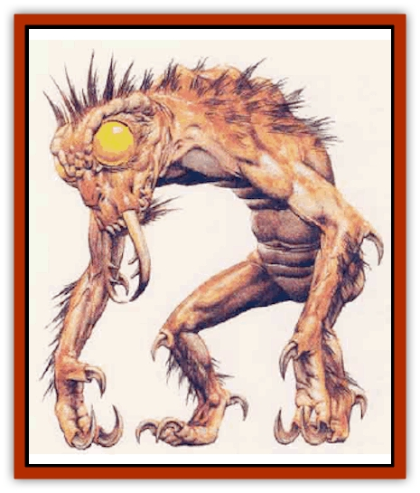

# Meenlock

| Statistic | **Meenlock** |
| --- | --- |
| **Activity Cycle:** | Night, any if tracking |
| **Alignment:** | Lawful evil |
| **Armor Class:** | 7 |
| **Climate/Terrain:** | Any/Subterranean |
| **Damage/Attack:** | 1-4/1-4 |
| **Diet:** | Omnivore |
| **Frequency:** | Very rare |
| **Hit Dice:** | 4 |
| **Intelligence:** | Very (11-12) |
| **Magic Resistance:** | Nil |
| **Morale:** | Steady (11-12) |
| **Movement:** | 9 |
| **No. Appearing:** | 3-5 |
| **No. of Attacks:** | 2 |
| **Organization:** | Band |
| **Size:** | T (2' tall) |
| **Special Attacks:** | Paralyzation |
| **Special Defenses:** | Dimension door |
| **THAC0:** | 17 |
| **Treasure:** | Nil |
| **XP Value:** | 650 |

Meenlocks are shadow-dwelling, bipedal creatures that use gruesome tortures to transform humans and demihumans into monsters like themselves. They are seldom seen, for they shun light. Meenlocks are squat, two feet tall, and covered in shaggy, black fur. Their bent arms end in nasty, three-clawed hands. Their heads are white and hairless, with small, toothsome mouths, flat noses, and large yellow eyes devoid of pupils. Meenlocks have a powerful telepathy ability that enables them to send messages to any creature within 300 feet. Their speech is limited to low guttural growls.

**Combat:** Intelligent creatures with 4 or fewer Hit Dice that view a meenlock collapse from fear for 1d4+4 rounds (reduce this number by half if they roll a successful saving throw vs. spell).

Meenlocks flee bright light if they can; they use considerable ingenuity to extinguish light sources.

In melee, meenlocks rake with their clawed hands. Each hit inflicts 1d4 points of damage. Any creature struck must roll a successful saving throw vs. paralyzation or be paralyzed for 1d6 turns. They may also use a limited *dimension door*, 60-foot range, every other round. Opponents who attack a meenlock during the round it dimension doors suffer a -4 penalty to their attack rolls. Meenlocks may not use this ability while carrying a victim. Three meenlocks are required to carry a man-sized victim.

Any human or group of humans who open a meenlock lair without killing the monsters or replacing the stone exactly as they found it will be tracked and attacked that night. The tracking meenlocks follow at a discrete distance and use their telepathy ability to send messages to one character in the group (no saving throw). This victim should be a paladin if one is present; if not, the meenlocks choose a human, elf, or other demihuman, in that order.

The messages convey the general impression to the victim that horrible monsters are in pursuit and they want to make him one of them. As the day wears on the victim becomes aware of stealthy movements all around him. Companions of the victim probably detect nothing (meenlock are 95% undetectable when tracking). This mental harassment continues throughout the day. The victim loses 1 point of Dexterity, Intelligence, Strength, and Wisdom per hour from distraction. Maximum reduction is to ½ the original value. In addition, a character being harassed by meenlocks is so distracted that he suffers a -1 penalty to his attack rolls or, if he is a spellcaster, the targets of his spells gain a +2 bonus to their saving throws.

Meenlocks attack after their victim beds down for the night. They are amazingly quiet and are 80% likely to surprise even watchful guards (100% against sleeping victims). The meenlocks try to use their fear ability and paralysis to stun any guards, then drag away their chosen victim. Meenlocks kill guards and companions if needed. They do not attack their victim unless absolutely necessary, preferring to drag him off to their lair. Once inside, after a short hideous ceremony, the victim becomes a meenlock.

**Habitat/Society:** Meenlocks dig their homes in desolate, rocky forests, covering the entrance with a large, flat rock (treat as a secret door). This stone opens to a twisting, vertical passageway that winds downward for 100 feet or more to the meenlock lair. The ceiling, floor, and vertical passageway of the entire lair are covered by a dank, spongy, moss unique to meenlock lairs.

Meenlocks use this moss to climb up and down the vertical passage. Anyone opening the lair senses powerful emanations of evil coming from below. In addition, anyone peering into the blackness is greeted by the smell of rotting corpses. Both of these sensations are telepathic warnings from the meenlocks below.

The meenlocks live in a dreary chamber at the bottom of the vertical passageway. Decorations consist of ratty sleeping furs, a number of wicked curved knives hanging on the walls, and a jumbled pile of bones.

**Ecology:** Meenlocks delight in transforming humans and demihumans into monsters like themselves. Little is known about the procedure, but apparently it involves a reduction in the victim's bulk followed by quick application of the meenlock moss.

A meenlock band contains a maximum of five individuals. If a sixth human is transformed, then the band splits. The three largest meenlocks (those with the most hit points) remain in the lair, while the three smaller meenlocks leave to construct their own lair.

---
## Discovery & Documentation

**Source Publication:** Monstrous Compendium, 1995 Annual, Volume 2 (1995)
**Campaign Setting:** Advanced Dungeons & Dragons 2nd Edition
**Author(s):** Jon Pickens

### Other Creatures Found in This Source Book
   * [[Aboleth_Savant|Aboleth, Savant]]
   * [[Addazahr|Addazahr]]
   * [[Amiq_Rasol|Amiq Rasol]]
   * [[Arch-Shadow|Arch-Shadow]]
   * [[Automaton_Scaladar|Automaton, Scaladar]]
   * [[Automaton_Trobriand's|Automaton, Trobriand's]]
   * [[Bat_Sporebat|Bat, Sporebat]]
   * [[Beetle_Dragon|Beetle, Dragon]]
   * [[Bi-nou|Bi-nou]]
   * [[Boggle|Boggle]]
   * [[Brownie_Dobie|Brownie, Dobie]]
   * [[Brownie_Quickling|Brownie, Quickling]]
   * [[Cat_Crypt|Cat, Crypt]]
   * [[Cat_Great_Cath_Shee|Cat, Great, Cath Shee]]
   * [[Centaur-kin_Dorvesh|Centaur-kin, Dorvesh]]
   * [[Centaur-kin_Gnoat|Centaur-kin, Gnoat]]
   * [[Centaur-kin_Ha'pony|Centaur-kin, Ha'pony]]
   * [[Centaur-kin_Zebranaur|Centaur-kin, Zebranaur]]
   * [[Chronolily|Chronolily]]
   * [[Curst|Curst]]
   * [[Darktentacles|Darktentacles]]
   * [[Dinosaur_Aquatic|Dinosaur, Aquatic]]
   * [[Dinosaur_II|Dinosaur II]]
   * [[Dinosaur_III|Dinosaur III]]
   * [[Doppelganger_Greater|Doppelganger, Greater]]
   * [[Dragon_Brine|Dragon, Brine]]
   * [[Dragon_Half-|Dragon, Half-]]
   * [[Dragon-kin_Sea_Wyrm|Dragon-kin, Sea Wyrm]]
   * [[Dwarf_Wild|Dwarf, Wild]]
   * [[Ekimmu|Ekimmu]]
   * [[Elemental_Nature|Elemental, Nature]]
   * [[Elf_Winged|Elf, Winged]]
   * [[Fish_Great_Glacier|Fish (Great Glacier)]]
   * [[Fish_Subterranean|Fish, Subterranean]]
   * [[Fish_Toril|Fish (Toril)]]
   * [[Flareater|Flareater]]
   * [[Flumph|Flumph]]
   * [[Froghemoth|Froghemoth]]
   * [[Ghost_Casurua|Ghost, Casurua]]
   * [[Ghost_Ker|Ghost, Ker]]
   * [[Ghul|Ghul]]
   * [[Ghul-Kin|Ghul-Kin]]
   * [[Giant_Half-giant|Giant, Half-giant]]
   * [[Golem_Burning_Man|Golem, Burning Man]]
   * [[Golem_Phantom_Flyer|Golem, Phantom Flyer]]
   * [[Gulguthhydra|Gulguthhydra]]
   * [[Hakeashar|Hakeashar]]
   * [[Horse_Moon-|Horse, Moon-]]
   * [[Human_Dragonslayer|Human, Dragonslayer]]
   * [[Human_Vistana|Human, Vistana]]
   * [[Jellyfish_Giant|Jellyfish, Giant]]
   * [[Kalin|Kalin]]
   * [[Kholiathra|Kholiathra]]
   * [[Laerti|Laerti]]
   * [[Leucrotta_Greater|Leucrotta, Greater]]
   * [[Lich_Suel|Lich, Suel]]
   * [[Lurker_Shadow|Lurker, Shadow]]
   * [[Lycanthrope_Werepanther|Lycanthrope, Werepanther]]
   * [[Lycanthrope_Wereshark|Lycanthrope, Wereshark]]
   * [[Mammal_Herd_II|Mammal, Herd II]]
   * [[Marl|Marl]]
   * [[Mimic_Greater|Mimic, Greater]]
   * [[Mold_II|Mold II]]
   * [[Mummy_Creature|Mummy, Creature]]
   * [[Nyth|Nyth]]
   * [[Ooze_Slime_Jelly_Ghaunadan|Ooze/Slime/Jelly, Ghaunadan]]
   * [[Palimpsest|Palimpsest]]
   * [[Peltast|Peltast]]
   * [[Plant_Dangerous_II|Plant, Dangerous II]]
   * [[Pleistocene_Animal|Pleistocene Animal]]
   * [[Pudding_Subterranean|Pudding, Subterranean]]
   * [[Raggamoffyn|Raggamoffyn]]
   * [[Snake_Serpent|Snake, Serpent]]
   * [[Snake_Serpent_Vine|Snake, Serpent Vine]]
   * [[Sphinx_Draco-|Sphinx, Draco-]]
   * [[Sprite_Seelie_Faerie|Sprite, Seelie Faerie]]
   * [[Sprite_Unseelie_Faerie|Sprite, Unseelie Faerie]]
   * [[Squealer|Squealer]]
   * [[Turtle_Giant|Turtle, Giant]]
   * [[Umpleby|Umpleby]]
   * [[Vizier's_Turban|Vizier's Turban]]
   * [[Wall_Walker|Wall Walker]]
   * [[Webbird|Webbird]]
   * [[Yak-Man|Yak-Man]]
   * [[Zorbo|Zorbo]]
