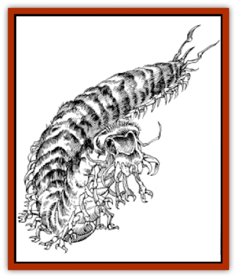

# Megapede

| Statistic | **Megapede** |
| --- | --- |
| **Activity Cycle:** | Night |
| **Alignment:** | Neutral |
| **Armor Class:** | 3 |
| **Climate/Terrain:** | Sandy wastes, salt flats |
| **Damage/Attack:** | 1-6 (&times;5) or 3-30 |
| **Diet:** | Omnivore |
| **Frequency:** | Very Rare |
| **Hit Dice:** | 10 |
| **Intelligence:** | Animal (1) |
| **Magic Resistance:** | Nil |
| **Morale:** | Steady (11-12) |
| **Movement:** | 12 |
| **No. Appearing:** | 1-4 |
| **No. of Attacks:** | 5 or 1 |
| **Organization:** | Solitary |
| **Size:** | Gargantuan (100-150' long) |
| **Special Attacks:** | Poison (Class B) |
| **Special Defenses:** | Nil |
| **THAC0:** | 11 |
| **Treasure:** | Nil |
| **XP Value:** | 4,000 |

**Psionics Summary**

| Level | Dis/Sci/Dev | Attack/Defense | Score | PSPs |
| --- | --- | --- | --- | --- |
| 7 | 3/7/10 | MT,PB,EW,PsC/TS,MB,IF,TW | 15 | 150 |

**Psychokinesis -** *Sciences:* detonate, disintegrate, project force; *Devotion:* soften.

**Psychometabolism -** *Sciences:* death field, energy containment; *Devotions:* biofeedback, chameleon power, double pain, reduction.

**Telepathy -** *Sciences:* mind link, psionic blast, tower of iron will; *Devotions:* aversion, contact, ego whip, mind thrust, psionic crush, thought shield, mental barrier, intellect fortress.

Megapedes are colossal [[Centipede|centipedes]] which roam the sandy deserts of Athas.

Megapedes are very similar to normal centipedes in all ways except in size. They have a very long (100 to 150 feet), segmented body which sports a pair of legs nearly every two feet. These legs are five feet in length and have flexible claws at their ends. The body of a megapede is covered with a fur-covered, bulbous skin which serves as a pseudo-exoskeleton.

**Combat:** Because of its size, the megapede is very capable of defending itself in combat.

When a megapede engages in combat, it can attack in one of three ways. First, it can use up to five of its legs to attack. These can all be used on the same target or on differing ones, providing there are targets within range (five feet). Each leg does 1d6 points of damage with a successful attack. A megapede can also use its tremendous jaws and bite its victim, doing 3-30 points of damage although it cannot use its legs to attack when biting. Creatures bitten by a megapede must save vs. poison or lose 20 additional hit points. Those who succeed at saving lose only 1-3 additional points.

The last combat ability of megapedes is that of psionics. Megapedes are powerful psionic-using creatures and can employ up to two different psionic powers in the same round, so long as they do not engage in melee combat during that round. Like many Athasian creatures, megapedes have natural psionic defense modes which are always considered to be "on". The creature still must pay the cost in PSPs, but may use the defense modes at anytime, regardless of any other actions it is performing at the time.

**Habitat/Society:** The megapedes of Athas are, with the exceptions of the [[Dragon_of_Tyr|Dragon]] and [[Nightmare_Beast|Nightmare Beasts]], the most dangerous feature of travelling across the deserts of this harsh world. Because of their sheer size, megapedes cannot normally hide their presence. Most, however, live beneath the sands of the desert, only surfacing to feed on unfortunate passers-by. Herds of [[Animal_Domestic_Athas_I|erdlus]] and even [[Animal_Domestic_Athas_I|kanks]] are among the favorite foods of megapedes, though they often survive on vegetation alone for weeks on end.

When a megapede is ready to lay eggs, it will find an isolated area, if possible in the rocky barrens of the Tablelands, and begin to make a cocoon in which to place its eggs. Up to three eggs can be placed within one cocoon, which often reaches near 60 feet in length. A cocoon will remain for four to five weeks before bearing young megapedes. At birth, a megapede is 20 to 30 feet long, growing to its full size within three months after birth. While not especially protective of its cocoon, a megapede which has laid eggs will fight off any creature which threatens them, mostly out of instinct.

**Ecology:** The claws of a megapede can be used as arrow/quarrel heads of a very effective nature. Arrows and quarrels tipped with megapede claws add +1 to damage rolls (note that this does not imply that these weapons are magical in any way). Also, the poison sacs of a megapede can be removed from the creature and saved. The poison (Class B) within remains potent for about one month, after which time it dries up and becomes worthless.

---
## Discovery & Documentation

**Source Publication:** MC12 Dark Sun Appendix I - Terrors of the Desert (1991)
**Campaign Setting:** Dark Sun
**Author(s):** Tom Prusa, Louis J. Prosperi, Walter M. Baas

### Other Creatures Found in This Source Book
   * [[Animal_Herd_Athas|Animal, Herd (Athas)]]
   * [[Animal_Household_Athas|Animal, Household (Athas)]]
   * [[Antloid_Desert|Antloid, Desert]]
   * [[Banshee_Dwarf|Banshee, Dwarf]]
   * [[Beetle_Agony|Beetle, Agony]]
   * [[Bog_Wader|Bog Wader]]
   * [[Brambleweed|Brambleweed]]
   * [[B'rohg|B'rohg]]
   * [[Burnflower|Burnflower]]
   * [[Cat_Psionic|Cat, Psionic]]
   * [[Cha'thrang|Cha'thrang]]
   * [[Cistern_Fiend|Cistern Fiend]]
   * [[Clam_Giant|Clam, Giant]]
   * [[Cloud_Ray|Cloud Ray]]
   * [[Drake_Athas_Air|Drake (Athas), Air]]
   * [[Drake_Athas_Earth|Drake (Athas), Earth]]
   * [[Drake_Athas_Fire|Drake (Athas), Fire]]
   * [[Drake_Athas_Water|Drake (Athas), Water]]
   * [[Dune_Runner|Dune Runner]]
   * [[Dune_Trapper|Dune Trapper]]
   * [[Elemental_Athas_Greater_Air|Elemental (Athas), Greater, Air]]
   * [[Elemental_Athas_Greater_Earth|Elemental (Athas), Greater, Earth]]
   * [[Elemental_Athas_Greater_Fire|Elemental (Athas), Greater, Fire]]
   * [[Elemental_Athas_Greater_Water|Elemental (Athas), Greater, Water]]
   * [[Elemental_Athas_Lesser_Air_Earth|Elemental (Athas), Lesser, Air/Earth]]
   * [[Elemental_Athas_Lesser_Fire_Water|Elemental (Athas), Lesser, Fire/Water]]
   * [[Elemental_Athas_General_Information|Elemental (Athas), General Information]]
   * [[Erdland|Erdland]]
   * [[Esperweed|Esperweed]]
   * [[Flailer|Flailer]]
   * [[Floater|Floater]]
   * [[Giant_Athas|Giant (Athas)]]
   * [[Golem_Athas_I|Golem (Athas) I]]
   * [[Golem_Athas_II|Golem (Athas) II]]
   * [[Golem_Athas_III|Golem (Athas) III]]
   * [[Golem_Athas_General_Information|Golem (Athas), General Information]]
   * [[Halfling_Renegade|Halfling, Renegade]]
   * [[Hej-kin|Hej-kin]]
   * [[Id_Fiend|Id Fiend]]
   * [[Insect_Swarm_Athas|Insect Swarm (Athas)]]
   * [[Kank_Wild|Kank, Wild]]
   * [[Kirre|Kirre]]
   * [[Mul_Wild|Mul, Wild]]
   * [[Nightmare_Beast|Nightmare Beast]]
   * [[Plant_Carnivorous_Athas|Plant, Carnivorous (Athas)]]
   * [[Pterran|Pterran]]
   * [[Pterrax|Pterrax]]
   * [[Pulp_Bee|Pulp Bee]]
   * [[Pyreen|Pyreen]]
   * [[Rasclinn|Rasclinn]]
   * [[Razorwing|Razorwing]]
   * [[Roc_Athas|Roc (Athas)]]
   * [[Sand_Bride|Sand Bride]]
   * [[Sand_Cactus|Sand Cactus]]
   * [[Sand_Vortex|Sand Vortex]]
   * [[Scrab|Scrab]]
   * [[Silt_Horror|Silt Horror]]
   * [[Silt_Runner|Silt Runner]]
   * [[Sink_Worm|Sink Worm]]
   * [[Sloth_Athas|Sloth (Athas)]]
   * [[So-ut|So-ut]]
   * [[Spider_Cactus|Spider Cactus]]
   * [[Spider_Crystal|Spider, Crystal]]
   * [[Spirit_of_the_Land|Spirit of the Land]]
   * [[T'Chowb|T'Chowb]]
   * [[Thrax|Thrax]]
   * [[Tohr-kreen_I|Tohr-kreen I]]
   * [[Villichi|Villichi]]
   * [[Zhackal|Zhackal]]
   * [[Zombie_Plant|Zombie Plant]]
