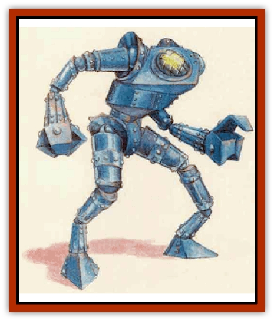

# Mek

| Statistic | **Mek** |
| --- | --- |
| **Activity Cycle:** | Any |
| **Alignment:** | Neutral |
| **Armor Class:** | -4 |
| **Climate/Terrain:** | Ruins or any |
| **Damage/Attack:** | 5d6+10 (fist)/5d6+10 (fist) |
| **Diet:** | Nil |
| **Frequency:** | Very rare |
| **Hit Dice:** | 11-16 |
| **Intelligence:** | Non- (0) |
| **Magic Resistance:** | Nil |
| **Morale:** | Fearless (20) |
| **Movement:** | 9 |
| **No. Appearing:** | 1 |
| **No. of Attacks:** | 2 |
| **Organization:** | Solitary |
| **Size:** | L or H (15-25' tall) |
| **Special Attacks:** | Paralyzing breath |
| **Special Defenses:** | Spell immunity |
| **THAC0:** | 11-12 Hit Dice: 9 / 13-14 Hit Dice: 7 / 15-16 Hit Dice: 8 |
| **Treasure:** | Nil |
| **XP Value:** | 11 HD: 12,000 / 12 HD: 13,000 / 13 HD: 14,000 / 14 HD: 15,000 / 15 HD: 16,000 / 16 HD: 17,000 |

Meks (possibly a derivative of the word "mechanical") are huge metallic creations, fabricated by a long-dead race of inhuman, insectlike sorcerers. Most meks resemble their creators, having barrel-like chests; and long, barbed, double-jointed arms and lecs. However, meks resemblinz giants, lizards, and other creatures have been found, too.

Meks usually serve as guardians and only attack beings who intrude into the area they protect. However, characters might encounter one of the few wild meks that wander as marauders.

These unintelligent creatures do not communicate, but follow the simple, verbal orders their creators gave them long ago. Rumors state that on rare occasions, a powerful individual has learned how to usurp control of a mek - at least for a while.

**Combat:** Meks vary in power. To randomly determine the number of Hit Dice of a given specimen, roll 1d6 and add 10.

A mek responds to motion; it cannot see a creature that remains perfectly still. The best defense against a wandering mek is to remain stock still, out of its path, and wait for it to pass by. This requires a character to remain motionless for approximately 1d3+1 rounds, enough time for the mek to move out of range. In order to remain motionless, a character must make a Dexterity check each round.

Meks attack by striking with their heavy, metallic limbs, inflicting 5d6+10 points of damage with each of their two mighty fists. So great is a blow from one of these monstrosities that a creature bit by both fists in one round must make a saving throw vs. paralysis. A failed saving throw means the mek has knocked the victim off his feet, stunned for 1d4-1 rounds. If the saving throw succeeds, the target still falls prone.

These creatures use their effective Strength of 22 to great effect by grabbing opponents with a successful attack roll, lifting them off the ground, and hurling them 1d6x10 feet away. Victims suffer 1d6 damage for every 10 feet thrown, plus the mek's Strength bonus of +10 to damage.

Once each turn, a mek can exhale a cloud of paralyzing gas. This cloud, a 10-foot-radius sphere centered around the creature, does not obscure vision and remains stationary if the mek moves away. Each creature within it must make a saving throw vs. breath weapon for each round spent inside; failure indicates the victim becomes paralyzed for 1d3 turns. The gas dissipates in 2d4 rounds.

Meks are immune to most enchantments. Cold-based spells cause them no damage but have the effect of a slow spell on them, and disintegrate spells destroy meks that fail their saving throws. Poison and attacks directed at a creature's mind have no effect on them.

**Habitat/Society:** Meks were created long ago to guard ancient insectoid wizards and their underground strongholds. (A few of these fortresses lie on the surface, in remote, desolate areas.) Meks encountered within ancient strongholds served a master at time of their entombment. Most of the time (90%), the creature's final order was to guard a particular chamber, item, or even an entire floor. In rare cases, its master ordered it to kill anyone who entered the stronghold.Sometimes the elements expose a buried stronghold, and a mek manages to escape and wander the countryside, attacking most creatures it encounters and leveling any structures in its path. Such meks apparently had no master at the time they were sealed up in the stronghold. These masterless creatures, lacking in magical compulsions and safeguards, prove dangerous.

The secret of creating meks has been lost - for now.

**Ecology:** Except for the ruin the few wild, uncontrolled meks inflict on the landscape, most meks have no effect on their immediate environment. Some mages and sages speculate that a relationship exists between meks, [[Golem_I_Greater_Golem|iron golems]], and *Apparatuses of Kwalish*.

---
## Discovery & Documentation

**Source Publication:** Mystara Appendix (1994)
**Campaign Setting:** Mystara
**Author(s):** John Nephew, Teeuwynn Woodruff, John Terra, Skip Williams

### Other Creatures Found in This Source Book
   * [[Actaeon|Actaeon]]
   * [[Agarat|Agarat]]
   * [[Ash_Crawler|Ash Crawler]]
   * [[Baldandar|Baldandar]]
   * [[Bargda|Bargda]]
   * [[Bhut|Bhut]]
   * [[Bird_Mystara|Bird (Mystara)]]
   * [[Blackball|Blackball]]
   * [[Choker|Choker]]
   * [[Coltpixie|Coltpixie]]
   * [[Crone_of_Chaos|Crone of Chaos]]
   * [[Darkhood|Darkhood]]
   * [[Darkwing|Darkwing]]
   * [[Decapus|Decapus]]
   * [[Deep_Glaurant|Deep Glaurant]]
   * [[Diabolus|Diabolus]]
   * [[Dimensional_Warper|Dimensional Warper]]
   * [[Dragon_Mystara_Crystalline|Dragon (Mystara), Crystalline]]
   * [[Dragon_Mystara_Jade|Dragon (Mystara), Jade]]
   * [[Dragon_Mystara_Onyx|Dragon (Mystara), Onyx]]
   * [[Dragon_Mystara_Ruby|Dragon (Mystara), Ruby]]
   * [[Drake_Mystara|Drake (Mystara)]]
   * [[Dragonfly|Dragonfly]]
   * [[Dusanu|Dusanu]]
   * [[Elemental_of_Chaos_Air_Earth|Elemental of Chaos, Air/Earth]]
   * [[Elemental_of_Chaos_Fire_Water|Elemental of Chaos, Fire/Water]]
   * [[Elemental_of_Law_Air_Earth|Elemental of Law, Air/Earth]]
   * [[Elemental_of_Law_Fire_Water|Elemental of Law, Fire/Water]]
   * [[Familiar_Mystara|Familiar (Mystara)]]
   * [[Frost_Salamander|Frost Salamander]]
   * [[Fundamental_Air_Earth|Fundamental, Air/Earth]]
   * [[Fundamental_Fire_Water|Fundamental, Fire/Water]]
   * [[Gargantua_Mystara|Gargantua (Mystara)]]
   * [[Geonid|Geonid]]
   * [[Ghostly_Horde|Ghostly Horde]]
   * [[Giant_Athach|Giant, Athach]]
   * [[Giant_Hephaeston|Giant, Hephaeston]]
   * [[Golem_Drolem|Golem, Drolem]]
   * [[Golem_Mystara_I|Golem (Mystara) I]]
   * [[Golem_Mystara_II|Golem (Mystara) II]]
   * [[Golem_Mystara_III|Golem (Mystara) III]]
   * [[Gray_Philosopher|Gray Philosopher]]
   * [[Guardian_Warrior|Guardian Warrior]]
   * [[Gyerian|Gyerian]]
   * [[Herex|Herex]]
   * [[Hivebrood|Hivebrood]]
   * [[Horde|Horde]]
   * [[Hsiao|Hsiao]]
   * [[Huptzeen|Huptzeen]]
   * [[Hutaakan|Hutaakan]]
   * [[Imp_Mystara|Imp (Mystara)]]
   * [[Jellyfish_Giant_Mystara|Jellyfish, Giant (Mystara)]]
   * [[Kna|Kna]]
   * [[Kopru|Kopru]]
   * [[Lizard_Mystara|Lizard (Mystara)]]
   * [[Lizard-kin_Mystara|Lizard-kin (Mystara)]]
   * [[Lupin|Lupin]]
   * [[Lycanthrope_Werejaguar_Mystara|Lycanthrope, Werejaguar (Mystara)]]
   * [[Lycanthrope_Wereswine|Lycanthrope, Wereswine]]
   * [[Magen|Magen]]
   * [[Manikin|Manikin]]
   * [[Mujina|Mujina]]
   * [[Nagpa|Nagpa]]
   * [[Neh-thalggu|Neh-thalggu]]
   * [[Nightshade_Mystara|Nightshade (Mystara)]]
   * [[Nuckalavee|Nuckalavee]]
   * [[Pegataur|Pegataur]]
   * [[Phanaton|Phanaton]]
   * [[Plant_Dangerous_Mystara|Plant, Dangerous (Mystara)]]
   * [[Plasm|Plasm]]
   * [[Rakasta|Rakasta]]
   * [[Rock_Man|Rock Man]]
   * [[Sabreclaw|Sabreclaw]]
   * [[Sacrol|Sacrol]]
   * [[Scamille|Scamille]]
   * [[Shapeshifter|Shapeshifter]]
   * [[Shargugh|Shargugh]]
   * [[Shark-kin|Shark-kin]]
   * [[Sollux|Sollux]]
   * [[Spectral_Death|Spectral Death]]
   * [[Spectral_Hound|Spectral Hound]]
   * [[Spider-kin|Spider-kin]]
   * [[Spirit_Mystara|Spirit (Mystara)]]
   * [[Statue_Living|Statue, Living]]
   * [[Surtaki|Surtaki]]
   * [[Tabi|Tabi]]
   * [[Thoul|Thoul]]
   * [[Thunderhead|Thunderhead]]
   * [[Tiger_Ebon|Tiger, Ebon]]
   * [[Topi|Topi]]
   * [[Tortle|Tortle]]
   * [[Vampire_Velya|Vampire, Velya]]
   * [[White_Fang|White Fang]]
   * [[Worm_Mystara|Worm (Mystara)]]
   * [[Wyrd|Wyrd]]
   * [[Yowler|Yowler]]
   * [[Zombie_Lightning|Zombie, Lightning]]
