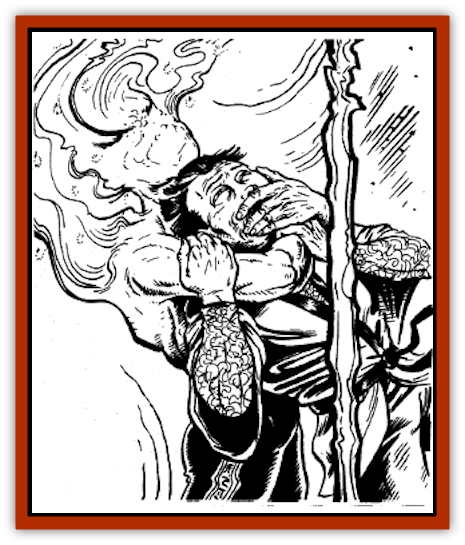

# Memedi

| Statistic | **Common Memedi** | **Gendruwo** |
| --- | --- | --- |
| **Activity Cycle:** | Night | Night |
| **Alignment:** | Neutral | Chaotic neutral or chaotic good |
| **Armor Class:** | 6 | 5 |
| **Climate/Terrain:** | Any | Any |
| **Damage/Attack:** | Nil | By weapon type |
| **Diet:** | Special | Special |
| **Frequency:** | Uncommon | Uncommon |
| **Hit Dice:** | 1 | 3 |
| **Intelligence:** | Semi- to high (2-14) | High (13-14) |
| **Magic Resistance:** | Nil | 35% (see below) |
| **Morale:** | Average (9) | Steady (11) |
| **Movement:** | 24 | 24 |
| **No. Appearing:** | 1 | 1-3 |
| **No. of Attacks:** | Nil | 1 |
| **Organization:** | Solitary | Solitary |
| **Size:** | S (3-4' tall) or M (5-6' tall) | M (5-6' tall) |
| **Special Attacks:** | Fear | Fear |
| **Special Defenses:** | +1 or better weapon to hit, etherealness | +1 or better weapon to hit, invisibility, etherealness |
| **THAC0:** | 19 | 17 |
| **Treasure:** | Nil | Nil |
| **XP Value:** | 35 | 650 |

The memedi include a broad variety of lesser spirits. They are responsible for many of the strange phenomena that frighten and perplex the living.

Common memedi are incorporeal beings found most often on Bawa and other southern islands, although they also have been reported elsewhere in Kara-Tur. Common memedi include djim, djangkong, panaspati, setan gundul, uwil, and wedon.

Memedi who attract the most attention are gendruwo. These playful spirits delight in causing mischief and harassing humans. Gendruwo can change their appearance at will. They have been encountered in the forms of dogs, peacocks, cattle, and lizards. Their favorite form is that of someone known by (or related to) the victim of their mischief. In their natural form, which they seldom assume, gendruwo are featureless humanoids made of shimmering, multi-colored mist.

Gendruwo, as well as all types of common memedi, speak archaic forms of the local languages in short, clipped phrases.

**Combat:** Any character who sees a memedi must make a successful saving throw vs. wands. If he fails, he responds as if he has been affected by a *fear* spell. In other words, the victim turns and moves at his fastest possible speed away from the memedi, for six rounds. Common memedi have no other attacks or special abilities. They are, in fact, quite harmless.

Gendruwo share the common memedi's dislike of physical combat. However, in a desperate situation - e.g., if cornered or seriously threatened - gendruwo may use any available weapon to defend themselves. As soon as the danger has passed, they dispose of such weapons. Gendruwo find the use of human weaponry demeaning and distasteful.

Kidnapping is the gendruwo's most dangerous ability. The spirits can enter the Ethereal Plane at will, and they can take one human victim with them to the border ethereal. In order to kidnap a victim from the Prime Material Plane, the gendruwo must offer him a morsel of food, such as a bit of meat or a piece of kastera (sweet sponge cake), usually presented on a silver tray. If the victim accepts the food, the gendruwo can then whisk him away to the border ethereal, far from friends, home, and family. A kidnapped victim cannot escape the grasp of a gendruwo, and no saving throw is allowed. Once in the border ethereal, the victim is released while the gendruwo returns to the Prime Material Plane to continue its harassment of humans. The kidnapped victim must find his own way home.

Gendruwo have a magic resistance of 35%. However, this does not apply to spells specifically intended for spirits. For instance, gendruwo are resistant to *hail of stone* but not to *abjure*.

**Habitat/Society:** Gendruwo have no permanent lairs, though they take refuge on the Ethereal Plane when threatened or harmed. Gendruwo are solitary by nature, but sometimes congregate in small groups to execute especially devious pranks. Most often they appear after dark, in lonely, secluded places.

The pranks of gendruwo usually are annoying but harmless. For instance, they may give travelers the wrong directions or appear unexpectedly to startle the inattentive. If a gendruwo's prank possibly could result in harm - e.g., if false instructions lead a traveler into a valley of monsters - the gendruwo may appear later to inquire about the victim's health and offer assistance.

When a gendruwo is in a dark or devilish mood, however, its pranks tend to be mean-spirited if not downright dangerous. For example, it may appear before a human in the form of a trusted friend and proceed to tell vicious lies, such as "your wife has left you" or "your brother has been murdered."

**Ecology:** Gendruwo eat all kinds of food and drink. Fearful humans sometimes leave generous offerings of food on the outskirts of their villages in hopes of keeping gendruwo away. Gendruwo also consume all types of paper and parchment. They enjoyannoying humans by eating crucial documents and books.

**Djim**

Djim are spirits of deceased priests, typically appearing as elderly, bald men wearing long prayer robes. Djim never make eye contact with humans or communicate with them directly. Instead, djim continually mumble chants and prayers in an archaic form of the local tongue.

Djim attend the funeral services of nobles and other wealthy men, to ensure safe passage of the deceased to the spirit world. However, they appear at the funeral only if the ceremony is performed exactly as prescribed. Local custom may dictate certain variations, but in general, djim prefer that the family follows these steps:

<ul><li>After the deceased has drawn his final breath, the body is laid out on a special tatami mat upon which a living person has never set foot. The body is then covered by a silken shroud with the head exposed.</li><li>The eldest son places a coin in a bowl, covers it with a silken cloth, then takes it to the nearest stream or pool. He throws a lighted candle and a handful of rice into the water, removes the cloth, and throws in the coin. Now having "purchased" the water, he fills his bowl from the stream.</li><li>The eldest son uncovers the feet of the body, washes them with the "purchased" water, then covers them with the shroud.</li><li>The entire household, along with the deceased's friends and associates, bare their feet, and express their sorrow by chanting, wailing, and moaning for a period not less than one hour.</li><li>The shroud is removed. A twig is placed in the body's right hand and a fan is placed in the left hand; these are to sweep away evil spirits. The family places rings, bracelets, and other jewelry on the deceased, so that he makes a good impression when he enters the afterlife.</li><li>The eldest son prepares several pieces of spirit money, called fang lu ch'ien. Each fang lu ch'ien is a round piece of paper in the shape of a coin, usually blue in color. On the day of the funeral, the fang lu ch'ien are scattered behind the procession. The sound of chanted mumbles heralds the arrival of a djim, who appears several yards behind the procession, collecting the scattered fang lu ch'ien. The appearance of the djim and his acceptance of the fang lu ch'ien ensures that the deceased's passage to the spirit world will be a safe one.</li></ul>Djim are neither violent nor malicious. If attacked, they simply vanish, never to return to that particular area.

**Djangkong**

  Djangkong take the form of a human skeleton with translucent bones and teeth made of black glass. When a human of good alignment is buried in an isolated area, djangkong sometimes appear in order to keep the deceased from becoming lonely.

Djangkong choose their haunts carefully. The ideal spot is a well-constructed crypt far from human settlements, preferably sheltered by tall trees. To attract the djangkong, carvings of animals native to the area should be placed in a line that leads to the crypt. Each corner of the crypt should be marked by a small stone bearing the name of the deceased; these markers, called tse' stones, define the area as a home for the dead.

The crypt itself should have the shape of a box or pyramid. It should contain a large grave marker made of granite or marble, and the marker must be in the south side of the crypt. Two arm chairs made of stone should stand side by side, their backs to the grave marker. The djangkong sits in one of these stone chairs, and the spirit of the deceased sits in the other.

To keep a djangkong happy, the family of the deceased must make a special offering at the crypt each year, during the first two weeks of April. The offering must include a variety of meats and vegetables, a sack of gold and silver coins, a bundle of incense sticks, a broom, and hoe. The djangkong will use the broom and hoe to rid the area of weeds and keep it clean. As long as the djangkong stays happy and remains in the crypt, the area bounded by the tse' stones is permanently charmed by *protection from evil*.

**Panaspati**

  The panaspati is a grotesque memedi resembling a human body with its head between its legs. The creature walks on its hands and breathes fire. The fire appears to be normal, but it generates no heat and causes no damage.

Humans often summon a panaspati to frighten or intimidate their enemies. Two adult humans must summon the spirit creature; one alone will not suffice. If the panaspati appears (10% chance per day) and both humans resist its fear (i.e., they don't run away), the panaspati asks for an offering of food and coins. If the panaspati rejects their offering, it vanishes, and the humans lose all their body hair. (It will grow again normally, however.) If the spirit accepts the offering, it asks the humans whom they wish to frighten. The panaspati will then harass the selected victim for a full day, after which it disappears.

**Setan Gundul**

  The setan gundul appears as a small child whose head has been completely shaved, except for a topknot. This spirit is the only type of memedi that cannot speak.

Setan gundul can be summoned only by an unmarried woman who is at least 80 years old. The woman summons the spirit by falling into a trance for two full days, after which the setan gundul appears. The spirit holds a brass mirror in its hands. Any person who resists the setan gundul's fear attack, and then gazes into its mirror, sees an omen of his future (e.g., a violent death, rich treasure, or great honor). The setan gundul seldom stays for more than a day, usually arriving after sunset and leaving before dawn. However, it may linger for longer periods if it receives tributes of food and is treated with kindness.

**Uwil**

  Uwil are derived from the spirit of dead sohei. They are the most intelligent of all memedi, and also cooperate most fully with humans. Men often seek their advice. Uwil always walk with their heads held downward because their brains are so heavy.

Uwil reside far from human civilizations, usually in caves and underground tunnels. They always are accompanied by 1-4 pure white [[Bat|bats]], which offer companionship. The uwil's bats are like normal bats in every respect, except they eat only stalactites. Uwil will converse with a human who treats them with respect, especially if he brings special food for the bats, such as gemencrusted stalactites.

**Wedon**

  Wedon resemble humans who are covered in white silken sheets from head to toe. These spirits are perhaps the most feared of all memedi, as they are considered to be omens of death, destruction, and misery. The appearance of a flock of sparrows or loons usually foreshadows the wedon's arrival. Wise humans respond to these omens by moving to another location, seeking the aid of a priest or other holy man, or by praying to the gods for redemption. However, should the birds linger in the area or pursue any fleeing humans, the arrival of a wedon is inevitable. Any person who sees a wedon must make a successful save vs. wands or flee.

---
## Discovery & Documentation

**Source Publication:** MC6 Kara-Tur Appendix (1990)
**Campaign Setting:** Kara-Tur (Forgotten Realms)
**Author(s):** Rick Swan

### Other Creatures Found in This Source Book
   * [[Bajang|Bajang]]
   * [[Bakemono|Bakemono]]
   * [[Bisan|Bisan]]
   * [[Buso|Buso]]
   * [[Carp_Giant|Carp, Giant]]
   * [[Centipede_Spirit|Centipede, Spirit]]
   * [[Chu-u|Chu-u]]
   * [[Con-tinh|Con-tinh]]
   * [[Doc_cu'o'c|Doc cu'o'c]]
   * [[Duruch'i-lin|Duruch'i-lin]]
   * [[Flame_Spirit|Flame Spirit]]
   * [[Foo_Creature|Foo Creature]]
   * [[Gaki|Gaki]]
   * [[Gargantua|Gargantua]]
   * [[Goblin_Rat|Goblin Rat]]
   * [[Hai_Nu|Hai Nu]]
   * [[Hannya|Hannya]]
   * [[Hengeyokai|Hengeyokai]]
   * [[Hsing-sing|Hsing-sing]]
   * [[Hu_Hsien|Hu Hsien]]
   * [[Human_Kara-Tur|Human (Kara-Tur)]]
   * [[Ikiryo|Ikiryo]]
   * [[Jishin_Mushi|Jishin Mushi]]
   * [[Kala|Kala]]
   * [[Kaluk|Kaluk]]
   * [[Kappa|Kappa]]
   * [[Korobokuru|Korobokuru]]
   * [[Krakentua|Krakentua]]
   * [[Kuei|Kuei]]
   * [[Men-shen|Men-shen]]
   * [[Nat|Nat]]
   * [[Ningyo|Ningyo]]
   * [[Oni|Oni]]
   * [[P'oh|P'oh]]
   * [[P'oh_Gohei|P'oh, Gohei]]
   * [[Shan_Sao|Shan Sao]]
   * [[Shirokinukatsukami|Shirokinukatsukami]]
   * [[Spirit_Folk|Spirit Folk]]
   * [[Spirit_Nature|Spirit, Nature]]
   * [[Spirit_Stone|Spirit, Stone]]
   * [[Tako|Tako]]
   * [[Tengu|Tengu]]
   * [[Wang-Liang|Wang-Liang]]
   * [[Yuan-ti_Histachii|Yuan-ti, Histachii]]
   * [[Yuki-on-na|Yuki-on-na]]
