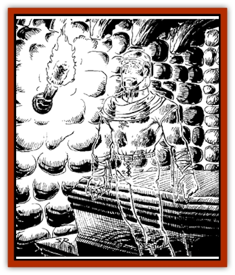

# Memento Mori

| Statistic | **Memento Mori** |
| --- | --- |
| **Activity Cycle:** | Any |
| **Alignment:** | Neutral |
| **Armor Class:** | 3 |
| **Climate/Terrain:** | Any |
| **Damage/Attack:** | See below |
| **Diet:** | None |
| **Frequency:** | Uncommon or very rare |
| **Hit Dice:** | 4 |
| **Intelligence:** | Average (9) |
| **Magic Resistance:** | Nil |
| **Morale:** | Fearless (20) |
| **Movement:** | 18 |
| **No. Appearing:** | 1 |
| **No. of Attacks:** | 1 |
| **Organization:** | Solitary |
| **Size:** | M |
| **Special Attacks:** | Nil |
| **Special Defenses:** | See below |
| **THAC0:** | 17 |
| **Treasure:** | See below |
| **XP Value:** | 10 per hit die of attacking energy when encountered |

While most undead are evil parodies of life, one type of undead has an entirely different origin and purpose. A memento mori is created by a priest's spell to serve as an everlasting remembrance of a dead person, and as an ever-vigilant guardian over its body.

A memento mori takes the form of a translucent image of the deceased as it appeared when the spell that created it was cast. In extreme circumstances, this could mean that the memento mori has the horrible appearance of a mangled and partially rotted corpse, but usually the creating spell is cast only after the body has been properly readied for internment, and so the memento mori will present the appearance of a person as fine and lifelike as the skill of the funeral arranger could ensure.

**Combat:** A memento mori has no material body and can be hit by only magical weapons, with these doing damage equal only to their applicable pluses on hits (e.g., a long sword +1, +2 against undead would do two points of damage to a memento mori on a successful hit). Most spells do not affect them, except for those specifically targeting undead (such as *invisibility to undead*), those that affect the dead (such as *raise dead*, which kills the memento mori if successful), and those that affect magical creatures (such as *dispel magic*, which causes damage equal to the caster's level).

As the memento mori is far from being the most powerful of undead, it uses intimidation to augment its combat abilities. When confronted by potential tombrobbers, the memento mori appears in front of the body it guards and warns the robbers away from their goal. If they do not immediately flee when confronted by the memento mori, it causes a strong static-electric charge to play over all standing within 20' of either the body or the memento mori. This charge is nondamaging, but makes the victims' hair stand on end and causes an unpleasant tingling to play across their skin. The memento mori, now surrounded by a blue nimbus of crackling electricity, then warns the intruders that worse effects are in store if they should persist.

If the thieves continue to advance, or if they attack either the memento mori or the body it protects (damaging the body won't harm its guardian, but will anger it), it attacks, being careful to avoid harming its body or treasure.

At the time of its creation, a memento mori is invested with a limited amount of energy that can be expended by touching a target with its hand. The effect is like that of the *shocking grasp* spell. For each attack, it decides how many dice of damage it will do; and upon a successful hit that amount of damage is done to the victim and is subtracted from the memento mori's total energy forever.

This energy total may be considerable. An average memento mori will have from 1-100 hit dice of energy remaining to it. Some few will have more than that, others will have used all they were provided with. As their energy level drops over time due to encounters, a memento mori tries to conserve energy wherever possible, giving opponents ample opportunity to flee and never attacking retreating robbers. Thus, while a particular memento mori might have a store of 50 hit dice of electrical energy, it would not expend this in one or two high-damage attacks. Instead, it would make a preliminary attack using only one or two dice of electricity, and after scoring a hit, would pull back and warn its opponents to leave or suffer worse. If this fails to dissuade the tomb-robbers, it will escalate the attacks while continually entreating its victims to withdraw.

As the memento mori has no purpose but to protect its body and treasures, it will not refrain from using every hit die left to it to prevent even a single attack if that is necessary. A memento mori with no remaining energy will still behave like one with damaging power, threatening potential robbers with its static charge and letting the charred remains of any previous robbers speak for themselves.

A memento mori does not differentiate between its body and its treasures, so deals threatening to endanger one in favor of preserving the other will not be accepted. If some part of the treasure is stolen, the memento mori will stay to protect the greater portion remaining.

If the majority of what it guards is destroyed, either by action of intelligent beings or by decay, the memento mori focuses its attention on whatever remains, even if that involves traveling to a distant land, unerringly seeking some small item of value that was stolen decades before. When it finds its treasure, it guards it wherever it happens to be, as it has no body with which to move the item.

**Habitat/Society:** Because of the preparations required for the ritual that creates a memento mori, they are almost never found in wilderness areas far from the place they called home in life. They are common in inhabited regions where ancestor worship, mummification, and other forms of preserving or remembering the dead are practiced, for "memento mori" means "remembrance of the dead". In these areas, no memento mori roam the streets, but are found in tombs or shrines where their bodies have been laid to rest.

The body that a memento mori guards will usually be adorned in the finest funeral garb and funerary gifts the family could afford, and it is these things that make up its treasure: anything from a few art objects and gaudy trinkets (the spell creating the memento mori is itself an expensive gift to the memory of the deceased) to a princely sum such as treasure types B or E.

As a memento mori is formed from a part of the soul of the dead body it guards, it retains the memories it possessed in life. This provides mourners with an opportunity to be comforted by speaking with the departed, and in some cultures, new generations are introduced to the memento mori of revered ancestors who died before they were born, hearing the family history from the lips of those who actually lived it. A memento mori is perfectly willing to converse with anyone, even a nonrelative, who makes no attempt to disturb its treasures or body.

Unfortunately, the memento mori has no lasting memory of events that occur after its creation, nor does it have any more personality than a video-recording would have. Thus, each encounter it has with a person, whether loving relative or avaricious tomb-robber, is treated as if it were the first such, and even if a family's tomb complex contains more than one memento mori these shades will not conduct conversations among themselves, as none has any desire or ability to benefit from discussions with equally dead souls. As a corollary, if tomb-robbers threaten the treasures of one memento mori, but stay more than 20' from all the goods of another memento mori-protected body, the second undead will do nothing to assist its fellow, even if they were related in life.

**Ecology:** A memento mori eats nothing, produces no byproducts, and as does not actively hunt the living, and is even further divorced from the greater ecology of the world than most evil undead.

---
## Discovery & Documentation

**Source Publication:** Dragon186 (1992)
**Campaign Setting:** Dragon Magazine
**Author(s):** 

### Other Creatures Found in This Source Book
   * [[Tymher-haid|Tymher-haid]]
