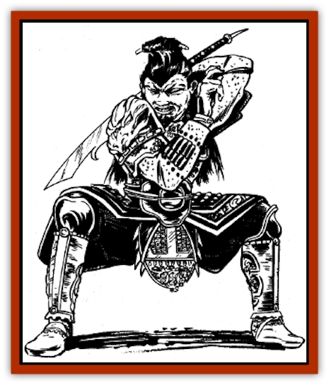

# Men-shen

| Statistic | **Men-shen** |
| --- | --- |
| **Activity Cycle:** | Night |
| **Alignment:** | Neutral |
| **Armor Class:** | 0 |
| **Climate/Terrain:** | Any |
| **Damage/Attack:** | 5-12 (1-8+4)/5-12 (1-8+4) |
| **Diet:** | Special |
| **Frequency:** | Very rare |
| **Hit Dice:** | 10 |
| **Intelligence:** | Very (11-12) |
| **Magic Resistance:** | Nil |
| **Morale:** | Champion (15) |
| **Movement:** | 12 Fl 12 (A) |
| **No. Appearing:** | 1-2 |
| **No. of Attacks:** | 2 |
| **Organization:** | Solitary |
| **Size:** | L (8' tall) |
| **Special Attacks:** | See below |
| **Special Defenses:** | See below |
| **THAC0:** | 11 |
| **Treasure:** | Nil |
| **XP Value:** | 4,000 |

Men-shen are greater spirits who serve as guardians. They protect a place or person against intruders, evil spirits, or similar threats.

The men-shen appears as an oversized human with a grim countenance and golden skin. His eyes may be black, blue, or red. He may be bald or have long, flowing hair, which spills over his shoulders. Some men-shen wear a single topknot, which is braided with flowers and hangs to the middle of their backs.

Men-shen don the regalia of an army general. Their clothing is pressed and spotless, their medals and buttons polished and sparkling. Each men-shen carries a large red sword.

Men-shen speak the languages of all inhabitants of Kara-Tur, as well as the language of the Celestial Court.

**Combat:** If a men-shen has been assigned to protect a place or person, or if he has agreed to perform any other service, he will faithfully discharge his duties to the death.

The men-shen is exceptionally difficult for opponents to strike. He commands continual *ESP* with a 30-foot radius, and no opponent within 30 feet can surprise him. He can fly, and also can become *invisible* at will. Furthermore, he can attack while *invisible*, as per *improved invisibility*. Finally, a men-shen can become *astral* at will and *polymorph self* twice per day. When *polymorphed*, the men-shen usually takes the form of an [[Oni|oni]] (or a similarly fearsome creature) in order to frighten away skittish opponents. The fierce countenance of the men-shen acts as an *apparition* spell on his victims (+1 bonus to men-shen's surprise; creatures of 1 HD or less must save vs. spell or flee for 1-3 rounds).

The men-shen primarily attacks with its sword, which grants him a +4 bonus to attack and damage rolls. No other creature can use a men-shen's sword. If a men-shen is destroyed, his sword will crumble to dust. In order for a sword to retain its potency, the men-shen must return daily to the Celestial realms. Each day spent away from these realms causes the sword to lose 1 point from its attack bonus; its damage bonus is unaffected.

The men-shen is immune to *fear*, *charm*, and *hold* spells of all types. He suffers half damage (or no damage) from spells that cause the loss of hit points.

**Habitat/Society:** The first two men-shen were originally famous generals of a good emperor. When the emperor fell ill due to the nightly visits of an evil [[Dragon_General_Information|dragon]], these generals volunteered to stand watch at his door. For several nights, nothing happened; still, the generals never deserted their posts, remaining alert at all times and shunning sleep. Concerned for the well-being of the generals, the emperor ordered that paintings of the two men be rendered on the door posts. So effective had been their vigilance that even the paintings kept the dragon at bay.

To this day, mortals paint the images of men-shen on the door posts of their homes, hoping to frighten evil spirits. Any painted image of a men-shen may be occupied by an astral men-shen; the chance is 5%. Homeowners rarely are aware of the existence of these astral spirits.

The Celestial Emperor sometimes assigns tasks to men-shen, but more often these spirits are invoked or summoned by mortals. The men-shen generals consider each request for assistance; if the generals deem such requests to be worthy, a men-shen (or men-shen couple) is dispatched. Such requests usually involve guarding tombs, shrines, or treasure vaults. Requests for men-shen to intervene directly in mortal affairs - e.g., an attack upon a human's enemies - usually are ignored by the generals. When assigned as a guardian, a men-shen's duties normally extend from dusk to dawn, allowing him to spend the rest of the day in the Celestial Court.

**Ecology:** Men-shen do not eat or drink. Instead, they are refreshed and energized merely by attending the Celestial Court.

---
## Discovery & Documentation

**Source Publication:** MC6 Kara-Tur Appendix (1990)
**Campaign Setting:** Kara-Tur (Forgotten Realms)
**Author(s):** Rick Swan

### Other Creatures Found in This Source Book
   * [[Bajang|Bajang]]
   * [[Bakemono|Bakemono]]
   * [[Bisan|Bisan]]
   * [[Buso|Buso]]
   * [[Carp_Giant|Carp, Giant]]
   * [[Centipede_Spirit|Centipede, Spirit]]
   * [[Chu-u|Chu-u]]
   * [[Con-tinh|Con-tinh]]
   * [[Doc_cu'o'c|Doc cu'o'c]]
   * [[Duruch'i-lin|Duruch'i-lin]]
   * [[Flame_Spirit|Flame Spirit]]
   * [[Foo_Creature|Foo Creature]]
   * [[Gaki|Gaki]]
   * [[Gargantua|Gargantua]]
   * [[Goblin_Rat|Goblin Rat]]
   * [[Hai_Nu|Hai Nu]]
   * [[Hannya|Hannya]]
   * [[Hengeyokai|Hengeyokai]]
   * [[Hsing-sing|Hsing-sing]]
   * [[Hu_Hsien|Hu Hsien]]
   * [[Human_Kara-Tur|Human (Kara-Tur)]]
   * [[Ikiryo|Ikiryo]]
   * [[Jishin_Mushi|Jishin Mushi]]
   * [[Kala|Kala]]
   * [[Kaluk|Kaluk]]
   * [[Kappa|Kappa]]
   * [[Korobokuru|Korobokuru]]
   * [[Krakentua|Krakentua]]
   * [[Kuei|Kuei]]
   * [[Memedi|Memedi]]
   * [[Nat|Nat]]
   * [[Ningyo|Ningyo]]
   * [[Oni|Oni]]
   * [[P'oh|P'oh]]
   * [[P'oh_Gohei|P'oh, Gohei]]
   * [[Shan_Sao|Shan Sao]]
   * [[Shirokinukatsukami|Shirokinukatsukami]]
   * [[Spirit_Folk|Spirit Folk]]
   * [[Spirit_Nature|Spirit, Nature]]
   * [[Spirit_Stone|Spirit, Stone]]
   * [[Tako|Tako]]
   * [[Tengu|Tengu]]
   * [[Wang-Liang|Wang-Liang]]
   * [[Yuan-ti_Histachii|Yuan-ti, Histachii]]
   * [[Yuki-on-na|Yuki-on-na]]
