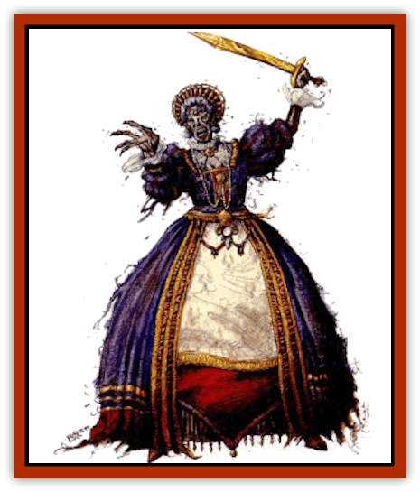

# Meorty

| Statistic | **Meorty** |
| --- | --- |
| **Activity Cycle:** | Any |
| **Alignment:** | Lawful evil |
| **Armor Class:** | 0 or better |
| **Climate/Terrain:** | Any |
| **Damage/Attack:** | By weapon type, or 1d6+6/1d6+6 |
| **Diet:** | None |
| **Frequency:** | Very rare |
| **Hit Dice:** | As in life, minimum 10 HD |
| **Intelligence:** | Genius (17.18) |
| **Magic Resistance:** | 25% (see below) |
| **Morale:** | Fearless (19-20) |
| **Movement:** | 12 |
| **No. Appearing:** | 1 |
| **No. of Attacks:** | As in life, or 2 |
| **Organization:** | Solitary |
| **Size:** | M (6' tall) |
| **Special Attacks:** | See below |
| **Special Defenses:** | +1 magical weapon or better to hit |
| **THAC0:** | As in life, minimum 11 |
| **Treasure:** | B,E,H |
| **XP Value:** | 20,000 + 2,000 per HD over 10 |

**Psionics Summary**

| Level | Dis/Sci/Dev | Attack/Defense | Score | PSPs |
| --- | --- | --- | --- | --- |
| 10+ | 4/6/17 | all/all | 15 | 80 |

**Clairsentience -** *Science:* clairvoyance; *Devotions:* danger sense, psionic sense.

**Psychometabolism -** *Science:* life detection; *Devotions:* clairaudience, displacement.

**Psychoportation -** *Science:* teleport; *Devotions:* astral projection, dream travel, dimensional door, teleport trigger.

**Telepathy -** *Sciences:* domination, mind link, psionic blast; *Devotions:* awe, contact, ego whip, id insinuation, mental barrier, mind thrust, psionic crush, send thoughts, truthear.

Meorties are [[Undead_Athas_General_Information|undead]] guardians from the Green Age who continue to watch over their ancient domains and enforce their ancient laws. These long-forgotten domains once covered the Tyr region and beyond in the time when psionics was the power of the day and great forests spread across the face of Athas. In most cases, all that remains of these domains are the meorty crypts and the memories of these undead guardians. Meorties emerge only to punish those who violate the ancient laws.

Meorties are gaunt, mummified corpses that are either wrapped in moldy cloth or wear rotting burial clothing befitting their station. They are always adorned with ancient jewelry of elaborate workmanship, and they usually carry the weapons they wielded in life. Their eyes glow with bright green embers and they move with regal grace.

Meorties have deep, reverberating voices but seldom speak except to announce the crimes for which they are about to punish trespassers. They speak only the ancient languages they knew in life.

**Combat:** A meorty usually teleports somewhere near those who have violated its ancient laws and approaches in a calm manner. It calmly informs the offenders of the laws they have violated and asks them to accept their punishments with honor. Those who refuse to allow themselves to be slaughtered at the hands of the meorty are attacked. A meorty uses its psionic powers against opponents, especially domination. If physical violence is required, a meorty attacks with the weapons it wielded in life or with its fists (causing 1-6 (1d6) points of damage, plus a 6 point bonus for their great strength).

Meorties can only be hit by a +1 or better magical weapon, by spells or psionics, or by creatures with more than 6 HD or magical properties. Meorties are immune to *charm*, *sleep*, *enfeeblement*, *polymorph*, *cold*, electricity, insanity, and death magic. Meorties have 25% magic resistance.

Meorties retain the powers and abilities of their character class in life. Most of these ancient guardians are psionicists, though they can also be fighters. As they come from the age before magic, there are no meorty wizards.

Meorties have the power to control other ancient undead as 15th-level clerics.

**Habitat/Society:** Meorties were created long ago through the necromancies of high priests and through the use of long-lost psionic abilities for the purpose of serving as the protectors of various Green-Age domains. Each domain selected a guardian to be turned into a meorty, thus creating a protector to enforce the laws for all time. It no longer matters that the domains and the laws that governed them are so much dust. The meorties continue to serve the territories they were bound to by undeath.

Though evil by the nature of their existence, meorties take no initiative in harming others. They prefer to rest in peace. They are bound by their state of undeath to enforce the ancient laws of their long-forgotten domains, however, and will emerge from their eternal slumber to pass judgment on those who violate the laws.

No records of the ancient laws or the boundaries of the ancient domains remain, so it is impossible to know exactly what is considered a violation where. Most travelers learn that it is safer to follow the local customs when they're far from the city-states, especially the more bizarre ones, as they are most likely observations of ancient laws.

Meorties reside in secret subterranean tombs of elaborate design. These tombs are massive and intricate in design, filled with countless undead and ancient treasures. No living beings are permitted to enter the tombs. Those who trespass are hunted down relentlessly and destroyed by the offended meorty and its undead minions, as is anyone else who learned about the tomb and its location.

**Ecology:** Meorties possess information concerning the ancient history of Athas, especially of the Green Age, before the Time of Magic and the Cleansing Wars. However, living beings are rarely in a position to question a meorty about its knowledge. If a living being makes contact with a meorty, it's almost always because the living one somehow violated the laws that the undead meorty enforces. The crypts of meorties are rumored to contain valuable psionic items, metal, and other riches from the Green Age.

---
## Discovery & Documentation

**Source Publication:** Dark Sun Appendix II - Terrors Beyond Tyr (1991)
**Campaign Setting:** Dark Sun
**Author(s):** Jim Atkiss, Steve Brown, Timothy B. Brown, Andrew P. Morris, Bruce Nesmith, Wes Nicholson, Bill Slavicsek

### Other Creatures Found in This Source Book
   * [[Aarakocra_Athas|Aarakocra (Athas)]]
   * [[Animal_Domestic_Athas_II|Animal, Domestic (Athas) II]]
   * [[Aviarag|Aviarag]]
   * [[Baazrag|Baazrag]]
   * [[Baazrag_Boneclaw|Baazrag, Boneclaw]]
   * [[Bloodgrass|Bloodgrass]]
   * [[Cactus_Hunting|Cactus, Hunting]]
   * [[Cactus_Rock|Cactus, Rock]]
   * [[Cilops|Cilops]]
   * [[Crodlu|Crodlu]]
   * [[Dagorran|Dagorran]]
   * [[Dhaot|Dhaot]]
   * [[Drake_Lesser_Athas_General_Information|Drake, Lesser (Athas), General Information]]
   * [[Drake_Lesser_Athas_Magma|Drake, Lesser (Athas), Magma]]
   * [[Drake_Lesser_Athas_Rain|Drake, Lesser (Athas), Rain]]
   * [[Drake_Lesser_Athas_Silt|Drake, Lesser (Athas), Silt]]
   * [[Drake_Lesser_Athas_Sun|Drake, Lesser (Athas), Sun]]
   * [[Dray|Dray]]
   * [[Drik|Drik]]
   * [[Dune_Reaper|Dune Reaper]]
   * [[Dwarf_Athas|Dwarf (Athas)]]
   * [[Elemental_Beast_Athas_Air|Elemental Beast (Athas), Air]]
   * [[Elemental_Beast_Athas_Earth|Elemental Beast (Athas), Earth]]
   * [[Elemental_Beast_Athas_Fire|Elemental Beast (Athas), Fire]]
   * [[Elemental_Beast_Athas_Water|Elemental Beast (Athas), Water]]
   * [[Elf_Athas|Elf (Athas)]]
   * [[Fael|Fael]]
   * [[Feylaar|Feylaar]]
   * [[Fordorran|Fordorran]]
   * [[Giant_Half-giant|Giant, Half-giant]]
   * [[Giant_Shadow|Giant, Shadow]]
   * [[Golem_Athas_Magma|Golem (Athas), Magma]]
   * [[Golem_Athas_Salt|Golem (Athas), Salt]]
   * [[Golem_Athas_General_Information|Golem (Athas), General Information]]
   * [[Gorak|Gorak]]
   * [[Halfling_Athas|Halfling (Athas)]]
   * [[Human_Athas|Human (Athas)]]
   * [[Jhakar|Jhakar]]
   * [[Kaisharga|Kaisharga]]
   * [[Kes'trekel|Kes'trekel]]
   * [[Klar|Klar]]
   * [[Krag|Krag]]
   * [[Kragling|Kragling]]
   * [[Lirr|Lirr]]
   * [[Mastyrial|Mastyrial]]
   * [[Mul|Mul]]
   * [[Nikaal|Nikaal]]
   * [[Paraelemental_Beast_General_Information|Paraelemental Beast, General Information]]
   * [[Paraelemental_Beast_Magma|Paraelemental Beast, Magma]]
   * [[Paraelemental_Beast_Rain|Paraelemental Beast, Rain]]
   * [[Paraelemental_Beast_Silt|Paraelemental Beast, Silt]]
   * [[Paraelemental_Beast_Sun|Paraelemental Beast, Sun]]
   * [[Pakubrazi|Pakubrazi]]
   * [[Psionocus|Psionocus]]
   * [[Psurlon|Psurlon]]
   * [[Raaig|Raaig]]
   * [[Retriever_Obsidian|Retriever, Obsidian]]
   * [[Ruktoi|Ruktoi]]
   * [[Ruvoka_Athas|Ruvoka (Athas)]]
   * [[Sand_Howler|Sand Howler]]
   * [[Scorpion_Athas|Scorpion (Athas)]]
   * [[Seed_Brain|Seed, Brain]]
   * [[Silt_Horror_Black|Silt Horror, Black]]
   * [[Silt_Horror_Magma|Silt Horror, Magma]]
   * [[Silt_Horror_Red|Silt Horror, Red]]
   * [[Silt_Spawn|Silt Spawn]]
   * [[Slig|Slig]]
   * [[Spider_Athas|Spider (Athas)]]
   * [[Spinewyrm|Spinewyrm]]
   * [[Ssurran|Ssurran]]
   * [[Stalking_Horror|Stalking Horror]]
   * [[Tarek|Tarek]]
   * [[Tari|Tari]]
   * [[Thri-kreen|Thri-kreen]]
   * [[T'liz|T'liz]]
   * [[Tohr-kreen_II|Tohr-kreen II]]
   * [[Tohr-kreen_III|Tohr-kreen III]]
   * [[Trin|Trin]]
   * [[Tul'k|Tul'k]]
   * [[Undead_Athas_General_Information|Undead (Athas), General Information]]
   * [[Wraith_Athas|Wraith (Athas)]]
   * [[Xerichou|Xerichou]]
   * [[Zombie_Thinking|Zombie, Thinking]]
