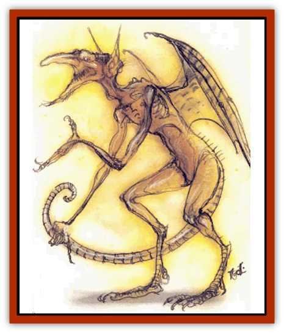
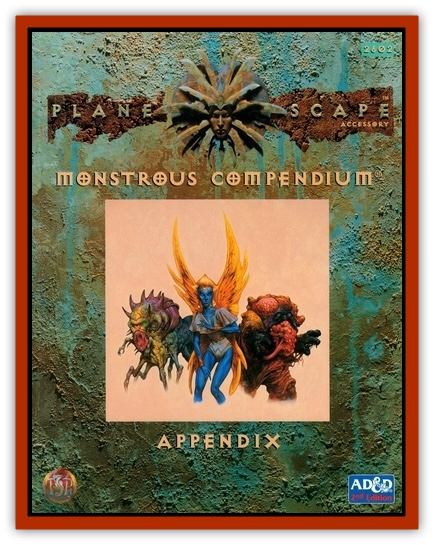

# Mephit III - Fire - Radiant

| Statistic | **Fire** | **Radiant** |
| --- | --- | --- |
| **Activity Cycle:** | Any | Any |
| **Alignment:** | Neutral | Neutral |
| **Armor Class:** | 5 | 4 |
| **Climate/Terrain:** | Any | Any |
| **Damage/Attack:** | 1d3+1/1d3+1 | 1d3/1d3 |
| **Diet:** | Special | Nil |
| **Frequency:** | Common | Common |
| **Hit Dice:** | 3+1 | 3 |
| **Intelligence:** | Average (8-10) | Average (8-10) |
| **Magic Resistance:** | Nil | Nil |
| **Morale:** | Average (8-10) | Irregular (5-7) |
| **Movement:** | 12, Fl 24 (B) | 12, Fl 24 (B) |
| **No. Appearing:** | 1-10 | 1-10 |
| **No. of Attacks:** | 2 | 2 |
| **Organization:** | Solitary | Solitary |
| **Size:** | M (5' tall) | M (5' tall) |
| **Special Attacks:** | See below | <i>Color spray</i> |
| **Special Defenses:** | See below | See below |
| **THAC0:** | 17 | 17 |
| **Treasure:** | N | Nil |
| **XP Value:** | 420 | 420 |

## Fire Mephit

The most mischievous of all [[Mephit_General_Information|mephits]], these fiends play terrible pranks on other mephits, such as pushing [[Mephit_VII_Magma_Ash|magma mephits]] into water and watching them harden.

Fire mephits are small, wiry humanoids with bright red skin and bat-wings. Some fire mephits affect a mustache, goatee, and tiny horns on their forehead, but these are always faked.

**Combat:** Touching a fire mephit causes 1 hp heat damage. Its two clawed hands rake for 1d3 damage each plus 1 hp heat damage per hit.

Fire mephits can use their breath weapon three times a day. In one form it is a flame jet 15' long and 1' wide that automatically hits one chosen target (1d8+1 damage; save vs. breath weapon for half damage). The second form, a fan of flame, covers a 120 arc in front of the mephit to a distance of five feet. Any creature in the arc suffers 4 hp damage (no save).

Fire mephits can also cast *magic missile* (two missiles) and *heat metal* spells once each per day. Once per hour a fire mephit can attempt to *gate* in another mephit, either fire, magma, [[Mephit_I_Air_Smoke|smoke]] or [[Mephit_VIII_Mist_Steam|steam]].

**Ecology:** Fire mephits sometimes prove useful heating forges, warming bedclothes, or lighting cigars.

## Radiant Mephit

Prone to non sequiturs and glazed looks, radiant mephits appear permanently, blissfully dazed by the glories of the quasi-plane of Radiance. They peer fixedly at people and say things like, "Have you too seen the majesty of the Ultimate Light? Oh, look at that amazing reflection on your armor there! Nice&hellip; Sorry, was I talking?" They take overblown names as do other mephits, hut never remember them.

Radiant mephits have silvery bodies that perfectly reflect their surroundings like a mirror, large black eyes, and thin prismatic wings. They have wide mouths, but their faces are usually expressionless, except during their sudden fits of crazed giggling.

**Combat:** Radiant mephits can attack with two claws (1d3 damage each). They can cast *color spray* once per turn at 6th level of magic use. However, unless directly attacked, they usually become distracted and forget their opponents.

Once per hour a radiant mephit can attempt to *gate* in another radiant mephit.

Radiant mephits are immune to all spells that affect or work through vision, including *color spray* and visual illusions, but they receive no saving throws against mind-affecting magic. They have infravision to 120'. In strong light they regenerate 1 hp per turn.

**Ecology:** Radiant mephits lack the attention span to carry out missions. They are created primarily because some powerful beings of lawful alignment find their *color sprays* (dim recreations of the plane of Radiance) soothing or mesmerizing.

---
## Discovery & Documentation

**Source Publication:** MC Planescape I (1991)
**Campaign Setting:** Planescape
**Author(s):** various

### Other Creatures Found in This Source Book
   * [[Aasimon_Agathinon|Aasimon, Agathinon]]
   * [[Aasimon_Deva|Aasimon, Deva]]
   * [[Aasimon_Light|Aasimon, Light]]
   * [[Aasimon_General_Information|Aasimon, General Information]]
   * [[Aasimon_Planetar|Aasimon, Planetar]]
   * [[Aasimon_Solar|Aasimon, Solar]]
   * [[Animal_Lord|Animal Lord]]
   * [[Baatezu_Lesser_Abishai|Baatezu, Lesser, Abishai]]
   * [[Baatezu_Greater_Amnizu|Baatezu, Greater, Amnizu]]
   * [[Baatezu_Lesser_Barbazu|Baatezu, Lesser, Barbazu]]
   * [[Baatezu_Greater_Cornugon|Baatezu, Greater, Cornugon]]
   * [[Baatezu_Lesser_Erinyes|Baatezu, Lesser, Erinyes]]
   * [[Baatezu_General_Information|Baatezu, General Information]]
   * [[Baatezu_Greater_Gelugon|Baatezu, Greater, Gelugon]]
   * [[Baatezu_Lesser_Hamatula|Baatezu, Lesser, Hamatula]]
   * [[Baatezu_Lemure|Baatezu, Lemure]]
   * [[Baatezu_Least_Nupperibo|Baatezu, Least, Nupperibo]]
   * [[Baatezu_Lesser_Osyluth|Baatezu, Lesser, Osyluth]]
   * [[Baatezu_Greater_Pit_Fiend|Baatezu, Greater, Pit Fiend]]
   * [[Baatezu_Least_Spinagon|Baatezu, Least, Spinagon]]
   * [[Baku|Baku]]
   * [[Bariaur|Bariaur]]
   * [[Bebilith|Bebilith]]
   * [[Bodak|Bodak]]
   * [[Einheriar|Einheriar]]
   * [[Elemental_Grue_Chaggrin|Elemental Grue, Chaggrin]]
   * [[Elemental_Grue_Harginn|Elemental Grue, Harginn]]
   * [[Elemental_Grue_Ildriss|Elemental Grue, Ildriss]]
   * [[Elemental_Grue_Varrdig|Elemental Grue, Varrdig]]
   * [[Foo_Creature|Foo Creature]]
   * [[Gehreleth|Gehreleth]]
   * [[Githyanki|Githyanki]]
   * [[Githzerai|Githzerai]]
   * [[Hordling|Hordling]]
   * [[Hound_Yeth|Hound, Yeth]]
   * [[Imp|Imp]]
   * [[Incarnate|Incarnate]]
   * [[Larva|Larva]]
   * [[Maelephant|Maelephant]]
   * [[Marut|Marut]]
   * [[Mediator|Mediator]]
   * [[Mephit_General_Information|Mephit, General Information]]
   * [[Mephit_I_Air_Smoke|Mephit I (Air/Smoke)]]
   * [[Mephit_II_Earth_Ooze|Mephit II (Earth/Ooze)]]
   * [[Mephit_IV_Water_Ice|Mephit IV (Water/Ice)]]
   * [[Mephit_V_Dust_Salt|Mephit V (Dust/Salt)]]
   * [[Mephit_VI_Lightning_Mineral|Mephit VI (Lightning/Mineral)]]
   * [[Mephit_VII_Magma_Ash|Mephit VII (Magma/Ash)]]
   * [[Mephit_VIII_Mist_Steam|Mephit VIII (Mist/Steam)]]
   * [[Night_Hag|Night Hag]]
   * [[Nightmare|Nightmare]]
   * [[Per|Per]]
   * [[Shadow_Fiend|Shadow Fiend]]
   * [[Slaad|Slaad]]
   * [[Tanar'ri_Greater_Babau|Tanar'ri, Greater, Babau]]
   * [[Tanar'ri_Greater_Chasme|Tanar'ri, Greater, Chasme]]
   * [[Tanar'ri_Greater_Nabassu|Tanar'ri, Greater, Nabassu]]
   * [[Tanar'ri_Greater_Wastrilith|Tanar'ri, Greater, Wastrilith]]
   * [[Tanar'ri_Least_Dretch|Tanar'ri, Least, Dretch]]
   * [[Tanar'ri_Least_Manes|Tanar'ri, Least, Manes]]
   * [[Tanar'ri_Least_Rutterkin|Tanar'ri, Least, Rutterkin]]
   * [[Tanar'ri_Lesser_Alu-Fiend|Tanar'ri, Lesser, Alu-Fiend]]
   * [[Tanar'ri_Lesser_Bar-Lgura|Tanar'ri, Lesser, Bar-Lgura]]
   * [[Tanar'ri_Lesser_Cambion|Tanar'ri, Lesser, Cambion]]
   * [[Tanar'ri_Lesser_Succubus|Tanar'ri, Lesser, Succubus]]
   * [[Tanar'ri_Guardian_Molydeus|Tanar'ri, Guardian, Molydeus]]
   * [[Tanar'ri_True_Balor|Tanar'ri, True, Balor]]
   * [[Tanar'ri_True_Glabrezu|Tanar'ri, True, Glabrezu]]
   * [[Tanar'ri_True_Hezrou|Tanar'ri, True, Hezrou]]
   * [[Tanar'ri_True_Marilith|Tanar'ri, True, Marilith]]
   * [[Tanar'ri_True_Nalfeshnee|Tanar'ri, True, Nalfeshnee]]
   * [[Tanar'ri_True_Vrock|Tanar'ri, True, Vrock]]
   * [[Tiefling|Tiefling]]
   * [[Vargouille|Vargouille]]
   * [[Yugoloth_Greater_Arcanaloth|Yugoloth, Greater, Arcanaloth]]
   * [[Yugoloth_Lesser_Dergoloth|Yugoloth, Lesser, Dergoloth]]
   * [[Yugoloth_Lesser_Hydroloth|Yugoloth, Lesser, Hydroloth]]
   * [[Yugoloth_General_Information|Yugoloth, General Information]]
   * [[Yugoloth_Lesser_Mezzoloth|Yugoloth, Lesser, Mezzoloth]]
   * [[Yugoloth_Lesser_Piscoloth|Yugoloth, Lesser, Piscoloth]]
   * [[Yugoloth_Greater_Ultroloth|Yugoloth, Greater, Ultroloth]]
   * [[Yugoloth_Lesser_Yagnoloth|Yugoloth, Lesser, Yagnoloth]]
