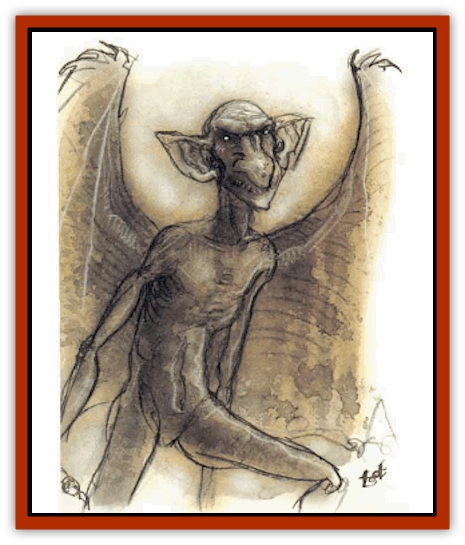

# Mephit II - Earth - Ooze

| Statistic | **Earth** | **Ooze** |
| --- | --- | --- |
| **Activity Cycle:** | Any | Any |
| **Alignment:** | Neutral | Neutral |
| **Armor Class:** | 5 | 6 |
| **Climate/Terrain:** | Any | Any |
| **Damage/Attack:** | 1d4/1d4 | 1d3/1d3 |
| **Diet:** | Special | Special |
| **Frequency:** | Common | Common |
| **Hit Dice:** | 3+2 | 3 |
| **Intelligence:** | Average (8-10) | Average (8-10) |
| **Magic Resistance:** | Nil | Nil |
| **Morale:** | Average (8-10) | Irregular (5-7) |
| **Movement:** | 12, Fl 24 (C) | 12, Fl 24 (B) |
| **No. Appearing:** | 1-10 | 1-10 |
| **No. of Attacks:** | 2 | 2 |
| **Organization:** | Solitary | Solitary |
| **Size:** | M (5' tall) | M (5' tall) |
| **Special Attacks:** | See below | Stinking cloud |
| **Special Defenses:** | See below | None |
| **THAC0:** | 17 | 17 |
| **Treasure:** | N | N&times;2 |
| **XP Value:** | 420 | 420 |

## Earth Mephit

These heavy, rocky [[Mephit_General_Information|mephits]] have stolid, humorless personalities. Stubborn and immune to insult, they look like small, thin [[Elemental_Air_Earth|earth elementals]], with stony skin, glittering eyes, and rigid wings of dull metal. Their wings, which never flap, seem to play no role in the mephit's magical flight. Earth mephits fly clumsily and smell like dirt.

**Combat:** Earth mephits have two fist attacks (1d4 damage each). Once per day, they can grow to a height of 10' for one turn; their fists do 2d6 damage at this size.

Three times a day an earth mephit can spit a rock at one target within 15' hitting automatically (1d6 damage). Additional uses of this attack beyond the third cost the mephit 2 hp apiece from its current total.

Once per hour an earth mephit can attempt to *gate* in 1-2 other mephits, either earth or [[Mephit_VII_Magma_Ash|magma]]. If two arrive, they are the same type.

Earth mephits regenerate 1 hp per round they spend buried in earth to at least waist level. *Passwall* and *transmute rock to mud* spells destroy them instantly.

**Ecology:** Earth mephits need no food or drink to survive, but they enjoy the taste of gems and jewelry. To gain these they pursue money-making schemes, always with single-mindedness but also singular ineptitude.

## Ooze Mephit

These unctuous creatures sidle up to strangers and, in purring, sibilant voices, use flattery to ingratiate themselves. "Oooh, what sssplendid armor! You know, you wear that armor with sssuch, sssuch authority, I feel myssself quite overwhelmed." After a few minutes of this, or as much as the target can stand, the mephit asks for "a loan" of 100 gold pieces.

Ooze mephits are made of ochre muck, just like their home plane. They have a rough humanoid form hut no clear joints, and their wings are transparent green bubble membranes that seldom break. They have dark green eyes and mouth with a mooning expression, and they smell absolutely terrible in a 30' radius. Contact with an ooze mephit stains clothing permanently.

**Combat:** Ooze mephits attack with two claws (1d3 damage each), but avoid combat when possible. Their breath weapon, usable every other round without limit, is an invisible cloud of gas that works as a *stinking cloud* (no range, 10' radius) cast at 3rd level of magic use. Other mephits are immune.

Once per hour an ooze mephit can *gate* in another ooze mephit. Ooze mephits are immune to cutting or impaling damage and to fire and water attacks of all types, but *transmute mud to rock* destroys them instantly. They regenerate 1 hp per round in stagnant water.

**Ecology:** Ooze mephits are created to clean sewage lines, maintain garbage dumps, and carry out other necessary but unpleasant duties. They quickly desert and become beggars. With the money they beg, ooze mephits hire wizards to transform them into more desirable forms: humans, [[Elf|elves]], [[Dwarf|dwarves]], even [[Kobold|kobolds]].

---
## Discovery & Documentation

**Source Publication:** MC Planescape I (1991)
**Campaign Setting:** Planescape
**Author(s):** various

### Other Creatures Found in This Source Book
   * [[Aasimon_Agathinon|Aasimon, Agathinon]]
   * [[Aasimon_Deva|Aasimon, Deva]]
   * [[Aasimon_Light|Aasimon, Light]]
   * [[Aasimon_General_Information|Aasimon, General Information]]
   * [[Aasimon_Planetar|Aasimon, Planetar]]
   * [[Aasimon_Solar|Aasimon, Solar]]
   * [[Animal_Lord|Animal Lord]]
   * [[Baatezu_Lesser_Abishai|Baatezu, Lesser, Abishai]]
   * [[Baatezu_Greater_Amnizu|Baatezu, Greater, Amnizu]]
   * [[Baatezu_Lesser_Barbazu|Baatezu, Lesser, Barbazu]]
   * [[Baatezu_Greater_Cornugon|Baatezu, Greater, Cornugon]]
   * [[Baatezu_Lesser_Erinyes|Baatezu, Lesser, Erinyes]]
   * [[Baatezu_General_Information|Baatezu, General Information]]
   * [[Baatezu_Greater_Gelugon|Baatezu, Greater, Gelugon]]
   * [[Baatezu_Lesser_Hamatula|Baatezu, Lesser, Hamatula]]
   * [[Baatezu_Lemure|Baatezu, Lemure]]
   * [[Baatezu_Least_Nupperibo|Baatezu, Least, Nupperibo]]
   * [[Baatezu_Lesser_Osyluth|Baatezu, Lesser, Osyluth]]
   * [[Baatezu_Greater_Pit_Fiend|Baatezu, Greater, Pit Fiend]]
   * [[Baatezu_Least_Spinagon|Baatezu, Least, Spinagon]]
   * [[Baku|Baku]]
   * [[Bariaur|Bariaur]]
   * [[Bebilith|Bebilith]]
   * [[Bodak|Bodak]]
   * [[Einheriar|Einheriar]]
   * [[Elemental_Grue_Chaggrin|Elemental Grue, Chaggrin]]
   * [[Elemental_Grue_Harginn|Elemental Grue, Harginn]]
   * [[Elemental_Grue_Ildriss|Elemental Grue, Ildriss]]
   * [[Elemental_Grue_Varrdig|Elemental Grue, Varrdig]]
   * [[Foo_Creature|Foo Creature]]
   * [[Gehreleth|Gehreleth]]
   * [[Githyanki|Githyanki]]
   * [[Githzerai|Githzerai]]
   * [[Hordling|Hordling]]
   * [[Hound_Yeth|Hound, Yeth]]
   * [[Imp|Imp]]
   * [[Incarnate|Incarnate]]
   * [[Larva|Larva]]
   * [[Maelephant|Maelephant]]
   * [[Marut|Marut]]
   * [[Mediator|Mediator]]
   * [[Mephit_General_Information|Mephit, General Information]]
   * [[Mephit_I_Air_Smoke|Mephit I (Air/Smoke)]]
   * [[Mephit_III_Fire_Radiant|Mephit III (Fire/Radiant)]]
   * [[Mephit_IV_Water_Ice|Mephit IV (Water/Ice)]]
   * [[Mephit_V_Dust_Salt|Mephit V (Dust/Salt)]]
   * [[Mephit_VI_Lightning_Mineral|Mephit VI (Lightning/Mineral)]]
   * [[Mephit_VII_Magma_Ash|Mephit VII (Magma/Ash)]]
   * [[Mephit_VIII_Mist_Steam|Mephit VIII (Mist/Steam)]]
   * [[Night_Hag|Night Hag]]
   * [[Nightmare|Nightmare]]
   * [[Per|Per]]
   * [[Shadow_Fiend|Shadow Fiend]]
   * [[Slaad|Slaad]]
   * [[Tanar'ri_Greater_Babau|Tanar'ri, Greater, Babau]]
   * [[Tanar'ri_Greater_Chasme|Tanar'ri, Greater, Chasme]]
   * [[Tanar'ri_Greater_Nabassu|Tanar'ri, Greater, Nabassu]]
   * [[Tanar'ri_Greater_Wastrilith|Tanar'ri, Greater, Wastrilith]]
   * [[Tanar'ri_Least_Dretch|Tanar'ri, Least, Dretch]]
   * [[Tanar'ri_Least_Manes|Tanar'ri, Least, Manes]]
   * [[Tanar'ri_Least_Rutterkin|Tanar'ri, Least, Rutterkin]]
   * [[Tanar'ri_Lesser_Alu-Fiend|Tanar'ri, Lesser, Alu-Fiend]]
   * [[Tanar'ri_Lesser_Bar-Lgura|Tanar'ri, Lesser, Bar-Lgura]]
   * [[Tanar'ri_Lesser_Cambion|Tanar'ri, Lesser, Cambion]]
   * [[Tanar'ri_Lesser_Succubus|Tanar'ri, Lesser, Succubus]]
   * [[Tanar'ri_Guardian_Molydeus|Tanar'ri, Guardian, Molydeus]]
   * [[Tanar'ri_True_Balor|Tanar'ri, True, Balor]]
   * [[Tanar'ri_True_Glabrezu|Tanar'ri, True, Glabrezu]]
   * [[Tanar'ri_True_Hezrou|Tanar'ri, True, Hezrou]]
   * [[Tanar'ri_True_Marilith|Tanar'ri, True, Marilith]]
   * [[Tanar'ri_True_Nalfeshnee|Tanar'ri, True, Nalfeshnee]]
   * [[Tanar'ri_True_Vrock|Tanar'ri, True, Vrock]]
   * [[Tiefling|Tiefling]]
   * [[Vargouille|Vargouille]]
   * [[Yugoloth_Greater_Arcanaloth|Yugoloth, Greater, Arcanaloth]]
   * [[Yugoloth_Lesser_Dergoloth|Yugoloth, Lesser, Dergoloth]]
   * [[Yugoloth_Lesser_Hydroloth|Yugoloth, Lesser, Hydroloth]]
   * [[Yugoloth_General_Information|Yugoloth, General Information]]
   * [[Yugoloth_Lesser_Mezzoloth|Yugoloth, Lesser, Mezzoloth]]
   * [[Yugoloth_Lesser_Piscoloth|Yugoloth, Lesser, Piscoloth]]
   * [[Yugoloth_Greater_Ultroloth|Yugoloth, Greater, Ultroloth]]
   * [[Yugoloth_Lesser_Yagnoloth|Yugoloth, Lesser, Yagnoloth]]
