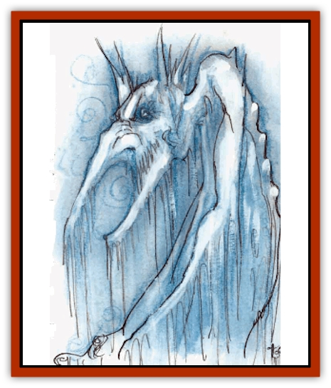

# Mephit IV - Water - Ice

| Statistic | **Ice** | **Water** |
| --- | --- | --- |
| **Activity Cycle:** | Any | Any |
| **Alignment:** | Neutral | Neutral |
| **Armor Class:** | 5 | 5 |
| **Climate/Terrain:** | Any | Any |
| **Damage/Attack:** | 1d2/1d2 | 1d3/1d3 |
| **Diet:** | Nil | Any liquid |
| **Frequency:** | Common | Common |
| **Hit Dice:** | 3 | 3 |
| **Intelligence:** | Average (8-10) | Average (8-10) |
| **Magic Resistance:** | Nil | Nil |
| **Morale:** | Average (8-10) | Average (8-10) |
| **Movement:** | 12, Fl 24 (B) | 12, Fl 24 (B) |
| **No. Appearing:** | 1-10 | 1-10 |
| **No. of Attacks:** | 2 | 2 |
| **Organization:** | Solitary | Solitary |
| **Size:** | M (5' tall) | M (5' tall) |
| **Special Attacks:** | See below | Acid stream |
| **Special Defenses:** | See below | See below |
| **THAC0:** | 17 | 17 |
| **Treasure:** | N | N |
| **XP Value:** | 420 | 420 |

## Water Mephit

These thin, finny humanoids are covered with sea-green scales, and webs of skin connect the spines of their ears, toes, and wings. They have fishy, staring eyes and fish lips. An odor of brine accompanies them, and they drip salt water.

Manifesting an irritating joviality, water [[Mephit_General_Information|mephits]] make remarkably tactless comments on their companions' actions and situations: "Buck up, you can handle these fiends. Or if not, you'll make good [[Tanar'ri_Least_Dretch|dretches]]." They attach themselves to adventuring parties (unasked) out of an appetite for novelty.

**Combat:** Water mephits can attack with two claws (1d3 damage each), but they prefer their breath weapon, a stream of acidic greenish water (2d4 acid damage for two rounds; one save vs. breath weapon halves damage on both rounds). The mephit can breathe every other round, automatically hitting one target.

The semi-liquid forms of water mephits are immune to cutting or impaling damage from nonmagical weapons and to fire damage (including magical fire), but they take double damage from cold attacks. Of course they can breathe water, and they can drink any liquid, such as mercury or poison without damage. They regenerate 1 hp per round spent only drinking liquid. Water mephits can attempt to *gate* in one other water or ice mephit once per hour.

**Ecology:** Captured water mephits stand watch in kitchens, ready to put out fires, or maintain aquaria for the wealthy.

## Ice Mephit

Ice mephits are angular, with translucent, ice-blue skin. They live on the colder Lower Planes and thus never mix with fire, magma, [[Mephit_I_Air_Smoke|smoke]], or steam mephits. Ice mephits act aloof and cruel, surpassing other mephits in torture and wanton destruction.

**Combat:** Ice mephits attack with two clawed hands (1d2 damage each). In addition, their chilling touch reduces the victim's attack rolls by 1 per hit. These effects are cumulative and last three turns, or until the victim is healed to full hit points, whichever comes first.

Ice mephits can breathe a volley of ice shards every other melee round, up to three times per day. This volley automatically hits a single victim within 15' (1d6 damage, save vs. breath weapon for half damage).

Once per hour an ice mephit can attempt to *gate* in one other mephit, either [[Mephit_VIII_Mist_Steam|mist]] or ice.

Ice mephits are of course immune to all cold-based attacks, but take full damage from fire- or heat-based attacks.

**Ecology:** Confined ice mephits chill small rooms for the cold storage of perishables.

---
## Discovery & Documentation

**Source Publication:** MC Planescape I (1991)
**Campaign Setting:** Planescape
**Author(s):** various

### Other Creatures Found in This Source Book
   * [[Aasimon_Agathinon|Aasimon, Agathinon]]
   * [[Aasimon_Deva|Aasimon, Deva]]
   * [[Aasimon_Light|Aasimon, Light]]
   * [[Aasimon_General_Information|Aasimon, General Information]]
   * [[Aasimon_Planetar|Aasimon, Planetar]]
   * [[Aasimon_Solar|Aasimon, Solar]]
   * [[Animal_Lord|Animal Lord]]
   * [[Baatezu_Lesser_Abishai|Baatezu, Lesser, Abishai]]
   * [[Baatezu_Greater_Amnizu|Baatezu, Greater, Amnizu]]
   * [[Baatezu_Lesser_Barbazu|Baatezu, Lesser, Barbazu]]
   * [[Baatezu_Greater_Cornugon|Baatezu, Greater, Cornugon]]
   * [[Baatezu_Lesser_Erinyes|Baatezu, Lesser, Erinyes]]
   * [[Baatezu_General_Information|Baatezu, General Information]]
   * [[Baatezu_Greater_Gelugon|Baatezu, Greater, Gelugon]]
   * [[Baatezu_Lesser_Hamatula|Baatezu, Lesser, Hamatula]]
   * [[Baatezu_Lemure|Baatezu, Lemure]]
   * [[Baatezu_Least_Nupperibo|Baatezu, Least, Nupperibo]]
   * [[Baatezu_Lesser_Osyluth|Baatezu, Lesser, Osyluth]]
   * [[Baatezu_Greater_Pit_Fiend|Baatezu, Greater, Pit Fiend]]
   * [[Baatezu_Least_Spinagon|Baatezu, Least, Spinagon]]
   * [[Baku|Baku]]
   * [[Bariaur|Bariaur]]
   * [[Bebilith|Bebilith]]
   * [[Bodak|Bodak]]
   * [[Einheriar|Einheriar]]
   * [[Elemental_Grue_Chaggrin|Elemental Grue, Chaggrin]]
   * [[Elemental_Grue_Harginn|Elemental Grue, Harginn]]
   * [[Elemental_Grue_Ildriss|Elemental Grue, Ildriss]]
   * [[Elemental_Grue_Varrdig|Elemental Grue, Varrdig]]
   * [[Foo_Creature|Foo Creature]]
   * [[Gehreleth|Gehreleth]]
   * [[Githyanki|Githyanki]]
   * [[Githzerai|Githzerai]]
   * [[Hordling|Hordling]]
   * [[Hound_Yeth|Hound, Yeth]]
   * [[Imp|Imp]]
   * [[Incarnate|Incarnate]]
   * [[Larva|Larva]]
   * [[Maelephant|Maelephant]]
   * [[Marut|Marut]]
   * [[Mediator|Mediator]]
   * [[Mephit_General_Information|Mephit, General Information]]
   * [[Mephit_I_Air_Smoke|Mephit I (Air/Smoke)]]
   * [[Mephit_II_Earth_Ooze|Mephit II (Earth/Ooze)]]
   * [[Mephit_III_Fire_Radiant|Mephit III (Fire/Radiant)]]
   * [[Mephit_V_Dust_Salt|Mephit V (Dust/Salt)]]
   * [[Mephit_VI_Lightning_Mineral|Mephit VI (Lightning/Mineral)]]
   * [[Mephit_VII_Magma_Ash|Mephit VII (Magma/Ash)]]
   * [[Mephit_VIII_Mist_Steam|Mephit VIII (Mist/Steam)]]
   * [[Night_Hag|Night Hag]]
   * [[Nightmare|Nightmare]]
   * [[Per|Per]]
   * [[Shadow_Fiend|Shadow Fiend]]
   * [[Slaad|Slaad]]
   * [[Tanar'ri_Greater_Babau|Tanar'ri, Greater, Babau]]
   * [[Tanar'ri_Greater_Chasme|Tanar'ri, Greater, Chasme]]
   * [[Tanar'ri_Greater_Nabassu|Tanar'ri, Greater, Nabassu]]
   * [[Tanar'ri_Greater_Wastrilith|Tanar'ri, Greater, Wastrilith]]
   * [[Tanar'ri_Least_Dretch|Tanar'ri, Least, Dretch]]
   * [[Tanar'ri_Least_Manes|Tanar'ri, Least, Manes]]
   * [[Tanar'ri_Least_Rutterkin|Tanar'ri, Least, Rutterkin]]
   * [[Tanar'ri_Lesser_Alu-Fiend|Tanar'ri, Lesser, Alu-Fiend]]
   * [[Tanar'ri_Lesser_Bar-Lgura|Tanar'ri, Lesser, Bar-Lgura]]
   * [[Tanar'ri_Lesser_Cambion|Tanar'ri, Lesser, Cambion]]
   * [[Tanar'ri_Lesser_Succubus|Tanar'ri, Lesser, Succubus]]
   * [[Tanar'ri_Guardian_Molydeus|Tanar'ri, Guardian, Molydeus]]
   * [[Tanar'ri_True_Balor|Tanar'ri, True, Balor]]
   * [[Tanar'ri_True_Glabrezu|Tanar'ri, True, Glabrezu]]
   * [[Tanar'ri_True_Hezrou|Tanar'ri, True, Hezrou]]
   * [[Tanar'ri_True_Marilith|Tanar'ri, True, Marilith]]
   * [[Tanar'ri_True_Nalfeshnee|Tanar'ri, True, Nalfeshnee]]
   * [[Tanar'ri_True_Vrock|Tanar'ri, True, Vrock]]
   * [[Tiefling|Tiefling]]
   * [[Vargouille|Vargouille]]
   * [[Yugoloth_Greater_Arcanaloth|Yugoloth, Greater, Arcanaloth]]
   * [[Yugoloth_Lesser_Dergoloth|Yugoloth, Lesser, Dergoloth]]
   * [[Yugoloth_Lesser_Hydroloth|Yugoloth, Lesser, Hydroloth]]
   * [[Yugoloth_General_Information|Yugoloth, General Information]]
   * [[Yugoloth_Lesser_Mezzoloth|Yugoloth, Lesser, Mezzoloth]]
   * [[Yugoloth_Lesser_Piscoloth|Yugoloth, Lesser, Piscoloth]]
   * [[Yugoloth_Greater_Ultroloth|Yugoloth, Greater, Ultroloth]]
   * [[Yugoloth_Lesser_Yagnoloth|Yugoloth, Lesser, Yagnoloth]]
