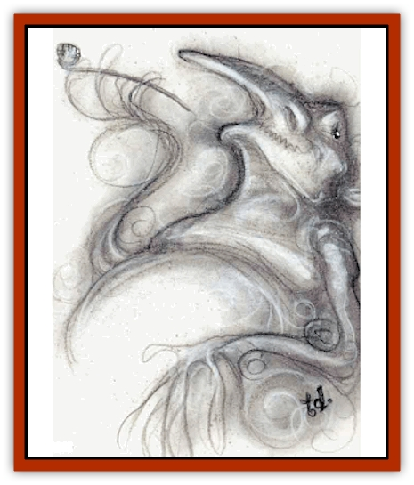

# Mephit I - Air - Smoke

| Statistic | **Air** | **Smoke** |
| --- | --- | --- |
| **Activity Cycle:** | Any | Any |
| **Alignment:** | Neutral | Neutral |
| **Armor Class:** | 4 | 4 |
| **Climate/Terrain:** | Any | Any |
| **Damage/Attack:** | 1d3/1d3 | 1d2/1d2 |
| **Diet:** | Nil | Special |
| **Frequency:** | Common | Common |
| **Hit Dice:** | 3 | 3 |
| **Intelligence:** | Average (8-10) | Average (8-10) |
| **Magic Resistance:** | Nil | Nil |
| **Morale:** | Average (8-10) | Average (8-10) |
| **Movement:** | 12, Fl 24 (A) | 12, Fl 24 (B) |
| **No. Appearing:** | 1-10 | 1-10 |
| **No. of Attacks:** | 2 | 2 |
| **Organization:** | Solitary | Solitary |
| **Size:** | M (5' tall) | M (5' tall) |
| **Special Attacks:** | See below | See below |
| **Special Defenses:** | See below | See below |
| **THAC0:** | 17 | 17 |
| **Treasure:** | N | Nil |
| **XP Value:** | 420 | 420 |

## Air Mephit

Most maneuverable in flight of all [[Mephit_General_Information|mephits]], air mephits are flighty in personality as well. Fickle, untrustworthy, and empty-headed, these mephits make excellent messengers and couriers - for their first mission. Thereafter they flee their creators to explore the planes, attach themselves to whomever looks interesting and make entertaining trouble.

Air mephits look like pure white muscular humanoids from the waist up and white tornadoes from the waist down. Unlike most other mephits, they have no wings but fly on their airstreams; they display astonishing agility. They are bald with broad grins and small ears, and they often wear one gold earring.

**Combat:** Air mephits favor sudden ambush attacks and quick escapes. An air mephit attacks with two claws (1d3 damage each). To use its breath weapon, the mephit inhales sand, dirt, or other particles in the vicinity and then blows the grit at high velocity at one target within 10' (hits automatically for 1d6 damage). The mephit can blow once every other round withut limit, as long as it finds sufficient grit in the vicinity.

Once per hour air mephits can cast *blur* on themselves at 3rd level of magic use. Once per day they can cast *gust of wind*.

Air mephits are immune to air and gas attacks of all kinds. They regenerate 1 hp per turn automatically. They die instantly and vanish in a vacuum.

**Ecology:** A confined mephit can freshen and cool the air in stuffy rooms. Spellcasters unaccustomed to hot weather sometimes bring them along on trips to hot Lower Planes.

## Smoke Mephit

Smoke mephits are crude and lazy. They spend most of their time sitting around invisible, smoking pipeweed, telling bad jokes about their creators, and generally shirking their responsibilities.

**Combat:** A smoke mephit's two clawed hands cause 1d2 damage each. Its breath weapon consists of a sooty ball usable every other melee round, an unlimited number of times per day. This sooty hall automatically strikes one creature of the mephit's choice within 20' (1d4 damage and blinded for 1-2 rounds), no saving throw.

Smoke mephits can cast *invisibility* and *dancing lights* once each per day. Once per hour, they can attempt to *gate* in 1-2 other mephits, [[Mephit_III_Fire_Radiant|fire]], [[Mephit_VII_Magma_Ash|magma]], smoke, or [[Mephit_VIII_Mist_Steam|steam]]. If two rnephits arrive, they are the same type.

Contact with any kind of smoke lets a smoke mephit regenerate 1 hp per turn. When a smoke mephit dies, it disappears in a flash of flame. This flash causes 1 hp damage to all creatures within 10'.

**Ecology:** Lower-planar beings traditionally dispatch a smoke mephit as a gift to enemies, a gesture of insolence and contempt that amounts to a declaration of vendetta.

---
## Discovery & Documentation

**Source Publication:** MC Planescape I (1991)
**Campaign Setting:** Planescape
**Author(s):** various

### Other Creatures Found in This Source Book
   * [[Aasimon_Agathinon|Aasimon, Agathinon]]
   * [[Aasimon_Deva|Aasimon, Deva]]
   * [[Aasimon_Light|Aasimon, Light]]
   * [[Aasimon_General_Information|Aasimon, General Information]]
   * [[Aasimon_Planetar|Aasimon, Planetar]]
   * [[Aasimon_Solar|Aasimon, Solar]]
   * [[Animal_Lord|Animal Lord]]
   * [[Baatezu_Lesser_Abishai|Baatezu, Lesser, Abishai]]
   * [[Baatezu_Greater_Amnizu|Baatezu, Greater, Amnizu]]
   * [[Baatezu_Lesser_Barbazu|Baatezu, Lesser, Barbazu]]
   * [[Baatezu_Greater_Cornugon|Baatezu, Greater, Cornugon]]
   * [[Baatezu_Lesser_Erinyes|Baatezu, Lesser, Erinyes]]
   * [[Baatezu_General_Information|Baatezu, General Information]]
   * [[Baatezu_Greater_Gelugon|Baatezu, Greater, Gelugon]]
   * [[Baatezu_Lesser_Hamatula|Baatezu, Lesser, Hamatula]]
   * [[Baatezu_Lemure|Baatezu, Lemure]]
   * [[Baatezu_Least_Nupperibo|Baatezu, Least, Nupperibo]]
   * [[Baatezu_Lesser_Osyluth|Baatezu, Lesser, Osyluth]]
   * [[Baatezu_Greater_Pit_Fiend|Baatezu, Greater, Pit Fiend]]
   * [[Baatezu_Least_Spinagon|Baatezu, Least, Spinagon]]
   * [[Baku|Baku]]
   * [[Bariaur|Bariaur]]
   * [[Bebilith|Bebilith]]
   * [[Bodak|Bodak]]
   * [[Einheriar|Einheriar]]
   * [[Elemental_Grue_Chaggrin|Elemental Grue, Chaggrin]]
   * [[Elemental_Grue_Harginn|Elemental Grue, Harginn]]
   * [[Elemental_Grue_Ildriss|Elemental Grue, Ildriss]]
   * [[Elemental_Grue_Varrdig|Elemental Grue, Varrdig]]
   * [[Foo_Creature|Foo Creature]]
   * [[Gehreleth|Gehreleth]]
   * [[Githyanki|Githyanki]]
   * [[Githzerai|Githzerai]]
   * [[Hordling|Hordling]]
   * [[Hound_Yeth|Hound, Yeth]]
   * [[Imp|Imp]]
   * [[Incarnate|Incarnate]]
   * [[Larva|Larva]]
   * [[Maelephant|Maelephant]]
   * [[Marut|Marut]]
   * [[Mediator|Mediator]]
   * [[Mephit_General_Information|Mephit, General Information]]
   * [[Mephit_II_Earth_Ooze|Mephit II (Earth/Ooze)]]
   * [[Mephit_III_Fire_Radiant|Mephit III (Fire/Radiant)]]
   * [[Mephit_IV_Water_Ice|Mephit IV (Water/Ice)]]
   * [[Mephit_V_Dust_Salt|Mephit V (Dust/Salt)]]
   * [[Mephit_VI_Lightning_Mineral|Mephit VI (Lightning/Mineral)]]
   * [[Mephit_VII_Magma_Ash|Mephit VII (Magma/Ash)]]
   * [[Mephit_VIII_Mist_Steam|Mephit VIII (Mist/Steam)]]
   * [[Night_Hag|Night Hag]]
   * [[Nightmare|Nightmare]]
   * [[Per|Per]]
   * [[Shadow_Fiend|Shadow Fiend]]
   * [[Slaad|Slaad]]
   * [[Tanar'ri_Greater_Babau|Tanar'ri, Greater, Babau]]
   * [[Tanar'ri_Greater_Chasme|Tanar'ri, Greater, Chasme]]
   * [[Tanar'ri_Greater_Nabassu|Tanar'ri, Greater, Nabassu]]
   * [[Tanar'ri_Greater_Wastrilith|Tanar'ri, Greater, Wastrilith]]
   * [[Tanar'ri_Least_Dretch|Tanar'ri, Least, Dretch]]
   * [[Tanar'ri_Least_Manes|Tanar'ri, Least, Manes]]
   * [[Tanar'ri_Least_Rutterkin|Tanar'ri, Least, Rutterkin]]
   * [[Tanar'ri_Lesser_Alu-Fiend|Tanar'ri, Lesser, Alu-Fiend]]
   * [[Tanar'ri_Lesser_Bar-Lgura|Tanar'ri, Lesser, Bar-Lgura]]
   * [[Tanar'ri_Lesser_Cambion|Tanar'ri, Lesser, Cambion]]
   * [[Tanar'ri_Lesser_Succubus|Tanar'ri, Lesser, Succubus]]
   * [[Tanar'ri_Guardian_Molydeus|Tanar'ri, Guardian, Molydeus]]
   * [[Tanar'ri_True_Balor|Tanar'ri, True, Balor]]
   * [[Tanar'ri_True_Glabrezu|Tanar'ri, True, Glabrezu]]
   * [[Tanar'ri_True_Hezrou|Tanar'ri, True, Hezrou]]
   * [[Tanar'ri_True_Marilith|Tanar'ri, True, Marilith]]
   * [[Tanar'ri_True_Nalfeshnee|Tanar'ri, True, Nalfeshnee]]
   * [[Tanar'ri_True_Vrock|Tanar'ri, True, Vrock]]
   * [[Tiefling|Tiefling]]
   * [[Vargouille|Vargouille]]
   * [[Yugoloth_Greater_Arcanaloth|Yugoloth, Greater, Arcanaloth]]
   * [[Yugoloth_Lesser_Dergoloth|Yugoloth, Lesser, Dergoloth]]
   * [[Yugoloth_Lesser_Hydroloth|Yugoloth, Lesser, Hydroloth]]
   * [[Yugoloth_General_Information|Yugoloth, General Information]]
   * [[Yugoloth_Lesser_Mezzoloth|Yugoloth, Lesser, Mezzoloth]]
   * [[Yugoloth_Lesser_Piscoloth|Yugoloth, Lesser, Piscoloth]]
   * [[Yugoloth_Greater_Ultroloth|Yugoloth, Greater, Ultroloth]]
   * [[Yugoloth_Lesser_Yagnoloth|Yugoloth, Lesser, Yagnoloth]]
