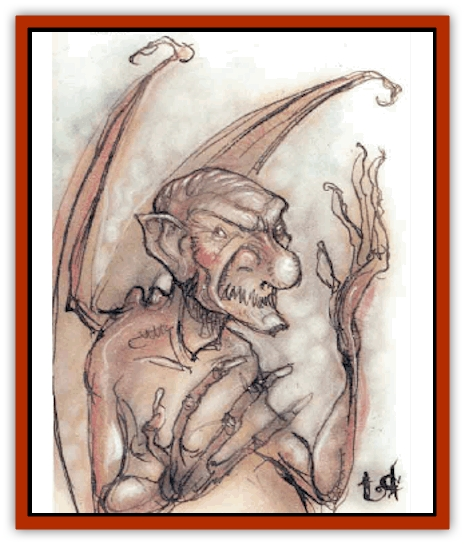

# Mephit VIII - Mist - Steam

| Statistic | **Mist** | **Steam** |
| --- | --- | --- |
| **Activity Cycle:** | Any | Any |
| **Alignment:** | Neutral | Neutral |
| **Armor Class:** | 7 | 7 |
| **Climate/Terrain:** | Any | Any |
| **Damage/Attack:** | 1/1 | 1d4+1/1d4+1 |
| **Diet:** | Special | Special |
| **Frequency:** | Common | Common |
| **Hit Dice:** | 3+2 | 3+3 |
| **Intelligence:** | Average (8-10) | Average (8-10) |
| **Magic Resistance:** | Nil | Nil |
| **Morale:** | Average (8-10) | Average (8-10) |
| **Movement:** | 12, Fl 24 (B) | 12, Fl 24 (B) |
| **No. Appearing:** | 1-10 | 1-10 |
| **No. of Attacks:** | 2 | 2 |
| **Organization:** | Solitary | Solitary |
| **Size:** | M (5' tall) | M (5' tall) |
| **Special Attacks:** | See below | See below |
| **Special Defenses:** | See below | See below |
| **THAC0:** | 17 | 17 |
| **Treasure:** | N | N&times;2 |
| **XP Value:** | 420 | 420 |

Both mist and steam [[Mephit_General_Information|mephits]] originate on the quasielemental Plane of Steam, the only known plane that has spawned two varieties of mephits. Possibly for this reason, the two varieties have developed an intense rivalry bordering on hatred. They insult one another constantly and fight inconclusive skirmishes.

## Mist Mephit

Mist mephits fancy themselves spies of the highest caliber. They quickly report other mephits who show mercy or other treasonous behavior, and they seldom engage in idle banter with other mephits.

Mist mephits can see clearly in fog or mist. Their skin is pale green.

**Combat:** Mist mephits seldom engage in melee unless trapped. Their soft claws inflict 1 hp damage. They can breathe a sickly-green ball of mist every other round, up to three times an hour, that automatically envelops one victim within 10' (save vs. poison or take 1d4+1 points of choking damage and blinded for 1-4 rounds).

Mist mephits can create a *wall of fog* once per day, as a 3rd-level wizard. They can also assume *gaseous form* once per day, and often do so to spy on others or escape combat. Once per hour, a mist mephit can attempt to *gate* in 1-2 other mephits, either [[Mephit_IV_Water_Ice|ice]] or mist. If two arrive, they are the same type.

Powerful winds, including a *gust of wind* spell, cause mist mephits to flee in confusion.

## Steam Mephit

Bossy and hypersensitive, steam mephits are the self-appointed overlords of all mephits and, in their own minds, lords of the quasiplane of Steam. Mist mephits refuse to obey them, and this disobedience has led to a millennia-long rivalry between the types.

In addition to the hissing steam that escapes from their pores, steam mephits leave a trail of near-boiling water where they walk.

**Combat:** Unlike other mephits who delay attacking as long as possible, steam mephits, ruled by oversized egos, ambush even large, well-armed parties. They strike first with their boiling rainstorm, then concentrate their breath weapons on the nearest wizard or priest.

The mephit's two hardened claws cause 1d4 damage each, plus 1 hp heat damage per touch. In addition, the victim is 50% likely to be stunned for one round. These effects are cumulative, so a victim raked twice could be stunned for two rounds.

Steam mephits can breathe a scalding jet of water every other round with a 20' range, automatically hitting one target (1d3 damage, with a 50% chance of stunning the victim for one round).

Once per day a steam mephit can create a rainstorm of boiling water over a 20'x20' area. This storm inflicts 2d6 damage to all victims in the area of effect. Steam mephits can also use *putrefy food &amp; drink* (reverse of *purify food and drink*) once per day to contaminate water.

Once per hour a steam mephit can attempt to *gate* in 1-2 other mephits ([[Mephit_III_Fire_Radiant|fire]], [[Mephit_VII_Magma_Ash|magma]], [[Mephit_I_Air_Smoke|smoke]], or steam). If two arrive, they are the same type.

Steam mephits are immune to fire and heat damage.

**Ecology:** Steam mephits heat confined areas or power small engines.

---
## Discovery & Documentation

**Source Publication:** MC Planescape I (1991)
**Campaign Setting:** Planescape
**Author(s):** various

### Other Creatures Found in This Source Book
   * [[Aasimon_Agathinon|Aasimon, Agathinon]]
   * [[Aasimon_Deva|Aasimon, Deva]]
   * [[Aasimon_Light|Aasimon, Light]]
   * [[Aasimon_General_Information|Aasimon, General Information]]
   * [[Aasimon_Planetar|Aasimon, Planetar]]
   * [[Aasimon_Solar|Aasimon, Solar]]
   * [[Animal_Lord|Animal Lord]]
   * [[Baatezu_Lesser_Abishai|Baatezu, Lesser, Abishai]]
   * [[Baatezu_Greater_Amnizu|Baatezu, Greater, Amnizu]]
   * [[Baatezu_Lesser_Barbazu|Baatezu, Lesser, Barbazu]]
   * [[Baatezu_Greater_Cornugon|Baatezu, Greater, Cornugon]]
   * [[Baatezu_Lesser_Erinyes|Baatezu, Lesser, Erinyes]]
   * [[Baatezu_General_Information|Baatezu, General Information]]
   * [[Baatezu_Greater_Gelugon|Baatezu, Greater, Gelugon]]
   * [[Baatezu_Lesser_Hamatula|Baatezu, Lesser, Hamatula]]
   * [[Baatezu_Lemure|Baatezu, Lemure]]
   * [[Baatezu_Least_Nupperibo|Baatezu, Least, Nupperibo]]
   * [[Baatezu_Lesser_Osyluth|Baatezu, Lesser, Osyluth]]
   * [[Baatezu_Greater_Pit_Fiend|Baatezu, Greater, Pit Fiend]]
   * [[Baatezu_Least_Spinagon|Baatezu, Least, Spinagon]]
   * [[Baku|Baku]]
   * [[Bariaur|Bariaur]]
   * [[Bebilith|Bebilith]]
   * [[Bodak|Bodak]]
   * [[Einheriar|Einheriar]]
   * [[Elemental_Grue_Chaggrin|Elemental Grue, Chaggrin]]
   * [[Elemental_Grue_Harginn|Elemental Grue, Harginn]]
   * [[Elemental_Grue_Ildriss|Elemental Grue, Ildriss]]
   * [[Elemental_Grue_Varrdig|Elemental Grue, Varrdig]]
   * [[Foo_Creature|Foo Creature]]
   * [[Gehreleth|Gehreleth]]
   * [[Githyanki|Githyanki]]
   * [[Githzerai|Githzerai]]
   * [[Hordling|Hordling]]
   * [[Hound_Yeth|Hound, Yeth]]
   * [[Imp|Imp]]
   * [[Incarnate|Incarnate]]
   * [[Larva|Larva]]
   * [[Maelephant|Maelephant]]
   * [[Marut|Marut]]
   * [[Mediator|Mediator]]
   * [[Mephit_General_Information|Mephit, General Information]]
   * [[Mephit_I_Air_Smoke|Mephit I (Air/Smoke)]]
   * [[Mephit_II_Earth_Ooze|Mephit II (Earth/Ooze)]]
   * [[Mephit_III_Fire_Radiant|Mephit III (Fire/Radiant)]]
   * [[Mephit_IV_Water_Ice|Mephit IV (Water/Ice)]]
   * [[Mephit_V_Dust_Salt|Mephit V (Dust/Salt)]]
   * [[Mephit_VI_Lightning_Mineral|Mephit VI (Lightning/Mineral)]]
   * [[Mephit_VII_Magma_Ash|Mephit VII (Magma/Ash)]]
   * [[Night_Hag|Night Hag]]
   * [[Nightmare|Nightmare]]
   * [[Per|Per]]
   * [[Shadow_Fiend|Shadow Fiend]]
   * [[Slaad|Slaad]]
   * [[Tanar'ri_Greater_Babau|Tanar'ri, Greater, Babau]]
   * [[Tanar'ri_Greater_Chasme|Tanar'ri, Greater, Chasme]]
   * [[Tanar'ri_Greater_Nabassu|Tanar'ri, Greater, Nabassu]]
   * [[Tanar'ri_Greater_Wastrilith|Tanar'ri, Greater, Wastrilith]]
   * [[Tanar'ri_Least_Dretch|Tanar'ri, Least, Dretch]]
   * [[Tanar'ri_Least_Manes|Tanar'ri, Least, Manes]]
   * [[Tanar'ri_Least_Rutterkin|Tanar'ri, Least, Rutterkin]]
   * [[Tanar'ri_Lesser_Alu-Fiend|Tanar'ri, Lesser, Alu-Fiend]]
   * [[Tanar'ri_Lesser_Bar-Lgura|Tanar'ri, Lesser, Bar-Lgura]]
   * [[Tanar'ri_Lesser_Cambion|Tanar'ri, Lesser, Cambion]]
   * [[Tanar'ri_Lesser_Succubus|Tanar'ri, Lesser, Succubus]]
   * [[Tanar'ri_Guardian_Molydeus|Tanar'ri, Guardian, Molydeus]]
   * [[Tanar'ri_True_Balor|Tanar'ri, True, Balor]]
   * [[Tanar'ri_True_Glabrezu|Tanar'ri, True, Glabrezu]]
   * [[Tanar'ri_True_Hezrou|Tanar'ri, True, Hezrou]]
   * [[Tanar'ri_True_Marilith|Tanar'ri, True, Marilith]]
   * [[Tanar'ri_True_Nalfeshnee|Tanar'ri, True, Nalfeshnee]]
   * [[Tanar'ri_True_Vrock|Tanar'ri, True, Vrock]]
   * [[Tiefling|Tiefling]]
   * [[Vargouille|Vargouille]]
   * [[Yugoloth_Greater_Arcanaloth|Yugoloth, Greater, Arcanaloth]]
   * [[Yugoloth_Lesser_Dergoloth|Yugoloth, Lesser, Dergoloth]]
   * [[Yugoloth_Lesser_Hydroloth|Yugoloth, Lesser, Hydroloth]]
   * [[Yugoloth_General_Information|Yugoloth, General Information]]
   * [[Yugoloth_Lesser_Mezzoloth|Yugoloth, Lesser, Mezzoloth]]
   * [[Yugoloth_Lesser_Piscoloth|Yugoloth, Lesser, Piscoloth]]
   * [[Yugoloth_Greater_Ultroloth|Yugoloth, Greater, Ultroloth]]
   * [[Yugoloth_Lesser_Yagnoloth|Yugoloth, Lesser, Yagnoloth]]
