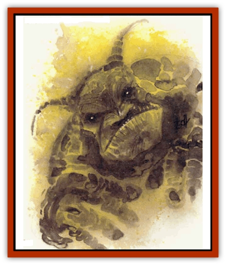

# Mephit VII - Magma - Ash

| Statistic | **Ash** | **Magma** |
| --- | --- | --- |
| **Activity Cycle:** | Any | Any |
| **Alignment:** | Average (8-10) | Low (5-7) |
| **Armor Class:** | 5 | 6 |
| **Climate/Terrain:** | Any | Any |
| **Damage/Attack:** | 1d3/1d3 | 1d8+1/1d8+1 |
| **Diet:** | Special | Special |
| **Frequency:** | Common | Common |
| **Hit Dice:** | 3 | 3 |
| **Intelligence:** | Nil | N |
| **Magic Resistance:** | Nil | Nil |
| **Morale:** | Average (8-10) | Average (8-10) |
| **Movement:** | 12, Fl 24 (B) | 12, Fl 24 (C) |
| **No. Appearing:** | 1 | 1 |
| **No. of Attacks:** | 2 | 2 |
| **Organization:** | Solitary | Solitary |
| **Size:** | M (5' tall) | M (5' tall) |
| **Special Attacks:** | Belaborment | Breath, heat |
| **Special Defenses:** | See below | Regenerates |
| **THAC0:** | 17 | 17 |
| **Treasure:** | Neutral | Neutral |
| **XP Value:** | 420 | 420 |

## Magma Mephit

Magma [[Mephit_General_Information|mephits]], or *lava mephits*, are the least intelligent of all mephits and hence the brunt of [[Mephit_III_Fire_Radiant|fire mephit]] jokes. They are sensitive to these insults and anger easily when offended, but otherwise they are passive and less temperamental than other mephits. They generate extreme heat that can be felt 30' away.

**Combat:** Magma mephit claws are small and soft, causing only 1 hp damage when they hit, but each hit inflicts an additional 1d8 heat damage and automatically melts or burns most nonmagical materials. The rate of destruction varies from three rounds (melting plate armor) to one hour (burning through an inch of wood).

Their breath weapon, usable once every three rounds, is a blob of lava that automatically hits one target within 10' (1d6 damage). A magma mephit can use this weapon eight times, then must recharge for one hour in a lava pool. Mephits in lava regenerate 2 hp per round.

Magma mephits can shapechange into a pool of lava 3' in diameter and six inches deep. This maneuver does not recharge their breath weapon. They take damage normally in pool form.

Once per hour a magma mephit can attempt to *gate* in 1-2 other mephits of [[Mephit_III_Fire_Radiant|fire]], magma, [[Mephit_I_Air_Smoke|smoke]], or [[Mephit_VIII_Mist_Steam|steam]]. If two arrive they are the same type.

Water in large quantities (a barrel or more) causes the magma mephit to harden, halving its movement. However, this releases large quantities of sulfurous steam, necessitating a save vs. poison for any creatures within 10'. Failure causes dizziness and nausea for two rounds, and the victim takes -2 on attack rolls.

## Ash Mephit

Profoundly depressed and lugubrious, ash mephits make adequate sentries and messengers, but they impose upon passersby with endless tales of their sorrows, boredom, and frustrations.

Ash mephits have powdery gray skin and wings ("You're so lucky not to have wings, they get fouled in everything and it's not like I ever asked to fly"), no external ears ("And even so I hear this persistent ringing, a ringing, you know, it just never stops"), and a nasal whining voice ("Am 1 boring you? I'd haaate to think I was boring you"). Scholars suppose that lower-planar beings can create ash mephits more easily than those of other types: why else would anyone create one?

**Combat:** Ash mephits cannot claw or bite, but they can spray a cloud of choking ash in a 10' radius at a cost of 1 hp from their current total (1d6 damage, save vs. breath weapons for half damage).

Once per day an ash mephit can harangue good and neutral creatures with a lengthy recitation of its woes. This works as *Leomund's lamentable belaborment* (It does not work on evil creatures, who care nothing for the mephit's troubles.)

Ash mephits are immune to nonmagical cutting and impaling weapons, to fire, heat, and cold (magical and nonmagical), and to poison. They take double damage from liquid-based attacks, and wind-based attacks inflict maximum damage. They do not breathe.

Once an hour an ash mephit can gate in another ash mephit (usual to commiserate)

---
## Discovery & Documentation

**Source Publication:** MC Planescape I (1991)
**Campaign Setting:** Planescape
**Author(s):** various

### Other Creatures Found in This Source Book
   * [[Aasimon_Agathinon|Aasimon, Agathinon]]
   * [[Aasimon_Deva|Aasimon, Deva]]
   * [[Aasimon_Light|Aasimon, Light]]
   * [[Aasimon_General_Information|Aasimon, General Information]]
   * [[Aasimon_Planetar|Aasimon, Planetar]]
   * [[Aasimon_Solar|Aasimon, Solar]]
   * [[Animal_Lord|Animal Lord]]
   * [[Baatezu_Lesser_Abishai|Baatezu, Lesser, Abishai]]
   * [[Baatezu_Greater_Amnizu|Baatezu, Greater, Amnizu]]
   * [[Baatezu_Lesser_Barbazu|Baatezu, Lesser, Barbazu]]
   * [[Baatezu_Greater_Cornugon|Baatezu, Greater, Cornugon]]
   * [[Baatezu_Lesser_Erinyes|Baatezu, Lesser, Erinyes]]
   * [[Baatezu_General_Information|Baatezu, General Information]]
   * [[Baatezu_Greater_Gelugon|Baatezu, Greater, Gelugon]]
   * [[Baatezu_Lesser_Hamatula|Baatezu, Lesser, Hamatula]]
   * [[Baatezu_Lemure|Baatezu, Lemure]]
   * [[Baatezu_Least_Nupperibo|Baatezu, Least, Nupperibo]]
   * [[Baatezu_Lesser_Osyluth|Baatezu, Lesser, Osyluth]]
   * [[Baatezu_Greater_Pit_Fiend|Baatezu, Greater, Pit Fiend]]
   * [[Baatezu_Least_Spinagon|Baatezu, Least, Spinagon]]
   * [[Baku|Baku]]
   * [[Bariaur|Bariaur]]
   * [[Bebilith|Bebilith]]
   * [[Bodak|Bodak]]
   * [[Einheriar|Einheriar]]
   * [[Elemental_Grue_Chaggrin|Elemental Grue, Chaggrin]]
   * [[Elemental_Grue_Harginn|Elemental Grue, Harginn]]
   * [[Elemental_Grue_Ildriss|Elemental Grue, Ildriss]]
   * [[Elemental_Grue_Varrdig|Elemental Grue, Varrdig]]
   * [[Foo_Creature|Foo Creature]]
   * [[Gehreleth|Gehreleth]]
   * [[Githyanki|Githyanki]]
   * [[Githzerai|Githzerai]]
   * [[Hordling|Hordling]]
   * [[Hound_Yeth|Hound, Yeth]]
   * [[Imp|Imp]]
   * [[Incarnate|Incarnate]]
   * [[Larva|Larva]]
   * [[Maelephant|Maelephant]]
   * [[Marut|Marut]]
   * [[Mediator|Mediator]]
   * [[Mephit_General_Information|Mephit, General Information]]
   * [[Mephit_I_Air_Smoke|Mephit I (Air/Smoke)]]
   * [[Mephit_II_Earth_Ooze|Mephit II (Earth/Ooze)]]
   * [[Mephit_III_Fire_Radiant|Mephit III (Fire/Radiant)]]
   * [[Mephit_IV_Water_Ice|Mephit IV (Water/Ice)]]
   * [[Mephit_V_Dust_Salt|Mephit V (Dust/Salt)]]
   * [[Mephit_VI_Lightning_Mineral|Mephit VI (Lightning/Mineral)]]
   * [[Mephit_VIII_Mist_Steam|Mephit VIII (Mist/Steam)]]
   * [[Night_Hag|Night Hag]]
   * [[Nightmare|Nightmare]]
   * [[Per|Per]]
   * [[Shadow_Fiend|Shadow Fiend]]
   * [[Slaad|Slaad]]
   * [[Tanar'ri_Greater_Babau|Tanar'ri, Greater, Babau]]
   * [[Tanar'ri_Greater_Chasme|Tanar'ri, Greater, Chasme]]
   * [[Tanar'ri_Greater_Nabassu|Tanar'ri, Greater, Nabassu]]
   * [[Tanar'ri_Greater_Wastrilith|Tanar'ri, Greater, Wastrilith]]
   * [[Tanar'ri_Least_Dretch|Tanar'ri, Least, Dretch]]
   * [[Tanar'ri_Least_Manes|Tanar'ri, Least, Manes]]
   * [[Tanar'ri_Least_Rutterkin|Tanar'ri, Least, Rutterkin]]
   * [[Tanar'ri_Lesser_Alu-Fiend|Tanar'ri, Lesser, Alu-Fiend]]
   * [[Tanar'ri_Lesser_Bar-Lgura|Tanar'ri, Lesser, Bar-Lgura]]
   * [[Tanar'ri_Lesser_Cambion|Tanar'ri, Lesser, Cambion]]
   * [[Tanar'ri_Lesser_Succubus|Tanar'ri, Lesser, Succubus]]
   * [[Tanar'ri_Guardian_Molydeus|Tanar'ri, Guardian, Molydeus]]
   * [[Tanar'ri_True_Balor|Tanar'ri, True, Balor]]
   * [[Tanar'ri_True_Glabrezu|Tanar'ri, True, Glabrezu]]
   * [[Tanar'ri_True_Hezrou|Tanar'ri, True, Hezrou]]
   * [[Tanar'ri_True_Marilith|Tanar'ri, True, Marilith]]
   * [[Tanar'ri_True_Nalfeshnee|Tanar'ri, True, Nalfeshnee]]
   * [[Tanar'ri_True_Vrock|Tanar'ri, True, Vrock]]
   * [[Tiefling|Tiefling]]
   * [[Vargouille|Vargouille]]
   * [[Yugoloth_Greater_Arcanaloth|Yugoloth, Greater, Arcanaloth]]
   * [[Yugoloth_Lesser_Dergoloth|Yugoloth, Lesser, Dergoloth]]
   * [[Yugoloth_Lesser_Hydroloth|Yugoloth, Lesser, Hydroloth]]
   * [[Yugoloth_General_Information|Yugoloth, General Information]]
   * [[Yugoloth_Lesser_Mezzoloth|Yugoloth, Lesser, Mezzoloth]]
   * [[Yugoloth_Lesser_Piscoloth|Yugoloth, Lesser, Piscoloth]]
   * [[Yugoloth_Greater_Ultroloth|Yugoloth, Greater, Ultroloth]]
   * [[Yugoloth_Lesser_Yagnoloth|Yugoloth, Lesser, Yagnoloth]]
