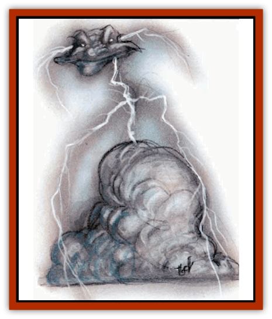

# Mephit VI - Lightning - Mineral

| Statistic | **Lightning** | **Mineral** |
| --- | --- | --- |
| **Activity Cycle:** | Any | Any |
| **Alignment:** | Neutral | Neutral |
| **Armor Class:** | 4 | 4 |
| **Climate/Terrain:** | Any | Any |
| **Damage/Attack:** | 1d3/1d3 | 1d4/1d4 |
| **Diet:** | Special | Nil |
| **Frequency:** | Common | Common |
| **Hit Dice:** | 3 | 3+2 |
| **Intelligence:** | Average (8-10) | Average (8-10) |
| **Magic Resistance:** | Nil | Nil |
| **Morale:** | Average (8-10) | Average (8-10) |
| **Movement:** | 12, Fl 36 (C) | 12, Fl 24 (C) |
| **No. Appearing:** | 1-20 | 1-20 |
| **No. of Attacks:** | 2 | 2 |
| **Organization:** | Solitary/band | Solitary |
| **Size:** | M (5' tall) | M (5' tall) |
| **Special Attacks:** | <i>Lightning bolt</i> | <i>Glitterdust</i> |
| **Special Defenses:** | See below | See below |
| **THAC0:** | 7 | 17 |
| **Treasure:** | Nil | N |
| **XP Value:** | 420 | 420 |

## Lightning Mephit

A lightning [[Mephit_General_Information|mephit]]'s torso and limbs are thin, jagged bolts of black lightning; its hands and feet are oversized, bulbous, and white. Its earless head smells like ozone and glows with a permanent *light* spell-like effect that cannot be dispelled; this expires when the mephit dies.

A lightning mephit has no wings. It races through the air like a lightning bolt, the fastest of all mephits. Unfortunately, it maneuvers poorly.

Lightning mephits are energetic, even hyperactive, with an incessant curiosity and desire for activity. They talk very, very fast, with many mistakes, false starts, and malapropisms.

**Combat:** Lightning mephits dislike combat and prefer to befriend opponents. They have no claws but have the spelllike ability to cast a *lightning bolt* three times a day. Unlike the wizard spell, this bolt does 3d6 damage automatically to one target within 80'. A mephit can cast additional bolts, but each extra bolt damages the mephit (2 hp from its current total per bolt cast).

Once per hour a lightning mephit can attempt to *gate* in 1-4 more lightning mephits.

Attacks with nonmagical metal weapons on a lightning mephit do it no harm but may harm the attacker (save vs. paralysis or take 1d3 shock damage). Lightning mephits are immune to fire, heat, and electrical damage of all kinds, but dousing with liquid (at least a gallon) destroys them in a flash (3 hp damage to everyone in a 5' radius).

Lightning mephits instantly regenerate all damage on contact with an electrical source, such as another mephit's lightning bolt. This reinforces the mephit's natural desire to congregate with others of its kind. A force of mephits that can recharge one another is unstoppable by anything short of a glass of water.

## Mineral Mephit

These thickly-built mephits look like [[Mephit_II_Earth_Ooze|earth mephits]]. Their skin and wings glitter with ground mica. The rigid metallic wings have no obvious function in the mephit's magical flight. Like their earthy kin, mineral mephits are clumsy in flight. They have no odor.

These suspicious, greedy, and self-righteous mephits show an attitude common in their native plane of Minerals: They style themselves guards of all treasure, whether or not they own it.

**Combat:** Mineral mephits attack with two claws (1d4 damage each). Their breath weapon works as *glitterdust* (no range, 10' radius) three times a day at 3rd level of magic use. They can move through stone walls less than a foot thick as though insubstantial.

Once per hour, mineral mephits can attempt to gate in 1-2 other mephits, either [[Mephit_II_Earth_Ooze|earth]] or mineral. If two arrive, they are the same type.

Mineral mephits do not breathe and are immune to gas attacks of all kinds. Vacuum and nonmagical impaling weapons do no damage. *Passwall* or *transmute rock to mud* destroys them instantly.

Mineral mephits regenerate 1 hp per turn in contact with stone. Gems and jewelry also restore hit points but are consumed in the process, 10 gp of value lost per hp restored.

---
## Discovery & Documentation

**Source Publication:** MC Planescape I (1991)
**Campaign Setting:** Planescape
**Author(s):** various

### Other Creatures Found in This Source Book
   * [[Aasimon_Agathinon|Aasimon, Agathinon]]
   * [[Aasimon_Deva|Aasimon, Deva]]
   * [[Aasimon_Light|Aasimon, Light]]
   * [[Aasimon_General_Information|Aasimon, General Information]]
   * [[Aasimon_Planetar|Aasimon, Planetar]]
   * [[Aasimon_Solar|Aasimon, Solar]]
   * [[Animal_Lord|Animal Lord]]
   * [[Baatezu_Lesser_Abishai|Baatezu, Lesser, Abishai]]
   * [[Baatezu_Greater_Amnizu|Baatezu, Greater, Amnizu]]
   * [[Baatezu_Lesser_Barbazu|Baatezu, Lesser, Barbazu]]
   * [[Baatezu_Greater_Cornugon|Baatezu, Greater, Cornugon]]
   * [[Baatezu_Lesser_Erinyes|Baatezu, Lesser, Erinyes]]
   * [[Baatezu_General_Information|Baatezu, General Information]]
   * [[Baatezu_Greater_Gelugon|Baatezu, Greater, Gelugon]]
   * [[Baatezu_Lesser_Hamatula|Baatezu, Lesser, Hamatula]]
   * [[Baatezu_Lemure|Baatezu, Lemure]]
   * [[Baatezu_Least_Nupperibo|Baatezu, Least, Nupperibo]]
   * [[Baatezu_Lesser_Osyluth|Baatezu, Lesser, Osyluth]]
   * [[Baatezu_Greater_Pit_Fiend|Baatezu, Greater, Pit Fiend]]
   * [[Baatezu_Least_Spinagon|Baatezu, Least, Spinagon]]
   * [[Baku|Baku]]
   * [[Bariaur|Bariaur]]
   * [[Bebilith|Bebilith]]
   * [[Bodak|Bodak]]
   * [[Einheriar|Einheriar]]
   * [[Elemental_Grue_Chaggrin|Elemental Grue, Chaggrin]]
   * [[Elemental_Grue_Harginn|Elemental Grue, Harginn]]
   * [[Elemental_Grue_Ildriss|Elemental Grue, Ildriss]]
   * [[Elemental_Grue_Varrdig|Elemental Grue, Varrdig]]
   * [[Foo_Creature|Foo Creature]]
   * [[Gehreleth|Gehreleth]]
   * [[Githyanki|Githyanki]]
   * [[Githzerai|Githzerai]]
   * [[Hordling|Hordling]]
   * [[Hound_Yeth|Hound, Yeth]]
   * [[Imp|Imp]]
   * [[Incarnate|Incarnate]]
   * [[Larva|Larva]]
   * [[Maelephant|Maelephant]]
   * [[Marut|Marut]]
   * [[Mediator|Mediator]]
   * [[Mephit_General_Information|Mephit, General Information]]
   * [[Mephit_I_Air_Smoke|Mephit I (Air/Smoke)]]
   * [[Mephit_II_Earth_Ooze|Mephit II (Earth/Ooze)]]
   * [[Mephit_III_Fire_Radiant|Mephit III (Fire/Radiant)]]
   * [[Mephit_IV_Water_Ice|Mephit IV (Water/Ice)]]
   * [[Mephit_V_Dust_Salt|Mephit V (Dust/Salt)]]
   * [[Mephit_VII_Magma_Ash|Mephit VII (Magma/Ash)]]
   * [[Mephit_VIII_Mist_Steam|Mephit VIII (Mist/Steam)]]
   * [[Night_Hag|Night Hag]]
   * [[Nightmare|Nightmare]]
   * [[Per|Per]]
   * [[Shadow_Fiend|Shadow Fiend]]
   * [[Slaad|Slaad]]
   * [[Tanar'ri_Greater_Babau|Tanar'ri, Greater, Babau]]
   * [[Tanar'ri_Greater_Chasme|Tanar'ri, Greater, Chasme]]
   * [[Tanar'ri_Greater_Nabassu|Tanar'ri, Greater, Nabassu]]
   * [[Tanar'ri_Greater_Wastrilith|Tanar'ri, Greater, Wastrilith]]
   * [[Tanar'ri_Least_Dretch|Tanar'ri, Least, Dretch]]
   * [[Tanar'ri_Least_Manes|Tanar'ri, Least, Manes]]
   * [[Tanar'ri_Least_Rutterkin|Tanar'ri, Least, Rutterkin]]
   * [[Tanar'ri_Lesser_Alu-Fiend|Tanar'ri, Lesser, Alu-Fiend]]
   * [[Tanar'ri_Lesser_Bar-Lgura|Tanar'ri, Lesser, Bar-Lgura]]
   * [[Tanar'ri_Lesser_Cambion|Tanar'ri, Lesser, Cambion]]
   * [[Tanar'ri_Lesser_Succubus|Tanar'ri, Lesser, Succubus]]
   * [[Tanar'ri_Guardian_Molydeus|Tanar'ri, Guardian, Molydeus]]
   * [[Tanar'ri_True_Balor|Tanar'ri, True, Balor]]
   * [[Tanar'ri_True_Glabrezu|Tanar'ri, True, Glabrezu]]
   * [[Tanar'ri_True_Hezrou|Tanar'ri, True, Hezrou]]
   * [[Tanar'ri_True_Marilith|Tanar'ri, True, Marilith]]
   * [[Tanar'ri_True_Nalfeshnee|Tanar'ri, True, Nalfeshnee]]
   * [[Tanar'ri_True_Vrock|Tanar'ri, True, Vrock]]
   * [[Tiefling|Tiefling]]
   * [[Vargouille|Vargouille]]
   * [[Yugoloth_Greater_Arcanaloth|Yugoloth, Greater, Arcanaloth]]
   * [[Yugoloth_Lesser_Dergoloth|Yugoloth, Lesser, Dergoloth]]
   * [[Yugoloth_Lesser_Hydroloth|Yugoloth, Lesser, Hydroloth]]
   * [[Yugoloth_General_Information|Yugoloth, General Information]]
   * [[Yugoloth_Lesser_Mezzoloth|Yugoloth, Lesser, Mezzoloth]]
   * [[Yugoloth_Lesser_Piscoloth|Yugoloth, Lesser, Piscoloth]]
   * [[Yugoloth_Greater_Ultroloth|Yugoloth, Greater, Ultroloth]]
   * [[Yugoloth_Lesser_Yagnoloth|Yugoloth, Lesser, Yagnoloth]]
