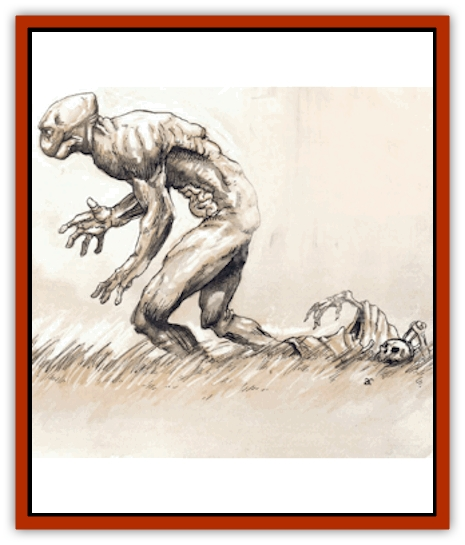

# Mercurial

| Statistic | **Mercurial** |
| --- | --- |
| **Activity Cycle:** | Any |
| **Alignment:** | Neutral |
| **Armor Class:** | -2 [0] |
| **Climate/Terrain:** | Hyper-reality |
| **Damage/Attack:** | 1d8+1/1d8+1 [2d8+2/2d8+2] |
| **Diet:** | Special |
| **Frequency:** | Very rare |
| **Hit Dice:** | 14 |
| **Intelligence:** | Supra-Genius (19-20) |
| **Magic Resistance:** | 20% |
| **Morale:** | Steady (11-12) |
| **Movement:** | 15 [30] |
| **No. Appearing:** | 1 [1d6] |
| **No. of Attacks:** | 2 |
| **Organization:** | Solitary (family) |
| **Size:** | M (5-6'tall) |
| **Special Attacks:** | Borrow form, mental blast [wish] |
| **Special Defenses:** | Nil [+1 magical weapon or better to hit, regeneration] |
| **THAC0:** | 7 |
| **Treasure:** | None |
| **XP Value:** | 9,000 [26,000] |

[Items in brackets reflect hyper-reality. The XP award becomes 22,000 in hyper-reality if the mercurial is wearing the *manacles of lesser reality*.]

Some bloods know that the reality every berk is used to isn't the only reality. There're realities that have less substance, and there're realities that're more intense, *more real*, than the multiverse most bodies are familiar with. These different levels of reality have their own rules, characteristics, and inhabitants, though these rarely have any affect on the multiverse at large.

 One of these higher realities (called *hyper-realities* by bloods who know the music) occupies a corner of Mount Celestia, where the realm of Beldaari shines with an intensity that's blinding to the lesser beings of the multiverse. In this realm, an unnamed power of pure thought contemplates ideas and concepts that are unfathomable to even the greatest sages of normal reality. This power is served by mercurials, an intelligent race of human-like beings attuned to the rules of hyper-reality.

In his natural form, a mercurial is indistinguishable from a normal human. He's of normal human height and build, has flesh tones in the normal range, and even his hair color falls within hues that are natural on a hundred different Prime worlds. In fact, the only difference that marks a mercurial from a human is his eyes, which are orbs of liquid metal, either fiery gold, scintillating silver, or shifting bronze.

Where a mercurial truly differs from a human is in his ability to shed his skin and bones; his inner flesh and organs can exist apart from the rest of his body. In Beldaari, the mercurial steps out of his skin to physically and symbolically leave behind his corporeal anchor and commune with his god. It's their physiological attempt at leaving behind the things of the flesh to get closer to pure, unencumbered thought.

Mercurials can vocalize any language (their mental abilities allowing them to learn a new language by plucking it right out of someone's mind), but they prefer to simply project and receive thoughts.

**Combat:** Most mercurials are pacifists, refusing to fight even to defend themselves. If threatened, a mercurial can *wish* himself to safety and avoid the fight. When forced into battle, a mercurial can strike with both fists in a single round, delivering damage with each one. If a mercurial has shed his skin and bones, each his inner flesh and outer flesh have the creature's total hit points. Whiie the inner flesh can be damaged, it continues to regenerate (see below) until the outer flesh and bones are destroyed (which completely kills the mercurial).

*Borrow Form* - Not only can a mercurial shed his skin and bones, he can then merge his inner flesh and organs with another being. Most mercurials "borrow" another's form to experience life through that being's senses. They never borrow a form without permission, and they never stay long enough to cause serious harm. A host gets a saving throw vs. petrification to resist the merge. If the merge is successful, the host loses Id4 points of Constitution per turn and must make a saving throw vs. petrification when the mercurial sheds the host's form. A successful saving throw indicates that the host will recover the lost Constitution points at a rate of one point per day. A failure indicates that the reduction in Constitution is permanent (unless restored through magical means). Any host reduced to zero Constitution points dies.

*Mental Blast* - If necessary, a mercurial can project a powerful blast of pure thought at an enemy. This mental blast inflicts 1d12+2 points of damage on a target (who can save vs. rod for half damage).

*Wish* - In hyper-reality, a mercurial's every thought can become real. This is reflected in their ability to mentally "cast" a *wish* spell once per turn.

*Immunity to Normal Weapons* - In hyper-reality, a mercurial can be damaged only by weapons with a +1 enchantment or better. Normal weapons inflict no damage.

*Regeneration* - A mercurial's inner flesh and organs regenerate damage at a rate of 3 hit points per round. If merged with his skin and bones, the entire mercurial heals in this manner. If the skin and bones (or the merged mercurial) are reduced to 0 hit points, the mercurial dies.

**Habitat/Society:** Mercurials live in the fourth level of reality, a state of existence called hyper-reality. In hyper-reality, everything has more vitality: Colors are brighter, scents are stronger, sounds are more intense, and emotions are more stirring. To reflect this, all damage rolls and movement rates are doubled; range, duration, effect, and area of effect of all spells are doubled; and experience points are calculated at double the normal rate.

Beldaari, the realm of the mercurials, is a huge forest specifically designed by its power to be a refuge of peace and quiet where all its inhabitants can contemplate and reflect on pure thoughts. The mercurials contemplate separately, but come together in family units whenever they return to their skin and bones. In Beldaari, mercurials are usually encountered while they are contemplating some great thought or another, resting beside a river or beneath the shade of a tree.

**Ecology:** While mercurials can eat most vegetables and meats, they usually draw nourishment by shedding their bodies and communing with the mental force of their god.

---
## Discovery & Documentation

**Source Publication:** Monstrous Compendium, 1997 Annual, Volume 4 (1995)
**Campaign Setting:** Advanced Dungeons & Dragons 2nd Edition
**Author(s):** Jon Pickens

### Other Creatures Found in This Source Book
   * [[Anemone_Giant_Sea|Anemone, Giant Sea]]
   * [[Asperii|Asperii]]
   * [[Bainligor|Bainligor]]
   * [[Beast_of_Chaos|Beast of Chaos]]
   * [[Blindheim|Blindheim]]
   * [[Bloodsipper_Far_Realm|Bloodsipper (Far Realm)]]
   * [[Bulette_Gohlbrorn|Bulette, Gohlbrorn]]
   * [[Child_of_the_Sea|Child of the Sea]]
   * [[Clockwork_Horror|Clockwork Horror]]
   * [[Clockwork_Swordsman|Clockwork Swordsman]]
   * [[Coral|Coral]]
   * [[Darklore|Darklore]]
   * [[Dharculus|Dharculus]]
   * [[Dolphin_Athas|Dolphin (Athas)]]
   * [[Dragon_Neutral_Moonstone|Dragon, Neutral, Moonstone]]
   * [[Dragon_Prismatic|Dragon, Prismatic]]
   * [[Dream_Stalker|Dream Stalker]]
   * [[Dragon-kin_Albino_Wyrm|Dragon-kin, Albino Wyrm]]
   * [[Echyan|Echyan]]
   * [[Firestar|Firestar]]
   * [[Firetail|Firetail]]
   * [[Fish_Ascallion|Fish, Ascallion]]
   * [[Fish_Deep_Ocean|Fish, Deep Ocean]]
   * [[Fish_Tropical|Fish, Tropical]]
   * [[Fish_Vurgens|Fish, Vurgens]]
   * [[Fogwarden|Fogwarden]]
   * [[Fraal|Fraal]]
   * [[Giant_Crag|Giant, Crag]]
   * [[Gibberling_Brood|Gibberling, Brood]]
   * [[Glutton_Sea|Glutton, Sea]]
   * [[Golden_Ammonite|Golden Ammonite]]
   * [[Golem_Brass_Minotaur|Golem, Brass Minotaur]]
   * [[Golem_Gemstone|Golem, Gemstone]]
   * [[Golem_Maggot|Golem, Maggot]]
   * [[Groundling|Groundling]]
   * [[Hermit_Sea|Hermit, Sea]]
   * [[Hound_of_Law|Hound of Law]]
   * [[Human_Amazon|Human, Amazon]]
   * [[Human_Pygmy|Human, Pygmy]]
   * [[Inquisitor|Inquisitor]]
   * [[Kercpa|Kercpa]]
   * [[Kreel|Kreel]]
   * [[Lycanthrope_Lythari|Lycanthrope, Lythari]]
   * [[Mold_Chromatic|Mold, Chromatic]]
   * [[Mummy_Bog|Mummy, Bog]]
   * [[Neh-thalggu|Neh-thalggu]]
   * [[Nymph_Grain|Nymph, Grain]]
   * [[Nymph_Unseelie|Nymph, Unseelie]]
   * [[Octopus_Octo-Jelly|Octopus, Octo-Jelly]]
   * [[Puddingfish|Puddingfish]]
   * [[Sea_Demon|Sea Demon]]
   * [[Shade|Shade]]
   * [[Shadowrath|Shadowrath]]
   * [[Shark_Athas|Shark (Athas)]]
   * [[Siren_Ravenloft|Siren (Ravenloft)]]
   * [[Skeleton_Variant|Skeleton, Variant]]
   * [[Skyfish|Skyfish]]
   * [[Spectral_Scion|Spectral Scion]]
   * [[Spyder_Fiend|Spyder Fiend]]
   * [[Squid_Squark|Squid, Squark]]
   * [[Tanar'ri_Lesser_Uridezu|Tanar'ri, Lesser, Uridezu]]
   * [[Troll_Mutate|Troll Mutate]]
   * [[Vaati|Vaati]]
   * [[Vampire_Cerebral|Vampire, Cerebral]]
   * [[Varkha|Varkha]]
   * [[Wizshade|Wizshade]]
   * [[Worm_Lukhorn|Worm, Lukhorn]]
   * [[Wyste|Wyste]]
   * [[Yugoloth_Lesser_Gacholoth|Yugoloth, Lesser, Gacholoth]]
   * [[Zombie_Mud|Zombie, Mud]]
