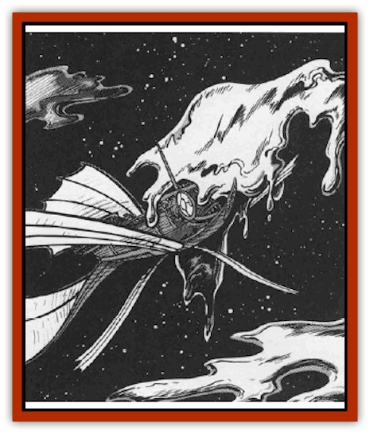

# Mercurial Slime

| Statistic | **Mercurial Slime** |
| --- | --- |
| **Activity Cycle:** | Any |
| **Alignment:** | Neutral |
| **Armor Class:** | 2 |
| **Climate/Terrain:** | Wildspace |
| **Damage/Attack:** | 5d10 |
| **Diet:** | Omnivore |
| **Frequency:** | Very rare |
| **Hit Dice:** | 4 |
| **Intelligence:** | Non- (0) |
| **Magic Resistance:** | Nil |
| **Morale:** | Fearless (20) |
| **Movement:** | 3, Fl 48 (E), SR 2 |
| **No. Appearing:** | 1-4 |
| **No. of Attacks:** | 1 |
| **Organization:** | Colony |
| **Size:** | L (10'+ diameter) |
| **Special Attacks:** | Nil |
| **Special Defenses:** | Nil |
| **THAC0:** | 17 |
| **Treasure:** | Nil |
| **XP Value:** | 420 |

The mercurial slime is widely feared by wildspace sailors as a mindless, swift, and deadly organism.

A colony of mercurial slime resembles a large blob of silver liquid drifting aimlessly in space. Several colonies can be found together, though no closer than 30' apart. As a result, only one colony at a time attacks a ship, though other mercurial slimes may block escape routes.

Mercurial slime has no sensory organs, but it can follow sound waves to their source. It is also attracted to light. When the slime is in an atmosphere, it can sense motion by disturbances in the air.

**Combat:** Mercurial slime is pervaded with strong acid that works much like blood and digestive fluids do in a human, dissolving nutrients and carrying them to individual cells. If the acid contacts living flesh, it dissolves the skin, causing 5d10 damage. All inorganic matter must save vs. acid at a -2 penalty. Weapons that hit the slime must save before they roll damage. If a weapon fails, it dissolves, causing no damage.

Mercurial slime is most hazardous when it contacts a spelljamming ship. Should a vessel touch mercurial slime, it must save vs. acid. If the ship fails, the mercurial slime makes a standard attack roll. Its acid damages the ship like a heavy ballista.

Sometimes the slime's silver surface catches starlight and reflects it back in lovely color patterns. Anyone staring at this display is mesmerized as if by *hypnotic pattern* cast at 4th level. Nothing frees the mesmerized viewer except a violent shaking for one round.

Mercurial slime is not organic. Thus it cannot be affected by spells that control nature, such as *charm plant* or *charm animal*. Fire, cold, and electrical attacks have no effect. However, mercurial slime is susceptible to *magic missile* spells.

**Habitat/Society:** Mercurial slime is unintelligent and has no society or organization beyond the colony. It merely drifts through space, seeking to feed. It cannot communicate.

**Ecology:** The organism reproduces by fission while it is dissolving living tissue. There is a straight 1% chance that the slime reproduces after each hit against an organic target. The slime splits into two creatures, the victim takes an extra 5d10 damage, and the two creatures reach full size instantly.

Mercurial slime converts light, including starlight, into propulsive energy. It can attain spelljamming speeds. Mercurial slime does not need air to survive, but it cannot land on planets, since gravity breaks it up into a fine mist which dissolves rapidly into nothing.

Enterprising folk have attempted to use the slime as an organic spelljamming source. The big problem with this plan: The mercurial slime attacks any container holding it, requiring a saving throw at -2 (cumulative) vs. acid each round.

Alchemists have tried in vain to collect mercurial slime to create a powerful acid, but the stuff keeps eating through vials and containers.

Some sages theorize that mercurial slime is in fact nothing more than a groundling slime or jelly carried into space and somehow altered. Others call it a plague sent by deities who do not wish to see the races ply the spacelanes. It is interesting (and reassuring) that no clerics endorse this theory. Some elven scholars guess that mercurial slime may be a weapon from the Unhuman Wars.

---
## Discovery & Documentation

**Source Publication:** MC9 Spelljammer Appendix II (1991)
**Campaign Setting:** Planescape
**Author(s):** Scott Davis, Newton Ewell, John Terra

### Other Creatures Found in This Source Book
   * [[Alchemy_Plant|Alchemy Plant]]
   * [[Allura|Allura]]
   * [[Aperusa|Aperusa]]
   * [[Autognome|Autognome]]
   * [[Bionoid|Bionoid]]
   * [[Bloodsac|Bloodsac]]
   * [[Buzzjewel|Buzzjewel]]
   * [[Constellate|Constellate]]
   * [[Contemplator|Contemplator]]
   * [[Dohwar|Dohwar]]
   * [[Dragon_Moon|Dragon, Moon]]
   * [[Dragon_Stellar|Dragon, Stellar]]
   * [[Dragon_Sun|Dragon, Sun]]
   * [[Dreamslayer|Dreamslayer]]
   * [[Dweomerborn|Dweomerborn]]
   * [[Fal|Fal]]
   * [[Feesu|Feesu]]
   * [[Fire_Bat|Fire Bat]]
   * [[Firebird|Firebird]]
   * [[Firelich|Firelich]]
   * [[Flowfiend|Flowfiend]]
   * [[Gadabout|Gadabout]]
   * [[Gammaroid|Gammaroid]]
   * [[Gonn|Gonn]]
   * [[Gossamer|Gossamer]]
   * [[Grav|Grav]]
   * [[Great_Dreamer|Great Dreamer]]
   * [[Greatswan|Greatswan]]
   * [[Grell_Colonial|Grell, Colonial]]
   * [[Gullion|Gullion]]
   * [[Insectare|Insectare]]
   * [[Lhee|Lhee]]
   * [[Meteorspawn|Meteorspawn]]
   * [[Monitor|Monitor]]
   * [[Owl_Space|Owl, Space]]
   * [[Pristatic|Pristatic]]
   * [[Scro|Scro]]
   * [[Selkie_Star|Selkie, Star]]
   * [[Silatic|Silatic]]
   * [[Skullbird|Skullbird]]
   * [[Sleek|Sleek]]
   * [[Sluk|Sluk]]
   * [[Space_Swine|Space Swine]]
   * [[Sphinx_Astro-|Sphinx, Astro-]]
   * [[Spirit_Warrior|Spirit Warrior]]
   * [[Starfly_Plant|Starfly Plant]]
   * [[Stargazer|Stargazer]]
   * [[Undead_Stellar|Undead, Stellar]]
   * [[Witchlight_Marauder|Witchlight Marauder]]
   * [[Xixchil|Xixchil]]
   * [[Yitsan|Yitsan]]
   * [[Zurchin|Zurchin]]
