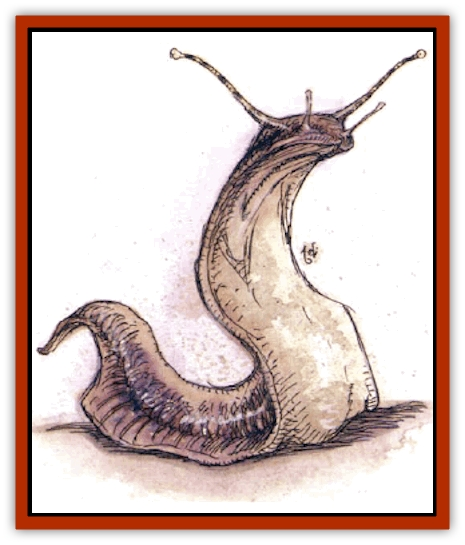

# Metalmaster

| Statistic | **Metalmaster** |
| --- | --- |
| **Activity Cycle:** | Any |
| **Alignment:** | Chaotic neutral |
| **Armor Class:** | 6 |
| **Climate/Terrain:** | Any land |
| **Damage/Attack:** | 3d4 |
| **Diet:** | Carnivore, scavenger |
| **Frequency:** | Very rare |
| **Hit Dice:** | 4+4 to 6+6 |
| **Intelligence:** | Low (5-7) |
| **Magic Resistance:** | Nil |
| **Morale:** | Elite (13-14) |
| **Movement:** | 12 |
| **No. Appearing:** | 1 or 1d4 |
| **No. of Attacks:** | 1 |
| **Organization:** | Solitary or hunting group |
| **Size:** | H (12-25' long) |
| **Special Attacks:** | Magnetism |
| **Special Defenses:** | See below |
| **THAC0:** | 4+4 or 5+5: 15 / 6+6: 13 |
| **Treasure:** | Nil |
| **XP Value:** | 4+4: 650 / 5+5: 975 / 6+6: 1,400 |

The metalmaster (or sword slug) is a large, leather-skinned sluglike monster, dull purple to rust-red in hue (rarely, smoky-gray or black), with large sawlike teeth that can bite through metal.

A sword slug can mimic vocal sounds previously made in its presence. It uses these to lure prey, but its low intelligence often causes it to emit the wrong sound for the situation.

**Combat:** A metalmaster generates powerful magnetic fields at will, effective to 30 feet (60 feet if affecting an existing magnetic field). It affects enchanted and normal metal equally, but does not influence traces of metal in rock or unrefined ores. In one round the metalmaster can attract or repel, then instantly stop or switch between attraction and repulsion at the round's end.

Attraction draws small, unsecured metallic objects toward the slug (small, secured objects may be taken if the devices holding them fail to save vs. crushing blow). Attracted objects smaller than a sword or medium-sized shield are pulled at the rate of 20 feet per round; larger unsecured objects are dragged 5-10 feet per round, and if secured (or are as massive as a large anvil or a metal throne), can't be shifted. Magically held or secured objects can't be moved, and magical barriers (such as a *wall of force*) stop moving items.

Repulsion deflects even partially metallic missiles so they don't hit intended targets. Metal-armored beings must make a successful strength check each round or be forced at least 10 feet away from the slug; those who only wear or carry metal weapons, coins, belt buckles, and the like also must make a successful Strengh check (with a bonus to the roll determined by the DM) or be likewise affected. Grasped metallic items suffer -4 attack penalties while repulsed, and the wielder must make a successful Strength check or the object tears free.

A metalmaster's power can't be avoided by the use of *blink*, *jump*, or similar spells, and it extends into the Ethereal Plane (though *dimension door* and similar magic does allow escape). The slug's magnetic field causes no damage by itself, but affects weapons often strike unintended targets.

Attracted objects never strike its body, but orbit around it. In the 10 feet closest to a slug's body (and up to 30 feet away), a whirling storm of metal rages, akin to a *blade barrier* spell. Creatures in this area suffer 4d6 points of damage each round unless they are magically shielded. A successful Dexterity check allows them to sustain only 2d6 points of damage.

A metalmaster's teeth can shear through hardened armor, but it does not otherwise harm metal. Metal pieces accidentally ingested do it no harm, but a sword slug doesn't eat metal.

Metalmasters can climb steep grades (but not vertical walls or smooth inclines), can see with 90-foot infravision, and they can sense the direction and approximate distance of fist-sized or larger pieces of metal up to 40 feet distant. Given sufficient food, they regenerate rapidly. Lost hit points are regained at the rate of 1 per turn, and a severed eyestalk might regenerate in a day or two.

**Habitat/Society:** Metalmasters have been known to live a century or more. They are usually solitary, banding together to hunt in dangerous areas and withdrawing into deep tunnels or muddy bogs to mate, choosing inhospitable places so that few will disturb them. Sword slugs lair near metal if they can, and favor small, narrow tunnels. They often lurk near hoards of metallic treasure, which attracts prey and provides the metalmaster with ready-made missiles for combat.

**Ecology:** Metalmasters prefer to eat large, red-blooded prey (such as livestock and adult humans), but in a pinch will eat almost any living creature or carrion. The flesh of a metalmaster is so bitter that only carrion-eaters will feed upon it. Alchemists and mages have experimented with metalmaster ichor and flesh, but have not thus far found a use for them.

---
## Discovery & Documentation

**Source Publication:** Monstrous Compendium, 1994 Annual, Volume 1 (1995)
**Campaign Setting:** Advanced Dungeons & Dragons 2nd Edition
**Author(s):** David Wise

### Other Creatures Found in This Source Book
   * [[Abyss_Ant|Abyss Ant]]
   * [[Achaierai|Achaierai]]
   * [[Afanc|Afanc]]
   * [[Al-Jahar|Al-Jahar]]
   * [[Baelnorn|Baelnorn]]
   * [[Baneguard|Baneguard]]
   * [[Banelar|Banelar]]
   * [[Bird_Talking|Bird, Talking]]
   * [[Blazing_Bones|Blazing Bones]]
   * [[Campestri|Campestri]]
   * [[Caniquine|Caniquine]]
   * [[Cat_Winged|Cat, Winged]]
   * [[Crypt_Servant|Crypt Servant]]
   * [[Death's_Head_Tree|Death's Head Tree]]
   * [[Dog_Saluqi|Dog, Saluqi]]
   * [[Dragon_Electrum|Dragon, Electrum]]
   * [[Dragon_Fang|Dragon, Fang]]
   * [[Dragon_Linnorm_Corpse_Tearer|Dragon, Linnorm, Corpse Tearer]]
   * [[Dragon_Linnorm_Dread|Dragon, Linnorm, Dread]]
   * [[Dragon_Linnorm_Flame|Dragon, Linnorm, Flame]]
   * [[Dragon_Linnorm_Forest|Dragon, Linnorm, Forest]]
   * [[Dragon_Linnorm_Frost|Dragon, Linnorm, Frost]]
   * [[Dragon_Linnorm_Gray|Dragon, Linnorm, Gray]]
   * [[Dragon_Linnorm_Land|Dragon, Linnorm, Land]]
   * [[Dragon_Linnorm_Midgard|Dragon, Linnorm, Midgard]]
   * [[Dragon_Linnorm_Rain|Dragon, Linnorm, Rain]]
   * [[Dragon_Linnorm_Sea|Dragon, Linnorm, Sea]]
   * [[Dragon_Neutral_Jacinth|Dragon, Neutral, Jacinth]]
   * [[Dragon_Neutral_Jade|Dragon, Neutral, Jade]]
   * [[Dragon_Neutral_Pearl|Dragon, Neutral, Pearl]]
   * [[Dread|Dread]]
   * [[Dragon-kin|Dragon-kin]]
   * [[Elemental_Earth_Kin_Chrysmal|Elemental, Earth Kin, Chrysmal]]
   * [[Elemental_Earth_Kin_Earth_Weird|Elemental, Earth Kin, Earth Weird]]
   * [[Elemental_Fire_Kin_Azer|Elemental, Fire Kin, Azer]]
   * [[Elemental_Sandman|Elemental, Sandman]]
   * [[Elemental_Wind_Walker|Elemental, Wind Walker]]
   * [[Elemental_Vermin|Elemental Vermin]]
   * [[Feystag|Feystag]]
   * [[Flame_Skull|Flame Skull]]
   * [[Foulwing|Foulwing]]
   * [[Gambado|Gambado]]
   * [[Garbug|Garbug]]
   * [[Genie_Tasked_Administrator|Genie, Tasked, Administrator]]
   * [[Genie_Tasked_Deceiver|Genie, Tasked, Deceiver]]
   * [[Genie_Tasked_Harim_Servant|Genie, Tasked, Harim Servant]]
   * [[Genie_Tasked_Messenger|Genie, Tasked, Messenger]]
   * [[Genie_Tasked_Miner|Genie, Tasked, Miner]]
   * [[Genie_Tasked_Oathbinder|Genie, Tasked, Oathbinder]]
   * [[Gibbering_Mouther|Gibbering Mouther]]
   * [[Gnasher|Gnasher]]
   * [[Gnasher_Winged|Gnasher, Winged]]
   * [[Golem_Brain|Golem, Brain]]
   * [[Golem_Hammer|Golem, Hammer]]
   * [[Golem_Metagolem|Golem, Metagolem]]
   * [[Golem_Spiderstone|Golem, Spiderstone]]
   * [[Gorynych|Gorynych]]
   * [[Greelox|Greelox]]
   * [[Helmed_Horror|Helmed Horror]]
   * [[Jarbo|Jarbo]]
   * [[Laraken|Laraken]]
   * [[Lich_Psionic|Lich, Psionic]]
   * [[Living_Steel|Living Steel]]
   * [[Lock_Lurker|Lock Lurker]]
   * [[Loxo|Loxo]]
   * [[Lycanthrope_Loup_de_Noir|Lycanthrope, Loup de Noir]]
   * [[Lycanthrope_Werebadger|Lycanthrope, Werebadger]]
   * [[Lycanthrope_Werejaguar|Lycanthrope, Werejaguar]]
   * [[Lythlyx|Lythlyx]]
   * [[Magebane|Magebane]]
   * [[Marrashi|Marrashi]]
   * [[Mimic_House_Hunter|Mimic, House Hunter]]
   * [[Naga_Bone|Naga, Bone]]
   * [[Nautilus_Giant|Nautilus, Giant]]
   * [[Nightshade_Toril|Nightshade (Toril)]]
   * [[Nishruu|Nishruu]]
   * [[Noran|Noran]]
   * [[Opinicus|Opinicus]]
   * [[Ormyrr|Ormyrr]]
   * [[Parasite|Parasite]]
   * [[Pasari-Niml|Pasari-Niml]]
   * [[Plant_Vampire_Moss|Plant, Vampire Moss]]
   * [[Pteraman|Pteraman]]
   * [[Rautym|Rautym]]
   * [[Shadeling|Shadeling]]
   * [[Skum|Skum]]
   * [[Snake_Giant_Cobra|Snake, Giant Cobra]]
   * [[Snake_Stone|Snake, Stone]]
   * [[Spectral_Wizard|Spectral Wizard]]
   * [[Spell_Weaver|Spell Weaver]]
   * [[Spider_Brain|Spider, Brain]]
   * [[Suwyze|Suwyze]]
   * [[Tatalla|Tatalla]]
   * [[Tick_Heart|Tick, Heart]]
   * [[Tree_Dark|Tree, Dark]]
   * [[Tree_Singing|Tree, Singing]]
   * [[Tressym|Tressym]]
   * [[Troll_Snow|Troll, Snow]]
   * [[Tuyewera|Tuyewera]]
   * [[Ulitharid|Ulitharid]]
   * [[Undead_Dwarf|Undead Dwarf]]
   * [[Undead_Lake_Monster|Undead Lake Monster]]
   * [[Whipsting|Whipsting]]
   * [[Windghost|Windghost]]
   * [[Wolf_Dread|Wolf, Dread]]
   * [[Wolf_Stone|Wolf, Stone]]
   * [[Wolf_Vampiric|Wolf, Vampiric]]
   * [[Wraith_Shimmering|Wraith, Shimmering]]
   * [[Xantravar|Xantravar]]
   * [[Xaver|Xaver]]
