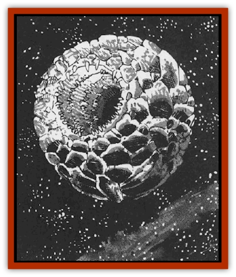

# Meteorspawn

| Statistic | **Meteorspawn** |
| --- | --- |
| **Activity Cycle:** | Any |
| **Alignment:** | Neutral |
| **Armor Class:** | -6 |
| **Climate/Terrain:** | Wildspace |
| **Damage/Attack:** | 3d10 |
| **Diet:** | Rocks and minerals |
| **Frequency:** | Uncommon |
| **Hit Dice:** | 19 |
| **Intelligence:** | Non- (0) |
| **Magic Resistance:** | Nil |
| **Morale:** | Steady (11) |
| **Movement:** | Fl 6 (E) |
| **No. Appearing:** | 1 |
| **No. of Attacks:** | 2 |
| **Organization:** | Solitary |
| **Size:** | G (100'+ diameter) |
| **Special Attacks:** | Nil |
| **Special Defenses:** | Nil |
| **THAC0:** | 2 |
| **Treasure:** | Nil |
| **XP Value:** | 11,000 |

For as long as the human race has been in space, sages have wondered what creates meteors. The meteorspawn is not necessarily the only source, but its presence certainly explains the reason for some of these flying rocks.

Meteorspawn are huge globes of living rock. The smallest meteorspawn measures at least 100' in diameter; some specimens are rumored to reach diameters of thousands of feet. The meteorspawn has a circular mouth that measures � the spawn's diameter. Two other holes lie opposite each other on the left and right rear quarters. These holes, waste orifices, are no wider than one tenth the spawn's diameter. The meteorspawn's coloration ranges from black to earth brown to slate gray.

Despite its great size and big mouth, the meteorspawn has no interest in eating spelljamming sailors nor their vessels. It drifts placidly, eating rocks and minerals.

**Combat:** Meteorspawn avoid fighting until they have lost 25% of their total hit points. Only this much damage makes the thick-skinned, unintelligent meteorspawn realize it is under attack.

The meteorspawn's only real attack is the meteors that it shoots out of its two opposing holes at extremely high speeds. If the meteorspawn is less than 1,000' in diameters it can rotate its body and bring both holes to bear on an enemy. Mcteorspawn wider than 1,000' can only bring one hole to bear.

Any unfortunate caught in the line of fire gets hit by 1d4 meteors, each doing 3d10 damage. In ship combat, treat the meteors as heavy catapult shots. Whether or not a meteor hits, the shot flies out of the combat into wildspace. Another meteor is born!

The meteorspawn's mouth does not bite, though if a ship collides with the mouth, it gets sucked in. The ship must make a saving throw vs. spell, or the part of the ship stuck in the meteorspawn's mouth is destroyed as though by a *disintegrate* spell. The ship's bow is normally the part which ends up colliding with the mouth. Each sailor in the affected area must make also save or suffer disintegration.

Waste material in the form of boulders is stored in two sacs deep behind the mouth. When these sacs are filled, the meteorspawn shoots boulders of waste rock out into space at great pressure and speed.

In rare (5%) instances, meteorspawns get close enough to planets to pull some atmosphere along with it. Since the meteorspawn does not need air to survive, this atmosphere remains until it is taken by grateful spelljammers.

**Ecology:** Most meteorspawn live for several centuries. During this time, the meteorspawn gestates 1d4 young. At the end of its life, it breaks up, and - a rare and wondrous sight - the young emerge. There is a 1% chance that any meteorspawn encountered is about to give birth.

The initial size of the young depends on how many are born. If four are born, each is a quarter the size of the parent. If three are born, each is a third the size, and so on.

Meteorspawn are a mixed blessing. On one hand, they clear away loose rock and debris that poses a navigational hazard. On the other hand, they create new hazards, high-velocity meteors that crash through ships. The only consolation is that the meteorspawns create less matter than they consume, so at least the overall volume of rocks and minerals in a given area is reduced.

Some mariners consider the birth of a meteorspawn to be a sign of good luck, seeing the symbolism of renewed life from death. In addition, when the parent breaks up, sailors can retrieve enough ammunition for 2d10 shots for each catapult on board. The size of the catapult does not matter; there are plenty of rocks of all sizes to choose from!

---
## Discovery & Documentation

**Source Publication:** MC9 Spelljammer Appendix II (1991)
**Campaign Setting:** Planescape
**Author(s):** Scott Davis, Newton Ewell, John Terra

### Other Creatures Found in This Source Book
   * [[Alchemy_Plant|Alchemy Plant]]
   * [[Allura|Allura]]
   * [[Aperusa|Aperusa]]
   * [[Autognome|Autognome]]
   * [[Bionoid|Bionoid]]
   * [[Bloodsac|Bloodsac]]
   * [[Buzzjewel|Buzzjewel]]
   * [[Constellate|Constellate]]
   * [[Contemplator|Contemplator]]
   * [[Dohwar|Dohwar]]
   * [[Dragon_Moon|Dragon, Moon]]
   * [[Dragon_Stellar|Dragon, Stellar]]
   * [[Dragon_Sun|Dragon, Sun]]
   * [[Dreamslayer|Dreamslayer]]
   * [[Dweomerborn|Dweomerborn]]
   * [[Fal|Fal]]
   * [[Feesu|Feesu]]
   * [[Fire_Bat|Fire Bat]]
   * [[Firebird|Firebird]]
   * [[Firelich|Firelich]]
   * [[Flowfiend|Flowfiend]]
   * [[Gadabout|Gadabout]]
   * [[Gammaroid|Gammaroid]]
   * [[Gonn|Gonn]]
   * [[Gossamer|Gossamer]]
   * [[Grav|Grav]]
   * [[Great_Dreamer|Great Dreamer]]
   * [[Greatswan|Greatswan]]
   * [[Grell_Colonial|Grell, Colonial]]
   * [[Gullion|Gullion]]
   * [[Insectare|Insectare]]
   * [[Lhee|Lhee]]
   * [[Mercurial_Slime|Mercurial Slime]]
   * [[Monitor|Monitor]]
   * [[Owl_Space|Owl, Space]]
   * [[Pristatic|Pristatic]]
   * [[Scro|Scro]]
   * [[Selkie_Star|Selkie, Star]]
   * [[Silatic|Silatic]]
   * [[Skullbird|Skullbird]]
   * [[Sleek|Sleek]]
   * [[Sluk|Sluk]]
   * [[Space_Swine|Space Swine]]
   * [[Sphinx_Astro-|Sphinx, Astro-]]
   * [[Spirit_Warrior|Spirit Warrior]]
   * [[Starfly_Plant|Starfly Plant]]
   * [[Stargazer|Stargazer]]
   * [[Undead_Stellar|Undead, Stellar]]
   * [[Witchlight_Marauder|Witchlight Marauder]]
   * [[Xixchil|Xixchil]]
   * [[Yitsan|Yitsan]]
   * [[Zurchin|Zurchin]]
