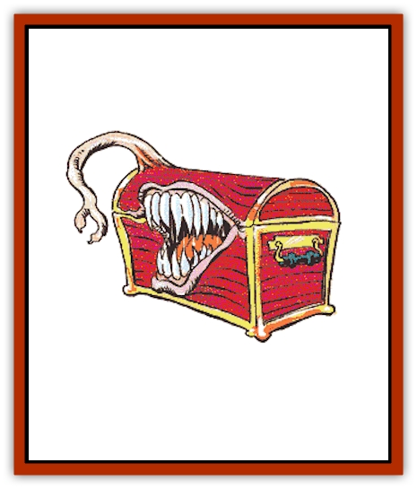

# Mimic

| Statistic | **Common** | **Killer** |
| --- | --- | --- |
| **Activity Cycle:** | Any | Any |
| **Alignment:** | Neutral | Neutral (evil) |
| **Armor Class:** | 7 | 7 |
| **Climate/Terrain:** | Subterranean | Subterranean |
| **Damage/Attack:** | 3-12 (smash) | 3-12 (smash) |
| **Diet:** | Carnivore | Carnivore |
| **Frequency:** | Rare | Rare |
| **Hit Dice:** | 7-8 | 9-10 |
| **Intelligence:** | Average (8-10) | Semi- (2-4) |
| **Magic Resistance:** | Nil | Nil |
| **Morale:** | Champion (15) | Elite (13) |
| **Movement:** | 3 | 3 |
| **No. Appearing:** | 1 | 1 |
| **No. of Attacks:** | 1 | 1 |
| **Organization:** | Solitary | Solitary |
| **Size:** | L | L |
| **Special Attacks:** | Glue | Glue |
| **Special Defenses:** | Camouflage | Camouflage |
| **THAC0:** | 13 | 11 |
| **Treasure:** | Incidental | Incidental |
| **XP Value:** | 7 HD: 975 / 8 HD: 1,400 | 9 HD: 2,000 / 10 HD: 3,000 |

Mimics are magically-created creatures with a hard rock-like outer shell that protects their soft inner organs. Mimics can alter their form and their pigmentation; they use this talent to lure victims into close range, where they attempt to feed on them. They usually appear in the form of treasure chests. There are two varieties, the smaller, more intelligent common mimic, and the larger, less intelligent killer mimic.

Mimics are large. Common mimics occupy about 150 cubic feet (a 3'x6'x8' chest, or a large door frame). Killer mimics occupy about 200 cubic feet. Mimics' natural color is a speckled grey that resembles granite. Mimics can alter their pigmentation to resemble varieties of stone (such as marble), wood grain, and various metals (gold, silver, copper); it takes one round to make the desired alteration. They cannot lose mass in this transformation (they must remain the same size, though they may radically alter their dimensions).

Common mimics have their own tongue (corruptions of the original language spoken by their wizard creators) and can also be taught to speak in common and other languages. Killer mimics are incapable of speech.

**Combat:** A mimic can surprise its victims easily (-4 penalty to victims' surprise rolls). When a creature touches a mimic, it lashes out with a pseudopod that inflicts 3d4 points of damage. Furthermore, the mimic covers itself with a glue-like substance. Any creature or item that touches a mimic is held fast. Alcohol will weaken the glue in three rounds, enabling the character to break free, or the character may attempt to make an open doors roll to break free. Only one attempt may be made per character, and no other action, offensive or defensive, may be performed during the round that the attempt is being made. A mimic may neutralize its glue at any time that it desires; the glue dissolves five rounds after the mimic dies. The mimic is immune to acid attacks and is unaffected by [[Mold_I|molds]], [[Ooze_Slime_Jelly_II|green slime]], and various puddings.

**Habitat/Society:** Mimics live underground, where they can avoid sunlight. They are solitary creatures; this is to ensure that each mimic has a large grazing area. They have no culture; their primary concerns are survival and food. Common mimics are quite intelligent and will gladly offer information in exchange for food. Killer mimics attack regardless of attempts at communication. Mimics have no moral code and no interest in culture or religion. Wizards who use them as guardians have sometimes found them to be less than enthusiastic about obeying their commands.

**Ecology:** Mimics were originally created by wizards to protect themselves from treasure hunters. A good meal (one or two humans) can sustain them for weeks. They reproduce by fission and grow to full size in several years. Mimics pose as stonework, doors, statues, stairs, chests, or other common items made from stone, wood, and metal. Their skin is covered with optical sensors that are sensitive to heat and light in a 90-foot radius, even in pitch darkness. Any powerful light source can easily blind them, including direct sunlight. Along with glue, they can excrete a liquid that smells like rotting meat; this attracts smaller, more common prey (usually [[Rat|rats]]). Mimic ichor is useful in the creation of polymorph self potions, and their glue and solvent sacs can be sold to alchemists. Other internal organs are useful in the manufacture of perfumes. The mimic's internal organs are considered tasty delicacies in some cultures.

---
## Discovery & Documentation

**Source Publication:** MC2 Volume II (1993)
**Campaign Setting:** Advanced Dungeons & Dragons 2nd Edition
**Author(s):** Jay Batista, Scott Bennie, Grant Boucher, William W. Connors, Steve Gilbert, Heike Kubasch, James Lowder, David Edward Martin, Bruce Nesmith, Jean Rabe, Rick Swan, John J. Terra, Gary L. Thomas

### Other Creatures Found in This Source Book
   * [[Ant|Ant]]
   * [[Ant_Lion_Giant|Ant Lion, Giant]]
   * [[Ape_Carnivorous|Ape, Carnivorous]]
   * [[Baboon|Baboon]]
   * [[Badger|Badger]]
   * [[Barracuda|Barracuda]]
   * [[Beetle_Giant|Beetle, Giant]]
   * [[Bulette|Bulette]]
   * [[Bullywug|Bullywug]]
   * [[Dwarf_Duergar|Dwarf, Duergar]]
   * [[Dwarf_Gully|Dwarf, Gully]]
   * [[Eagle|Eagle]]
   * [[Eel|Eel]]
   * [[Elemental_Air_Kin|Elemental, Air Kin]]
   * [[Elemental_Water_Kin|Elemental, Water Kin]]
   * [[Elemental_Water_Kin_Water_Weird|Elemental, Water Kin, Water Weird]]
   * [[Firestar|Firestar]]
   * [[Firetail|Firetail]]
   * [[Fish_Giant|Fish, Giant]]
   * [[Frog|Frog]]
   * [[Gorgon|Gorgon]]
   * [[Hawk|Hawk]]
   * [[Heucuva|Heucuva]]
   * [[Hippocampus|Hippocampus]]
   * [[Hippogriff|Hippogriff]]
   * [[Kelpie|Kelpie]]
   * [[Kenku|Kenku]]
   * [[Killmoulis|Killmoulis]]
   * [[Kuo-Toa|Kuo-Toa]]
   * [[Lamia|Lamia]]
   * [[Lammasu|Lammasu]]
   * [[Lamprey|Lamprey]]
   * [[Leech|Leech]]
   * [[Leprechaun|Leprechaun]]
   * [[Leucrotta|Leucrotta]]
   * [[Locathah|Locathah]]
   * [[Lycanthrope_Wereboar|Lycanthrope, Wereboar]]
   * [[Lycanthrope_Werefox|Lycanthrope, Werefox]]
   * [[Mammal_Minimal|Mammal, Minimal]]
   * [[Mammal_Small|Mammal, Small]]
   * [[Morkoth|Morkoth]]
   * [[Muckdweller|Muckdweller]]
   * [[Myconid|Myconid]]
   * [[Naga|Naga]]
   * [[Obliviax|Obliviax]]
   * [[Octopus_Giant|Octopus, Giant]]
   * [[Otyugh|Otyugh]]
   * [[Piranha|Piranha]]
   * [[Plant_Dangerous_I|Plant, Dangerous I]]
   * [[Plant_Intelligent|Plant, Intelligent]]
   * [[Poltergeist|Poltergeist]]
   * [[Porcupine|Porcupine]]
   * [[Rat_Osquip|Rat, Osquip]]
   * [[Roc|Roc]]
   * [[Roper|Roper]]
   * [[Rot_Grub|Rot Grub]]
   * [[Rust_Monster|Rust Monster]]
   * [[Sahuagin|Sahuagin]]
   * [[Sea_Lion|Sea Lion]]
   * [[Sea_Horse_Giant|Sea Horse, Giant]]
   * [[Shambling_Mound|Shambling Mound]]
   * [[Shark|Shark]]
   * [[Sphinx|Sphinx]]
   * [[Squid_Giant|Squid, Giant]]
   * [[Stirge|Stirge]]
   * [[Swanmay|Swanmay]]
   * [[Tarrasque|Tarrasque]]
   * [[Tasloi|Tasloi]]
   * [[Triton|Triton]]
   * [[Troglodyte|Troglodyte]]
   * [[Urchin|Urchin]]
   * [[Urd|Urd]]
   * [[Weasel|Weasel]]
   * [[Wolverine|Wolverine]]
   * [[Yellow_Musk_Creeper|Yellow Musk Creeper]]
