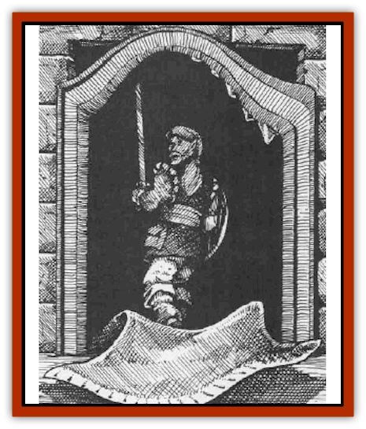

# Mimic - Greater

| Statistic | **Mimic, Greater** |
| --- | --- |
| **Activity Cycle:** | Any |
| **Alignment:** | Neutral |
| **Armor Class:** | 5 internal (2 external) |
| **Climate/Terrain:** | Subterranean |
| **Damage/Attack:** | 6d4 |
| **Diet:** | Carnivore |
| **Frequency:** | Very rare |
| **Hit Dice:** | 15 or 16 |
| **Intelligence:** | Very to High (12-14) |
| **Magic Resistance:** | 10% |
| **Morale:** | Fanatic (17) |
| **Movement:** | 1 |
| **No. Appearing:** | 1 |
| **No. of Attacks:** | 1 |
| **Organization:** | Solitary |
| **Size:** | H (1,000+ cu.ft.) |
| **Special Attacks:** | Surprise, glue |
| **Special Defenses:** | Camouflage |
| **THAC0:** | 5 |
| **Treasure:** | Nil |
| **XP Value:** | 7,000-8,000 |

Greater mimics are presumed to be either common [[Mimic|mimics]] that have survived for a century or more and grown to great size, or mimics altered by the strange magics of the dungeon and its wizardly denizens. Like their more common cousins, greater mimics have a hard, rock-like outer shell surrounding a mass of soft inner organs; however, greater mimics have a higher Intelligence and a limited magic resistance. Greater mimics are also vastly larger, occupying 1,000 cubic feet (or more!), and can cover whole rooms or small buildings like crypts. The largest known specimen covered as much as a 30-foot by 30-foot by 30-foot area.

While common and [[Mimic|killer mimics]] alter their pigmentation to resemble stone, wood, or metals, the greater mimic can alter its coloring and shape to imitate a vast number of textures, colors, and shapes at once. Common mimics imitate chests and doors; with its intelligence and augmented abilities, the greater mimic can create entire rooms of furniture, treasure, and tapestries. A greater mimic rarely disguises itself as only a mound of treasure, as that still offers adventurers and other food the chance to escape; by blocking a corridor and altering its shape to become a room with entrance doors on either side, its prey walks directly into it and guarantees easy capture. In larger caverns or halls, the greater mimic shapes itself into a burial alcove or a cave against a rocky wall. Regardless of its exterior, the "interior" disguise always has simulated treasure, furniture, and other enticements to lure in prey.

**Combat:** Greater mimics surprise their victims easily (-6 to victims' surprise rolls). Intelligent and patient, they wait until an entire group is inside the "room" before attacking. Then they release natural adhesives across all surfaces, holding their victims fast while they attack by slamming their "walls" together, causing 6d4 points of damage to all creatures trapped inside (to unknowing adventurers, it seems like the room implodes on them!). The greater mimic's adhesive can be weakened by alcohol in 3 rounds. If any creatures remain outside the mimic, it closes all its "openings" and seals its dense outer hide (AC 2 vs. external attacks). Its internal Armor Class is 5.

**Habitat/Society:** Greater mimics live in subterranean caverns. They are almost immobile due to their great size and seldom move at all once they have chosen a living place. They are intelligent enough to make pacts with any groups of creatures within the same area, and often exchange treasure (which they cannot digest) for food. It is often worthwhile for a group of adventurers to bribe a greater mimic rather than slay it, as it has likely gathered a great deal of information about the surrounding area over. Adventurers can often persuade these creatures to trade their incidental treasures and information for food.

**Ecology:** Greater mimics have prodigious appetites, but can sustain themselves on little or no food for long periods of time. This is not a preferred choice, however, and they do not practice conservation if a steady food supply is at hand. They are intelligent, efficient predators.

Though common mimics were created by wizards as guardians, the greater mimic is rarely used as such. This, quite simply, is due to the fact that few wizards can get these creatures to obey them.

One in five greater mimics can develop a limited illusory ability allowing it to display creatures inside the "rooms" simulates. These monsters can even portray intelligent creatures and pretend to speak through their mouths. Observers need to roll under half their Intelligence to realize that the words are actually coming from the walls around them.

---
## Discovery & Documentation

**Source Publication:** Monstrous Compendium, 1995 Annual, Volume 2 (1995)
**Campaign Setting:** Advanced Dungeons & Dragons 2nd Edition
**Author(s):** Jon Pickens

### Other Creatures Found in This Source Book
   * [[Aboleth_Savant|Aboleth, Savant]]
   * [[Addazahr|Addazahr]]
   * [[Amiq_Rasol|Amiq Rasol]]
   * [[Arch-Shadow|Arch-Shadow]]
   * [[Automaton_Scaladar|Automaton, Scaladar]]
   * [[Automaton_Trobriand's|Automaton, Trobriand's]]
   * [[Bat_Sporebat|Bat, Sporebat]]
   * [[Beetle_Dragon|Beetle, Dragon]]
   * [[Bi-nou|Bi-nou]]
   * [[Boggle|Boggle]]
   * [[Brownie_Dobie|Brownie, Dobie]]
   * [[Brownie_Quickling|Brownie, Quickling]]
   * [[Cat_Crypt|Cat, Crypt]]
   * [[Cat_Great_Cath_Shee|Cat, Great, Cath Shee]]
   * [[Centaur-kin_Dorvesh|Centaur-kin, Dorvesh]]
   * [[Centaur-kin_Gnoat|Centaur-kin, Gnoat]]
   * [[Centaur-kin_Ha'pony|Centaur-kin, Ha'pony]]
   * [[Centaur-kin_Zebranaur|Centaur-kin, Zebranaur]]
   * [[Chronolily|Chronolily]]
   * [[Curst|Curst]]
   * [[Darktentacles|Darktentacles]]
   * [[Dinosaur_Aquatic|Dinosaur, Aquatic]]
   * [[Dinosaur_II|Dinosaur II]]
   * [[Dinosaur_III|Dinosaur III]]
   * [[Doppelganger_Greater|Doppelganger, Greater]]
   * [[Dragon_Brine|Dragon, Brine]]
   * [[Dragon_Half-|Dragon, Half-]]
   * [[Dragon-kin_Sea_Wyrm|Dragon-kin, Sea Wyrm]]
   * [[Dwarf_Wild|Dwarf, Wild]]
   * [[Ekimmu|Ekimmu]]
   * [[Elemental_Nature|Elemental, Nature]]
   * [[Elf_Winged|Elf, Winged]]
   * [[Fish_Great_Glacier|Fish (Great Glacier)]]
   * [[Fish_Subterranean|Fish, Subterranean]]
   * [[Fish_Toril|Fish (Toril)]]
   * [[Flareater|Flareater]]
   * [[Flumph|Flumph]]
   * [[Froghemoth|Froghemoth]]
   * [[Ghost_Casurua|Ghost, Casurua]]
   * [[Ghost_Ker|Ghost, Ker]]
   * [[Ghul|Ghul]]
   * [[Ghul-Kin|Ghul-Kin]]
   * [[Giant_Half-giant|Giant, Half-giant]]
   * [[Golem_Burning_Man|Golem, Burning Man]]
   * [[Golem_Phantom_Flyer|Golem, Phantom Flyer]]
   * [[Gulguthhydra|Gulguthhydra]]
   * [[Hakeashar|Hakeashar]]
   * [[Horse_Moon-|Horse, Moon-]]
   * [[Human_Dragonslayer|Human, Dragonslayer]]
   * [[Human_Vistana|Human, Vistana]]
   * [[Jellyfish_Giant|Jellyfish, Giant]]
   * [[Kalin|Kalin]]
   * [[Kholiathra|Kholiathra]]
   * [[Laerti|Laerti]]
   * [[Leucrotta_Greater|Leucrotta, Greater]]
   * [[Lich_Suel|Lich, Suel]]
   * [[Lurker_Shadow|Lurker, Shadow]]
   * [[Lycanthrope_Werepanther|Lycanthrope, Werepanther]]
   * [[Lycanthrope_Wereshark|Lycanthrope, Wereshark]]
   * [[Mammal_Herd_II|Mammal, Herd II]]
   * [[Marl|Marl]]
   * [[Meenlock|Meenlock]]
   * [[Mold_II|Mold II]]
   * [[Mummy_Creature|Mummy, Creature]]
   * [[Nyth|Nyth]]
   * [[Ooze_Slime_Jelly_Ghaunadan|Ooze/Slime/Jelly, Ghaunadan]]
   * [[Palimpsest|Palimpsest]]
   * [[Peltast|Peltast]]
   * [[Plant_Dangerous_II|Plant, Dangerous II]]
   * [[Pleistocene_Animal|Pleistocene Animal]]
   * [[Pudding_Subterranean|Pudding, Subterranean]]
   * [[Raggamoffyn|Raggamoffyn]]
   * [[Snake_Serpent|Snake, Serpent]]
   * [[Snake_Serpent_Vine|Snake, Serpent Vine]]
   * [[Sphinx_Draco-|Sphinx, Draco-]]
   * [[Sprite_Seelie_Faerie|Sprite, Seelie Faerie]]
   * [[Sprite_Unseelie_Faerie|Sprite, Unseelie Faerie]]
   * [[Squealer|Squealer]]
   * [[Turtle_Giant|Turtle, Giant]]
   * [[Umpleby|Umpleby]]
   * [[Vizier's_Turban|Vizier's Turban]]
   * [[Wall_Walker|Wall Walker]]
   * [[Webbird|Webbird]]
   * [[Yak-Man|Yak-Man]]
   * [[Zorbo|Zorbo]]
