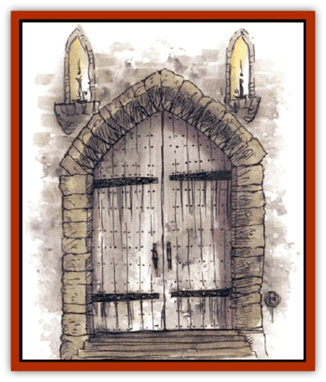

# Mimic - House Hunter

| Statistic | **Adult** | **Ancient** | **Young** |
| --- | --- | --- | --- |
| **Activity Cycle:** | Any | Any | Any |
| **Alignment:** | Neutral | Neutral | Neutral |
| **Armor Class:** | 0 (shell), 6 (tentacles and tongue) | 0 (shell), 6 (tentacles and tongue) | 0 (shell), 6 (tentacles and tongue) |
| **Climate/Terrain:** | Any land | Any land | Any land |
| **Damage/Attack:** | 3d6 | 4d6 | 2d6 |
| **Diet:** | Carnivore | Carnivore | Carnivore |
| **Frequency:** | Rare | Rare | Rare |
| **Hit Dice:** | 15 | 20 | 10 |
| **Intelligence:** | Low (5-7) | Average (8-10) | Semi (2-4) |
| **Magic Resistance:** | Nil | Nil | Nil |
| **Morale:** | Champion (15-16) | Fanatic (17-18) | Elite (13-14) |
| **Movement:** | 3 | 3 | 3 |
| **No. Appearing:** | 1d6 | 1d4 | 1d4 |
| **No. of Attacks:** | 3 | 1d4+2 | 3 |
| **Organization:** | Pack | Pack | Pack |
| **Size:** | H (15-20' tall) | G (30-40' tall) | L (10' tall) |
| **Special Attacks:** | Mimicry; continuous damage | Mimicry, continuous damage | Mimicry, continuous damage |
| **Special Defenses:** | Camouflage, heat and cold resistance | Camouflage, heat and cold resistance | Camouflage, heat and cold resistance |
| **THAC0:** | 5 | 1 | 11 |
| **Treasure:** | J,K,L,M | (J,K,L,M,N,Q)&times;10,S | Nil |
| **XP Value:** | 8,000 | 13,000 | 3,000 |

House hunters are large relatives of [[Mimic|mimics]]. They have lost some of the latter's camouflage versatility, but they have gained the ability to live above ground.

House hunters form hard shells that look like stone, wood, or thatch, lending the appearance of a building. Young house hunters look like smaller structures such as outhouses and sheds, adults are the size of cottages and small houses, while ancient creatures are larger still, with elaborate shells that can resemble inns, temples, or ruined towers. All three sizes of this monster can produce dim, flickering light (bioluminescence), resembling candle or lantern light, at any body opening, and they can imitate domestic noises (muffled voices, clucking hens, the tolling of a temple bell, etc.)

Bony plates resembling doors and shutters cover the shell openings, protecting and hiding their mouths, eyestalks, and huge tentacles - each specimen has a tongue that is 2 feet long per Hit Die, two eyestalks that are 6 inches long per Hit Die, and two tentacles that are 1 foot long per Hit Die. The bony plates are opened and shut by the use of strong muscles that function like those of clams. These apertures can be forced open by making a successful open doors roll. There is a wide variety in the locations of these openings: Some of these creatures have them all along the fronts of the "buildings", while others have mouths and eyes at the front, but tentacles at the left and right sides. Ancient house hunters often have extra tentacles, which may be arrayed on all sides of the structure.

Adult and ancient house hunters can talk, but they only speak a crude form of Common. Sages speculate that they communicate telepathically within a 10-mile range.

**Combat:** A house hunter attacks by extruding its tongue and limbs and wrapping those appendages around nearby victims (one appendage per victim). Each extremity makes a separate attack roll, suffering a -2 penalty if it is on a side that lacks an eyestalk. A successful hit indicates the member has caught its target, whereupon it will inflict damage at the end of that and each ensuing round, continuing to do so until the victim appears to be dead or breaks free. The caught character must immediately roll a successful Dexterity check to avoid having his or her arms trapped too - if the roll fails by more than 4, both arms are pinned to the sides of the victim's body and no counterattacks are possible. If only one limb is caught, the DM must roll to determine randomly which arm has been pinned down, and thence whether counterattacks are possible.

The creature's tongue and tentacles are covered with a musty-smelling adhesive slime; those caught by any of those appendages must make a successful Strength check in order to break free. The victim may either attempt to escape or attack (depending upon whether his weapon arm is free) in a single round, but not both.

An unresisting opponent is assumed dead by the captor house hunter, and the victim will be dropped after five additional rounds of constriction. Once all adversaries have been dealt with, the bodies are picked up by the house hunter's tongue and pulled into its mouth at the rate of one per round. Victims lying along the blind side of the monster are taken in first, followed by those along the sides with eyestalks. Anyone pretending to be dead suffers one more round of constriction damage as he is picked up, but he still has one last chance to pull free in that round before being dragged inside the house hunter.

Once inside the monster, only small, hand-held stabbing weapons - the size of a short sword or smaller - may be used to attack (consider the creature's insides to be AC 10). If any damage is inflicted, the house hunter uses its appendages to eject the person from its shell and then constricts him again until he ceases to resist for five rounds, escapes, or the monster dies. Bodies within a house bunter are fully digested and unrecoverable after 1d4 turns.

Note that the tongue, eyestalks, and tentacles of the house hunter are actually pseudopods; if any member is amputated in combat, it regrows in 1d4 turns, and all damage sustained by that appendage is returned to the creature's hit point total.

House hunters aren't damaged by sunlight, but they don't like to expose their flesh and eyes to it. Hence, they prefer to travel by night, and they delay their attacks until after dusk if possible. If forced to fight by day, they make all attacks with -2 penalties.

House-bunter shells are thick enough to reduce both normal and magical heat and cold damage by 1 point per Hit Die of damage. If one's hit point total falls below 10, it pulls in all of its appendages, shuts all openings, and attempts to move away from its attackers.

**Habitat/Society:** House hunters are pack animals, cooperating to capture their prey. Young house hunters rarely attack until an adult has taken the initiative. They all have good hearing and can sense the vibration of footsteps of man-sized and larger creatures that are 120 yards away. They are also intelligent enough to delay their attack until they can reap the maximum reward. For example, they won't attack a single scout if there is a large party approaching behind.

The reproduction of these monsters remains a mystery, though an adult has been seen digging a large hole in the earth with its foot, then depositing its single live young in the hole. The creature subsequently made its way out of that hole and followed its mother. Shells apparently grow in size with their owners, and they are shaped over long periods of time to resemble particular buildings that the house hunters have probably seen in their limited travels.

**Ecology:** Treasure is usually found inside a house hunter's shell, either within the stomach or embedded in the shell wall. Such treasure consists of the undigestible remains of the monster's victims, including coins, gems, and similar small items. Some treasure may be encysted in layers of shell, like pearls, but these lumps have no jewel value. Occasionally, a magical item or rare antiquity may be found within the monster. A *cursed* item is especially possible, since those characters carrying truly powerful weapons or items would be much more likely to successfully repel the attack of a house hunter and escape. Assume that adult house hunters have a 5% chance to contain a magical item and that ancients have a 10% chance. Further, such items found in either type are 60% likely to be magically *cursed*.

The underside of a house hunter has no armor. It is a slippery foot resembling that of a snail, though it isn't especially adhesive. When the creature moves, the outer shell raises slightly to allow movement over open ground, debris, etc.

If cleaned out thoroughly, a house hunter's shell can be converted into a crude dwelling.

---
## Discovery & Documentation

**Source Publication:** Monstrous Compendium, 1994 Annual, Volume 1 (1995)
**Campaign Setting:** Advanced Dungeons & Dragons 2nd Edition
**Author(s):** David Wise

### Other Creatures Found in This Source Book
   * [[Abyss_Ant|Abyss Ant]]
   * [[Achaierai|Achaierai]]
   * [[Afanc|Afanc]]
   * [[Al-Jahar|Al-Jahar]]
   * [[Baelnorn|Baelnorn]]
   * [[Baneguard|Baneguard]]
   * [[Banelar|Banelar]]
   * [[Bird_Talking|Bird, Talking]]
   * [[Blazing_Bones|Blazing Bones]]
   * [[Campestri|Campestri]]
   * [[Caniquine|Caniquine]]
   * [[Cat_Winged|Cat, Winged]]
   * [[Crypt_Servant|Crypt Servant]]
   * [[Death's_Head_Tree|Death's Head Tree]]
   * [[Dog_Saluqi|Dog, Saluqi]]
   * [[Dragon_Electrum|Dragon, Electrum]]
   * [[Dragon_Fang|Dragon, Fang]]
   * [[Dragon_Linnorm_Corpse_Tearer|Dragon, Linnorm, Corpse Tearer]]
   * [[Dragon_Linnorm_Dread|Dragon, Linnorm, Dread]]
   * [[Dragon_Linnorm_Flame|Dragon, Linnorm, Flame]]
   * [[Dragon_Linnorm_Forest|Dragon, Linnorm, Forest]]
   * [[Dragon_Linnorm_Frost|Dragon, Linnorm, Frost]]
   * [[Dragon_Linnorm_Gray|Dragon, Linnorm, Gray]]
   * [[Dragon_Linnorm_Land|Dragon, Linnorm, Land]]
   * [[Dragon_Linnorm_Midgard|Dragon, Linnorm, Midgard]]
   * [[Dragon_Linnorm_Rain|Dragon, Linnorm, Rain]]
   * [[Dragon_Linnorm_Sea|Dragon, Linnorm, Sea]]
   * [[Dragon_Neutral_Jacinth|Dragon, Neutral, Jacinth]]
   * [[Dragon_Neutral_Jade|Dragon, Neutral, Jade]]
   * [[Dragon_Neutral_Pearl|Dragon, Neutral, Pearl]]
   * [[Dread|Dread]]
   * [[Dragon-kin|Dragon-kin]]
   * [[Elemental_Earth_Kin_Chrysmal|Elemental, Earth Kin, Chrysmal]]
   * [[Elemental_Earth_Kin_Earth_Weird|Elemental, Earth Kin, Earth Weird]]
   * [[Elemental_Fire_Kin_Azer|Elemental, Fire Kin, Azer]]
   * [[Elemental_Sandman|Elemental, Sandman]]
   * [[Elemental_Wind_Walker|Elemental, Wind Walker]]
   * [[Elemental_Vermin|Elemental Vermin]]
   * [[Feystag|Feystag]]
   * [[Flame_Skull|Flame Skull]]
   * [[Foulwing|Foulwing]]
   * [[Gambado|Gambado]]
   * [[Garbug|Garbug]]
   * [[Genie_Tasked_Administrator|Genie, Tasked, Administrator]]
   * [[Genie_Tasked_Deceiver|Genie, Tasked, Deceiver]]
   * [[Genie_Tasked_Harim_Servant|Genie, Tasked, Harim Servant]]
   * [[Genie_Tasked_Messenger|Genie, Tasked, Messenger]]
   * [[Genie_Tasked_Miner|Genie, Tasked, Miner]]
   * [[Genie_Tasked_Oathbinder|Genie, Tasked, Oathbinder]]
   * [[Gibbering_Mouther|Gibbering Mouther]]
   * [[Gnasher|Gnasher]]
   * [[Gnasher_Winged|Gnasher, Winged]]
   * [[Golem_Brain|Golem, Brain]]
   * [[Golem_Hammer|Golem, Hammer]]
   * [[Golem_Metagolem|Golem, Metagolem]]
   * [[Golem_Spiderstone|Golem, Spiderstone]]
   * [[Gorynych|Gorynych]]
   * [[Greelox|Greelox]]
   * [[Helmed_Horror|Helmed Horror]]
   * [[Jarbo|Jarbo]]
   * [[Laraken|Laraken]]
   * [[Lich_Psionic|Lich, Psionic]]
   * [[Living_Steel|Living Steel]]
   * [[Lock_Lurker|Lock Lurker]]
   * [[Loxo|Loxo]]
   * [[Lycanthrope_Loup_de_Noir|Lycanthrope, Loup de Noir]]
   * [[Lycanthrope_Werebadger|Lycanthrope, Werebadger]]
   * [[Lycanthrope_Werejaguar|Lycanthrope, Werejaguar]]
   * [[Lythlyx|Lythlyx]]
   * [[Magebane|Magebane]]
   * [[Marrashi|Marrashi]]
   * [[Metalmaster|Metalmaster]]
   * [[Naga_Bone|Naga, Bone]]
   * [[Nautilus_Giant|Nautilus, Giant]]
   * [[Nightshade_Toril|Nightshade (Toril)]]
   * [[Nishruu|Nishruu]]
   * [[Noran|Noran]]
   * [[Opinicus|Opinicus]]
   * [[Ormyrr|Ormyrr]]
   * [[Parasite|Parasite]]
   * [[Pasari-Niml|Pasari-Niml]]
   * [[Plant_Vampire_Moss|Plant, Vampire Moss]]
   * [[Pteraman|Pteraman]]
   * [[Rautym|Rautym]]
   * [[Shadeling|Shadeling]]
   * [[Skum|Skum]]
   * [[Snake_Giant_Cobra|Snake, Giant Cobra]]
   * [[Snake_Stone|Snake, Stone]]
   * [[Spectral_Wizard|Spectral Wizard]]
   * [[Spell_Weaver|Spell Weaver]]
   * [[Spider_Brain|Spider, Brain]]
   * [[Suwyze|Suwyze]]
   * [[Tatalla|Tatalla]]
   * [[Tick_Heart|Tick, Heart]]
   * [[Tree_Dark|Tree, Dark]]
   * [[Tree_Singing|Tree, Singing]]
   * [[Tressym|Tressym]]
   * [[Troll_Snow|Troll, Snow]]
   * [[Tuyewera|Tuyewera]]
   * [[Ulitharid|Ulitharid]]
   * [[Undead_Dwarf|Undead Dwarf]]
   * [[Undead_Lake_Monster|Undead Lake Monster]]
   * [[Whipsting|Whipsting]]
   * [[Windghost|Windghost]]
   * [[Wolf_Dread|Wolf, Dread]]
   * [[Wolf_Stone|Wolf, Stone]]
   * [[Wolf_Vampiric|Wolf, Vampiric]]
   * [[Wraith_Shimmering|Wraith, Shimmering]]
   * [[Xantravar|Xantravar]]
   * [[Xaver|Xaver]]
