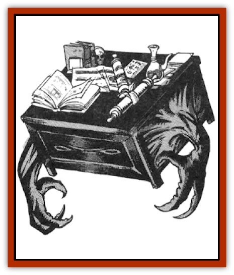

# Mimic - Space

| Statistic | **Mimic, Space** |
| --- | --- |
| **Activity Cycle:** | Any |
| **Alignment:** | Neutral |
| **Armor Class:** | 7 |
| **Climate/Terrain:** | Wildspace |
| **Damage/Attack:** | 3-12 (smash) |
| **Diet:** | Carnivore |
| **Frequency:** | Very rare |
| **Hit Dice:** | 12 |
| **Intelligence:** | High (13-14) |
| **Magic Resistance:** | Nil |
| **Morale:** | Champion (15) |
| **Movement:** | 3, Fl 18 (B) |
| **No. Appearing:** | 1 |
| **No. of Attacks:** | 1 |
| **Organization:** | Solitary |
| **Size:** | L (varies) |
| **Special Attacks:** | Glue |
| **Special Defenses:** | Camouflage |
| **THAC0:** | 9 |
| **Treasure:** | V (U) |
| **XP Value:** | 5,000 |

[[Mimic|Mimics]] are the result of a magical experiment. Despite their very thick, resilient hide, these creatures hace the ability to change their shapes and colors at will in order to fool nearby vitims, which they then feed on. Space mimics sometimes pass as ship debris floating in wildspace, as an ornate chest, or as an elaborate wizard's desk with books and scrolls in an abandoned ship.

Space mimics have two eyes, which normally remain hidden under thick eyelids. In addition, space mimics can sense heat and light within 90 feet.

Space mimics are about the same size as their planetside counterparts, about 150 cubic feet (a 3'x6'x8' chest for example or a small lifeboat). The natural skin of the space mimic is pitch black, with small specks of twinkling light, imitating a space background. The space mimic can change its shape and color in one round to resemble a piece of furniture made of any variety of wood, stone, or metal (either plain or carved). Like the common mimic, the space mimic must retain its normal size, but can otherwise radically alter its shape.

The space mimic speaks its own tongue and often another three or four. The languages it is most likely to understand are [[Neogi|neogi]] (01-20), the [[Arcane|arcane]] tongue (21-40), human common (41-70), [[Beholder_and_Beholder-kin_I|beholder]] (71-75), [[Elf|elven]] (76-90), or [[Mind_Flayer|illithid]] (91-95). On a roll of 96-00, the space mimic is eager to learn a new language.

**Combat:** Mimics use their shapechanging ability to surprise their victims (-4 penalty to the victim's surprise roll). If attacked, a space mimic lashes out with a pseudopod that inflicts 3d4 points of damage. The mimic is also covered with a strong glue that can hold anyone or anything coming in contact. A victim can be pulled free in three rounds only if the glue is weakened with a flask of alcohol. The space mimic can dissolve its glue anytime it so desires, and can control which areas of its hide are covered with the glue. Mimics are immune to acid, [[Mold_I|molds]], [[Ooze_Slime_Jelly_II|green slime]], and various puddings.

Space mimics have the ability to cast the spells available to a 4th-level illusionist. This is an innate ability, and thus the spells do not require components. Space mimics do need to locate spell books or scrolls in order to acquire the spells initially. Once they have acquired a spell, they may use it as a 4th-level illusionist. Space mimics also need rest to recover spells previously cast. A common spell mix for space mimics might include the following: *audible glamer*, *cantrip*, *spook*, *Nystul's magical aura*, *hypnotic pattern*, *improved phantasmal force*, and *invisibility*.

Space mimics are as much interested in food as they are in magic. When visitors approach, the space mimic stays invisible to study the party. If it finds out there is a wizard, the space mimic tries to lure the spellcaster somewhere alone, and then hypnotizes him while it steals books, scrolls, or magical items. After eating a victim, the mimic goes into hiding. If the party remains, the undiscovered mimic may attempt to lure yet another member when it hungers again.

**Habitat/Society:** Space mimics live in wildspace. They are solitary creatures that enjoy spending time reading space lore, tomes on magic, and other arcane volumes. Unlike their common cousins, space mimics have various cultures, usually based on their readings. These mimics are intelligent; they exchange books they already read for food or other books. Space mimics have neither religious beliefs nor any morals.

When food is scarce, the mimic turns invisible and goes dormant for up to two to three years, after which time it will die unless it feeds. A good meal (one or two humans) sustains a space mimic for 1d4+4 months. Space mimics can levitate at will, which enables them to slowly travel across wildspace.

**Ecology:** Mimics were created by wizards to protect their treasures. This strain was created for long voyages, but they soon proved unreliable servants. After being discarded, mimics survived, reproducing by fission. Along with their glue, space mimics exude an odor that attracts rodents, space vermin, and occasional monsters as well.

Body parts of the space mimic are as useful as that of its common cousin. In addition, the space mimic often keeps some treasure (usually books or scrolls) in a pocket under its belly.

---
## Discovery & Documentation

**Source Publication:** MC7 Spelljammer Appendix I (1990)
**Campaign Setting:** Advanced Dungeons & Dragons 2nd Edition
**Author(s):** various

### Other Creatures Found in This Source Book
   * [[Aartuk|Aartuk]]
   * [[Albari|Albari]]
   * [[Ancient_Mariner|Ancient Mariner]]
   * [[Argos|Argos]]
   * [[Beholder_Abomination_Astereater|Beholder (Abomination), Astereater]]
   * [[Blazozoid|Blazozoid]]
   * [[Chattur|Chattur]]
   * [[Chevall|Chevall]]
   * [[Clockwork_Horror|Clockwork Horror]]
   * [[Colossus|Colossus]]
   * [[Delphinid|Delphinid]]
   * [[Dizantar|Dizantar]]
   * [[Dog|Dog]]
   * [[Dog_Bog_Hound|Dog, Bog Hound]]
   * [[Esthetic|Esthetic]]
   * [[Focoid|Focoid]]
   * [[Fractine|Fractine]]
   * [[Giant_Spacesea|Giant, Spacesea]]
   * [[Golem_Furnace|Golem, Furnace]]
   * [[Golem_Radiant|Golem, Radiant]]
   * [[Gravislayer|Gravislayer]]
   * [[Grommam|Grommam]]
   * [[Hadozee|Hadozee]]
   * [[Hamster_Giant_Space|Hamster, Giant Space]]
   * [[Jammer_Leech|Jammer Leech]]
   * [[Lakshu|Lakshu]]
   * [[Lumineaux|Lumineaux]]
   * [[Lutum|Lutum]]
   * [[Misi|Misi]]
   * [[Moon_Rogue|Moon, Rogue]]
   * [[Mortiss|Mortiss]]
   * [[Murderoid|Murderoid]]
   * [[Nay-Churr|Nay-Churr]]
   * [[Phlog-Crawler|Phlog-Crawler]]
   * [[Plasman|Plasman]]
   * [[Plasmoid_DeGleash|Plasmoid, DeGleash]]
   * [[Plasmoid_DelNoric|Plasmoid, DelNoric]]
   * [[Plasmoid_General_Information|Plasmoid, General Information]]
   * [[Plasmoid_Ontalak|Plasmoid, Ontalak]]
   * [[Puffer|Puffer]]
   * [[Q'nidar|Q'nidar]]
   * [[Rastipede|Rastipede]]
   * [[Reigar|Reigar]]
   * [[Rock_Hopper|Rock Hopper]]
   * [[Slinker|Slinker]]
   * [[Spider_Asteroid|Spider, Asteroid]]
   * [[Spiritjam|Spiritjam]]
   * [[Survivor|Survivor]]
   * [[Syllix|Syllix]]
   * [[Symbiont_Power|Symbiont, Power]]
   * [[Vine_Infinity|Vine, Infinity]]
   * [[Wiggle|Wiggle]]
   * [[Wizshade|Wizshade]]
   * [[Wryback|Wryback]]
   * [[Zard|Zard]]
   * [[Zodar|Zodar]]
