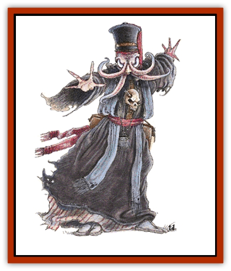

# Mind Flayer

| Statistic | **Mind Flayer** |
| --- | --- |
| **Activity Cycle:** | Any |
| **Alignment:** | Lawful evil |
| **Armor Class:** | 5 |
| **Climate/Terrain:** | Any subterranean |
| **Damage/Attack:** | 2; see below |
| **Diet:** | Carnivore (brains) |
| **Frequency:** | Rare |
| **Hit Dice:** | 8+4 |
| **Intelligence:** | Genius (17-18) |
| **Magic Resistance:** | 90% |
| **Morale:** | Champion (15) + special |
| **Movement:** | 12 |
| **No. Appearing:** | 1-4 |
| **No. of Attacks:** | 4 |
| **Organization:** | Community |
| **Size:** | M (6' tall) |
| **Special Attacks:** | Mind blast, see below |
| **Special Defenses:** | Magical powers |
| **THAC0:** | 11 |
| **Treasure:** | S,T,X (B) |
| **XP Value:** | 9,000 (7,000 for psionic version) |

The illithid, or mind flayer, is an evil and feared creature of the Underdark; its powers are formidable and it feeds on the brains of any creature it encounters. Using arcane powers, it enslaves or destroys its foes, which include such powerful creatures as [[Elf_Drow|drow]] and [[Kuo-Toa|kuo-toa]].

Mind Flayers stand about 6 feet tall and have hideous mauve skin that glistens with slime. The head resembles an octopus, with white eyes (no pupils are evident) and four tentacles around its mouth, a round, many-toothed orifice like that of a lamprey. The creature has three reddish fingers and a thumb on each hand.

Illithids have infravision. They can communicate with any creatures via innate telepathy; they have no spoken language, although they often accompany their thoughts with hissing, and the eager lashing of their tentacles. Mind flayers dress in flowing robes, often with high, stiff collars, adorned with symbols of death and despair.

**Combat:** A mind flayer's preferred method of attack is the mind blast, projected in a cone 60 feet long, 5 feet wide at the mind flayer, and 20 feet wide at the opposite end. All within the cone must make a saving throw vs. wands or be stunned and unable to act for 3d4 rounds. The illithid tries to grab one or two stunned victims (requiring normal attack rolls if others try to prevent this) and escape with them.

The illithid keeps some victims as slaves and feeds on the brains of the others. When devouring the brain of a stunned victim, it inserts its tentacles into the victim's skull and draws out its brain, killing the victim in one round. A mind flayer can also use its tentacles in combat; it does so only when surprised or when attacking a single, unarmed victim. A tentacle which hits causes 2 hp damage and holds the victim. A tentacle does no damage while holding, and can be removed with a successful bend bars/lift gates roll. Once all four tentacles have attached to the victim, the mind flayer has found a path to the brain and kills the victim in one round. If preferred, the DM can simply roll 1d4 for the number of rounds required to kill a struggling victim.

A mind flayer can also use the following arcane powers, one per round, as a 7th-level mage: *suggestion*, *charm person*, *charm monster*, *ESP*, *levitate*, *astral projection*, and *plane shift*. All saving throws against these powers are made at a -4, due to the creature's mental prowess.

If an encounter is going against a mind flayer, it will immediately flee, seeking to save itself regardless of its treasure or its fellows.

**Habitat/Society:** Mind flayers hate sunlight and avoid it when possible. They live in underground cities of 200 to 2,000 illithids, plus at least two slaves per illithid. All the slaves are under the effects of a *charm person* or *charm monster*, and obey their illithid masters without question.

The center of a community is its [[Elder_Brain|elder brain]], a pool of briny fluid that contains the brains of the city's dead mind flayers. Due to the mental powers of illithids, the elder brain is still sentient, and the telepathic union of its brains rules the community. The elder brain has a telepathic range of 2 to 5 miles, depending on its age and size. It does not attack, but telepathically warns the mind flayers of the presence of thinking creatures, so a mind flayer within its telepathic radius can be surprised only by non-intelligent creatures. The range of the elder brain determines the territory claimed and defended by the community, though raiding parties are sent far beyond this limit.

Mind flayers have no family structure. Their social activities include eating, communicating with the elder brain, and debating on the best tactics to conquer the Underdark. For amusement, they inflict pain on their captives and force slaves to fight in gladiatorial games.

Mind flayers are arrogant, viewing all other species only as cattle to be fed upon. They prefer to eat the brains of thinking creatures.

**Ecology:** Mind flayers live about 125 years. They are warm-blooded amphibians, and spend the first 10 years of life as tadpoles, swimming in the elder-brain pool until they either die (which most do) or grow into adult illithids. On an irregular basis, adult illithids feed brains to the tadpoles, which do not molest the elder brain. Illithids are hermaphroditic; each can produce one tadpole twice in its life.

Mind flayer ichor is an effective ingredient in a *potion of ESP*.

**Psionic Illithids**

  **Psionics Summary**

| Level | Dis/Sci/Dev | Attack/Defense | Score | PSPs |
| --- | --- | --- | --- | --- |
| 10 | 4/5/15 | EW,II/All | =Int | 1d100+250 |

**Psychokinesis -** *Sciences:* nil; *Devotions:* control body, levitation.

**Psychometabolism -** *Science:* body equilibrium; *Devotions:* nil.

**Psychoportation -** *Sciences:* probability travel, teleport; *Devotion:* astral projection.

**Telepathy -** *Sciences:* domination, mind link; *Devotions:* awe, contact, ESP, ego whip, id insinuation, post-hypnotic suggestion.

  Psionic flayers, considered the only true illithids by some (including themselves), have most of the same statistics and abilities as other mind flayers. Instead of magic-based abilities, however, theirs are purely psionic. Psionic mind flayers have a beak-like mouth and disdain the stiff-collared robes preferred by their cousins.

Illithids use psionics for attack, mind control, and travel.

---
## Discovery & Documentation

**Source Publication:** MC1 Volume I (w/binder #1) (1991)
**Campaign Setting:** Advanced Dungeons & Dragons 2nd Edition
**Author(s):** Jay Batista, Scott Bennie, Grant Boucher, William W. Connors, Steve Gilbert, Heike Kubasch, James Lowder, David Edward Martin, Bruce Nesmith, Jean Rabe, Rick Swan, John J. Terra, Gary L. Thomas

### Other Creatures Found in This Source Book
   * [[Bat|Bat]]
   * [[Bear|Bear]]
   * [[Behir|Behir]]
   * [[Boar|Boar]]
   * [[Bookworm|Bookworm]]
   * [[Brownie|Brownie]]
   * [[Bugbear|Bugbear]]
   * [[Carrion_Crawler|Carrion Crawler]]
   * [[Cat_Great|Cat, Great]]
   * [[Catoblepas|Catoblepas]]
   * [[Dragon_General_Information|Dragon, General Information]]
   * [[Dragonfish|Dragonfish]]
   * [[Elemental_Air_Kin_Aerial_Servant|Elemental, Air Kin, Aerial Servant]]
   * [[Elemental_Earth_Kin_Sandling|Elemental, Earth Kin, Sandling]]
   * [[Elephant|Elephant]]
   * [[Gnoll|Gnoll]]
   * [[Hobgoblin|Hobgoblin]]
   * [[Homunculus|Homunculus]]
   * [[Hornet_Giant|Hornet, Giant]]
   * [[Horse|Horse]]
   * [[Hyena|Hyena]]
   * [[Jackal|Jackal]]
   * [[Jackalwere|Jackalwere]]
   * [[Korred|Korred]]
   * [[Lich|Lich]]
   * [[Lizard|Lizard]]
   * [[Lizard_Man|Lizard Man]]
   * [[Lycanthrope_General_Information|Lycanthrope, General Information]]
   * [[Lycanthrope_Seawolf|Lycanthrope, Seawolf]]
   * [[Lycanthrope_Werebear|Lycanthrope, Werebear]]
   * [[Lycanthrope_Weretiger|Lycanthrope, Weretiger]]
   * [[Lycanthrope_Werewolf|Lycanthrope, Werewolf]]
   * [[Manticore|Manticore]]
   * [[Medusa|Medusa]]
   * [[Minotaur|Minotaur]]
   * [[Mudman|Mudman]]
   * [[Mummy|Mummy]]
   * [[Nixie|Nixie]]
   * [[Nymph|Nymph]]
   * [[Ogre|Ogre]]
   * [[Ooze_Slime_Jelly_I|Ooze/Slime/Jelly I]]
   * [[Ooze_Slime_Jelly_II|Ooze/Slime/Jelly II]]
   * [[Orc|Orc]]
   * [[Owl|Owl]]
   * [[Owlbear_I|Owlbear I]]
   * [[Pegasus|Pegasus]]
   * [[Piercer|Piercer]]
   * [[Pudding_Deadly|Pudding, Deadly]]
   * [[Rakshasa|Rakshasa]]
   * [[Rat|Rat]]
   * [[Ray|Ray]]
   * [[Remorhaz|Remorhaz]]
   * [[Satyr|Satyr]]
   * [[Scorpion|Scorpion]]
   * [[Selkie|Selkie]]
   * [[Shadow|Shadow]]
   * [[Skeleton|Skeleton]]
   * [[Skunk|Skunk]]
   * [[Snake|Snake]]
   * [[Spectre|Spectre]]
   * [[Spider|Spider]]
   * [[Sprite|Sprite]]
   * [[Toad_Giant|Toad, Giant]]
   * [[Treant|Treant]]
   * [[Troll|Troll]]
   * [[Umber_Hulk|Umber Hulk]]
   * [[Unicorn|Unicorn]]
   * [[Vampire|Vampire]]
   * [[Wight|Wight]]
   * [[Will_O'Wisp|Will O'Wisp]]
   * [[Wolf|Wolf]]
   * [[Wolfwere|Wolfwere]]
   * [[Wraith|Wraith]]
   * [[Wyvern|Wyvern]]
   * [[Yeti|Yeti]]
   * [[Yuan-ti|Yuan-ti]]
   * [[Zombie|Zombie]]
