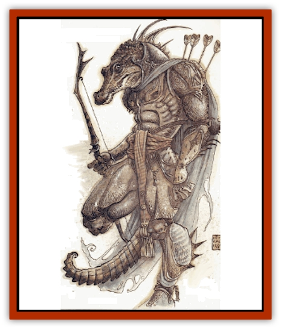

# Minion of Set

| Statistic | **Minion of Set** |
| --- | --- |
| **Activity Cycle:** | Any |
| **Alignment:** | Lawful evil |
| **Armor Class:** | -2 |
| **Climate/Terrain:** | Baator |
| **Damage/Attack:** | 1d12 (snake bite), by weapon or by form |
| **Diet:** | Carnivore |
| **Frequency:** | Uncommon |
| **Hit Dice:** | 6 |
| **Intelligence:** | High (13-14) |
| **Magic Resistance:** | 10% |
| **Morale:** | Fearless (20) |
| **Movement:** | 12 |
| **No. Appearing:** | 1d20 |
| **No. of Attacks:** | 3/2 or by form |
| **Organization:** | Hierarchy |
| **Size:** | M (6'6&rdquo; tall) |
| **Special Attacks:** | See below |
| **Special Defenses:** | Saves as 10th-level fighter |
| **THAC0:** | 15 |
| **Treasure:** | Nil |
| **XP Value:** | 1,400 / Shadow Priest: 2,000 |

Minions of Set are proxies of Set (of the Egytian mythos). In their natural form, the minions appear to be warriors wielding broad swords and dressed in black, scaly plate mail armor. Sometimes they are mistaken for adventurers, since these are people they most closely resemble, yet they are far from human.

The minions of Set are endowed with the power to change into an animal. The second shape is most often that of a giant [[Snake|snake]], but a few are able to assume the forms of [[Bear|cave bears]], giant [[Crocodile|crocodiles]], giant [[Hyena|hyenas]], or giant [[Scorpion|scorpions]]. The transformation is complete, including clothing and weapons, leaving no traces of their human guises behind.

**Combat:** A minion of Set typically begins combat in human form unless it's already in animal shape. Changing to anima1 form is normally done only when absolutely necessary. Most minions prefer not to disclose their capabilities, since once discovered their usefulness to their deity is compromised. As humans, 25% of them use magical weapons fashioned in Baator, though none are greater than +2 enchantment.

Should a battle go badly or the need be great, however, the minions of Set transform themselves into their fearsome animal forms. The transformation takes less than a single round, leaving only an initiative modifier of 5. Thus, a character could battle an armored fighter one round, only to discover himself facing a giant snake the very next. The Armor Class of the minion does not change because their armor is actually an integral part of their form, but the number of attacks and damage caused varies according to the creature form assumed.

| Form | Damage |
| --- | --- |
| Cave bear | 1d8/1d8/1d12 |
| Giant crocodile | 3d6/2d10 |
| Giant hyena | 3d4* |
| Giant scorpion | 1d10/1d10/1d4** |
| Giant snake | 1d12** |

* A roll of 20 indicates the hyena has locked its jaws around its adversary. The held victim suffers -2 penalties to initiative and attack rolls, and moves at half his or her normal rate.

** Victims struck by the scorpion's tail or the snake's fangs must successfully save vs. poison or die. Those who save still suffer 2d4 points of additional damage.

The minion's form also affects its tactics. The most common - those who are giant snakes - fight independently, without coordinating their attacks. Those in cave bear form are likewise loners in battle, but are fearsome in their determination. Minions able to take giant hyena form usually fight in packs, concentrating their efforts on a single victim. Ideally, one will lock its jaws on the target while the others tear it to shreds. The remaining two types, giant scorpions and giant crocodiles, normally attack en masse, though not with the coordination of the giant hyena type.

Minions of Set, utterly devoted to their power, never check morale and are immune to magic that creates fear or doubt, such as *cause fear*, *scare*, *phantasmal killer*, or *doubt* spells. All minions, regardless of form, save as 10th-level fighters. For magical attacks, the saving throw takes place only if the minions' magic resistance (10%) rolls fail.

**Habitat/Society:** As is clear by their name, the minions of Set are the agents of that evil power. They are his special proxies. Once petitioners from the plane of Baator, Set imbued them with special powers needed to carry out his will. Since they rose from petitioner stock, minions of Set cannot be raised, reincarnated, or even spoken to after death. At that point, their essences are forever lost to oblivion.

Although evil, Set is a lawful power. He is not one of those creatures from the Abyss, so he will never destroy one of his proxies on a whim, as might Juiblex or other chaotic powers. In return, Set demands absolute and utter loyalty from his minions, which they willingly give. The minions are a fanatical lot, who will follow Set's instructions even to their own deaths. They devoutly believe that even the slightest whim of Set is more important than all of their lives put together.

Nevertheless, the minions are not fools or automatons. They are fully intelligent beings, capable of sophisticated strategies, who act as go-betweens for Set and all other creatures in the multiverse. They command Set's forces during those times when he is drawn into the Blood War, watch over his petitioners, and even carry out his will on the Prime Material Plane.

They are also implacable enemies. To defy the will of Set, as defined by the priests, is to embrace a death sentence unless every minion with knowledge of the defiance is destroyed. An offended minion of Set is tantamount to an entire sect of enemies for life.

**Ecology:** Within the twisted ecology of Baator, the minions of Set are predators. When not carrying out the wishes of their master, the minions steal [[Larva|larvae]] away from the [[Baatezu_General_Information|baatezu]] to add to their own hordes.

**Shadow Priests**

  Out of approximately every 20 minions created, Set finds one of exceptional ability. This individual is elevated to the ranks of Set's shadow priests - sinister commissars of the deity.

In addition to the shapechanging ability of regular minions, shadow priests have all the clerical abilities of a normal priest of Set. They have major access to the spheres of All, Astral, Combat, Guardian, Necromance, and Summoning, and they enjoy minor access to the spheres of Healing and Protection. They can memorize and cast spells as if they were priests of 6th to 9th lecel (1d4+5). The shadow priests also have the ability to backstab like a thief /at the same level as their spellcasting abilities), and they are immune to all poisons and gases. Shadow priests are able to command undead if a successful attempt to turn is made. While on Baator, all such command attempts gain a +2 bonus.

As noted, the shadow priests are Set's enforcers. They punish any minion headstrong enough to oppose Set, and lea large forces in battle against Set's enemies. Shadow priests are often sent to other planes to punish adventurers who have angered Set.

---
## Discovery & Documentation

**Source Publication:** Planescape Campaign Setting (1994)
**Campaign Setting:** Planescape
**Author(s):** David Cook

### Other Creatures Found in This Source Book
   * [[Aleax|Aleax]]
   * [[Astral_Searcher|Astral Searcher]]
   * [[Barghest|Barghest]]
   * [[Bariaur|Bariaur]]
   * [[Cranium_Rat|Cranium Rat]]
   * [[Dabus|Dabus]]
   * [[Magman|Magman]]
   * [[Modron|Modron]]
   * [[Nic'Epona|Nic'Epona]]
   * [[Spirit_of_the_Air|Spirit of the Air]]
   * [[Vortex|Vortex]]
   * [[Yugoloth_Lesser_Marraenoloth|Yugoloth, Lesser, Marraenoloth]]
