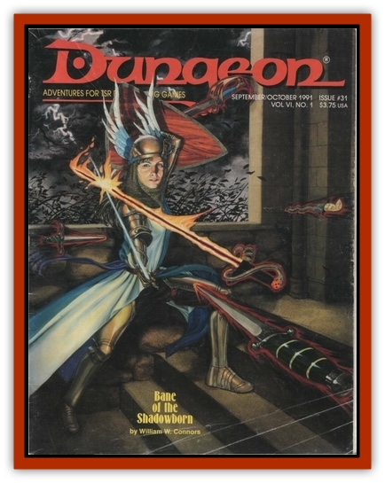

# Minion of Set - Lesser

| Statistic | **Minion of Set, Lesser** |
| --- | --- |
| **Activity Cycle:** | Any |
| **Alignment:** | Lawful evil |
| **Armor Class:** | -2 |
| **Climate/Terrain:** | Any |
| **Damage/Attack:** | By weapon type in human form, or 1-12 (bite) in serpent form |
| **Diet:** | Omnivore |
| **Frequency:** | Uncommon |
| **Hit Dice:** | 3+1 (25hp) |
| **Intelligence:** | Average to high (8-14) |
| **Magic Resistance:** | 10% |
| **Morale:** | Fearless (20) |
| **Movement:** | 12 |
| **No. Appearing:** | 1-20 (or more) |
| **No. of Attacks:** | 3/2 in human form, or 1 in serpent form |
| **Organization:** | Solitary to legion |
| **Size:** | M (6½' in human form, or H (13' long) in serpent form |
| **Special Attacks:** | Entanglment in serpent form |
| **Special Defenses:** | Save as 10th-level warrior |
| **THAC0:** | 11 |
| **Treasure:** | Nil |
| **XP Value:** | 650 |

<a href="minioset">Minions</a> are special servants of the deity Set. These minions usually appear as normal humans or demihumans to do their master's evil bidding. They are usually created from particularly adroit followers of Set, although they can be made by corrupting good beings, using devices like the *Pool of the Dark Stars*.

**Combat:** In human form, a minion of Set will always use a weapon if detection of the monster's true form might ruin its mission. The minion may also assume its natural form of a giant snake, biting for 1-12 hp damage. In addition, any successful biting attack allows the serpent a second to-hit roll to entangle its victim in its coils. The victim is not constricted, but his limbs are pinned and he must make a bend-bars/lift-gates strength roll to free himself; he will be unable to attack otherwise. Failure indicates the victim is trapped for that round, although he may attempt to struggle free in subsequent rounds. Entangled victims may be automatically bitten for maximum damage each round after being captured. Certain special minions of Set have poisonous bites (save vs. poison or take 4-24 hp damage, 2-12 hp if the save is made; XP 1,400).

Minions save as 10th-level fighters, and all possess 10% magic resistance. They never check morale. If magical weapons or useful magical devices are available, they will use them in human form, though magical armor or shields are never used.

**Habitat/Society:** Minions may be found in any society where Set (or his enemies) is worshiped. They may achieve their goals by gaining positions of power in local governments, or plot in other ways against the temples of Osiris and Horus. They have no society of their own but mix with others to spread evil.

**Ecology:** These creatures may evolve from particularly evil beings or be magically created. As such, they fit into the natural world only as subversives and impostors. Though omnivorous, they can go without food and drink indefinitely; tho social customs they must observe when spying on their enemies dictate what they will eat. Minions do not breed and have no urge to collect treasure. If a minion of Set is slain in polymorphed form, it is enveloped in smoke, leaving behind its original, humanoid body.

---
## Discovery & Documentation

**Source Publication:** Dungeon #31 (1991)
**Campaign Setting:** Dungeon Magazine
**Author(s):**
