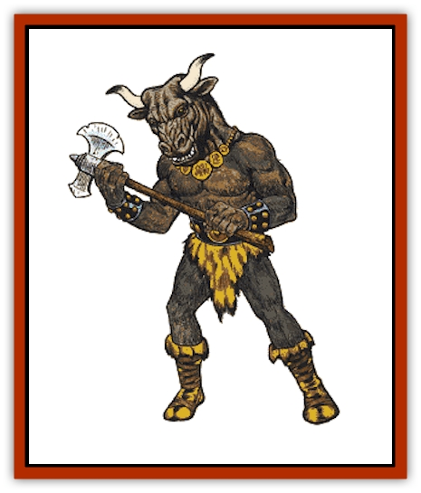

# Minotaur

| Statistic | **Minotaur** |
| --- | --- |
| **Activity Cycle:** | Night |
| **Alignment:** | Chaotic evil |
| **Armor Class:** | 6 |
| **Climate/Terrain:** | Temperate and subtropical labyrinths |
| **Damage/Attack:** | 2-8/2-8 or 1-4/by weapon type |
| **Diet:** | Carnivore (man-eater) |
| **Frequency:** | Rare |
| **Hit Dice:** | 6+3 |
| **Intelligence:** | Low (5-7) |
| **Magic Resistance:** | Nil |
| **Morale:** | Elite (13) + Special |
| **Movement:** | 12 |
| **No. Appearing:** | 1-8 |
| **No. of Attacks:** | 2 |
| **Organization:** | Clan |
| **Size:** | L (7½' tall) |
| **Special Attacks:** | Grapple, charge |
| **Special Defenses:** | +2 bonus on surprise roll |
| **THAC0:** | 13 |
| **Treasure:** | (C) |
| **XP Value:** | 1,400 / Elder: 3,000 |

Minotaurs are either cursed humans or the offspring of minotaurs and humans. They usually dwell in underground labyrinths, for they are not confused in these places, which gives them an advantage over their prey.

Minotaurs are huge, well over 7 feet tall, and quite broad and muscular. They have the head of a [[Mammal_Herd_II|bull]] but the body of a human male. Their fur is brown to black while their body coloring varies as would a normal human's. Clothing is minimal, usually a loin cloth or skirt.

**Combat:** Minotaurs are very strong (equivalent human Strength of 18). Against man-sized opponents (minimum 6 feet tall) they may butt for 2-8 points of damage. Against smaller opponents, they bite for 1-4 points of damage. If a minotaur is 30 feet or more from its opponent, it can lower its head and charge against any creature that is at least 6 feet tall. If successful, the charge causes double head-butt damage. In addition to these attacks, most minotaurs also carry weapons - a huge axe (treat as a halberd) or flail, with which it inflicts normal damage +2.

Minotaurs are not particularly intelligent, but are extremely cunning and have excellent senses. They have a +2 bonus on their surprise rolls, have infravision, and can track prey by scent like a ranger, with 50% accuracy. They always pursue an unfamiliar scent. Minotaurs are immune to maze spells. They attack any intruder without fear, and will retreat only if the creature is obviously beyond their ability to defeat (+3 to morale score in combat).

**Habitat/Society:** Minotaurs live in communities of up to eight members. If the community contains more than six minotaurs, one will be an elder minotaur with 18/50 Strength and 8+4 Hit Dice. The minotaur elder is the clan leader; he remains in the center of the labyrinth and raises young minotaurs while others hunt. He is always encountered in the center of a labyrinth.

A minotaur's labyrinth is rarely natural. Often an evil wizard or a tyrant will construct a labyrinth and place the minotaur family there, feeding it prisoners and slaves on a regular basis.

Occasionally this tyrant will be killed and the minotaurs forced to fend for themselves; since creatures rarely enter a labyrinth on their own accord, these minotaurs will usually be ravenously hungry.

Minotaurs speak their own primitive language and are 25% likely to speak a halting form of common. They have little culture; their lives resemble animals more than humans. Their culture venerates physical strength above all else and particularly strong human fighters have been known to earn their respect. They worship crude gods and have weak clerics (maximum 3rd-level shaman). Rumors persist of more intelligent minotaurs with developed societies.

**Ecology:** The curse which creates minotaurs is unknown, but sages suspect it involves "crimes against the natural order". Minotaurs are always male. It is also said that the first minotaur was originally a great and ill-tempered human fighter; he wanted to be as strong as a bull and his wish was granted in the most hideous manner possible. Minotaurs breed with human females to produce offspring, which are male minotaurs. Minotaurs have a lifespan of 200 years. They can live without food for years at a time, but are always hungry unless they are fed regularly. They are meat-eaters, but their curse causes them to prefer a diet of human flesh. Those transformed into minotaurs by curses may be restored to human form by a *wish*, but those who were born as minotaurs cannot be made human. [[Gnoll|Gnolls]] are their natural enemies; they will kill each other on sight.

Minotaur components are sometimes used in spells and potions, and might be used in magical items involving strength, location, and misdirection.

---
## Discovery & Documentation

**Source Publication:** MC1 Volume I (w/binder #1) (1991)
**Campaign Setting:** Advanced Dungeons & Dragons 2nd Edition
**Author(s):** Jay Batista, Scott Bennie, Grant Boucher, William W. Connors, Steve Gilbert, Heike Kubasch, James Lowder, David Edward Martin, Bruce Nesmith, Jean Rabe, Rick Swan, John J. Terra, Gary L. Thomas

### Other Creatures Found in This Source Book
   * [[Bat|Bat]]
   * [[Bear|Bear]]
   * [[Behir|Behir]]
   * [[Boar|Boar]]
   * [[Bookworm|Bookworm]]
   * [[Brownie|Brownie]]
   * [[Bugbear|Bugbear]]
   * [[Carrion_Crawler|Carrion Crawler]]
   * [[Cat_Great|Cat, Great]]
   * [[Catoblepas|Catoblepas]]
   * [[Dragon_General_Information|Dragon, General Information]]
   * [[Dragonfish|Dragonfish]]
   * [[Elemental_Air_Kin_Aerial_Servant|Elemental, Air Kin, Aerial Servant]]
   * [[Elemental_Earth_Kin_Sandling|Elemental, Earth Kin, Sandling]]
   * [[Elephant|Elephant]]
   * [[Gnoll|Gnoll]]
   * [[Hobgoblin|Hobgoblin]]
   * [[Homunculus|Homunculus]]
   * [[Hornet_Giant|Hornet, Giant]]
   * [[Horse|Horse]]
   * [[Hyena|Hyena]]
   * [[Jackal|Jackal]]
   * [[Jackalwere|Jackalwere]]
   * [[Korred|Korred]]
   * [[Lich|Lich]]
   * [[Lizard|Lizard]]
   * [[Lizard_Man|Lizard Man]]
   * [[Lycanthrope_General_Information|Lycanthrope, General Information]]
   * [[Lycanthrope_Seawolf|Lycanthrope, Seawolf]]
   * [[Lycanthrope_Werebear|Lycanthrope, Werebear]]
   * [[Lycanthrope_Weretiger|Lycanthrope, Weretiger]]
   * [[Lycanthrope_Werewolf|Lycanthrope, Werewolf]]
   * [[Manticore|Manticore]]
   * [[Medusa|Medusa]]
   * [[Mind_Flayer|Mind Flayer]]
   * [[Mudman|Mudman]]
   * [[Mummy|Mummy]]
   * [[Nixie|Nixie]]
   * [[Nymph|Nymph]]
   * [[Ogre|Ogre]]
   * [[Ooze_Slime_Jelly_I|Ooze/Slime/Jelly I]]
   * [[Ooze_Slime_Jelly_II|Ooze/Slime/Jelly II]]
   * [[Orc|Orc]]
   * [[Owl|Owl]]
   * [[Owlbear_I|Owlbear I]]
   * [[Pegasus|Pegasus]]
   * [[Piercer|Piercer]]
   * [[Pudding_Deadly|Pudding, Deadly]]
   * [[Rakshasa|Rakshasa]]
   * [[Rat|Rat]]
   * [[Ray|Ray]]
   * [[Remorhaz|Remorhaz]]
   * [[Satyr|Satyr]]
   * [[Scorpion|Scorpion]]
   * [[Selkie|Selkie]]
   * [[Shadow|Shadow]]
   * [[Skeleton|Skeleton]]
   * [[Skunk|Skunk]]
   * [[Snake|Snake]]
   * [[Spectre|Spectre]]
   * [[Spider|Spider]]
   * [[Sprite|Sprite]]
   * [[Toad_Giant|Toad, Giant]]
   * [[Treant|Treant]]
   * [[Troll|Troll]]
   * [[Umber_Hulk|Umber Hulk]]
   * [[Unicorn|Unicorn]]
   * [[Vampire|Vampire]]
   * [[Wight|Wight]]
   * [[Will_O'Wisp|Will O'Wisp]]
   * [[Wolf|Wolf]]
   * [[Wolfwere|Wolfwere]]
   * [[Wraith|Wraith]]
   * [[Wyvern|Wyvern]]
   * [[Yeti|Yeti]]
   * [[Yuan-ti|Yuan-ti]]
   * [[Zombie|Zombie]]
