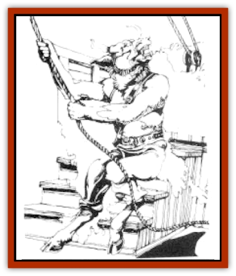

# Minotaur - Krynn

| Statistic | **Minotaur, Krynn** |
| --- | --- |
| **Activity Cycle:** | Any |
| **Alignment:** | Varies, but usually lawful evil |
| **Armor Class:** | 6 (5) |
| **Climate/Terrain:** | Tropical and subtropical/Islands and seacoasts |
| **Damage/Attack:** | 2-8/1-4 (horns and bite) or by weapon |
| **Diet:** | Omnivore |
| **Frequency:** | Rare |
| **Hit Dice:** | 6+3 |
| **Intelligence:** | Varies (5-18) |
| **Magic Resistance:** | See below |
| **Morale:** | Elite (13) |
| **Movement:** | 12 |
| **No. Appearing:** | Patrol: 1-8; Settlement: 20-400 |
| **No. of Attacks:** | 2 |
| **Organization:** | Family |
| **Size:** | L (7-8' tall) |
| **Special Attacks:** | See below |
| **Special Defenses:** | See below |
| **THAC0:** | 13 |
| **Treasure:** | L,M (C) |
| **XP Value:** | Varies |

The [[Minotaur|minotaurs]] of Krynn are a highly organized warrior race primarily occupying the remote islands of Mithas and Kothas. Huge and brutish, the minotaurs believe their destiny is to conquer and enslave the world.

Most of Krynn's minotaurs are informally known as Blood Sea minotaurs, named for the treacherous ocean area in which they are commonly encountered.

The hulking minotaurs exceed 350 pounds in weight and seven feet in height. Short fur covers their massive bodies; a thin fuzz covers their faces and forearms. Their fur ranges from red-brown to near black. Their bullish faces are brutish and ugly, with broad snouts and wide-set eyes. Sharp, curving horns grow from their foreheads to a length of 6-12 inches for the females and one to two feet for the males. Minotaurs have long, wide hands with thick fingers ending in short claws.

Minotaurs usually wear harnesses and skirts made of leather. The harnesses have loops and pockets to carry weapons, and are decorated with military awards and insignia. Some minotaurs wear rings of steel or other precious metals through their noses and ears.

Minotaurs were an oppressed race for much of their early history. They spent many years as slaves of [[Ogre|ogres]], and another long period as slaves of mountain [[Dwarf|dwarves]]. They were enslaved by the Istar Empire until the onset of the Cataclysm, which the minotaurs saw as divine intervention on their behalf.

After the Istar Empire sunk beneath the ocean the minotaurs sailed to the islands of Mithas and Kothas and claimed them for their own. With their new homes separated from the mainlands of Ansalon by the Blood Sea, the minotaurs believed they were at last in a position to become a world-class power.

Minotaurs believe it is their destiny to bring the rest of Krynn under their control. They will go to any lengths to achieve domination. They believe that the weak should perish and that the strong should rule. Minotaur armies are legendary for their ruthlessness. Their laws are harsh and merciless.

However, minotaurs are by no means mindless killers. Many are thoughtful and sophisticated. Some are even gentle. Though dedicated to their own goals, minotaurs will ally with the forces of good if convinced that it best serves their purposes.

**Combat:** Minotaurs are trained from youth for strength, cunning, and intelligence. Minotaurs are violent, brutal fighters, bent on slaughtering their opponents to the last man. Minotaurs view surrender as weakness, and unless they desire slaves or need prisoners for negotiating purposes, opponents who surrender are usually executed on the spot.

The minotaurs' favorite weapons are double-edged axes (dmg 1d10), but they also use flails (+2 damage bonus when used by a minotaur), daggers, and whips. Especially strong minotaurs (those with Strengths of 10 or higher) have been known to use a broad sword in each hand. Armor is leather and use of shields is rare.

Minotaurs can also butt an opponent who is at least six feet tall to inflict 2d4 points of damage. They can bite opponents shorter than six feet to inflict 1d4 points of damage. Minotaurs have excellent senses and can track prey by scent with 50% accuracy when following a trail that is one day old or less. For each day after the trail was made, this chance is reduced by 10%.

**Habitat/Society:** The fundamental principle of minotaur society is that might makes right. The minotaurs are lead by an emperor who resides in the city of Nethosak on the island of Mithas. Under the emperor is a Supreme Circle of eight minotaurs. The Supreme Circle advises the emperor and handles the day-to-day administration of the government. These positions are decided in armed confrontation in the Circus, a combat arena where rivals for the same office fight to the death. Minotaurs claim to have the only truly classless society, since anyone is eligible to become emperor, providing he or she defeats the current emperor in Circus combat. Minotaur clerics worship Sargas, known as Sargonnas to the Solamnics.

Families are the foundation of minotaur society, and the honor of one's family is held supreme above all other considerations. Minotaurs make conscientious parents, supervising the training and education of their offspring from an early age. Female children are offered the same opportunities as males, though females are vastly outnumbered; because of a genetic quirk, three minotaur males are born for every female. When a child reaches the age of 15, he or she engages in non-lethal combat in the Circus, a contest that serves as the minotaur's rite of passage into adult society. Government elders observe the performances of the young minotaurs, then evaluate their aptitude for various sciences and crafts based on a series of oral examinations. The young minotaurs are then assigned roles in their communities to according to their abilities.

Each minotaur community maintains a sizeable number of slaves; most slaves are humans obtained from captured though a few [[Elf|elven]], dwarven, and ogre slaves are also in evidence. Virtually all of a minotaur city's manual labor is performed by slaves. Slave laborers are treated harshly, though not with the wanton cruelty common to [[Draconian_General_Information|draconian]] or ogre masters.

Minotaur justice is equally harsh, with floggings and beatings common for most minor infractions such as theft, infidelity, and assault; for more serious crimes, such as murder, the offender is sentenced to death in the term of gladiatorial combat in their circus. Every month prisoners fight a series of battles in the circus with the winners earning the right to live until the next month's contests. Personal disputes among minotaurs are also settled in the circus; minotaur law forbids the killing of one minotaur by another unless it takes place in the circus. Most minotaurs are strong and also workers; they are particularly fine seafarers. Minotaurs have developed shipbuilding a fine art. Their sturdy - though somewhat sluggish - vessels are a common sight on the waters of the Blood sea; some vessels carry cargo between Mithas and Kothas, others are used for fishing, and still others are commissioned as cargo vessels by human customers. Though minotaurs have no particular affection for humans, they willingly accept money from them.

Piracy is also a common activity for the seafaring minotaurs. They use sleek, light longships plundered from other races for catching and overcoming their victims, since minotaur-made vessels lack the necessary speed and maneuverability.

Advancement in the minotaur navy is dependent in part on the number of plundered ships claimed by a minotaur officer. To the eyes of an outsider, minotaur cities are crude are oppressive places. The streets are paved with dirt that always seems to have the consistency of mud; even in dry seasons the rutted lanes and filly alleys consist of a gooey mire. Most buildings are made of wood, crudely assembled and always unpainted. Wooden foundations are left to rot. When a building collapses, another is constructed in its place.

Most buildings are small clanholds that house families of 3d6 members. Each clanhold has one central room used for eating and other daily activities. The central room contains a large water trough used for both bathing and cooking. Adults have private sleeping areas, separated from the central room by a hanging curtain.

Every block of a minotaur city contains at least one tavern or inn where eating and drinking goes on at all hours of the day and night. Large central shopping districts are the liveliest areas of a city during the daylight hours. Numerous shipyards line the shores of seacoast cities. Most shipyards are manned by dozens of slaves overseen by minotaur masters.

Minotaurs not fortunate enough to live in city dwell in small villages. Villages are haphazard collections of shabby huts centered around a few stone buildings. Some of the stone buildings are temples for the worship of evil gods. The largest stone building is the residence of the local chieftain, who is referred to by the commoners as "Lord". The huts are the hovels in which the commoners live and work.

**Ecology:** Minotaurs frequently battle with various races on the high seas. They have only one natural enemy, the [[Kyrie|kyrie]], whom the minotaurs consider to be trespassers. Battles between these races have raged for centuries, with the minotaurs slowly gaining the upper hand.

Minotaurs produce a variety of products, among the them smoked and canned fish, weapons and armor (particularly leathers armor and shields), wool and woven goods and fine silver jewelry. They are fairly active traders with their solidly constructed war ships in especially high demand. The most commons import is lumber which is always in demand for construction of minotaur ships and buildings. Minotaurs eat a variety of food but they have a special taste for fish, mutton, and raw rains. They also enjoy strong ales and beers.

**Thoradorian Minotaurs**

  Thoradorian minotaurs live isolated villages on the southwestern coasts of Mithas. Thoradorian Minotaurs are considered to be an inferior class of minotaur - lazier, clumsier, and less intelligent than their blood sea cousins. Since all of the Thoradorian overtures for acceptance have been rejected by the bleed sea minotaurs, the Thoradorian minotaurs have been tell to their own devices.

Thoradorian minotaurs are seldom visited by traders or travelers, as they have little of value to trade. Their primary industry is ship building. Through their ships are notable for their size and seaworthiness, similar ships are available from the Blood sea minotaurs at much lower prices.

Most Thoradorian buildings are crude stone structures or caves dug into the mountains. Owing to their love or labyrinths, many homes contain winding passages leading from one room to the next. Natural cavern labyrinths serve as Thoradorian versions of the circus.

---
## Discovery & Documentation

**Source Publication:** MC4 Dragonlance Appendix (w/binder #2) (1989)
**Campaign Setting:** Dragonlance
**Author(s):** Rick Swan

### Other Creatures Found in This Source Book
   * [[Anemone_Giant_Sea|Anemone, Giant Sea]]
   * [[Bear_Ice|Bear, Ice]]
   * [[Beast_Undead|Beast, Undead]]
   * [[Bird_Krynn|Bird (Krynn)]]
   * [[Disir|Disir]]
   * [[Draconian_Aurak|Draconian, Aurak]]
   * [[Draconian_Baaz|Draconian, Baaz]]
   * [[Draconian_Bozak|Draconian, Bozak]]
   * [[Draconian_Kapak|Draconian, Kapak]]
   * [[Draconian_General_Information|Draconian, General Information]]
   * [[Draconian_Sivak|Draconian, Sivak]]
   * [[Draconian_Proto-_Traag|Draconian, Proto-, Traag]]
   * [[Dragon_Amphi|Dragon, Amphi]]
   * [[Dragon_Astral|Dragon, Astral]]
   * [[Dragon_Kodragon|Dragon, Kodragon]]
   * [[Dragon_Krynn_Othlorx_General_Information|Dragon (Krynn), Othlorx, General Information]]
   * [[Dragon_Krynn_General_Information|Dragon (Krynn), General Information]]
   * [[Dragon_Sea|Dragon, Sea]]
   * [[Dreamshadow|Dreamshadow]]
   * [[Dreamwraith|Dreamwraith]]
   * [[Dwarf_Daergar|Dwarf, Daergar]]
   * [[Dwarf_Hill_Neidar|Dwarf, Hill, Neidar]]
   * [[Dwarf_Mountain_Hylar|Dwarf, Mountain, Hylar]]
   * [[Dwarf_Theiwar|Dwarf, Theiwar]]
   * [[Dwarf_Zakhar|Dwarf, Zakhar]]
   * [[Elf_Half-|Elf, Half-]]
   * [[Elf_High_Qualinesti|Elf, High, Qualinesti]]
   * [[Elf_High_Silvanesti|Elf, High, Silvanesti]]
   * [[Elf_Sea_Dargonesti|Elf, Sea, Dargonesti]]
   * [[Elf_Sea_Dimernesti|Elf, Sea, Dimernesti]]
   * [[Elf_Wild_Kagonesti|Elf, Wild, Kagonesti]]
   * [[Eyewing|Eyewing]]
   * [[Fetch|Fetch]]
   * [[Fire_Minion|Fire Minion]]
   * [[Fireshadow|Fireshadow]]
   * [[Gnome_Tinker|Gnome, Tinker]]
   * [[Gurik_Cha'ahl|Gurik Cha'ahl]]
   * [[Haunt_Knight|Haunt, Knight]]
   * [[Horax|Horax]]
   * [[Human_Krynn|Human (Krynn)]]
   * [[Imp_Blood_Sea|Imp, Blood Sea]]
   * [[Kalothagh|Kalothagh]]
   * [[Kani_Doll|Kani Doll]]
   * [[Kender|Kender]]
   * [[Kyrie|Kyrie]]
   * [[Lizard_Man_Krynn|Lizard Man (Krynn)]]
   * [[Ogre_High|Ogre, High]]
   * [[Ogre_Krynn|Ogre (Krynn)]]
   * [[Phaethon|Phaethon]]
   * [[Saqualaminoi|Saqualaminoi]]
   * [[Shadowperson|Shadowperson]]
   * [[Shimmerweed|Shimmerweed]]
   * [[Skrit|Skrit]]
   * [[Spectral_Minion|Spectral Minion]]
   * [[Spider_Krynn|Spider (Krynn)]]
   * [[Stag|Stag]]
   * [[Tayling|Tayling]]
   * [[Thanoi|Thanoi]]
   * [[Tylor|Tylor]]
   * [[Wichtlin|Wichtlin]]
   * [[Wyndlass|Wyndlass]]
   * [[Yaggol|Yaggol]]
