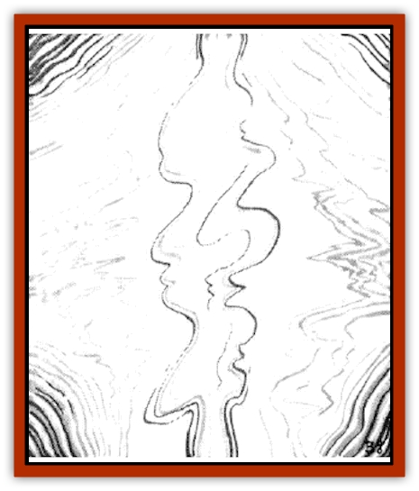

# Misi

| Statistic | **Misi** |
| --- | --- |
| **Activity Cycle:** | Any |
| **Alignment:** | Chaotic neutral |
| **Armor Class:** | 0 |
| **Climate/Terrain:** | Wildspace/phlogiston |
| **Damage/Attack:** | Special |
| **Diet:** | Magical energy |
| **Frequency:** | Very rare |
| **Hit Dice:** | 5 |
| **Intelligence:** | Very (11-12) |
| **Magic Resistance:** | 10% |
| **Morale:** | Unsteady (7) |
| **Movement:** | 12 (through any medium) (or SR 5) |
| **No. Appearing:** | 1-6 |
| **No. of Attacks:** | 1 (for entire pack) |
| **Organization:** | Pack |
| **Size:** | S (3' tall) |
| **Special Attacks:** | See below |
| **Special Defenses:** | Injured only by spells |
| **THAC0:** | N/A |
| **Treasure:** | Nil |
| **XP Value:** | 975 |

When a party encounters a pack of misi, always roll 1d6 to determine the number present, as the number of misi encountered may have a serious effect on any combat that follows.

Misi do not exist in three of the four dimensions that humans and humanoids are capable of sensing. They have no physical manifestations in terms of length, width, or height. Instead, they exist solely in the fourth through sixth dimensions. Consequently, they cannot be injured by any form of physical attack, although they can be contacted and affected by magic.

Occasionally, misi can be glimpsed in the spacial dimensions as rainbow-colored scintillations of indistinct shape, but for no more than a few moments at a time. Such apparences can occur anyplace - on the surface of a planet, in the depths of wildspace, or even out on the phlogiston ocean. However, mist are almost always seen near spelljammer ships, for they are attracted to the magical emanations associated with the spacefaring craft.

**Combat:** The misi have no direct means of inflicting physical injury on ordinary beings. Instead, the misi rely on an indirect method to defend themselves - intefering with any magic being used at the time, especially magic powering the spelljammer ships.

When the misi attack, they always do so as a group, making a single attack no matter how many of them are involved. Their attack comes in one of two forms: They either interfere with spelljammer navigation, or they try to alter any spell being cast at the time. In either case, to see if the misi's attack is successful, roll an Intelligence check for the character casting the spell or using the spelliammer helm. If the user/wearer passes the check, he has repelled the misi attack. Otherwise, the misi are successful. To determine the results of a successful mist attack, consult the following table in the next column.

The misi cannot be injured by any sort of physical attack, including those made with magical weapons. They are vulnerable only to damage from spells, and then only if an individual misi can be located to have the spell cast at it.

Characters attempting to locate a misi have a percentage chance equal to three times their Intelligence score of spotting a misi's scintillating body for one round. For example, a character with an Intelligence score of 10 has a 30% chance of spying a misi, and a character with a Intelligence of 18 has a 54% chance. Misi cannot be detected by means of a *detect invisible* spell, but they can be located by use of a *locate animal*, *locate object*, or *ESP* spell.

| No. of Misi | Effect on Spell or Caster | Effect on Spelljammer Ship |
| --- | --- | --- |
| 1 | Negates spell | Drifts off course |
| 2 | Spell affects random PC | Stops dead |
| 3 | Caster takes any spell damage | Accelerate toward hazard (planet, asteroids, star) |
| 4 | Caster loses magic for 1 day | Ship loses gravity |
| 5 | Caster suffers 5d10 damage | Ship's air becomes deadly |
| 6 | Caster dies; save to negate | Ship explodes and breaks up, crew suffers 1d12 damage apiece |

**Habitat/Society:** Misi live in small family grottos in the fourth, fifth, and sixth dimensions. They cannot see into the first three dimensions any better than the PCs can see into the fourth, fifth, and sixth. They are aware of PCs only as vague shadows. They have absolutely no interest in characters inhabiting the first three dimensions, save when those characters are using magic.

**Ecology:** Misi feed on magical emanations and are therefore attracted to spelljamming ships. When misi attach themselves to a ship, they flit about the rudder, rigging, and decks, occasionally becoming visible as scintillating manifestations of light. They feed for 1d10 turns. During this time, the spelljammer's SR is reduced by 1 per round (that's right, per round!) of feeding. When the SR drops below 1, the ship drops out of spelljamming speed and is stranded until the misi finish feeding.

---
## Discovery & Documentation

**Source Publication:** MC7 Spelljammer Appendix I (1990)
**Campaign Setting:** Advanced Dungeons & Dragons 2nd Edition
**Author(s):** various

### Other Creatures Found in This Source Book
   * [[Aartuk|Aartuk]]
   * [[Albari|Albari]]
   * [[Ancient_Mariner|Ancient Mariner]]
   * [[Argos|Argos]]
   * [[Beholder_Abomination_Astereater|Beholder (Abomination), Astereater]]
   * [[Blazozoid|Blazozoid]]
   * [[Chattur|Chattur]]
   * [[Chevall|Chevall]]
   * [[Clockwork_Horror|Clockwork Horror]]
   * [[Colossus|Colossus]]
   * [[Delphinid|Delphinid]]
   * [[Dizantar|Dizantar]]
   * [[Dog|Dog]]
   * [[Dog_Bog_Hound|Dog, Bog Hound]]
   * [[Esthetic|Esthetic]]
   * [[Focoid|Focoid]]
   * [[Fractine|Fractine]]
   * [[Giant_Spacesea|Giant, Spacesea]]
   * [[Golem_Furnace|Golem, Furnace]]
   * [[Golem_Radiant|Golem, Radiant]]
   * [[Gravislayer|Gravislayer]]
   * [[Grommam|Grommam]]
   * [[Hadozee|Hadozee]]
   * [[Hamster_Giant_Space|Hamster, Giant Space]]
   * [[Jammer_Leech|Jammer Leech]]
   * [[Lakshu|Lakshu]]
   * [[Lumineaux|Lumineaux]]
   * [[Lutum|Lutum]]
   * [[Mimic_Space|Mimic, Space]]
   * [[Moon_Rogue|Moon, Rogue]]
   * [[Mortiss|Mortiss]]
   * [[Murderoid|Murderoid]]
   * [[Nay-Churr|Nay-Churr]]
   * [[Phlog-Crawler|Phlog-Crawler]]
   * [[Plasman|Plasman]]
   * [[Plasmoid_DeGleash|Plasmoid, DeGleash]]
   * [[Plasmoid_DelNoric|Plasmoid, DelNoric]]
   * [[Plasmoid_General_Information|Plasmoid, General Information]]
   * [[Plasmoid_Ontalak|Plasmoid, Ontalak]]
   * [[Puffer|Puffer]]
   * [[Q'nidar|Q'nidar]]
   * [[Rastipede|Rastipede]]
   * [[Reigar|Reigar]]
   * [[Rock_Hopper|Rock Hopper]]
   * [[Slinker|Slinker]]
   * [[Spider_Asteroid|Spider, Asteroid]]
   * [[Spiritjam|Spiritjam]]
   * [[Survivor|Survivor]]
   * [[Syllix|Syllix]]
   * [[Symbiont_Power|Symbiont, Power]]
   * [[Vine_Infinity|Vine, Infinity]]
   * [[Wiggle|Wiggle]]
   * [[Wizshade|Wizshade]]
   * [[Wryback|Wryback]]
   * [[Zard|Zard]]
   * [[Zodar|Zodar]]
