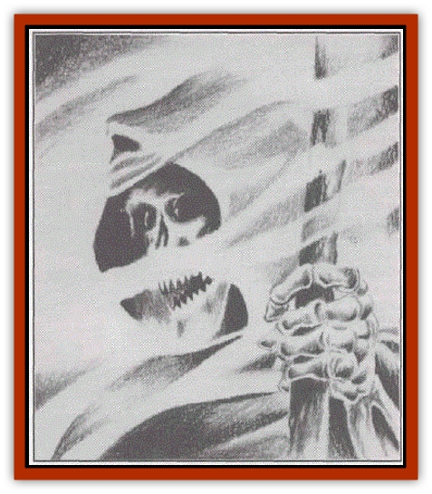

# Mist Ferryman

| Statistic | **Mist Ferryman** |
| --- | --- |
| **Activity Cycle:** | Foggy days or nights |
| **Alignment:** | Neutral evil |
| **Armor Class:** | 3 |
| **Climate/Terrain:** | Mists and fog banks |
| **Damage/Attack:** | 1d6/1d6/1d8 |
| **Diet:** | Carnivore |
| **Frequency:** | Rare |
| **Hit Dice:** | 4 |
| **Intelligence:** | Low (5-7) |
| **Magic Resistance:** | Nil |
| **Morale:** | Average (8-10) |
| **Movement:** | 12 |
| **No. Appearing:** | 1 |
| **No. of Attacks:** | 3 |
| **Organization:** | Solitary |
| **Size:** | M (6' tall) |
| **Special Attacks:** | Disease |
| **Special Defenses:** | +1 or better weapons to hit |
| **THAC0:** | 17 |
| **Treasure:** | Nil |
| **XP Value:** | 420 |

Some call these spectral ambassadors of Ravenloft [[Grim_Reaper|grim reapers]], confusing them with those sinister creatures.

The mist ferrymen are frightful beasts, appearing as skeletal parodies of normal humans. Their mouths are full of sharp incisors which often have bits of rotting flesh caught between them. An unwary traveler can almost never see their full form, because swirling clouds of mist hide the shape of the creature, allowing only glimpses of its horrifying figure.

Mist ferrymen seem unhindered by language, apparently having the ability to speak with any sentient creature they encounter. Their hollow, sinister voices give an instant impression of death, however, which none can deny.

**Combat:** Mist Ferrymen are foul creatures of the Ravenloft Mists, haunting the Misty Borders of the Core and the Islands. They prey on the travelers in the mists, occasionally cooperating to bring down the more powerful specimens. They are mostly solitary creatures and attack any interlopers in their territory, including other Ferrymen and even an occasional [[Human_Vistana|Vistani]] tribe.

When one of these creatures needs help to defeat an invader it issues a strange, ululating howl, sounding like the sobbing of a frightened woman. This attracts all other ferrymen within 2 miles (usually 1d8+1). These arrive in five rounds, traveling through the mists with preternatural speed.

Their method of travel is somewhat unclear, as no one has ever seen one in transit. Perhaps they assume the form of fog and speed through the mists which surround them, re-forming when they reach their destination. They never use this ability in combat, so there is no proof they use this method of transit.

When they appear, they fall upon their victims, tearing at them with their sharp claws and powerful teeth. Any who receive damage from these must successfully save vs. poison or suffer from a debilitating disease. The victims lose 1 point of Constitution per week unless a cure disease spell is cast upon them. Lost Constitution points are regained at a rate of 1 point per day. If a victim reaches 0 hit points, he becomes a mist ferryman himself after three days.

Ferrymen attempt to keep their victim alive as long as possible, for they relish the flow of the living blood as well as the flavor of the struggling flesh and muscle. They often attempt to overbear their victims, overwhelming them with sheer numbers, at which point they take turns eating.

Mist ferrymen can be turned as ghosts and have the usual undead resistance to spells like *charm*, *sleep*, and *hold*. Holy water does not harm them but contact with a lawful good holy symbol will inflict 1d4 points of damage to them.

**Habitat/Society:** Although usually solitary creatures, mist ferrymen occasionally band together for hunting purposes.

It seems that they have somehow acquired the ability to travel anywhere they desire in the Mists, but it is not known just what gives them this power.

If one subdues a ferryman in combat, it is possible to force the creature to lead the way to a desired destination within Ravenloft. There is no way to make a ferryman take someone out of the demiplane, although there are those who say that the secret of escape from Ravenloft is known to these undead creatures.

**Ecology:** It is sometimes said that mist ferrymen are manifestations of the Mists themselves, lesser forms that sometimes serve the whims of the lords. Their ability to cause the mists to work for them lends credence to this theory, but there are many factors that count against it as well.

---
## Discovery & Documentation

**Source Publication:** Ravenloft Appendix III (1991)
**Campaign Setting:** Ravenloft
**Author(s):** Kirk Botulla

### Other Creatures Found in This Source Book
   * [[Akikage|Akikage]]
   * [[Animator_Common|Animator, Common]]
   * [[Animator_Greater|Animator, Greater]]
   * [[Animator_Minor|Animator, Minor]]
   * [[Animator_General_Information|Animator, General Information]]
   * [[Bakhna_Rakhna|Bakhna Rakhna]]
   * [[Baobhan_Sith|Baobhan Sith]]
   * [[Beetle_Scarab|Beetle, Scarab]]
   * [[Boneless|Boneless]]
   * [[Boowray|Boowray]]
   * [[Bruja|Bruja]]
   * [[Carrionette|Carrionette]]
   * [[Carrion_Stalker|Carrion Stalker]]
   * [[Cat_Midnight|Cat, Midnight]]
   * [[Cat_Skeletal|Cat, Skeletal]]
   * [[Cloaker_Resplendent|Cloaker, Resplendent]]
   * [[Cloaker_Shadow|Cloaker, Shadow]]
   * [[Cloaker_Undead|Cloaker, Undead]]
   * [[Corpse_Candle|Corpse Candle]]
   * [[Death's_Head_Tree|Death's Head Tree]]
   * [[Doppelganger_Ravenloft|Doppelganger (Ravenloft)]]
   * [[Familiar_Pseudo-|Familiar, Pseudo-]]
   * [[Familiar_Undead|Familiar, Undead]]
   * [[Feathered_Serpent|Feathered Serpent]]
   * [[Fenhound|Fenhound]]
   * [[Figurine_Ceramic|Figurine, Ceramic]]
   * [[Figurine_Crystal|Figurine, Crystal]]
   * [[Figurine_Ivory|Figurine, Ivory]]
   * [[Figurine_Obsidian|Figurine, Obsidian]]
   * [[Figurine_Porcelain|Figurine, Porcelain]]
   * [[Figurine_General_Information|Figurine, General Information]]
   * [[Fleas_of_Madness|Fleas of Madness]]
   * [[Furies|Furies]]
   * [[Geist|Geist]]
   * [[Ghost_Animal|Ghost, Animal]]
   * [[Golem_Flesh_Ravenloft|Golem, Flesh (Ravenloft)]]
   * [[Golem_Mist_Ravenloft|Golem, Mist (Ravenloft)]]
   * [[Golem_Wax_Ravenloft|Golem, Wax (Ravenloft)]]
   * [[Gremishka|Gremishka]]
   * [[Hag_Spectral|Hag, Spectral]]
   * [[Head_Hunter|Head Hunter]]
   * [[Hearth_Fiend|Hearth Fiend]]
   * [[Hebi-No-Onna|Hebi-No-Onna]]
   * [[Hound_Phantom|Hound, Phantom]]
   * [[Hound_Skeletal|Hound, Skeletal]]
   * [[Imp_Wishing|Imp, Wishing]]
   * [[Ivy_Crawling|Ivy, Crawling]]
   * [[Jack_Frost|Jack Frost]]
   * [[Jolly_Roger|Jolly Roger]]
   * [[Kizoku|Kizoku]]
   * [[Lashweed|Lashweed]]
   * [[Leech_Magical|Leech, Magical]]
   * [[Leech_Psionic|Leech, Psionic]]
   * [[Lich_Defiler|Lich, Defiler]]
   * [[Lich_Drow|Lich, Drow]]
   * [[Lich_Elemental|Lich, Elemental]]
   * [[Lich_Psionic|Lich, Psionic]]
   * [[Living_Tattoo|Living Tattoo]]
   * [[Lycanthrope_Loup-garou|Lycanthrope, Loup-garou]]
   * [[Lycanthrope_Werejackal|Lycanthrope, Werejackal]]
   * [[Lycanthrope_Werejaguar_Ravenloft|Lycanthrope, Werejaguar (Ravenloft)]]
   * [[Lycanthrope_Wereleopard|Lycanthrope, Wereleopard]]
   * [[Lycanthrope_Wereray|Lycanthrope, Wereray]]
   * [[Moor_Man|Moor Man]]
   * [[Obedient|Obedient]]
   * [[Odem|Odem]]
   * [[Paka|Paka]]
   * [[Plant_Blood_Rose|Plant, Blood Rose]]
   * [[Plant_Fearweed|Plant, Fearweed]]
   * [[Radiant_Spirit|Radiant Spirit]]
   * [[Recluse|Recluse]]
   * [[Remnant_Aquatic|Remnant, Aquatic]]
   * [[Rushlight|Rushlight]]
   * [[Sea_Spawn_Master|Sea Spawn, Master]]
   * [[Sea_Spawn_Minion|Sea Spawn, Minion]]
   * [[Shadow_Asp|Shadow Asp]]
   * [[Shattered_Brethren|Shattered Brethren]]
   * [[Skeleton_Archer|Skeleton, Archer]]
   * [[Skeleton_Insectoid|Skeleton, Insectoid]]
   * [[Skin_Thief|Skin Thief]]
   * [[Spirit_Psionic|Spirit, Psionic]]
   * [[Strahd_Skeleton|Strahd Skeleton]]
   * [[Strahd_Zombie|Strahd Zombie]]
   * [[Unicorn_Shadow|Unicorn, Shadow]]
   * [[Vampire_Drow|Vampire, Drow]]
   * [[Vampire_Nosferatu|Vampire, Nosferatu]]
   * [[Vampire_Oriental|Vampire, Oriental]]
   * [[Virus_General_Information|Virus, General Information]]
   * [[Virus_I|Virus I]]
   * [[Virus_II|Virus II]]
   * [[Virus_III|Virus III]]
   * [[Vorlog|Vorlog]]
   * [[Will_O'Dawn|Will O'Dawn]]
   * [[Will_O'Deep|Will O'Deep]]
   * [[Will_O'Mist|Will O'Mist]]
   * [[Will_O'Sea|Will O'Sea]]
   * [[Zombie_Cannibal|Zombie, Cannibal]]
   * [[Zombie_Desert|Zombie, Desert]]
   * [[Zombie_Wolf|Zombie Wolf]]
   * [[Zombie_Fog|Zombie Fog]]
