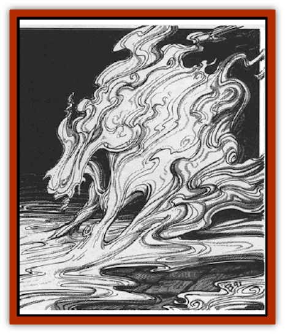

# Mist Horror

| Statistic | **Common** | **Wandering** |
| --- | --- | --- |
| **Activity Cycle:** | Any | Any |
| **Alignment:** | Neutral evil | Chaotic evil |
| **Armor Class:** | 2 | 0 |
| **Climate/Terrain:** | Ravenloft mists | Ravenloft mists |
| **Damage/Attack:** | 2d6/2d6 | 2d6/2d6 |
| **Diet:** | None | None |
| **Frequency:** | Common | Uncommon |
| **Hit Dice:** | 5 | 5 |
| **Intelligence:** | Low (5-7) | Average (8-10) |
| **Magic Resistance:** | 50% | 50% |
| **Morale:** | Steady (11-12) | Steady (11-12) |
| **Movement:** | 15 | 15 |
| **No. Appearing:** | 1 | 1 |
| **No. of Attacks:** | 2 | 2 |
| **Organization:** | Solitary | Solitary |
| **Size:** | Varies | Varies |
| **Special Attacks:** | See below | See below |
| **Special Defenses:** | See below | See below |
| **THAC0:** | 15 | 15 |
| **Treasure:** | Nil | Nil |
| **XP Value:** | 3,000 | 5,000 |

Mist horrors lurk in the swirling banks of fog that encompass all of Ravenloft. Any creature who lingers too long in the mist is sure to draw the attentions, and earn the wrath, of these horrid creatures.

While their presence is often sensed as they move by a party just outside of visual range - an unusual ripple in the vapors to one side, a strange sensation of some lurking presence - they do not allow themselves to be seen until they attack. When they do make their presence known, their form can be greatly varied, though they always appear to be made of mist. While a horror is generally man-sized, it can take any shape it desires, usually taking on a form that it knows (from an empathic probe of the victim's mind) will cause terror. Thus, persons afraid of wolves would find themselves facing a six-foot-long wolf composed of billowing fog.

Mist horrors appear to be able to communicate teleempathically with anyone moving through the Ravenloft Mists. Thus, when they are about to attack or are stalking someone, they will send feelings of dread and fear into their minds. In addition, they often use this power to entice person outside of the mists to enter them. Communication in this manner consists of feelings and impressions rather than solid understanding. Someone being called into the mists by the foul spirits might begin to feel an mild fascination with the billowing clouds of vapor. Eventually, this interest grows into a consuming need to enter the mists.

**Combat:** It takes a mist horror some time (generally 1d4 turns) to assemble its physical form and attack someone travelling through the mists. Thus, those who keep moving are safe from harm as a mist horror is very restricted in its own movement and must remain within a small area. A mist horror will often use its telempathic power to make travellers feel that they are safe and can rest without danger. Once they stop moving, of course, it attacks.

When a mist horror attacks it is likely to catch its victims off guard. This is largely due to the fact that it can spring out of the swirling vapors (in which it is treated as if it were *invisible*) without warning. Once a mist horror assumes its combat shape (whatever form that may be), it is easy enough to detect, although it can, at will, break off from combat and return to the mists, effectively becoming *invisible* again. When a mist horror opts to do this (or before it assumes a combat form), it is protected from any attack as its essence disperses through the mists. However, it requires 1d4 turns to reform.

When in combat, the horror will attack in whatever manner seems appropriate for its form. Because of the mystic nature of this being, however, the number of attacks it is entitled to and the damage it inflicts remain constant (two attacks at 2d6 points each). Thus, if the horror appears as a vast, six-tentacled creature only two of its limbs would strike each round.

Because of its almost insubstantial nature, the mist horror can be hit only by +2 or better magical weapons. Further, it has an innate magic resistance (50%) that not only protects it, but radiates into an area 20' around it, canceling the effects of all spells cast in its presence. Because this magic resistance takes the form of a mental wave that affects the minds of spell casters and upsets their ability to properly direct magical influences, it has no effect on magical items. Thus, a *fireball* spell directed at a mist horror has a 50% chance of failure while a *wand of fireballs* will work normally. Magical effects already in place (such as infravision) do not falter when they enter this aura. Spells cast within the aura must overcome both the magical resistance of the target and the effects of the spell disruption field.

Mist horrors are, in a sense, a form of undead. They can be turned as if they were "special" creatures by high-level priests and paladins. They suffer no damage from spells designed to affect undead (*negative plane protection*, for example) and are immune to the effects of holy water. They cannot be *charmed* or controlled in any way and have no physical forms to be affected by spells like *cause blindness* or *cause light wounds*.

**Habitat/Society:** Mist horrors are the spirits of evil beings who, while not foul enough to receive their own domain, attracted the attention of the Dark Powers with their diabolical arts during life. Upon their deaths, their spirits leave their bodies to enter the mists. Throughout Ravenloft, there is a superstition that anyone buried on a foggy day will become a mist horror. This may or may not be true, but the [[Human_Vistana|Vistani]] themselves seem to take this belief very seriously and that lends great credence to it in the eyes of many.

Once it becomes a mist horror, the evil spirit is unable to move about freely. Like the various lords scattered throughout Ravenloft, the mist horror must remain in one area. As a rule, this region is very small. Thus, as mentioned earlier, the time required for the horror to assume a dangerous form makes it possible for explorers moving through the Ravenloft Mists to avoid attack if they do not linger too long in any one place.

Because mist horrors know that they were judged to be less important than the lords of even the smallest domain, they envy them their comparative freedom and power. This hostility burns within them, making them more and more evil as time goes by. Thus, when a mist horror is encountered, it is a foul and spiteful spirit that seeks only to cause pain and suffering. If a party travelling through the mists is bearing wounded, infirm, or otherwise defenseless beings with them, these will often be the first target of a mist horror's attack. By destroying the persons who have entrusted their well being to the might of other party members, the horrors hope to shatter the morale of the entire group.

**Ecology:** As mentioned above, mist horrors are the spirits of evil beings who did not merit a place as lord of their own domain. The Vistani say they serve a vital role in maintaining the structure of Ravenloft and that the very land itself could not exist without their lingering presence. Whether this is true or not, no outsider can say.

## Wandering Horrors

The wandering horror is an even more dangerous, though thankfully rarer, version of the mist horror. Unlike the traditional mist horror, it is not rooted in a given place and can travel through the Ravenloft Mists at will in search of victims. When it attacks, it is every bit as evil and malicious as its kindred spirit.

Wandering horrors appear as dark shapes that can be seen as they move through the mists. Unlike mist horrors, they are locked into a single shape - one that is based on the evil deed they did in life. For example, a cruel baron who ordered those he considered disloyal beheaded might well appear as a wandering figure without a head while a woman who murdered her lover with a poisonous spider might appear as a giant black widow. The wandering horror looks much like a heat mirage, for its body seems to ripple and shift from second to second. This effect is a reflection of its spiritual nature and the twisted shape of its soul.

Wandering horrors employ the same telempathic communication used by their lesser cousins, but are also able to use this power to implant a *suggestion* (once per day) in the minds of their victims. In order to be affected by this power, the target must be within 120 feet of the horror.

**Combat:** When moving through the mists in an effort to position itself for an attack, the wandering horror is 75% unlikely to be detected. Once it attacks, however, it is fully visible to all its opponents. If it wishes to break away from combat, it may do so by attempting to vanish into the mists again (75% chance of success). Thereafter, it returns to its virtually undetectable state. When a wandering horror attacks a person that has not detected it, it imposes a -3 on their surprise check.

In combat, the wandering horror has the same attacks and defenses as the traditional mist horror (two attacks for 2d6 points of damage each). It can also send out a wave of fear with its telempathic power. While this can be attempted only once per day, it causes all those within 120 feet to make a fear check. Since a failed fear check often has the result of scattering a party that might otherwise destroy the wanderer, it will always use this power (if possible) on the first round of combat (or the second if it makes a surprise attack).

The wandering horror can only be hit by +2 or better magical weapons and has the same magical resistance as the mist horror. This magic resistance functions in the exact same way, affecting spell casters but not magical items, save that it has a greater area of effect (30 feet).

A wandering horror can be turned by priests and paladins as if it were a "special" undead creature. If a character attempts to turn it and fails, however, they are subject to a special telempathic backlash that causes them to make a fear check at a -2 penalty.

Wandering horrors suffer no damage from spells designed to affect undead (*negative plane protection*, for example) and are immune to the effects of holy water. They cannot be *charmed* or controlled in any way and have no physical forms to be affected by spells like *cause blindness* or *cause light wounds*.

**Habitat/Society:** The wandering horror is an evolutionary step above the mist horror. In essence, a mist horror is the evil soul of a being foul enough to draw the attention of the Dark Powers, but not so evil as to be rewarded/cursed with their own domain. After a period of time as a mist horror, however, this spirit may have caused enough fear and suffering (in short, done enough evil) to be elevated to the status of wandering horror.

Wandering horrors share the same vile and sadistic mannerisms as their lesser brethren. If anything, in fact, they are far more evil and dangerous as they generally hope to prove themselves dark and foul enough to earn their own domain and escape the limbo in which they now dwell.

**Ecology:** Wandering horrors seem to be as much a part of the fabric of Ravenloft as mist horrors. There are those who say that the destruction of a wandering horror weakens all of the evil things in Ravenloft slightly. Of course, as evil things are constantly dying and becoming mist horrors, this less-than-insignificant drop in power is quickly replenished.

**Pseudo-horrors**

  In addition to the true mist horrors that lurk in the boiling vapors that surround Ravenloft, there are the pseudo-horrors. These are simply beings travelling through the mists for one reason or another. In most cases, they have wandered in through a portal from some other land and are seeking escape. Because these temporary, one-way entrances to Ravenloft often appear near an evil thing, and then close again behind it, the number of pseudo-horrors in the mists can be quite large.

A pseudo-horror is, therefore, not a distinct creature but rather any monster that has become trapped in the Ravenloft Mists and is seeking either prey or escape. Most often, they are spectral things (like [[Ghost|ghosts]], [[Wraith|wraiths]], and [[Shadow_Fiend|shadow fiends]]) although occasional physical monsters ([[Ghoul|ghouls]], [[Vampire_General_Information|vampires]], [[Mind_Flayer|mind flayers]], and the like) are encountered. As a rule, nearly all (85%) of the things a party of explorers encounters in the Mists of Ravenloft can be assumed to be evil, for such creatures are naturally drawn into the demiplane of terror. Those creatures that are not evil, however, are almost certain to be hostile to or wary of strangers, for one seldom comes across friends in the dreaded Mists of Ravenloft.

---
## Discovery & Documentation

**Source Publication:** MC10 Ravenloft Appendix I (1989)
**Campaign Setting:** Planescape
**Author(s):** William W. Connors

### Other Creatures Found in This Source Book
   * [[Bastellus|Bastellus]]
   * [[Bat_Ravenloft|Bat (Ravenloft)]]
   * [[Bowlyn|Bowlyn]]
   * [[Broken_One|Broken One]]
   * [[Bussengeist|Bussengeist]]
   * [[Darkling|Darkling]]
   * [[Doom_Guard|Doom Guard]]
   * [[Doppelganger_Plant|Doppelganger Plant]]
   * [[Elemental_Ravenloft|Elemental (Ravenloft)]]
   * [[Ermordenung|Ermordenung]]
   * [[Ghoul_Lord|Ghoul Lord]]
   * [[Goblyn|Goblyn]]
   * [[Golem_III|Golem III]]
   * [[Golem_IV|Golem IV]]
   * [[Golem_Ravenloft|Golem (Ravenloft)]]
   * [[Grim_Reaper|Grim Reaper]]
   * [[Human_Abber_Nomad|Human, Abber Nomad]]
   * [[Human_Ravenloft|Human (Ravenloft)]]
   * [[Imp_Assassin|Imp, Assassin]]
   * [[Impersonator|Impersonator]]
   * [[Lycanthrope_Werebat|Lycanthrope, Werebat]]
   * [[Lycanthrope_Wereraven|Lycanthrope, Wereraven]]
   * [[Mummy_Greater|Mummy, Greater]]
   * [[Quevari|Quevari]]
   * [[Quickwood|Quickwood]]
   * [[Ravenkin|Ravenkin]]
   * [[Reaver|Reaver]]
   * [[Scarecrow_Ravenloft|Scarecrow (Ravenloft)]]
   * [[Shadow_Fiend|Shadow Fiend]]
   * [[Skeleton_Giant|Skeleton, Giant]]
   * [[Strahd's_Skeletal_Steed|Strahd's Skeletal Steed]]
   * [[Treant_Evil|Treant, Evil]]
   * [[Treant_Undead|Treant, Undead]]
   * [[Valpurgeist|Valpurgeist]]
   * [[Vampire_Dwarf|Vampire, Dwarf]]
   * [[Vampire_Elf|Vampire, Elf]]
   * [[Vampire_Gnome|Vampire, Gnome]]
   * [[Vampire_Halfling|Vampire, Halfling]]
   * [[Vampire_General_Information|Vampire, General Information]]
   * [[Vampire_Kender|Vampire, Kender]]
   * [[Vampyre|Vampyre]]
   * [[Widow_Red|Widow, Red]]
   * [[Wolfwere_Greater|Wolfwere, Greater]]
   * [[Zombie_Lord|Zombie Lord]]
