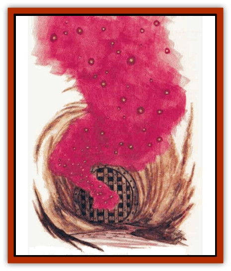

# Mist - Scarlet Dancer

| Statistic | **Mist, Scarlet Dancer** |
| --- | --- |
| **Activity Cycle:** | Any |
| **Alignment:** | Neutral |
| **Armor Class:** | 1 (8 after feeding) |
| **Climate/Terrain:** | Swamps/sewers |
| **Damage/Attack:** | 1d3 per Hit Die |
| **Diet:** | Carnivore |
| **Frequency:** | Rare |
| **Hit Dice:** | 1 per 10 present |
| **Intelligence:** | Semi- (2-4) |
| **Magic Resistance:** | Nil |
| **Morale:** | Champion (15-16) |
| **Movement:** | Fl 24 (A) (Fl 12 (B) after feeding) |
| **No. Appearing:** | 10-100 |
| **No. of Attacks:** | 1 |
| **Organization:** | Cluster |
| **Size:** | T (2' diameter) |
| **Special Attacks:** | Blood drain |
| **Special Defenses:** | Nil |
| **THAC0:** | Varies by number of Hit Dice |
| **Treasure:** | S |
| **XP Value:** | 10 dancers: 35 / 20 dancers: 65 / 30 dancers: 120 / 40 dancers: 175 / 50 dancers: 270 / 60 dancers: 420 / 70 dancers: 975 / 80 dancers: 1,400 / 90 dancers: 2,000 / 100 dancers: 3,000 |

Scarlet dancers are similar to [[Mist_Crimson_Death|crimson deaths]], but are much smaller in size. Scarlet dancers also gather together in clusters of 10 to 100, unlike crimson deaths. Scarlet dancers appear as miniature versions of their dreaded bog cousins, but without an outward humanoid appearance (such as a face with the look of intelligence). Some theorize that these creatures are immature versions of the malevolent crimson death.

These creatures have only been found within the sewers of Zhentil Keep, an environment that has proven to be the perfect haunt for scarlet dancers. They are yet another reason why the sewers of that city are deadly to traverse.

**Combat:** Clusters of scarlet dancers can sense the presence of warm-blooded creatures within a 100-foot radius. The red mist that surrounds the creatures draws the blood from their victims, using tentacles of scarlet mist. The amount of blood drained depends on the number of dancers present - the more dancers in a cluster, the more blood is drained from the victim each round. For each 10 scarlet dancers present, the creature has 1 HD (and appropriate THAC0) and drains 1d3 hit points on a successful hit.

Because these creatures are partially mist, metal and leather armor do not protect an intended victim from a cluster of dancers - their misty tentacles permeate the cracks in the armor, seeking out the victim's skin. Only Dexterity adjustments and magical protection can prevent the attack of the dancers.

Before 10 dancers (1 HD's worth) feed, they have an Armor Class of 1, but after draining 7 hit points of blood the dancers are slower and their Armor Class drops to 8. Ten scarlet dancers can absorb up to 14 points of blood before the cluster stops attacking to digest its spoils.

Having evolved in the sewers of Zhentil Keep, scarlet dancers cannot stand the light of the sun. Though sunlight does no physical damage to them, the dancers instinctively flee from it.

**Habitat/Society:** Scarlet dancers live exclusively in the sewer tunnels below Zhentil Keep. The dancers live in clusters that float throughout the sewers in search of food. The only time they are not flying is when they have consumed their maximum daily allotment of blood (14 hit point's worth per 10 dancers). Then they seek an out-of-the-way place to rest for 1d4 hours.

Since only the foolish come down into the sewers beneath the city, scarlet dancers feed mostly on [[Mammal_Small|mice]], [[Rat|rats]], and other warmblooded denizens living in the bowels of Zhentil Keep. The favorite food of the dancers is humans, since their reproduction requires human blood.

The similarities between scarlet dancers and crimson deaths are unnerving, especially to the lords of Zhentil Keep, who are fearful of a possible outbreak of crimson deaths throughout the city. In fact, crimson deaths and scarlet dancers are similar only in appearance and type of attack. The creatures are in no way biologically related.

The shadowy forces of Zhentil Keep know the locations of five clusters of scarlet dancers in the city sewers. These areas have been marked on certain maps and have gained notoriety by word of mouth. However, Zhentil Keep's sewers are not the only home of the dancers, as many of them live in small clusters throughout the tunnels honeycombing the ground beneath the Keep - and their numbers are greatest in the deepest tunnels.

**Ecology:** Scarlet dancers need small amounts of blood on a daily basis to survive. If a cluster goes for more than three days without feeding, the dancers of that cluster perish. However, since the sewers of Zhentil Keep are flooded with vermin and other nasty monsters, finding potential sources of food is seldom a problem. While scarlet dancers need human blood to reproduce, any kind of iron-based blood will suffice for nourishment.

The dancers are neither mean nor malicious, but do what they need to in order to survive, as would any animal in need of food. The creature's origins are unknown. Some believe that they are but another Zhentarim experiment gone bad. The truth may lie deep underground beneath Zhentil Keep.

---
## Discovery & Documentation

**Source Publication:** Ruins of Zhentil Keep (1995)
**Campaign Setting:** Forgotten Realms
**Author(s):** John Terra and Kevin Melka

### Other Creatures Found in This Source Book
   * [[Banedead|Banedead]]
   * [[Banelich|Banelich]]
   * [[Burnbones|Burnbones]]
   * [[Elemental_Nature|Elemental, Nature]]
   * [[Gargoyle_Guardgoyle|Gargoyle, Guardgoyle]]
   * [[Golem_Magic|Golem, Magic]]
   * [[Golem_Vault_Guardian|Golem, Vault Guardian]]
   * [[Hybsil|Hybsil]]
   * [[Magedoom|Magedoom]]
   * [[Orc_Ondonti|Orc, Ondonti]]
   * [[Rat_Zhentish_Sewer|Rat, Zhentish Sewer]]
   * [[Render|Render]]
   * [[Sacaanti|Sacaanti]]
   * [[Snake_Messenger|Snake, Messenger]]
   * [[Zhentarim_Spirit|Zhentarim Spirit]]
