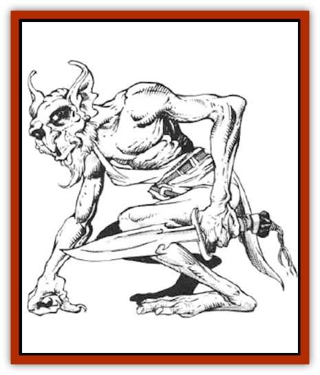

# Mite

| Statistic | **Mite** | **Snyad (Pestie)** |
| --- | --- | --- |
| **Activity Cycle:** | Any | Any |
| **Alignment:** | Lawful evil | Neutral |
| **Armor Class:** | 8 | -4 |
| **Climate/Terrain:** | Any/Subterranean | Any/Subterranean |
| **Damage/Attack:** | 1-3 | Nil |
| **Diet:** | Omnivore | Omnivore |
| **Frequency:** | Rare | Uncommon |
| **Hit Dice:** | 1-1 | 1-1 |
| **Intelligence:** | Low (5-7) | Low (5-7) |
| **Magic Resistance:** | Nil | See below |
| **Morale:** | Average (8-10) | Average (8-10) |
| **Movement:** | 3 | 21 |
| **No. Appearing:** | 6-24 | 1-8 |
| **No. of Attacks:** | 1 | 0 |
| **Organization:** | Tribe | Family |
| **Size:** | T (2' tall) | T (2½' tall) |
| **Special Attacks:** | Nil | Nil |
| **Special Defenses:** | Nil | See below |
| **THAC0:** | 20 | 20 |
| **Treasure:** | K (C) | J (I) |
| **XP Value:** | 35 | 65 |

Mites, and the related snyads, are tiny, mischievous humanoids that waylay dungeon adventurers for fun and profit.

Mites have hairless, warty skin varying in color form light gray to bright violet. Their heads are triangular with bat-like ears and a long, hooked nose. Male mites sport a bone ridge down the center of their skulls and short goatee beards. Many wear filthy rags stolen from previous victims. Their voices are high-pitched and twittery, conveying only the simplest ideas to each other.

**Combat:** Mites try to catch lone travelers and stragglers using pit-traps (1d6 points of damage), nets (successful saving throw vs. paralysis or caught), and trip wires (successful Dexterity check or fall prone). Prone or netted victims are swarmed over and whacked at with weighted clubs (2% cumulative chance, per club, of stunning the victim, but only if he's in armor worse than splint mail). The mites then bind their unconscious victim from head to foot, then drag him down into their lair. Once inside the victim is teased and twittered at for 1d4 days, the mites get bored with him. They then stun their victim again, steal all his possessions and deposit him at another point in the dungeon.

**Habitat/Society:** Mite lairs consist of dozens of tiny, interconnecting corridors built above and below the main corridors of the dungeon. Numerous entrances connect the mite tunnels to the dungeon, but all are hidden by carefully places stones (check for secret doors to find a mite tunnel entrance). Mite corridors are tiny by human and demihuman standards. Larger creatures, such as men, have a - 4 attack roll penalty and a + 4 AC penalty when fighting in a mite tunnel.

Mites are small and quick. They scurry to and fro through their tunnels, stopping briefly to spy on the main tunnel, always chattering and twittering to themselves.

Deep inside the mite tunnel system is a single, large, low-ceilinged chamber. The mite king lives here, sitting on his tiny throne, dressed in baggy clothes stolen from previous victims. The mite king is a fierce (by mite standards) warrior with 1+1 Hit Dice. His bite causes 1d4 points of damage. Also in the chamber are 4d6 mite women and 4d6 mite children. The women have 1-2 Hit Dice and bite for 1-2 points of damage. The children are noncombatants.

The chamber itself is filthy and strewn with captured weapons, armor, and clothes. Coins and such are carelessly thrown about, but mites love bright, shiny gems. These are kept by the king, who is allowed to play with them anytime he wants.

Mites are mischievous and curious. They pore for hours over every little stolen item, poking and prodding, bending and tasting, until either they grow bored, or, more likely, the item breaks. They delight in wearing clothes several dozen sizes too large. Mites are fond of bones, and they sometimes drag the skulls of great monsters into their lair.

**Ecology:** Mites hunt vermin and other pests. They love iron rations. Mites are viewed as bite-sized snacks by most monsters. Evil giants sometimes feature them as appetizers.

**Snyad**

  Snyads are distant relatives of mites. Their love of treasure often compels them to steal from humans and demihumans. Snyads resemble mites, but they are slightly larger (2½ feet tall), have full, though messy, heads of hair, and are light brown in color.

Snyads speak no known language but seem to communicate with mites successfully. These two creatures sometimes team up, with the mites distracting the victim, while the snyads dart in and grab things.

Snyads steal with great skill, surprising their targets 90% of the time, often snatching items directly from a person's hand, then zipping back into their hole and hiding until the pursuers leave. Spotting the entrance to a snyad lair requires a successful search roll: a 1-in-3 chance for elves and a 1-in-4 chance for all others.

Snyads never attack, relying on their amazingly quick reflexes to escape combat. They are not particularly strong, and any human or demihuman character with a Strength of 12 can capture a snyad with a successful attack roll. Captured snyads kick and scream, squirming and twisting to get away, but never bite (for fear that the captor might bite back). Because of their high Dexterity, snyads gain a +3 bonus to their saving throws vs. dodgeable spells.

Snyads live in immediate families, marrying for life.

---
## Discovery & Documentation

**Source Publication:** MC5 Greyhawk Appendix (1989)
**Campaign Setting:** Advanced Dungeons & Dragons 2nd Edition
**Author(s):** Grant Boucher, William W. Connors, Steve Gilbert, Bruce Nesmith, Chris Mortika, Skip Williams

### Other Creatures Found in This Source Book
   * [[Aspis|Aspis]]
   * [[Beastman|Beastman]]
   * [[Bonesnapper|Bonesnapper]]
   * [[Booka|Booka]]
   * [[Brownie_Buckawn|Brownie, Buckawn]]
   * [[Brownie_Quickling|Brownie, Quickling]]
   * [[Crystalmist|Crystalmist]]
   * [[Dragon_Cloud|Dragon, Cloud]]
   * [[Dragon_Oerth_Greyhawk|Dragon (Oerth), Greyhawk]]
   * [[Dragonfly_Giant|Dragonfly, Giant]]
   * [[Dragonnel|Dragonnel]]
   * [[Elf_Grugach|Elf, Grugach]]
   * [[Elf_Valley|Elf, Valley]]
   * [[Golem_Necrophidius|Golem, Necrophidius]]
   * [[Grell_Wild|Grell, Wild]]
   * [[Grung|Grung]]
   * [[Hobgoblin_Norker|Hobgoblin, Norker]]
   * [[Hook_Horror|Hook Horror]]
   * [[Horgar|Horgar]]
   * [[Hound_Yeth|Hound, Yeth]]
   * [[Iguana_Giant|Iguana, Giant]]
   * [[Ingundi|Ingundi]]
   * [[Kech|Kech]]
   * [[Kyuss_Son_of|Kyuss, Son of]]
   * [[Needleman|Needleman]]
   * [[Plant_Carnivorous_Oerth|Plant, Carnivorous (Oerth)]]
   * [[Plant_Carnivorous_Vampire_Cactus|Plant, Carnivorous, Vampire Cactus]]
   * [[Plasmoid_General_Information|Plasmoid, General Information]]
   * [[Rat_Oerth|Rat (Oerth)]]
   * [[Raven_Crow|Raven/Crow]]
   * [[Scarecrow|Scarecrow]]
   * [[Shadow_Slow|Shadow, Slow]]
   * [[Skulk|Skulk]]
   * [[Snail|Snail]]
   * [[Sprite|Sprite]]
   * [[Taer|Taer]]
   * [[Tentamort|Tentamort]]
   * [[Turtle_Giant|Turtle, Giant]]
   * [[Tyrg|Tyrg]]
   * [[Wolf_Mist|Wolf, Mist]]
   * [[Wraith_Oerth|Wraith (Oerth)]]
   * [[Zygom|Zygom]]
