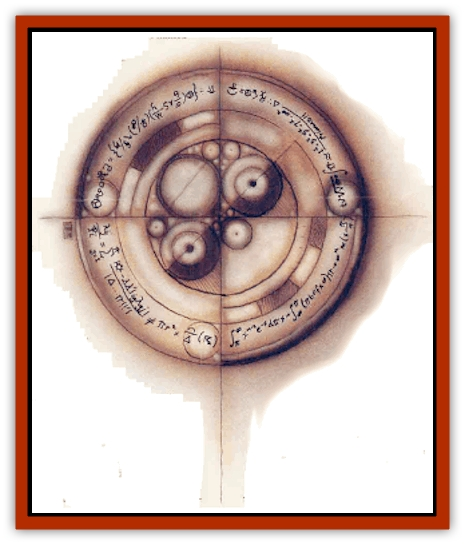
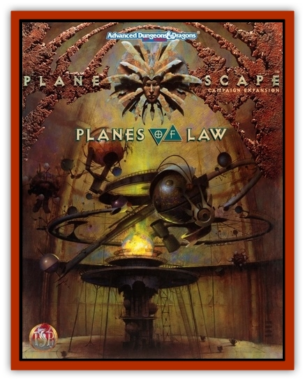

# Moigno

| Statistic | **Moigno** |
| --- | --- |
| **Activity Cycle:** | Any |
| **Alignment:** | Lawful neutral |
| **Armor Class:** | 0 |
| **Climate/Terrain:** | Mechanus |
| **Damage/Attack:** | 1d20 |
| **Diet:** | Nil |
| **Frequency:** | Rare |
| **Hit Dice:** | 2+2 |
| **Intelligence:** | See below |
| **Magic Resistance:** | Nil |
| **Morale:** | Fearless (20) |
| **Movement:** | See below |
| **No. Appearing:** | 1d4 |
| **No. of Attacks:** | 1 |
| **Organization:** | Patrol |
| **Size:** | T (1' tall) |
| **Special Attacks:** | Paradox attack |
| **Special Defenses:** | Immune to physical attacks; reconstruction |
| **THAC0:** | Automatic |
| **Treasure:** | Nil |
| **XP Value:** | 2,000 |

Moignos are bizarre, two-dimensional creatures that roam Mechanus. Their tiny bodies are nothing more than strings of equations given form and shape by the plane itself. They have no visible sensory organs, and a berk can see through all but the oldest moignos (the older they get, the more their equations create *if then* syllogisms and loop hack on themselves).

These mathematical constructions work in conjunction with [[Modron|modrons]] and [[Gear_Spirit|gear spirits]]. While modrons oversee activity on the plane and gear spirits perform the actual work on the cogs and wheels, it is the moignos who execute all the necessary calculations on gear rotation rates, interaction intervals, acceleration and deceleration frequencies, and the like. Without the moignos' split-second calculations, the modrons could not easily create any additional cogs or wheels to expand Mechanus or even keep such a gargantuan structure moving.

Moignos perform these highly necessary duties with a methodical plodding that could be construed as resentment. Indeed, there's often a palpable annoyance emanating from the moignos' small bodies. Though they perform their problem-solving with efficient speed, their very beings quiver with the desire to perform their true function to find the finite value of *pi*, a transcendental number with presumably no ultimate value. Of all the truisms in the multiverse, there is none more solidly grounded than this one: Moignos are obsessed with finding *pi*.

Moignos are two-dimensional except when reaching out to communicate, which they do with a string of symbols, mostly mathematical. Although modrons and gear spirits communicate with moignos intuitively, few others are capable of carrying on a conversation with a moigno. Gorad Drummerhaven, a sage noted for his rather inaccurate observations on wildlife, once attempted contact with a moigno. He used the telepathic science mindlink and actually did make connection with the moigno. Unfortunately, Drummerhaven couldn't handle the images he received and was in shock for two weeks.

**Combat:** Moignos don't engage in combat in the typical physical sense, partly because they are capable of instant teleportation. They are also entirely immune to physical attacks, for hitting their visible form simply disrupts their equations for a nanosecond before they reform into a new routine. Although they can be injured, they are rarely ever destroyed, for injured moignos will merge with another to reconstruct a single new, stronger moigno that then divides into numerous subroutines each forming new moignos. All this takes place instantaneously to the typical human.

Psionic attacks and spells that disrupt thought processes (such as the telepathic devotion mind thrust and feeblemind) can damage moignos, slowing them to a movement rate of 12 and preventing them from reconstructing. Interestingly, moignos are extremely susceptible to the psychokinetic devotion molecular manipulation; should they encounter a psionicist using such an effect, all moignos within the area will instantly vanish for 1d4 turns. Moignos can slip from the third dimension to the second at will.

Moignos do have the capability of attack. In their search for pi they have been forcibly confronted with living beings. Some of these have sought to harm the moignos, and the formulas retaliated (being somewhat aggressive little creatures) by developing their *paradox attack*.

Once per round, a moigno can automatically invade any creature and create a paradox within its internal system. This attack effectively "shorts out" the body, inflicting 1d20 points of damage. A character who makes a successful saving throw versus petrification suffers only half damage.

Intelligence in moignos is a difficult thing to gauge. In game terms, their rating is an overall 6 (low) because of their lack of understanding of this dimension. (This rating also explains how the modrons have been able to dominate the moignos.) However, in terms of mathematical application, the moignos are beyond 21+ (godlike).

**Habitat/Society:** Moignos were created less than a millennium ago (which is a relatively shoe time in the multiverse) by a brilliant mathematical theorist named Moigno. Unfortunately, his conception of multidimensional, functioning mathematics proved too much for him; Moigno collapsed in a babbling heap. His idea fled across the multiverse and found refuge in the plane of Mechanus. The modrons were struggling to maintain and expand their plane, and the now-sentient thought saw an opportunity to function there. It strung together a stream of parameters and crossed into the three-dimensional world with a two-dimensional mind and body.

The modrons, of course, were ecstatic (er, well, as ecstatic as their orderly selves could be) with the moigno's help. For perhaps two minutes, while the first moigno struggled into existence and calculated its and the subsequent needs of the plane, the relationship between the two creatures was harmonious. Then the moigno spun off its *if then* parameters, created the necessary subsets (additional moignos), and promptly proceeded to rework the plane.

The modrons nearly lost control of Mechanus then, and might have done so had they not stumbled upon one exceedingly important fact: The mathematician Moigno, for all his brilliance, had been unaware of the existence of *pi*. By introducing the mathematical conundrum *pi* to the moignos, the modrons were able to focus the equations' impulses. The moignos are now obsessed with *pi*, determined to find its ultimate value. Of course, it's entirely possible the moignos may actually find *pi*&hellip; After all, a millennium's worth of work performed by an infinite number of moignos at instantaneous calculations&hellip; The mind boggles.

Moignos have no particular hierarchy or society, being for the most part entirely independent. They have no personality traits discernible to humans and the like, though moignos do give themselves names based on the value to *pi* they have calcnlated. Of course, since moignos continuously calculate that value, their names continually change.

Moignos rather unwillingly perform the bidding of modrons, which they do out of an odd gratitude for having been giving pi to pursue. The chores mognos perform for Mechanus are almost entirely done on subroutines, hoever, so that they can devote as much energy to finding *pi*.

**Ecology:** Moignos consume nothing, nor do they die or reproduce in the typical sense. Since the introduction of pi, no moigno has ceased to function, though some have faded and disappeared. As moignos age, they gain more subtle nuances of mathematics and often set up subroutines to deal with mundane work. These subroutines frequently spin off to form new, individual moignos.

---
## Discovery & Documentation

**Source Publication:** Planes of Law (1995)
**Campaign Setting:** Planescape
**Author(s):** Colin McComb, Wolfgang Baur

### Other Creatures Found in This Source Book
   * [[Achaierai|Achaierai]]
   * [[Archon|Archon]]
   * [[Baatezu_Lesser_Kocrachon|Baatezu, Lesser, Kocrachon]]
   * [[Bladeling|Bladeling]]
   * [[Busen|Busen]]
   * [[Dragon_Rust|Dragon, Rust]]
   * [[Formian|Formian]]
   * [[Gear_Spirit|Gear Spirit]]
   * [[Hellcat|Hellcat]]
   * [[Kyton|Kyton]]
   * [[Parai|Parai]]
