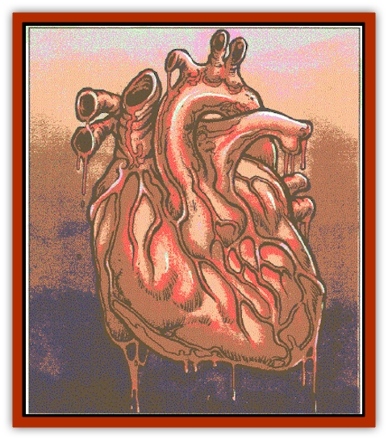

# Moilian Heart

| Statistic | **Moilian Heart** |
| --- | --- |
| **Activity Cycle:** | Any |
| **Alignment:** | Neutral evil |
| **Armor Class:** | 10 |
| **Climate/Terrain:** | Any |
| **Damage/Attack:** | Nil |
| **Diet:** | None |
| **Frequency:** | Very rare |
| **Hit Dice:** | 3 |
| **Intelligence:** | Non- (0) |
| **Magic Resistance:** | Nil |
| **Morale:** | Fearless (20) |
| **Movement:** | Nil |
| **No. Appearing:** | 1 |
| **No. of Attacks:** | Nil |
| **Organization:** | Solitary |
| **Size:** | S (heart sized) |
| **Special Attacks:** | Life drain, frost |
| **Special Defenses:** | Regeneration |
| **THAC0:** | None |
| **Treasure:** | Nil |
| **XP Value:** | 975 |

A moilian heart is an example of a previously undiscovered class of undead creatures created by the dissolution of the lost city of Moil. Moilian undead of all types are usually cloaked in a thin layer of hoarfrost, so it is hard to get a good look at them before they animate. Breaking away the rime reveals a disembodied humanoid heart trailing arteries and veins in a sinister tangle. A moilian heart beats only when it can drain life.

**Combat:** If deprived of living creatures to supply it with life force, the heart sinks into quiescence. It does not beat, nor does it regenerate; it appears utterly lifeless. No matter how long the heart exists in this condition, it revives if any living creature comes within 20 feet. The heart then drains life to vitalize its own dead flesh. Each round, living creatures in range must make special saving throws to avoid damage. Success requires a roll of 12 or better on 1d20. A character's hit point adjustment from Constitution applies to the roll (characters of all classes can claim the warrior adjustment for purposes of the rol1). Failure results in the loss of 1d10 hit points. The heart transfers drained hit points to itself, up to its maximum (excess hit points are simply lost). The hit points drained by the heart do not heal naturally; the stolen life force can only be returned through magical healing. If any being reaches 0 hit points through draining, it dies. Anyone slain in this manner stands a 13% chance of animating as a [[Moilian_Zombie|moilian zombie]] within 24 hours of death.

A moilian heart beats for as many days as it has hit points. The heart loses one hit point a day until it reaches 0, at which point it lapses into quiescence.

A moilian heart is sessile and has no physical attacks. However, the heart can project a wave of frost at all opponents within 30 feet, inflicting 2d6 points of damage. A successful saving throw vs. spell negates the effect. Cold attacks cannot occur until the heart begins regenerating.

Only consumption by flames, dissolution in acid, or similar means will permanently destroy a moilian heart. Moilian hearts can be turned as mummies. Being immobile, they do not run away if turned, but cease attacking when successfully turned, unless attacked themselves. Moilian hearts are immune to *charm*, *hold*, *sleep*, cold, poison, and death magic.

**Habitat/Society:** Moilian hearts are not directly linked to the Negative Material plane during phases of quiescence. A conduit to the Negative Material Plane springs into existence while a moilian heart drains hit points, but the conduit fades as soon as this feeding ceases. In the absence of a permanent Negative Material connection (like standard undead possess), moilian hearts remain animated only for as long as they have stolen life force to sustain them.

**Ecology:** The moilian heart is an entirely artificial monster, created by dark necromancy. Moilian hearts only exist where they have been placed by their creators, as they cannot move on their own.

The artificial animation of moilian creatures involves a very rare spell researched and codified by the necromancer Drake of the Black Academy, who has discovered the unique undead creatures of Moil, the City That Waits. The moilian heart represents the necromancer's first essay into this new avenue of the Dark Arts, but certainly not his last.

---
## Discovery & Documentation

**Source Publication:** Return to the Tomb of Horrors (1998)
**Campaign Setting:** Greyhawk
**Author(s):** Bruce R. Cordell, Gary Gygax

### Other Creatures Found in This Source Book
   * [[Bone_Weird|Bone Weird]]
   * [[Elemental_Negative_Energy|Elemental, Negative Energy]]
   * [[Fundamental_Negative|Fundamental, Negative]]
   * [[Moilian_Zombie|Moilian Zombie]]
   * [[Vestige|Vestige]]
   * [[Winter-Wight|Winter-Wight]]
