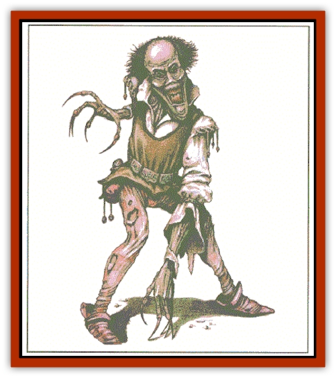

# Moilian Zombie

| Statistic | **Moilian Zombie** |
| --- | --- |
| **Activity Cycle:** | Any |
| **Alignment:** | Chaotic evil |
| **Armor Class:** | 6 |
| **Climate/Terrain:** | City of Moil |
| **Damage/Attack:** | By weapon (1d8) |
| **Diet:** | None |
| **Frequency:** | Uncommon |
| **Hit Dice:** | 9 |
| **Intelligence:** | Low (5-7) |
| **Magic Resistance:** | Nil |
| **Morale:** | Fearless (20) |
| **Movement:** | 9 |
| **No. Appearing:** | 1-6 |
| **No. of Attacks:** | 1 |
| **Organization:** | Solitary |
| **Size:** | M (5-6' tall) |
| **Special Attacks:** | Life drain, frost |
| **Special Defenses:** | Regeneration |
| **THAC0:** | 11 |
| **Treasure:** | F |
| **XP Value:** | 4,000 |

Moilian [[Zombie|zombies]] usually look like sprawling, frost-coated humans. They lie as dead, although they are not marked by violence, as their deaths came to them in dark slumber. Neither is there any rot apparent, due to the supernatural cold which permeates the air in the city of their origin, Moil. When moilian zombies animate, tearing free of their icy coverings, it is hard to mistake their undead origins; their eyes reflect the vacuum of the Void, their touch chills to the bone, and their very presence drains life itself.

**Combat:** Moilian zombies usually lie in an intonate state. Any living creature that comes within 20 feet of a moilian zombie must make a special saving throw to avoid damage. Success requires a roll of 12 or better on 1d20. A character's hit point adjustment from Constitution applies to the roll (characters of all classes can claim the warrior adjustment for purposes of the roll). Failure results in the loss of 1d4 hit points. The zombie transfers drained hit points to itself, up to its maximum (excess hit points are simply lost). The hit points drained by the zombie do not heal naturally; the stolen life force can only be returned through magical healing. If any being reaches 0 hit points through draining, it dies. Anyone slain in this manner stands a 13% chance of animating as a moilian zombie within 24 hours of death.

A moilian zombie remains animated for as many days as it has hit points. The zombie loses one hit point a day until it reaches 0, at which point it lapses into quiescence.

An animated moilian zombie actively moves towards its victims, attempting to keep living beings in range of its draining effect. It will bring weapons to bear, or pummel with its fists for 1d8 points of damage. Once a round, a zombie can project a wave of frost at all foes within 30 feet. Targets who fail a saving throw vs. spell suffer 2d6 points of cold damage. Those who fail this first saving throw must make an additional save vs. paralyzation or remain frozen in place by the sudden ice coating for 1d4+1 rounds.

Only consumtion by flames, dissolution in acid, or similar means will permanently destroy a moilian zombie.

Moilian zombies can be turned as vampires. They are immune to *charm*, *hold*, *sleep*, cold, poison, and death magic.

**Habitat/Society:** There was once a city called Moil that daily saw the light of the sun. The inhabitants of Moil were a foul people, as evidenced by their worship of the powerful [[Tanar'ri_General_Information|tanar'ri]] lord called Orcus. With the passage of time the Moilians' faith in their deity slipped. The tanar'ri lord sought vengeance, and placed a curse upon Moil; its inhabitants fell into an enchanted slumber which would lift only with the dawn. Orcus then removed the city from its natural site and transformed it into a nightmarish demiplane with ties to the Negative Energy Plane, assuring that the sun would never again shine upon Moil. Over time, the slumbering moilians all perished in their dark sleep. Because of their proximity to the Negative Energy Plane, the frozen forms of the inhabitants became undead moilian zombies.

**Ecology:** Unlike normal undead creatures, moilian zombies are not directly linked to the Negative Energy plane during phases of quiescence. A conduit to the Negative Energy springs into existence while a moilian zombie drains hit points, but the conduit fades as soon as this life force has been consumed. In the absence of a permanent Negative Energy connection (like standard undead possess), moilian zombies remain animated only for as long as they have stolen life force to sustain them.

---
## Discovery & Documentation

**Source Publication:** Return to the Tomb of Horrors (1998)
**Campaign Setting:** Greyhawk
**Author(s):** Bruce R. Cordell, Gary Gygax

### Other Creatures Found in This Source Book
   * [[Bone_Weird|Bone Weird]]
   * [[Elemental_Negative_Energy|Elemental, Negative Energy]]
   * [[Fundamental_Negative|Fundamental, Negative]]
   * [[Moilian_Heart|Moilian Heart]]
   * [[Vestige|Vestige]]
   * [[Winter-Wight|Winter-Wight]]
