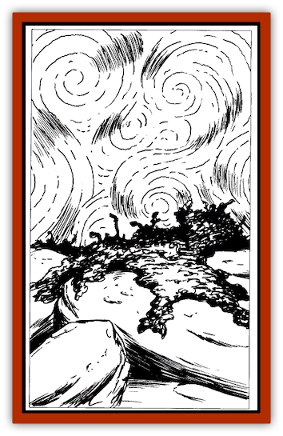

# Mold - Chromatic

| Statistic | **Mold, Chromatic** |
| --- | --- |
| **Activity Cycle:** | Any |
| **Alignment:** | Neutral |
| **Armor Class:** | 0 |
| **Climate/Terrain:** | Underdark |
| **Damage/Attack:** | Nil |
| **Diet:** | Carnivore |
| **Frequency:** | Uncommon |
| **Hit Dice:** | 2 |
| **Intelligence:** | Non- (0) |
| **Magic Resistance:** | Nil |
| **Morale:** | n/a |
| **Movement:** | 0 (special) |
| **No. Appearing:** | 1 patch |
| **No. of Attacks:** | 1 |
| **Organization:** | Patch |
| **Size:** | S to L |
| **Special Attacks:** | <i>Fascination</i>, spore infestation |
| **Special Defenses:** | Immune to nonfire attacks |
| **THAC0:** | Nil |
| **Treasure:** | Nil |
| **XP Value:** | 175 / Sonic: 270 |

Chromatic [[Mold_I|mold]] is a spore-producing [[Fungus|fungus]] that grows in warm, damp caverns such as exists in the twisted passages of the Underdark. The fungal growth has a thick, furry texture and appears dark brown in color to normal sight. Due to its unusual method of reproduction, chromatic mold is rarely found in large colonies; however, individual patches of mold can grow to 12 feet in diameter.

Infravision reveals a totally different picture of the fungus. Chromatic mold emits a complex pattern of varying heat signatures. The patterns register as swirling shades and colors to the eye of infravision users.

**Combat:** Although not a predator in the common sense of the word, chromatic mold is potentially lethal. The mold's swirling heat signatures exerts a strong *fascination* effect upon those who view it with infravision. Any such creature must make a successful saving throw vs. paralyzation or be helplessly drawn toward the fungus.

When any creature of small size (size S) or larger approaches within three feet of the chromatic mold, it sends out a cloud of spores in a 10-foot radius. Anyone caught in the cloud must make a saving throw vs. poison. Failure indicates that the victim breathes in the mold spores and begins to wander aimlessly as if under the effects of a *confusion* spell. The spores incubate within the victim's body, rapidly consuming the creature from within. Within 10 hours, the creature dies and a new patch of chromatic mold bursts forth from the victim's body, completely consuming the carcass in another 12 hours.

A *hold plant* spell halts the spores' incubation for the duration of the enchantment; after that, however, the infestation progresses as normal. *Cure disease* permanently kills the spore infestation if cast within the first 10 hours of affliction. After this period, however, the spell destroys both the mold and the victim.

Fire is a useful weapon against chromatic mold, consuming it at the rate of 1d4 rounds per 10-foot patch. A cold-based attack inflicts no damage, but negates the fascination effect and prevents the normal release of spores. Forceful contact with the mold (even a *magic missile* spell) causes the reflexive release of spores.

**Habitat/Society:** Chromatic mold is a nonmobile hazard of the Underdark and warm subterranean settings. It may appear by itself or, more rarely in the presence of other types of mold and fungi. It is not uncommon for intelligent creatures, such as [[Elf_Drow|drow]], [[Dwarf_Duergar|duergar]], and [[Gnome|deep gnomes]], to routinely put an entire cavern complex to the torch if even one cave exhibits signs of infestation.

**Ecology:** Chromatic mold is exceptionally dangerous to most humanoids, but seems to have little effect on certain scavegers of the Underdark. Some creatures, like [[Burbur|burburs]] eat vast quantities of this mold with no apparent ill-effect.

**Sonic Mold**

  This more dangerous variant of chromatic mold also infests caverns and labyrinthine underground complexes. Though sonic mold shares the physical characteristics of chromatic mold - including the emission of swirling heat patters - the latter exhibits an even stranger adaption to its underground environment.

Besides the heat emissions, sonic mold vibrates at various pitches, producing eerie and compelling patterns of sound. These tones snare creatures who can hear as effectively as chromatic mold snares those using infravision. A master bard lucky enough to survive an encounter with this rare mold reports that the mold's complex tonal "phrases" weave up and down traditional and unorthodox scales by a series of weirdly disquieting "half-steps".

Although potentially audible for miles in the echoing passageways of underground complexes, the *fascination* effect occurs only within 60 feet of the mold. Creatures with normal human hearing in this radius must make a successful saving throw vs. paralyzation or be inexorably toward the mold. Creatures with enhanced hearing have a -1 penalty; those using echo-location have a penalty of -3.Once a creature of at least small size (size S) approaches within 3 feet of the mold, the deadly growth releases its cloud of spores to a 10-foot radius. Anyone failing a saving throw vs. poison is rendered confused as the spores incubate inside the victim's body. The onset time is only 8 hours, after which the mold erupts from the victim's body, and death follows in only 8 hour more. Priests can slow or destroy sonic spores in the same way they slow or neutralize chromatic mold spores, and burburs merely eat them.

---
## Discovery & Documentation

**Source Publication:** Monstrous Compendium, 1997 Annual, Volume 4 (1995)
**Campaign Setting:** Advanced Dungeons & Dragons 2nd Edition
**Author(s):** Jon Pickens

### Other Creatures Found in This Source Book
   * [[Anemone_Giant_Sea|Anemone, Giant Sea]]
   * [[Asperii|Asperii]]
   * [[Bainligor|Bainligor]]
   * [[Beast_of_Chaos|Beast of Chaos]]
   * [[Blindheim|Blindheim]]
   * [[Bloodsipper_Far_Realm|Bloodsipper (Far Realm)]]
   * [[Bulette_Gohlbrorn|Bulette, Gohlbrorn]]
   * [[Child_of_the_Sea|Child of the Sea]]
   * [[Clockwork_Horror|Clockwork Horror]]
   * [[Clockwork_Swordsman|Clockwork Swordsman]]
   * [[Coral|Coral]]
   * [[Darklore|Darklore]]
   * [[Dharculus|Dharculus]]
   * [[Dolphin_Athas|Dolphin (Athas)]]
   * [[Dragon_Neutral_Moonstone|Dragon, Neutral, Moonstone]]
   * [[Dragon_Prismatic|Dragon, Prismatic]]
   * [[Dream_Stalker|Dream Stalker]]
   * [[Dragon-kin_Albino_Wyrm|Dragon-kin, Albino Wyrm]]
   * [[Echyan|Echyan]]
   * [[Firestar|Firestar]]
   * [[Firetail|Firetail]]
   * [[Fish_Ascallion|Fish, Ascallion]]
   * [[Fish_Deep_Ocean|Fish, Deep Ocean]]
   * [[Fish_Tropical|Fish, Tropical]]
   * [[Fish_Vurgens|Fish, Vurgens]]
   * [[Fogwarden|Fogwarden]]
   * [[Fraal|Fraal]]
   * [[Giant_Crag|Giant, Crag]]
   * [[Gibberling_Brood|Gibberling, Brood]]
   * [[Glutton_Sea|Glutton, Sea]]
   * [[Golden_Ammonite|Golden Ammonite]]
   * [[Golem_Brass_Minotaur|Golem, Brass Minotaur]]
   * [[Golem_Gemstone|Golem, Gemstone]]
   * [[Golem_Maggot|Golem, Maggot]]
   * [[Groundling|Groundling]]
   * [[Hermit_Sea|Hermit, Sea]]
   * [[Hound_of_Law|Hound of Law]]
   * [[Human_Amazon|Human, Amazon]]
   * [[Human_Pygmy|Human, Pygmy]]
   * [[Inquisitor|Inquisitor]]
   * [[Kercpa|Kercpa]]
   * [[Kreel|Kreel]]
   * [[Lycanthrope_Lythari|Lycanthrope, Lythari]]
   * [[Mercurial|Mercurial]]
   * [[Mummy_Bog|Mummy, Bog]]
   * [[Neh-thalggu|Neh-thalggu]]
   * [[Nymph_Grain|Nymph, Grain]]
   * [[Nymph_Unseelie|Nymph, Unseelie]]
   * [[Octopus_Octo-Jelly|Octopus, Octo-Jelly]]
   * [[Puddingfish|Puddingfish]]
   * [[Sea_Demon|Sea Demon]]
   * [[Shade|Shade]]
   * [[Shadowrath|Shadowrath]]
   * [[Shark_Athas|Shark (Athas)]]
   * [[Siren_Ravenloft|Siren (Ravenloft)]]
   * [[Skeleton_Variant|Skeleton, Variant]]
   * [[Skyfish|Skyfish]]
   * [[Spectral_Scion|Spectral Scion]]
   * [[Spyder_Fiend|Spyder Fiend]]
   * [[Squid_Squark|Squid, Squark]]
   * [[Tanar'ri_Lesser_Uridezu|Tanar'ri, Lesser, Uridezu]]
   * [[Troll_Mutate|Troll Mutate]]
   * [[Vaati|Vaati]]
   * [[Vampire_Cerebral|Vampire, Cerebral]]
   * [[Varkha|Varkha]]
   * [[Wizshade|Wizshade]]
   * [[Worm_Lukhorn|Worm, Lukhorn]]
   * [[Wyste|Wyste]]
   * [[Yugoloth_Lesser_Gacholoth|Yugoloth, Lesser, Gacholoth]]
   * [[Zombie_Mud|Zombie, Mud]]
