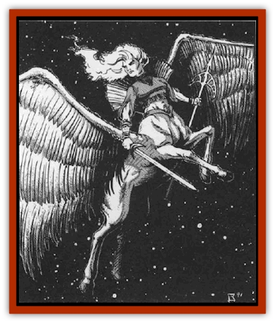

# Monitor

| Statistic | **Monitor** |
| --- | --- |
| **Activity Cycle:** | Any |
| **Alignment:** | Lawful good |
| **Armor Class:** | 0 |
| **Climate/Terrain:** | Any |
| **Damage/Attack:** | 1d10 (weapon) +1 (strength bonus) or 1d8/1d8 |
| **Diet:** | Herbivore |
| **Frequency:** | Uncommon |
| **Hit Dice:** | 10 |
| **Intelligence:** | Exceptional (16) |
| **Magic Resistance:** | 50% |
| **Morale:** | Elite (16) |
| **Movement:** | 12, Fl 24 (A), Sw 9 |
| **No. Appearing:** | 4-7 |
| **No. of Attacks:** | 2 or 3 |
| **Organization:** | Patrol |
| **Size:** | M (6' tall) |
| **Special Attacks:** | See below |
| **Special Defenses:** | Nil |
| **THAC0:** | 11 |
| **Treasure:** | D |
| **XP Value:** | 8,000 |

The monitors are benevolent beings who patrol the farflung reaches of wildspace and the phlogiston. However, space is quite large, and the monitors' forces are spread thin. Understandably, not everyone feels comfortable around monitors. Their absolute, black-and-white code alarms beings who compromise or bend rules to accomplish things.

Monitors manifest in two different ways. In a crystal sphere or on the Outer planes, they appear as gold-skinned, winged [[Centaur|centaurs]]. Their eyes and hair blaze as if made of red flames. In the phlogiston (only), monitors appear as silver-skinned [[Pegasus|pegasi]], with icy blue eyes and manes. Both forms have the same movement rate.

Monitors speak their own complex language, Common, and all of the tongues of evil races native to wildspace and the phlogiston.

**Combat:** Monitors are not averse to combat when necessary, though they usually give opponents a chance to surrender before starting hostilities.

In their centaur form, monitors wield two-handed *flame tongue* swords. The swords strike twice per round, inflicting 1d10 hp on small or man-sized opponents, and 3d6 hp on larger opponents. *Flame tongues* are +1 swords, +2 vs. regenerating monsters, +3 vs cold-using, flammable, or avian creatures, and +4 vs. undead. Monitors have Strength 17.

In pegasus form, monitors can breathe a *cone of cold* three times a day at 10th-level ability.

In addition, either of the monitor's forms may strike with the two forehooves, doing 1d8 damage each. This, however, is a lastditch measure, as the monitors consider it undignified.Besides their normal magic resistance, monitors are immune to all spells from the school of enchantment/charm.

A monitor reduced to 0 hp falls and dies in 1d4+1 rounds. Before the monitor expires, it makes a loud keening noise. This special distress call relays who is dying, where they fell, and the descriptions of those who committed the deed. Any monitors in the same crystal sphere immediately receive the report. Satisfied, the monitor dies, its body and sword becoming a puff of golden smoke.

**Habitat/Society:** Monitors travel in patrols with a rotating leader, giving all squad members the chance to command. The squads wander everywhere, enforcing the tenets of their lawful good alignment: punishing evil, rescuing the helpless, and protecting all innocent life from harm or malice. They personify goodness, raising the alignment of lawful good almost to an art. Monitors are unselfish, just, brave, unswervingly loyal to their ethos, and dedicated to their mission of eradicating or reforming evil. They are not intimidated by anything and calmly face overwhelming odds. One tale tells of a monitor who was surrounded and outnumbered by a horde of [[Gith_Pirate_of|Pirates of Gith]]. When asked for her last words, the monitor replied, "You are all charged with murder, piracy, and threatening a monitor. Surrender now, and things will go easy for you." The scary thing is, after the dust of battle settled, she had won.

Unfortunately, monitors are not the greatest diplomats. They have a black-and-white view of right and wrong. Compromise is repellent. As they say, "Shades of gray may feature a bit of white, but they also harbor a bit of black." In some cases, monitors have rescued [[Halfling|halfling]] thieves from the clutch of [[Mind_Flayer|illithids]], then turned the thieves over to the proper authorities for incarceration.

With all the evil races such as the [[Neogi|neogi]], illithids, and [[Beholder_and_Beholder-kin_I|beholders]] in wildspace, other races are reluctant to alienate a powerful race of good beings who try to stem the tide of evil. Monitors are the butt of many complaints, jokes, and grumblings, but people turn to them first when a great evil arises.

**Ecology:** Though monitors appear as beautiful male or female centaurs, they do not reproduce. Young monitors have never been seen. Some scholars guess that monitors are the spirits of deceased paladins, rewarded by various good deities with these powers and responsibilities. Some cynical observers believe the opposite: paladins who were not "good enough" have been stuck with the task of policing space.

Monitors do not require air, food, or drink, though they sometimes eat food to make other beings feel at ease. Even so, they are strict vegetarians.

---
## Discovery & Documentation

**Source Publication:** MC9 Spelljammer Appendix II (1991)
**Campaign Setting:** Planescape
**Author(s):** Scott Davis, Newton Ewell, John Terra

### Other Creatures Found in This Source Book
   * [[Alchemy_Plant|Alchemy Plant]]
   * [[Allura|Allura]]
   * [[Aperusa|Aperusa]]
   * [[Autognome|Autognome]]
   * [[Bionoid|Bionoid]]
   * [[Bloodsac|Bloodsac]]
   * [[Buzzjewel|Buzzjewel]]
   * [[Constellate|Constellate]]
   * [[Contemplator|Contemplator]]
   * [[Dohwar|Dohwar]]
   * [[Dragon_Moon|Dragon, Moon]]
   * [[Dragon_Stellar|Dragon, Stellar]]
   * [[Dragon_Sun|Dragon, Sun]]
   * [[Dreamslayer|Dreamslayer]]
   * [[Dweomerborn|Dweomerborn]]
   * [[Fal|Fal]]
   * [[Feesu|Feesu]]
   * [[Fire_Bat|Fire Bat]]
   * [[Firebird|Firebird]]
   * [[Firelich|Firelich]]
   * [[Flowfiend|Flowfiend]]
   * [[Gadabout|Gadabout]]
   * [[Gammaroid|Gammaroid]]
   * [[Gonn|Gonn]]
   * [[Gossamer|Gossamer]]
   * [[Grav|Grav]]
   * [[Great_Dreamer|Great Dreamer]]
   * [[Greatswan|Greatswan]]
   * [[Grell_Colonial|Grell, Colonial]]
   * [[Gullion|Gullion]]
   * [[Insectare|Insectare]]
   * [[Lhee|Lhee]]
   * [[Mercurial_Slime|Mercurial Slime]]
   * [[Meteorspawn|Meteorspawn]]
   * [[Owl_Space|Owl, Space]]
   * [[Pristatic|Pristatic]]
   * [[Scro|Scro]]
   * [[Selkie_Star|Selkie, Star]]
   * [[Silatic|Silatic]]
   * [[Skullbird|Skullbird]]
   * [[Sleek|Sleek]]
   * [[Sluk|Sluk]]
   * [[Space_Swine|Space Swine]]
   * [[Sphinx_Astro-|Sphinx, Astro-]]
   * [[Spirit_Warrior|Spirit Warrior]]
   * [[Starfly_Plant|Starfly Plant]]
   * [[Stargazer|Stargazer]]
   * [[Undead_Stellar|Undead, Stellar]]
   * [[Witchlight_Marauder|Witchlight Marauder]]
   * [[Xixchil|Xixchil]]
   * [[Yitsan|Yitsan]]
   * [[Zurchin|Zurchin]]
