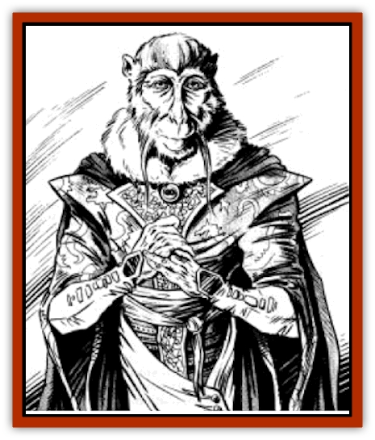

# Monkey - Greater Spirit

| Statistic | **Monkey (Greater Spirit)** |
| --- | --- |
| **Activity Cycle:** | Any |
| **Alignment:** | Chaotic good |
| **Armor Class:** | -10 |
| **Climate/Terrain:** | Any |
| **Damage/Attack:** | By weapon +5 |
| **Diet:** | Vegetarian |
| **Frequency:** | Unique |
| **Hit Dice:** | * |
| **Intelligence:** | Supra-genius (19-20) |
| **Magic Resistance:** | 30% |
| **Morale:** | Fearless (19-20) |
| **Movement:** | 15, Fl 24 |
| **No. Appearing:** | 1 |
| **No. of Attacks:** | 5 |
| **Organization:** | Solitary |
| **Size:** | M (5'6&rdquo;) |
| **Special Attacks:** | See below |
| **Special Defenses:** | See below |
| **THAC0:** | 2 |
| **Treasure:** | Special |
| **XP Value:** | See below |

Monkey is a truly unique being. Once he was an official of the Celestial Bureaucracy in the Outer Planes. However, for his tricks and mischief, the Celestial Emperor stripped him of much of his power and banished him to Toril on the Prime Material plane.

Monkey can take many different forms, but generally restricts himself to a human appearance or his natural form. This is of a human with a [[Mammal_Small|monkey's]] face, dressed in robes finer than those of the greatest Shou mandarin. He has impeccable manners. (Although by the standards of the Celestial Court he is crude and profane.)

**Combat:** Monkey never fights unless he wants to; with his powers it is impossible to force him into a battle. When he does choose battle, he will either fight to kill (against evil opponents) or fight to embarrass and humiliate his enemy. In physical combat, he can make five attacks in a single round, striking with his sword at blinding speed. He can only be hit by +3 weapons or better and regenerates at the rate of 5 hit points per round.

Even more formidable, though, are his magical powers. Monkey has the innate ability to cast almost any magical spell. The only ones denied him are *wishes*, those that summon creatures from other planes, and those involving planar travel. Beyond these restrictions he can use any other spell he desires simply by thinking about it. He needs no components, gestures, or the like. Given this power, he is virtually unbeatable in combat.

Although he functions as if he had 20 hit dice, Monkey cannot truly be killed, this being one of the conditions of his banishment. If his physical form is destroyed, he is reborn, hale and well, with the next dawn.

**Habitat/Society:** Fortunately for the world, Monkey is not interested in power or domination. Indeed, he has developed a paternal attitude toward the beings of this littie island he is stranded upon. If attacked by the inhabitants, he is more likely to teleport his foes to the top of a mountain or onto a lonely island than to kill them outright (which would not be hard for him).

It is difficult to say what does motivate Monkey. He is a trickster, a gadfly to the great powers of the outer planes. He has stolen the Peaches of immortality, battled the Animal Kings, studied the Seven Great Disciplines under the Nine Masters, shaved the beard of the Lord of the Dead, and committed many other pranks too numerous to mention. Although these jests have enraged the greater powers, Monkey shows no fear or sincere remorse for committing them. Even being banished for his pestiferous deeds has not dulled his wit or mischievous nature. There is no doubt that were he returned to the Celestial Bureaucracy tomorrow, he would immediately resume his old ways, and probably be banished again the day after.

Indeed, if Monkey has any failing, it is his lack of "common sense". He boasts when others know it will get him in trouble. He lies outrageously and without conscience. He commits deeds certain to get him in trouble and makes no effort to hide his involvement in the most outlandish events. He cheerfully taunts his enemies, humiliating them in front of their equals. None of these have earned him many friends among the celestial officials.

Monkey's treasure is not one that can be carried away. Although he has many magical items and great wealth, he does not consider these important. Knowledge and information are true treasures. As a reward for services, Monkey typically answers one to three questions. These can be about anything on Toril, for nothing except the doings of his fellow celestial powers is hidden from him.

His exploits have earned him a place in the myths of Shou. He is hailed as a comic folk hero by the peasants. in him they have a figure who strikes back at corrupt officials in the name of the peasantry. Many a Robin Hood bandit has taken the name Monkey as his own.

**Ecology:** What does a godlike being eat? Monkey can live on the very air. He does have a taste for rich food, fruits, and wine. He can eat prodigious quantities without filling himself. It is not a good idea to offer to cook for him.

---
## Discovery & Documentation

**Source Publication:** The Horde (boxed set) (1990)
**Campaign Setting:** The Horde (Forgotten Realms)
**Author(s):** David Cook

### Other Creatures Found in This Source Book
   * [[Centaur_Nomadic|Centaur, Nomadic]]
   * [[Horse_Endless_Waste|Horse (Endless Waste)]]
   * [[Manggus|Manggus]]
   * [[Shatjan|Shatjan]]
   * [[Shimnus_Greater_Spirit|Shimnus, Greater Spirit]]
